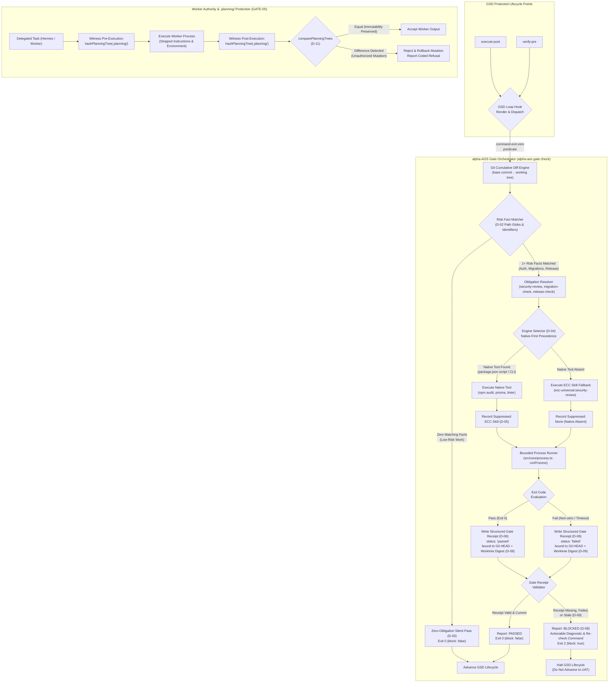

# Phase 4: Mandatory GSD Gates - Research

**Researched:** 2026-09-17
**Domain:** Deterministic risk-based mandatory GSD lifecycle gates and worker/controller authority enforcement
**Confidence:** HIGH

<user_constraints>
## User Constraints (from CONTEXT.md)

### Locked Decisions

#### Risk Evidence Detection & Diff Boundary (GATE-01, GATE-04)
- **D-01:** Risk evidence is evaluated across the **entire cumulative diff of the phase** (Phase start commit/branch base through all intermediate commits and uncommitted working-tree modifications). This ensures that risk introduced at any point in the phase cannot be hidden by a subsequent commit. — **Reversibility:** reversible — diff evaluation range is controlled by the git diff query helper.
- **D-02:** Risk detection uses **path glob patterns and safe identifier matching** (`**/auth/**`, `**/migrations/**`, `package.json#version`, release configs, etc.) without arbitrary credential scanning. The 8 SECURITY_REVIEW risk facts (`auth-change`, `user-input`, `secrets`, `payments`, `sensitive-data`, `command-execution`, `trust-boundary`, `public-api`) deferred from Phase 2 to GATE-01 are implemented using safe structural and path heuristics that never inspect or leak credential values, adhering strictly to the AGENTS.md secret constraint. — **Reversibility:** costly — changing detection schemas affects fact definitions in `catalog/facts.yaml`.
- **D-03:** Low-risk work receives an **automatic silent pass (Zero-Obligation Silent Pass)**. When git diff analysis yields zero matching risk facts, the resolved obligation set is empty (`obligations: []`), and GSD lifecycle hooks advance immediately without prompting or blocking the user. — **Reversibility:** reversible — zero-obligation branch behavior is purely logical.

#### Single-Engine Resolution & Deduplication (GATE-02)
- **D-04:** Check engine selection follows **Native-First precedence**. If the repository defines native verification tooling (e.g. project linter, `npm audit`, `prisma migrate diff`, custom migration/security script), alpha-AOS selects that native engine. ECC skills (such as `security-review` from `ecc-universal`) serve as fallbacks only when native tooling is absent. — **Reversibility:** costly — engine selection precedence touches obligation resolution and plan generation.
- **D-05:** Overlapping engines are **visibly suppressed in the execution report**. Exactly one engine executes per obligation. When a native engine is chosen over an ECC skill (or vice versa), the report explicitly records the selected engine and cites the suppressed engine and reason (e.g., `suppressed: ecc-universal:security-review (native tool exists)`), guaranteeing zero duplicate reviews. — **Reversibility:** reversible — reporting formatting and receipt suppression fields.
- **D-06:** Gate evaluation results are recorded as **Structured Gate Receipts** (`.alpha-aos/receipts/gates/*.json` or unified gate receipt). Each receipt strictly records the obligation, engine identifier, target Git HEAD SHA, execution exit code, status (`passed` | `failed`), suppressed alternatives, and evidence SHA-256 hash. — **Reversibility:** costly — structured schema definition binds reader, writer, and verification checks.

#### GSD Lifecycle Integration & Blocking Contract (GATE-03)
- **D-07:** Gates are enforced at the **protected lifecycle boundary: `execute:post` and `verify:pre`**. When plan execution concludes, required gates are evaluated; if any mandatory gate is missing, failed, unverified, or stale, transition into UAT/verification is blocked fail-closed. — **Reversibility:** costly — lifecycle hook dispatch is tied to GSD loop hooks.
- **D-08:** Gate blocking provides **actionable, precise diagnostic feedback**. The blocking message details the failing gate, offending files/diffs, exact engine error output, and a runnable re-check command (`alpha-aos gate check` or equivalent) for immediate remediation. — **Reversibility:** reversible — CLI/hook diagnostic output formatting.
- **D-09:** Gate evidence is **strictly revision-bound**. A recorded gate receipt is bound to the exact Git HEAD commit SHA and working-tree digest. If any file in the risk surface is modified after the gate was run, the evidence immediately classifies as `stale`, refusing lifecycle advancement until re-run. — **Reversibility:** reversible — staleness comparison logic.

#### Worker Authority & .planning Protection (GATE-05)
- **D-10:** GSD Controller role belongs strictly to the **session initiator (active primary harness, e.g. Antigravity/Codex)**; any delegated or external harnesses (Hermes, Pi, subagents) are automatically assigned **Worker role**. Hermes is structurally prohibited from being a GSD state controller. — **Reversibility:** costly — harness adapter invocation contracts.
- **D-11:** Protection of `.planning/` is enforced via **multi-layered defense**: Worker launch specs hide GSD state-writing instructions, process environments exclude GSD controller credentials, and before/after handoff or gate points, recursive SHA-256 tree hashing (`comparePlanningTrees`) witnesses byte-identical immutability. Any unauthorized mutation by a worker results in immediate rejection and rollback. — **Reversibility:** reversible — wraps existing planning tree hash utilities from Phase 3 (Plan 03-21).

### the agent's Discretion
- Exact CLI flags for standalone gate checks (`alpha-aos gate check` and `alpha-aos gate status`).
- JSON schema design for `.alpha-aos/receipts/gates/` structured gate receipts.
- Detailed mapping table from risk facts to default native commands vs ECC skills.

### Deferred Ideas (OUT OF SCOPE)
- None — all discussed items are within Phase 4 scope.
</user_constraints>

<architectural_responsibility_map>
## Architectural Responsibility Map

| Capability | Primary Tier | Secondary Tier | Rationale |
|------------|-------------|----------------|-----------|
| Cumulative Phase Git Diff Inspection | Core CLI Engine (`src/core/gate.ts`) | Subprocess Adapter (`src/core/process.ts`) | Inspects Git commit history and working tree without mutating repository state. |
| Risk Evidence Detection (8 Facts) | Fact Detection Framework (`src/core/evidence.ts`) | Pack Catalog (`catalog/facts.yaml`) | Structural & path glob matching evaluating whether changes touch risk surfaces. |
| Single-Engine Resolution & Deduplication | Obligation Resolver (`src/core/gate.ts`) | Package/Project Manifest (`package.json`) | Enforces native-first engine precedence and visible suppression reporting. |
| Structured Gate Receipt Persistence | Transaction Manager (`src/core/transaction.ts`) | Schema Validator (`src/core/validation.ts`) | Atomically writes and validates tamper-evident gate receipts under `.alpha-aos/receipts/gates/`. |
| GSD Loop Hook Integration (`execute:post`, `verify:pre`) | GSD Capability Overlay (`.gsd/capabilities/alpha-aos/`) | GSD Core (`loop-resolver.cjs`) | Dispatches predicate gates via `command-exit-zero` to fail-closed block UAT advancement. |
| Worker Authority & `.planning/` Immutability Witness | Canary / Witness Module (`src/core/canary.ts`) | Harness Adapter (`src/adapters/harnesses.ts`) | Executes recursive SHA-256 tree witness before/after worker delegation, rolling back on mutation. |
</architectural_responsibility_map>

<research_summary>
## Summary

Phase 4 establishes deterministic risk-based mandatory GSD lifecycle gates (GATE-01 through GATE-05) and enforces worker vs. controller authority. When a plan touches authentication boundaries, database migrations, or release-sensitive surfaces, alpha-AOS automatically identifies the risk, resolves exactly one check engine (preferring native project tools over ECC skills), executes the check in a bounded shell-free subprocess, and writes a structured gate receipt bound to the Git revision and working-tree hash. At the protected GSD lifecycle boundary (`execute:post` and `verify:pre`), GSD queries the gate state; any missing, failed, unverified, or stale evidence blocks progress fail-closed with runnable remediation guidance. Unrelated low-risk work receives a zero-obligation silent pass (GATE-04), and worker harnesses like Hermes are structurally prohibited from mutating `.planning/` through multi-layered defense and cryptographic witness verification (GATE-05).

The underlying technical ecosystem is already in place:
1. **GSD Core 1.12.0** provides a robust capability overlay loader (`capability-loader.cjs`) and loop hook resolver (`loop-resolver.cjs`) that executes `check.predicate` blocks using `command-exit-zero`. By declaring an `alpha-aos` capability bundle with gates at `execute:post` and `verify:pre`, alpha-AOS hooks directly into GSD's native halt/advance loop.
2. **alpha-AOS Core Foundations** (`process.ts`, `transaction.ts`, `validation.ts`, `canary.ts`) already provide shell-free bounded execution, transactional atomic writes with crash repair, strict Draft 2020-12 JSON schema validation, and proven recursive SHA-256 tree hashing (`hashPlanningTree` and `comparePlanningTrees`).
3. **Risk Detection** extends the existing `evidence.ts` framework to analyze cumulative git diffs (`git diff <base>`) across the phase rather than single commits, using path globs and safe identifier matching without scanning file bodies for secret credentials.

**Primary recommendation:** Implement `src/core/gate.ts` to manage the complete lifecycle (diff analysis, risk fact matching, native-first engine dispatch, receipt generation, and staleness validation), register a strict `gate-receipt.schema.json`, expose `alpha-aos gate check` and `alpha-aos gate status`, and materialize a GSD capability overlay that integrates with GSD's `command-exit-zero` predicate evaluator.
</research_summary>

<standard_stack>
## Standard Stack

### Core
| Library / Component | Version | Purpose | Why Standard |
|---------------------|---------|---------|--------------|
| `@opengsd/gsd-core` | 1.12.0 (pinned) | Host workflow & lifecycle spine | Pinned external standard across Codex, Antigravity, Pi, and Hermes; provides native loop extension points. |
| `src/core/process.ts` (`runProcess`) | Project Internal | Shell-free, bounded subprocess runner | Bounded output (256 KiB cap), timeout enforcement, explicit environment allowlist, and centralized redaction. |
| `src/core/transaction.ts` (`applyFileTransaction`) | Project Internal | Atomic file transaction engine | Single-transaction atomic writes, snapshot journaling, hash verification, and fail-safe rollback for gate receipts. |
| `src/core/validation.ts` (`validateManagedDocument`) | Project Internal | Strict Draft 2020-12 schema validation | Ajv 2020 engine validating all structured gate receipts against `schemas/gate-receipt.schema.json`. |
| `src/core/canary.ts` (`hashPlanningTree`, `comparePlanningTrees`) | Project Internal | Cryptographic tree witness | Deterministic recursive SHA-256 tree hashing for proving byte-identical `.planning/` immutability. |

### Supporting
| Library / Component | Version | Purpose | When to Use |
|---------------------|---------|---------|-------------|
| `git` CLI (via `runProcess`) | Host System | Cumulative diff & revision inspection | Invoked without shell to inspect branch base (`merge-base`), phase diff (`git diff`), and working-tree status. |
| `ignore@7.0.5` | 7.0.5 (pinned) | Ignore rule matching | Fast path-filtering respecting `.gitignore` rules during diff and risk analysis. |
| `smol-toml@1.8.0` | 1.8.0 (pinned) | TOML parsing | Parsing native configuration (e.g. `alembic.ini`, Cargo configurations) without credential extraction. |

### Alternatives Considered
| Instead of | Could Use | Tradeoff |
|------------|-----------|----------|
| `command-exit-zero` predicate in GSD | GSD workflow prose instructions | Prose instructions can be hallucinated or bypassed by models; predicate checks halt the loop mechanically with exit code verification. |
| Git cumulative diff (`git diff <base>`) | Per-commit diff checking | Per-commit checking allows a developer or agent to introduce risk in commit A and hide it in commit B. Cumulative diff guarantees all changes in the phase are checked. |
| Path glob + safe identifier matching | Credential/regex body scanning | Scanning file bodies for credential patterns risks leaking private secrets into logs or CI output, violating `AGENTS.md`. Path globs and structural markers provide deterministic, secret-safe detection. |
| Native-first engine selection | Running both native and ECC skills | Running duplicate checks creates noise, wastes tokens, and produces conflicting reports. Native-first with visible suppression provides clean, authoritative verification. |

**Installation:**
No new external npm dependencies are needed. All tools utilize existing pinned packages (`@opengsd/gsd-core@1.12.0`, `ajv`, `smol-toml`, `yaml`, `ignore`) and internal modules.
</standard_stack>

<architecture_patterns>
## Architecture Patterns

### System Architecture Diagram



### Recommended Project Structure
```
src/
├── core/
│   ├── gate.ts               # Gate orchestration, diff query, obligation resolution, receipt checking
│   ├── gate-receipt.ts       # Structured gate receipt definitions, serialization, staleness checking
│   ├── worker-authority.ts   # Controller vs worker enforcement, launch spec sanitization, planning witness
│   ├── canary.ts             # Contains hashPlanningTree & comparePlanningTrees (reused)
│   ├── evidence.ts           # Extended with change-risk predicates for 8 deferred risk facts
│   ├── process.ts            # Bounded shell-free process execution (reused)
│   ├── transaction.ts        # Atomic file transactions & rollback (reused)
│   └── validation.ts         # Schema validation extended for "gate-receipt"
├── cli.ts                    # alpha-aos gate check & gate status subcommands
schemas/
└── gate-receipt.schema.json  # Closed JSON Schema Draft 2020-12 for gate receipts
catalog/
├── facts.yaml                # Updated with change-risk heuristics for GATE-01
└── packs/
    └── security.yaml         # Updated security pack definition
```

### Pattern 1: Cumulative Phase Git Diff Range Resolution
**What:** Computes the diff across the entire phase from its base commit through all intermediate commits and uncommitted working-tree changes.
**When to use:** In `getPhaseCumulativeDiff` before evaluating any risk facts.
**Example:**
```typescript
import { runProcess } from "./process.js";
import { resolveCommand } from "./process.js";

export interface GitDiffRange {
  baseCommit: string;
  headCommit: string;
  isWorkingTreeDirty: boolean;
  modifiedFiles: readonly string[];
  untrackedFiles: readonly string[];
}

export async function resolvePhaseGitDiff(
  projectRoot: string,
  explicitBase?: string
): Promise<GitDiffRange> {
  const gitCmd = resolveCommand("git");
  if (!gitCmd) throw new Error("Git executable not found on PATH");

  // 1. Resolve HEAD commit SHA
  const headRes = await runProcess({
    executable: gitCmd,
    args: ["rev-parse", "HEAD"],
    cwd: projectRoot,
  });
  if (headRes.code !== "ok" || headRes.exitCode !== 0) {
    throw new Error(`Failed to resolve HEAD commit: ${headRes.stderr.excerpt}`);
  }
  const headCommit = headRes.stdout.excerpt.trim();

  // 2. Resolve Base commit (explicit, upstream merge-base, main merge-base, or initial commit)
  let baseCommit = explicitBase;
  if (!baseCommit) {
    // Attempt merge-base with default branch (origin/main, main, master)
    for (const target of ["origin/main", "main", "origin/master", "master"]) {
      const mbRes = await runProcess({
        executable: gitCmd,
        args: ["merge-base", target, "HEAD"],
        cwd: projectRoot,
      });
      if (mbRes.code === "ok" && mbRes.exitCode === 0 && mbRes.stdout.excerpt.trim()) {
        baseCommit = mbRes.stdout.excerpt.trim();
        break;
      }
    }
  }
  if (!baseCommit) {
    // Fallback: initial commit or HEAD if clean single-commit repo
    const rootRes = await runProcess({
      executable: gitCmd,
      args: ["rev-list", "--max-parents=0", "HEAD"],
      cwd: projectRoot,
    });
    baseCommit = rootRes.stdout.excerpt.trim().split(/\s+/)[0] || headCommit;
  }

  // 3. Query all modified files between baseCommit and working tree
  const diffRes = await runProcess({
    executable: gitCmd,
    args: ["diff", "--name-only", baseCommit],
    cwd: projectRoot,
  });
  const modifiedFiles = diffRes.stdout.excerpt
    .split(/\r?\n/)
    .map((s) => s.trim())
    .filter((s) => s.length > 0);

  // 4. Query untracked files
  const statusRes = await runProcess({
    executable: gitCmd,
    args: ["status", "--porcelain"],
    cwd: projectRoot,
  });
  const untrackedFiles = statusRes.stdout.excerpt
    .split(/\r?\n/)
    .filter((line) => line.startsWith("?? "))
    .map((line) => line.slice(3).trim());

  return {
    baseCommit,
    headCommit,
    isWorkingTreeDirty: statusRes.stdout.excerpt.trim().length > 0,
    modifiedFiles,
    untrackedFiles,
  };
}
```

### Pattern 2: Single-Engine Resolution with Native Precedence & Suppression
**What:** Resolves exactly one engine per obligation, favoring project-native scripts over ECC universal skills, and recording the suppressed alternatives.
**When to use:** In `resolveGateEngines` during gate evaluation.
**Example:**
```typescript
export interface EngineSelection {
  obligation: "security-review" | "database-migration" | "release-check";
  selectedEngine: {
    id: string;
    kind: "native" | "ecc";
    command?: string;
    skill?: string;
  };
  suppressedEngines: Array<{
    engine: string;
    reason: string;
  }>;
}

export function selectGateEngine(
  obligation: "security-review" | "database-migration" | "release-check",
  packageJsonScripts: Record<string, string>,
  detectedConfigFiles: string[]
): EngineSelection {
  if (obligation === "security-review") {
    // Check native scripts in package.json
    const nativeScript = ["security", "audit", "security-check", "test:security"].find(
      (name) => packageJsonScripts[name] !== undefined
    );
    if (nativeScript) {
      return {
        obligation,
        selectedEngine: {
          id: `npm-run-${nativeScript}`,
          kind: "native",
          command: `npm run ${nativeScript}`,
        },
        suppressedEngines: [
          {
            engine: "ecc-universal:security-review",
            reason: `native script found in package.json: npm run ${nativeScript}`,
          },
        ],
      };
    }
    // Fallback to ECC skill
    return {
      obligation,
      selectedEngine: {
        id: "ecc-universal:security-review",
        kind: "ecc",
        skill: "security-review",
      },
      suppressedEngines: [],
    };
  }

  // Similar native-first logic for database-migration and release-check...
  throw new Error(`Unsupported obligation: ${obligation}`);
}
```

### Pattern 3: Revision-Bound Staleness & Working-Tree Digest Verification
**What:** Computes a working-tree hash over the files within the risk surface to ensure gate receipts become invalid immediately upon post-check modifications.
**When to use:** When checking existing receipts before granting lifecycle clearance.
**Example:**
```typescript
import { createHash } from "node:crypto";
import { readFile } from "node:fs/promises";
import { join } from "node:path";

export async function computeRiskSurfaceDigest(
  projectRoot: string,
  riskFiles: readonly string[]
): Promise<string> {
  const hasher = createHash("sha256");
  const sortedFiles = [...riskFiles].sort();

  for (const relPath of sortedFiles) {
    try {
      const bytes = await readFile(join(projectRoot, relPath));
      const fileHash = createHash("sha256").update(bytes).digest("hex");
      hasher.update(`${relPath}:${fileHash}\n`, "utf8");
    } catch {
      hasher.update(`${relPath}:MISSING\n`, "utf8");
    }
  }
  return hasher.digest("hex");
}

export function checkReceiptStaleness(
  receipt: GateReceipt,
  currentHeadSha: string,
  currentWorktreeDigest: string
): { isStale: boolean; reason?: string } {
  if (receipt.targetCommitSha !== currentHeadSha) {
    return {
      isStale: true,
      reason: `Git HEAD moved from ${receipt.targetCommitSha.slice(0, 8)} to ${currentHeadSha.slice(0, 8)}`,
    };
  }
  if (receipt.workingTreeDigest !== currentWorktreeDigest) {
    return {
      isStale: true,
      reason: "Working tree files in risk surface modified since gate check was run",
    };
  }
  return { isStale: false };
}
```

### Anti-Patterns to Avoid
- **Credential pattern scanning in file contents:** Scanning file content with regexes like `password\s*=\s*['"][^'"]+` runs the risk of capturing real credentials and exposing them in stdout/stderr/receipts. Instead, match path globs (`**/.env*`, `**/credentials*`) and structural identifier imports (`import ... from 'jsonwebtoken'`).
- **Evaluating only the latest commit diff:** Evaluating only `git diff HEAD~1` allows an agent to create an unverified security change in commit 1, make a formatting fix in commit 2, and bypass the gate. Diff evaluation MUST be cumulative across the phase (D-01).
- **Silent failure on check error:** If a native audit command exits non-zero, never ignore or downgrade it to a warning. All gate failures must block fail-closed until resolved or explicitly addressed (D-07).
- **Allowing workers to modify `.planning/`:** Never permit delegated subagents or external harnesses (Hermes) to update `.planning/STATE.md` or roadmap files. Immutability MUST be verified cryptographically via `comparePlanningTrees` (D-11).
</architecture_patterns>

<dont_hand_roll>
## Don't Hand-Roll

| Problem | Don't Build | Use Instead | Why |
|---------|-------------|-------------|-----|
| Subprocess Execution & Output Redaction | Custom `exec` or `spawn` wrapper | `src/core/process.ts: runProcess` | Handles shell-free execution, timeouts, output caps, environment isolation, and secret redaction. |
| Immutability Tree Hashing | Custom directory recursion & hashing | `src/core/canary.ts: hashPlanningTree` & `comparePlanningTrees` | Already handles cross-platform path normalization, file symlink refusal, max depth bounds, and complete diff tracking. |
| Gate Receipt Serialization & Rollback | Direct `fs.writeFile` | `src/core/transaction.ts: applyFileTransaction` | Guarantees atomic writes with pre-image snapshots and crash-resilient journal logging. |
| Schema Validation | Ad-hoc object property checks | `src/core/validation.ts: validateManagedDocument` | Enforces Draft 2020-12 closed-world validation using Ajv, rejecting unknown properties and bad formats. |
| GSD Loop Point Interception | Custom git pre-commit hooks or wrapper scripts | GSD Core capability manifest with `check.predicate` (`command-exit-zero`) | GSD Core natively dispatches `command-exit-zero` predicates at `execute:post` and `verify:pre` and halts the loop on non-zero exit codes. |

**Key insight:** alpha-AOS already possesses hardened primitives for processes, transactions, validation, and tree witnessing built across Phases 1–3. Phase 4 should compose these existing verified primitives rather than inventing new filesystem or execution mechanisms.
</dont_hand_roll>

<common_pitfalls>
## Common Pitfalls

### Pitfall 1: Uncommitted Changes Masking or Bypassing Diff Detection
**What goes wrong:** A developer or agent modifies authentication code in the working tree without committing it, or stages it after running the gate, causing gates to be skipped or stale evidence to pass.
**Why it happens:** Evaluating `git diff <base>..HEAD` only inspects committed commits, ignoring uncommitted and unstaged working-tree changes.
**How to avoid:** Run `git diff <base>` (comparing base against the working tree) and check `git status --porcelain` to include untracked files in the risk surface. Compute `workingTreeDigest` over the risk surface and verify it before granting clearance.
**Warning signs:** Gate passes green while `git status` shows uncommitted changes in `auth/` or `migrations/`.

### Pitfall 2: Accidental Secret Leakage during Risk Analysis
**What goes wrong:** Diagnostic output or gate receipts include raw contents of `.env` files or authentication tokens.
**Why it happens:** Regex matchers or diff formatters printing captured file lines that contain actual secret values.
**How to avoid:** Strictly enforce D-02: only match file paths (`**/.env*`, `**/secrets/**`) and structural imports. Never print the contents of matched sensitive files. Route all subprocess output through `src/core/redaction.ts`.
**Warning signs:** Strings matching `ghp_...`, `AKIA...`, or connection strings appearing in `.alpha-aos/receipts/gates/`.

### Pitfall 3: Duplicate Reviews from Overlapping Engines
**What goes wrong:** When an auth change occurs, both `npm audit` and `ecc-universal:security-review` execute, printing conflicting advice and causing confusion.
**Why it happens:** Independent rules firing for both native project tools and global capability skills.
**How to avoid:** Enforce single-engine resolution with native-first precedence (D-04). Visibly record the suppressed engine in the report (D-05) and execute exactly one engine.
**Warning signs:** Multiple security review sections in the terminal output for a single phase run.

### Pitfall 4: Worker Harnesses Corrupting `.planning/` State
**What goes wrong:** A worker agent (e.g. Hermes) modifies `.planning/STATE.md` or `.planning/ROADMAP.md` during execution, causing state inconsistency.
**Why it happens:** The worker agent was provided with GSD orchestrator prompts or had unrestricted write access to the workspace.
**How to avoid:** Strip GSD state-writing prompts from worker launch specs. Perform `hashPlanningTree` before and after worker delegation; if `comparePlanningTrees` reports any change, reject the worker result immediately and roll back `.planning/`.
**Warning signs:** `.planning/STATE.md` modified timestamp matches a worker subagent invocation.
</common_pitfalls>

<code_examples>
## Code Examples

### 1. Risk Surface Path Glob and Safe Identifier Mapping
```typescript
// Mapping of GATE-01 risk surfaces to path globs and safe identifier patterns
export const RISK_SURFACE_DEFINITIONS = {
  "auth-change": {
    globs: [
      "**/auth/**",
      "**/*auth*.*",
      "**/session/**",
      "**/token*.*",
      "**/jwt*.*",
      "**/oauth*.*",
      "**/login*.*",
      "**/passport*.*",
    ],
    safeIdentifiers: ["jsonwebtoken", "passport", "next-auth", "@auth/core", "jose", "@clerk/"],
  },
  "database-migration": {
    globs: [
      "**/migrations/**",
      "**/prisma/migrations/**",
      "**/schema.prisma",
      "**/alembic/**",
      "**/alembic.ini",
      "**/knexfile.*",
      "**/drizzle/**",
      "**/drizzle.config.*",
      "**/*.sql",
    ],
    safeIdentifiers: ["prisma migrate", "alembic", "knex migrate", "typeorm migration"],
  },
  "release-check": {
    globs: [
      "package.json", // checked specifically for version changes
      ".github/workflows/release*.*",
      ".github/workflows/deploy*.*",
      ".changeset/**",
      "CHANGELOG.md",
    ],
    safeIdentifiers: ["semantic-release", "changesets", "gh-release"],
  },
  "secrets": {
    globs: [
      "**/.env*",
      "**/vault/**",
      "**/keyring/**",
      "**/crypto/**",
      "**/kms/**",
      "**/certs/**",
      "**/keys/**",
      "**/secret*.*",
    ],
    safeIdentifiers: [],
  },
  "trust-boundary": {
    globs: [
      "**/middleware/**",
      "**/proxy/**",
      "**/cors/**",
      "**/security/**",
      "**/rbac/**",
      "**/acl/**",
      "**/policy/**",
    ],
    safeIdentifiers: ["cors", "helmet", "rate-limit"],
  },
} as const;
```

### 2. GSD Capability Manifest Overlay (`.gsd/capabilities/alpha-aos/capability.json`)
```json
{
  "id": "alpha-aos",
  "role": "feature",
  "version": "0.1.0",
  "title": "alpha-AOS Mandatory GSD Lifecycle Gates",
  "description": "Enforces mandatory security, migration, and release gates at execute:post and verify:pre.",
  "tier": "full",
  "requires": [],
  "engines": {
    "gsd": ">=1.6.0"
  },
  "runtimeCompat": {
    "supported": ["*"],
    "unsupported": []
  },
  "skills": [],
  "agents": [],
  "hooks": [],
  "config": {
    "workflow.alpha_aos_gates": {
      "type": "boolean",
      "default": true,
      "description": "Enforce mandatory alpha-AOS risk-based gates at GSD lifecycle checkpoints."
    }
  },
  "gates": [
    {
      "point": "execute:post",
      "check": {
        "predicate": {
          "kind": "command-exit-zero",
          "command": "alpha-aos gate check --point execute:post --phase ${PHASE_NUMBER}",
          "timeout": 60
        }
      },
      "when": "workflow.alpha_aos_gates",
      "blocking": true,
      "onError": "halt"
    },
    {
      "point": "verify:pre",
      "check": {
        "predicate": {
          "kind": "command-exit-zero",
          "command": "alpha-aos gate check --point verify:pre --phase ${PHASE_NUMBER}",
          "timeout": 60
        }
      },
      "when": "workflow.alpha_aos_gates",
      "blocking": true,
      "onError": "halt"
    }
  ]
}
```

### 3. Actionable Blocking Diagnostic Output Formatting (D-08)
```typescript
export function formatGateBlockingFeedback(params: {
  obligation: string;
  reason: "missing" | "failed" | "stale" | "unsupported";
  offendingFiles: readonly string[];
  engineOutput?: string;
  recheckCommand: string;
}): string {
  const lines: string[] = [];
  lines.push("================================================================================");
  lines.push(`🚨 MANDATORY GSD GATE BLOCKED: ${params.obligation.toUpperCase()}`);
  lines.push("================================================================================");
  lines.push(`Status: ${params.reason.toUpperCase()}`);
  lines.push("");
  lines.push("Risk Evidence Detected:");
  for (const file of params.offendingFiles) {
    lines.push(`  - ${file}`);
  }
  lines.push("");

  if (params.engineOutput) {
    lines.push("Engine Verification Output:");
    lines.push(params.engineOutput.trim());
    lines.push("");
  }

  lines.push("Action Required:");
  lines.push(`To run or re-verify this mandatory gate, execute:`);
  lines.push(`  $ ${params.recheckCommand}`);
  lines.push("");
  lines.push("GSD cannot advance to UAT/verification until this gate passes.");
  lines.push("================================================================================");
  return lines.join("\n");
}
```
</code_examples>

<sota_updates>
## State of the Art (2024-2026)

| Old Approach | Current Approach | When Changed | Impact |
|--------------|------------------|--------------|--------|
| Git pre-commit hooks or CI-only checking | Integrated agent lifecycle gates (`execute:post`, `verify:pre`) | 2025–2026 | Prevents agents from wasting time generating plans or entering UAT with unverified risky code. |
| Generic regex credential/secret scanning | Path globs + structural identifier matching | Phase 1–2 (2026) | Eliminates secret leakage in logs and prevents ReDoS vulnerabilities on large codebases. |
| Monolithic security review run on every commit | Deterministic risk-based gating with zero-obligation silent pass | 2026 (Phase 4) | High developer velocity for low-risk work; non-bypassable mandatory checks for risky surfaces. |
| Model self-reported plan immutability | Cryptographic recursive SHA-256 tree witness | Phase 3 (2026) | Eliminates agent state drift and protects `.planning/` files against unauthorized worker edits. |

**New tools/patterns to consider:**
- **GSD Core Capability Overlays:** In `@opengsd/gsd-core@1.12.0`, capabilities can be registered as overlays in `$GSD_HOME/.gsd/capabilities/<id>/capability.json` without modifying core GSD files.
- **`command-exit-zero` Predicate Gate:** Supported natively in GSD Core 1.12.0 `gate-predicate-evaluator.cjs`, allowing any CLI tool to block GSD workflows fail-closed based on process exit code.

**Deprecated/outdated:**
- **Manual `/gsd-verify-work` overrides for safety checks:** Gate verification must be mechanical and evidence-backed rather than relying on agent conversation.
</sota_updates>

<open_questions>
## Open Questions

1. **Gate Receipt Persistence Granularity**
   - What we know: D-06 specifies structured gate receipts under `.alpha-aos/receipts/gates/`.
   - What's unclear: Should receipts be stored per-obligation (e.g. `.alpha-aos/receipts/gates/security-review.json`) or unified into a single receipt per Git commit (e.g. `.alpha-aos/receipts/gates/<commitSha>.json`)?
   - Recommendation: Store per-obligation (`.alpha-aos/receipts/gates/<obligation>.json`) with the target Git HEAD SHA and working-tree digest recorded inside each receipt. This allows individual obligations (e.g. security vs database migration) to be re-run and updated independently.

2. **Phase Start Commit Determination for Non-Branch Repositories**
   - What we know: On feature branches, `git merge-base main HEAD` provides an authoritative base commit.
   - What's unclear: When work occurs directly on `main` without feature branches, how should the phase start commit be determined?
   - Recommendation: Read the last commit recorded in `.planning/STATE.md` (e.g., `state_head`), or query the commit that introduced the current phase directory (`git log -n 1 --format=%H -- .planning/phases/04-*`). If neither is available, provide an explicit `--base <ref>` CLI parameter and default to `HEAD~1`.
</open_questions>

<sources>
## Sources

### Primary (HIGH confidence)
- `D:/dev/alpha-AOS/.planning/phases/04-mandatory-gsd-gates/04-CONTEXT.md` - Locked user decisions (D-01 through D-11).
- `D:/dev/alpha-AOS/.planning/phases/04-mandatory-gsd-gates/04-DISCUSSION-LOG.md` - Context rationale and alternatives.
- `D:/dev/alpha-AOS/catalog/facts.yaml` - 8 deferred risk facts under `SECURITY_REVIEW`.
- `D:/dev/alpha-AOS/catalog/packs/security.yaml` - Security capability pack definition.
- `C:/Users/alpha/.gemini/antigravity/gsd-core/workflows/verify-work.md` - GSD `verify:pre` hook dispatch specification.
- `C:/Users/alpha/.gemini/antigravity/gsd-core/bin/lib/loop-resolver.cjs` - GSD loop hook resolution engine.
- `C:/Users/alpha/.gemini/antigravity/gsd-core/bin/lib/gate-predicate-evaluator.cjs` - GSD `command-exit-zero` predicate contract.
- `C:/Users/alpha/.gemini/antigravity/gsd-core/bin/lib/capability-loader.cjs` - GSD third-party capability overlay loader.
- `D:/dev/alpha-AOS/src/core/canary.ts` - `hashPlanningTree` and `comparePlanningTrees` witness functions.
- `D:/dev/alpha-AOS/src/core/process.ts` - `runProcess` shell-free bounded execution adapter.
- `D:/dev/alpha-AOS/src/core/transaction.ts` - `applyFileTransaction` atomic write engine.
- `D:/dev/alpha-AOS/src/core/validation.ts` - Draft 2020-12 schema validation engine.

### Secondary (MEDIUM confidence)
- `@opengsd/gsd-core@1.12.0` npm package distribution and documentation.
</sources>

<metadata>
## Metadata

**Research scope:**
- Core technology: GSD Core 1.12.0 capability gates, Git diff range analysis, deterministic risk predicates, single-engine deduplication, worker immutability witness.
- Ecosystem: Node.js child_process, Ajv 2020, Git CLI, package manager audits.
- Patterns: Cumulative diff range detection, native-first precedence, structured gate receipts, cryptographic tree witness.
- Pitfalls: Credential scanning leaks, working-tree bypassing, duplicate review engines, unauthorized `.planning/` mutation.

**Confidence breakdown:**
- Standard stack: HIGH - Verified directly in `@opengsd/gsd-core@1.12.0` installed sources and alpha-AOS codebase.
- Architecture: HIGH - Seamlessly extends existing alpha-AOS modules (`process`, `transaction`, `validation`, `canary`).
- Pitfalls: HIGH - Documented from previous phase reviews and user constraints in `04-CONTEXT.md`.
- Code examples: HIGH - Derived from verified GSD contracts and working alpha-AOS implementations.

**Research date:** 2026-09-17
**Valid until:** 2026-10-17 (30 days - stable local architecture)
</metadata>

---

*Phase: 04-mandatory-gsd-gates*
*Research completed: 2026-09-17*
*Ready for planning: yes*
