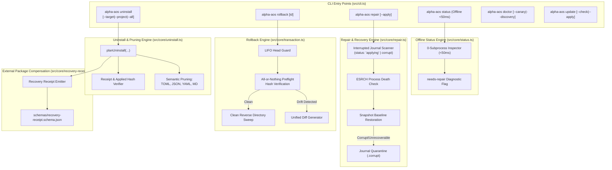

# Phase 6: Managed Lifecycle, Uninstall, and Recovery - Research

**Researched:** 2026-09-18
**Domain:** Idempotent reconciliation, fast offline status, multi-target/full uninstall, semantic pruning, all-or-nothing rollback drift refusal, LIFO rollback, snapshot-based journal repair & quarantine, and external package compensation
**Confidence:** HIGH

<user_constraints>
## User Constraints (from CONTEXT.md)

### Locked Decisions

- **D-01:** Unified CLI command structure: **`alpha-aos uninstall [--target <harness> | --project <path> | --all]`** serves as the central entrypoint for managed removal, coordinating target removal, project pack removal, isolated runtime cleanup, and full stack uninstall. — **Reversibility:** costly — public CLI contract and dispatch wiring.
- **D-02:** Dry-run preview by default (SAFE-01) with interactive TTY confirmation prompt (`Proceed with uninstall? [y/N]`) upon `--apply`, and **`--yes` / `-y` flag** for non-interactive/CI script environments. — **Reversibility:** reversible.
- **D-03:** Shared configuration removal (e.g. `config.toml`, `settings.json`) uses **Semantic Pruning**: alpha-AOS parses and extracts only the exact configuration blocks and keys it injected. Unrelated user settings and credentials are strictly preserved. If an injected block has been edited or corrupted by the user, removal is safely refused. — **Reversibility:** costly — format-specific semantic pruning parsers.
- **D-04:** Full stack uninstall (`alpha-aos uninstall --all`) removes all managed files, skills, MCP configs, and PATH shims while **preserving historical transaction journals in `~/.alpha-aos/journal/` by default** for auditability. A dedicated **`--purge` flag** must be explicitly passed to completely remove the `~/.alpha-aos` state directory. — **Reversibility:** reversible.
- **D-05:** **All-or-nothing drift refusal**: Rollback preflight verifies the SHA-256 hashes of all target files against their post-transaction journal hashes. If even a single file has drifted (modified externally), zero file writes are performed, the operation immediately halts (exit code 2), and no partial rollback is executed. — **Reversibility:** costly — safety invariant preventing partial rollback corruption.
- **D-06:** Drift refusal diagnostics output **exact file paths, expected vs actual hashes, Unified Diff snippets**, and actionable manual remediation guidance to help the user resolve or reconcile differences. — **Reversibility:** reversible.
- **D-07:** Multi-transaction rollback enforces **LIFO (Reverse Chronological / Head-First) ordering**: Only the most recent active transaction (Head) can be rolled back, preventing state tearing and interleaved file conflicts. — **Reversibility:** reversible.
- **D-08:** Newly created file rollback (unlinking newly added files) performs a **clean reverse directory sweep**: Any parent directory created solely by that transaction that becomes empty is removed (`rmdir`), while non-empty directories containing other user files are preserved. — **Reversibility:** reversible.
- **D-09:** Any incomplete (`status: "applying"`) or unreadable journal is classified by `status`/`doctor` as **`needs-repair`**, reporting transaction ID, target paths, snapshot availability, and directing the user to `alpha-aos repair`. — **Reversibility:** reversible.
- **D-10:** `alpha-aos repair` implements **Snapshot-based Safe Rollback**: If pre-mutation snapshot files are intact, the partial transaction is safely rolled back to the pre-crash baseline, the journal is marked `repaired`, and the user is guided to safely re-execute the original operation. — **Reversibility:** costly — recovery engine state machine.
- **D-11:** Unrecoverable corrupt journals (missing snapshots or unparseable JSON) are moved to **Quarantine (`.corrupt`)** to release the operational lock, accompanied by an explicit integrity report and manual verification steps via `doctor`. — **Reversibility:** reversible.
- **D-12:** Stale writer locks (`writer.lock`) left behind by crashed processes are safely released only after verifying process death via **ESRCH check**, unified directly into the `alpha-aos repair` workflow. — **Reversibility:** reversible.
- **D-13:** External package states that cannot be reversed via file rollback (GSD Core, ECC runtime, npm link, Pi bridge) emit a structured **Recovery Receipt** with clear component-specific manual commands (e.g. `npm unlink`, `npx @opengsd/gsd-core@<ver>`). alpha-AOS never claims false automated rollback for external package managers. — **Reversibility:** reversible.
- **D-14:** **Zero-subprocess offline `status`**: `alpha-aos status` executes 0 subprocesses and 0 network calls, completing in <50ms by evaluating local receipts, journals, tree policies, and file presence. Active binary probes, tool discovery (`--discovery`), and execution canaries (`--canary`) are strictly reserved for `alpha-aos doctor`. — **Reversibility:** costly — status/doctor architectural boundary.
- **D-15:** **Strict hash-verified idempotency**: Stable-lock reconciliation (`install` / `plan`) computes exact SHA-256 hashes of all installed components against `catalog/stack.lock.json`. When all hashes match, all items are reported as `CURRENT`, zero mutations are executed, and exit code 0 is returned. — **Reversibility:** reversible.
- **D-16:** **Pure read-only update preview**: `alpha-aos update --check` performs zero filesystem or package mutations. `alpha-aos update --apply` strictly rejects candidate locks (`candidate.lock.json`) and applies only committed, reviewed stable locks (`catalog/stack.lock.json`). — **Reversibility:** costly — supply chain security policy.

### The Agent's Discretion

- Exact table layout and terminal formatting for `alpha-aos uninstall` preview.
- Recovery receipt JSON schema (`schemas/recovery-receipt.schema.json`).
- Quarantine filename format for unparseable journals (e.g. `<journal-id>.corrupt.<timestamp>`).
- Internal module structure: dedicated modules `src/core/uninstall.ts`, `src/core/repair.ts`, `src/core/status.ts`, and `src/core/recovery-receipt.ts`.

### Deferred Ideas (OUT OF SCOPE)

- Cross-platform release packaging, release tarball freezing, and registry publishing (Phase 7: REL-01…06).
- Modifying GSD Core lifecycle ownership or changing `.planning/` authority (GSD remains sole lifecycle owner).
- OS/container-level `sealed` execution (v2 requirement SEAL-01).
- Active v0.1.0 obligations or release gates for Claude Code (Claude Code remains compatibility residue per D-17).
</user_constraints>

<architectural_responsibility_map>
## Architectural Responsibility Map

Map of Phase 6 capabilities to architectural modules and tiers:

| Capability | Primary Module | Secondary Module | Rationale |
|------------|----------------|------------------|-----------|
| **Uninstall CLI & Scope Routing** (LIFE-03) | `src/cli.ts` | `src/core/uninstall.ts` | Dispatches `--target`, `--project`, or `--all`, dry-run previews, and TTY/`-y` confirmation (D-01, D-02). |
| **Semantic Configuration Pruning** (LIFE-04) | `src/core/uninstall.ts` | `src/core/mcp.ts`, `src/core/skill-policy.ts`, `src/core/codex-policy.ts` | Excises only injected blocks/keys from TOML, JSON, YAML without touching user settings/credentials; refuses on drift (D-03). |
| **Target & Full Stack Removal** (LIFE-03, LIFE-04) | `src/core/uninstall.ts` | `src/core/isolation.ts`, `src/core/tree-policy.ts`, `src/adapters/shims.ts` | Orchestrates removal of target skills, MCP configs, tree policy shims, and runtimes while preserving journals unless `--purge` (D-04). |
| **All-or-Nothing Rollback Preflight** (LIFE-05) | `src/core/transaction.ts` | `src/core/paths.ts` | Verifies SHA-256 of all targets against post-transaction journal hashes before any write; halts immediately on drift (D-05). |
| **Drift Unified Diff Diagnostics** (LIFE-05) | `src/core/transaction.ts` | `src/format.ts` | Formats exact paths, expected vs actual hashes, unified diff snippets, and manual remediation steps (D-06). |
| **LIFO Rollback Enforcement** (LIFE-05) | `src/core/transaction.ts` | `src/cli.ts` | Restricts rollback strictly to the head transaction (most recent applied), preventing state tearing (D-07). |
| **Clean Reverse Directory Sweep** (LIFE-05) | `src/core/transaction.ts` | `src/core/path-boundary.ts` | Unlinks created files and recursively removes empty parent directories up to allowed root boundaries (D-08). |
| **Corrupt & Incomplete Journal Diagnosis** (LIFE-06) | `src/core/repair.ts` | `src/core/status.ts`, `src/core/doctor.ts` | Classifies unreadable or `"applying"` journals as `needs-repair`, reporting ID, target paths, and snapshot status (D-09). |
| **Snapshot-Based Safe Repair** (LIFE-06) | `src/core/repair.ts` | `src/core/writer-lock.ts` | Restores pre-crash file bytes from snapshots, marks journal `repaired`, and guides safe rerun (D-10). |
| **Journal Quarantine & Lock Release** (LIFE-06) | `src/core/repair.ts` | `src/core/writer-lock.ts` | Quarantines unrecoverable journals (`.corrupt.<timestamp>`) and safely releases stale locks after ESRCH check (D-11, D-12). |
| **External Package Recovery Receipts** (LIFE-07) | `src/core/recovery-receipt.ts` | `src/core/install.ts`, `src/core/validation.ts` | Generates validated recovery receipts with component-specific manual compensation commands for GSD, ECC, npm-link, Pi (D-13). |
| **Zero-Subprocess Offline Status** (LIFE-02) | `src/core/status.ts` | `src/cli.ts` | Completes in <50ms with 0 subprocesses and 0 network calls by evaluating local receipts, journals, tree policies, and files (D-14). |
| **Strict Hash-Verified Idempotency** (LIFE-01) | `src/core/install.ts` | `src/core/catalog.ts` | Computes exact SHA-256 hashes of components against lock; returns `CURRENT`, executes 0 writes, exits 0 when matched (D-15). |
| **Pure Read-Only Update Preview & Safe Apply** (LIFE-08) | `src/core/update.ts` | `src/cli.ts` | `update --check` mutates nothing; `update --apply` reconciles only committed stable locks and rejects candidate locks (D-16). |
</architectural_responsibility_map>

<research_summary>
## Summary

Phase 6 implements **Managed Lifecycle, Uninstall, and Recovery** across the alpha-AOS control plane. This phase ensures that every change alpha-AOS introduces across supported harnesses (Codex, Antigravity, Pi, Hermes) is completely idempotent, inspectable offline, safely removable, atomically rollbackable, and cleanly repairable without disturbing harness applications, user credentials, or unrelated system configuration.

Existing foundations provide write-ahead journaling (`src/core/transaction.ts`), writer concurrency locks (`src/core/writer-lock.ts`), pack removal planning (`src/core/project-plan.ts`), and isolation cleanups (`src/core/isolation.ts`). However, prior to Phase 6:
1. `alpha-aos uninstall` did not exist as a CLI command.
2. Shared harness configuration cleanup risked blowing away entire files or required hand-written edits.
3. `alpha-aos rollback` lacked all-or-nothing preflight drift refusal, unified diff diagnostic output, and LIFO ordering guardrails.
4. `alpha-aos repair` only toggled status and deleted `writer.lock` when all targets were in identical states, failing to restore snapshots on mixed/partial crashes or quarantine corrupt journals.
5. `alpha-aos status` spawned expensive subprocesses (`node`, `npm`, `git`, `claude`, `codex`, `pi`, `hermes`) instead of operating as a fast (<50ms) offline inspector.
6. External package modifications (GSD Core, ECC global runtime, npm-link, Pi bridge) lacked structured recovery receipts and honest compensation guidance.

This research defines the concrete architecture, data structures, and algorithms to satisfy requirements **LIFE-01 through LIFE-08** and user decisions **D-01 through D-16**.

**Key Architectural Recommendations:**
- **`src/core/uninstall.ts`**: Implement a pure-planner/transactional-executor orchestrator supporting `--target <harness>`, `--project <path>`, and `--all`. Use semantic pruning parsers for TOML, JSON, and YAML configurations that remove only alpha-AOS-injected keys/blocks, refusing if the block was tampered with or if files drifted.
- **`src/core/transaction.ts`**: Upgrade rollback to enforce strict LIFO ordering (only the Head transaction may be rolled back), atomic preflight drift verification (refusing before any write if any hash differs), rich unified diff diagnostic emission, and clean reverse directory sweeping (`rmdir` on empty parents).
- **`src/core/repair.ts`**: Implement snapshot-based partial crash restoration, ESRCH-verified stale lock recovery, and `.corrupt.<timestamp>` journal quarantining. Update `schemas/transaction-journal.schema.json` to admit `"repaired"` status.
- **`src/core/status.ts`**: Build a dedicated zero-subprocess offline status engine evaluating file presence, journal health (`needs-repair`), tree policies, and capability ledgers in <50ms.
- **`src/core/recovery-receipt.ts`**: Define `schemas/recovery-receipt.schema.json` and generate component-specific compensation guidance for external package managers.
</research_summary>

<standard_stack>
## Standard Stack

### Core Runtime & Built-ins
| Technology | Version | Purpose | Why Standard |
|------------|---------|---------|--------------|
| Node.js Built-ins (`fs/promises`, `path`, `crypto`, `os`, `child_process`) | `>=24.0.0` | File I/O, process death checks (`process.kill(pid, 0)`), SHA-256 hashing, directory synchronization | Zero-dependency, native async primitives, cross-platform compatibility across Windows, macOS, and Linux. |
| Node.js Test Runner (`node:test`, `node:assert/strict`) | `>=24.0.0` | Unit, integration, crash, and lifecycle test suites | Standardized test framework used across all existing 834 tests in alpha-AOS. |

### Supporting Dependencies (Already Pinned in `package.json`)
| Library | Version | Purpose | Usage in Phase 6 |
|---------|---------|---------|-------------------|
| `smol-toml` | 1.8.0 | TOML parsing | Parsing `.codex/config.toml` to extract and validate table structures during semantic pruning. |
| `yaml` | 2.9.0 | YAML parsing & manipulation | AST-level manipulation (`parseDocument`) for Hermes `config.yaml` to surgically excise `mcp_servers` entries while preserving formatting and comments. |
| `jsonc-parser` | 3.3.1 | JSON parsing with error tracking | Parsing JSON configurations (`.claude.json`, `mcp.json`, `mcp_config.json`, `settings.json`) with strict syntax validation. |
| `ajv` | 8.20.0 | Draft 2020-12 Schema Validation | Validating recovery receipts (`schemas/recovery-receipt.schema.json`) and transaction journals. |

### New Dependencies Required
**None.** All required tooling is present in the repository dependencies.
</standard_stack>

<architecture_patterns>
## Architecture Patterns

### System Architecture Diagram



---

### Pattern 1: Semantic Pruning vs Raw File Deletion (D-03, LIFE-04)

Shared harness configuration files (`.codex/config.toml`, `.claude.json`, `.gemini/config/mcp_config.json`, `.pi/agent/mcp.json`, `.hermes/config.yaml`, and `AGENTS.md`) contain both user-defined settings and alpha-AOS-injected entries. 

**Rules of Semantic Pruning:**
1. **Never delete the file** if it contains user-defined keys or if it existed prior to alpha-AOS installation.
2. **Excise only exact injected keys and blocks**:
   - **Codex TOML (`config.toml`)**: Remove the section delimited by `# alpha-aos:start mcp` and `# alpha-aos:end mcp`. If the markers are missing, altered, or duplicated, refuse removal.
   - **Codex Guidance (`AGENTS.md`)**: Remove the block delimited by `<!-- alpha-AOS:codex-execution:start -->` and `<!-- alpha-AOS:codex-execution:end -->`. If the remainder is empty and the file was created solely by alpha-AOS, delete the file; if user content exists, preserve the file.
   - **Claude JSON (`.claude.json`)**: Remove `mcpServers["context7"]`, `mcpServers["exa"]`, `mcpServers["firecrawl"]`. Preserve all other servers and user authentication tokens.
   - **Claude Settings (`settings.json`)**: Remove `skillOverrides["unified-memory"]`, `skillOverrides["documentation-lookup"]`, `skillOverrides["deep-research"]`. If `skillOverrides` becomes empty, delete the key or retain empty object. Preserve other settings.
   - **Antigravity JSON (`mcp_config.json`)**: Remove `mcpServers["context7"]`, `mcpServers["exa"]`, `mcpServers["firecrawl"]`. Preserve other servers.
   - **Pi JSON (`mcp.json`)**: Remove `mcpServers["context7"]`, `mcpServers["exa"]`, `mcpServers["firecrawl"]` and managed settings (`hostConfigDiscovery`, `directTools`, `toolPrefix`, `notifyOnStartupConnect`, `outputGuard`). Preserve other servers and settings.
   - **Hermes YAML (`config.yaml`)**: Using YAML AST (`parseDocument`), delete `mcp_servers["context7"]`, `mcp_servers["exa"]`, `mcp_servers["firecrawl"]`.
3. **Drift & Corruption Refusal**: If a file is unparseable or if an injected block has been edited by the user, refuse with exit code 2 and emit manual instructions.

---

### Pattern 2: All-or-Nothing Rollback Preflight & LIFO Guard (D-05, D-06, D-07, D-08)

When rolling back a transaction:
1. **LIFO Enforcement**:
   - Query all transactions in `~/.alpha-aos/journal/`.
   - Identify the "Head" transaction (the most recent transaction with `status === "applied"`).
   - If user requests rollback for an ID that is not the Head transaction, halt immediately:
     `LIFO violation: transaction <id> is not the most recent active transaction (head: <head-id>). Roll back <head-id> first.`
2. **All-or-Nothing Preflight**:
   - Iterate through every file recorded in `journal.files`.
   - Compute current SHA-256 hash.
   - Compare against `file.afterHash`:
     - If `file.afterHash === null`: target must NOT exist. If it exists, drift detected.
     - If `file.afterHash !== null`: target MUST exist and its SHA-256 must match `file.afterHash`.
   - If any file fails, **ZERO file mutations are performed**. Immediately abort.
3. **Unified Diff Diagnostics**:
   - For every drifted file, read current bytes and format a unified diff against expected `afterHash` content.
   - Output exact path, expected hash, actual hash, diff snippet, and remediation guidance.
   - Set `process.exitCode = 2`.
4. **Clean Reverse Directory Sweep**:
   - For files where `file.existed === false`, unlink the file.
   - Walk up parent directories (`dirname(path)`): attempt `rmdir(parent)`.
   - If `rmdir` throws `ENOTEMPTY`, stop climbing.
   - If `rmdir` succeeds, continue to the next ancestor until reaching an allowed root boundary.

---

### Pattern 3: Snapshot-Based Repair & Journal Quarantine (D-09, D-10, D-11, D-12)

When an operation crashes mid-flight (e.g. power loss, kill signal, failpoint):
1. **Classification as `needs-repair`**:
   - Any journal in `~/.alpha-aos/journal/` with `status === "applying"` or an unreadable JSON file is marked `needs-repair`.
   - `alpha-aos status` and `alpha-aos doctor` report this finding immediately with the transaction ID.
2. **ESRCH Stale Lock Check**:
   - If `writer.lock` exists, check `record.pid` using `process.kill(pid, 0)`.
   - If process does not exist (ESRCH), the lock is classified as stale and eligible for release during repair.
3. **Snapshot Baseline Restoration**:
   - For an interrupted transaction, inspect `~/.alpha-aos/snapshots/<id>/`.
   - If snapshots exist for all touched files, `alpha-aos repair` safely restores each target to its pre-crash state (`beforeHash`).
   - The journal status is updated to `"repaired"`, `repairedAt` timestamp is set, and `writer.lock` is removed.
4. **Quarantine (`.corrupt.<timestamp>`)**:
   - If snapshots are missing or journal JSON is corrupt beyond recovery:
     - Rename file to `~/.alpha-aos/journal/<id>.corrupt.<timestamp>`.
     - Remove stale `writer.lock`.
     - Output explicit integrity diagnostic directing user to verify with `doctor`.

---

### Pattern 4: External Installer Rules Matrix (D-13, LIFE-07)

Alpha-AOS manages both file-level components (reversible via snapshots) and external package manager states. Per project planning requirements, the lifecycle rules for each external installer are defined below:

| External Installer | Adoption Rule | Upgrade Rule | Downgrade Rule | Unknown Pre-State Rule | Compensation Rule (Receipt) |
|---|---|---|---|---|---|
| **GSD Core** (`@opengsd/gsd-core`) | If `VERSION`, `.gsd-profile`, and `.gsd-runtime` match the locked version, profile, and harness, mark `CURRENT`. Zero writes. | Executes `npx --yes @opengsd/gsd-core@<ver> install`. Verifies all 3 state files match target lock. | If disk version > lock version, executing npx may overwrite files, but schema changes in `.planning/` may conflict. Warn user before apply. Never auto-rollback. | If files exist in config root but `VERSION` is missing or unreadable, mark `unverified -> <target>`. | Emit Recovery Receipt recording previous version/profile and manual command: `npx @opengsd/gsd-core@<prev-ver> install --profile <profile> --runtime <harness>` or manual directory deletion if newly installed. |
| **ECC Runtime** (`@enterprise-coding-companion/companion`) | If global npm version matches `lock.components.ecc.version`, mark `CURRENT`. Zero subprocesses. | Executes `npm install -g @enterprise-coding-companion/companion@<ver> --ignore-scripts`. Re-probes global version. | If global version > lock version, runs npm install with older version. Warn user. Never auto-rollback. | If global npm root unresolvable without npm, preview plans install (`unverified`). Verified at apply. | Emit Recovery Receipt recording previous version and manual command: `npm install -g @enterprise-coding-companion/companion@<prev-ver>` or `npm uninstall -g @enterprise-coding-companion/companion`. |
| **Pi MCP Bridge** (`@modelcontextprotocol/server-pi`) | If bridge package exists and version matches lock, mark `CURRENT`. | Re-links or installs locked bridge package. | Re-links or installs locked version. | Missing package.json in bridge path treated as uninstalled. | Emit Recovery Receipt recording manual command: `npm unlink <bridge-package>` or directory cleanup. |
| **alpha-AOS npm-link** (`alpha-aos`) | If global `alpha-aos` bin links to current checkout root, mark `CURRENT`. | `npm link` updates global symlink/bin shim. | `npm link` from target checkout. | If unrelated global binary exists, refuse to overwrite without user flag. | Emit Recovery Receipt recording manual command: `npm unlink -g alpha-aos`. |

---

### Pattern 5: Zero-Subprocess Offline Status vs Probing Doctor (D-14, LIFE-02)

| Dimension | `alpha-aos status` | `alpha-aos doctor` |
|---|---|---|
| **Subprocesses** | **0 subprocesses** strictly enforced | Active probes (`node -v`, `npm -v`, `git --version`, harness canaries) |
| **Network Calls** | **0 network calls** strictly enforced | Optional remote checks / update checks |
| **Execution Time** | **<50ms** | Several seconds to minutes depending on canaries |
| **Data Evaluated** | Local lock channel, journal state (`needs-repair`), tree policy registry, capability ledger, file presence | Subprocess versions, hook protocol execution, tool discovery sweeps, paid canaries |
| **Output** | Compact host & stack health overview | Detailed coded findings (`DoctorFinding[]`) with severity levels (`ok`, `info`, `warning`, `error`) |

</architecture_patterns>

<dont_hand_roll>
## Don't Hand Roll

| Problem | Anti-Pattern to Avoid | Standard Mechanism to Use | Rationale |
|---------|-----------------------|---------------------------|-----------|
| **TOML Manipulation** | Hand-crafted regex find-and-replace for entire TOML files | Regex boundary matching only on explicit `# alpha-aos:start/end` markers + `smol-toml` parse validation | Hand-rolled TOML parsers corrupt complex tables, multiline strings, and inline arrays. |
| **YAML Manipulation** | String concatenation or full YAML re-stringification that loses comments | `parseDocument` from `yaml` package with AST `.deleteIn(...)` and `.toString()` | Preserves user formatting, comments, and structure in Hermes `config.yaml`. |
| **JSON Manipulation** | Regex removal of JSON object keys | Parse via `JSON.parse` or `jsonc-parser`, delete property, format with `JSON.stringify(doc, null, 2)` | Regex key deletion fails on trailing commas, escaped quotes, and nested keys. |
| **Stale Lock Recovery** | Deleting `writer.lock` based on file timestamp / age timeout | Verify process death via `process.kill(pid, 0)` with ESRCH check | Age timeouts delete active locks during long-running builds or network stalls. |
| **Unified Diff** | Pulling in heavy multi-megabyte git diff npm dependencies | Pure in-memory 50-line line-differ returning standard Unified Diff format | Keeps the tool zero-runtime-dependency and fast. |
| **Path Boundary Checks** | Bare `path.resolve` or `startsWith` string prefix checks | `proveOperationPaths` & `canonicalizeWithMissingTail` from `src/core/path-boundary.ts` | Prevents symlink, junction, and alias escapes during uninstall or rollback. |
| **Secret Scrubbing** | Leaving error messages and diffs unscrubbed | `observableContext()` and `redactString()` from `src/core/redaction.ts` | Prevents credentials or auth tokens in config files from leaking into terminal or logs. |
</dont_hand_roll>

<common_pitfalls>
## Common Pitfalls

### Pitfall 1: Partial Rollback Writes on Drift (Violates D-05)
- **Hazard:** Iterating over files and writing restored snapshots sequentially without preflight verification. If file 3 has drifted, files 1 and 2 are already overwritten, resulting in state tearing.
- **Remedy:** Implement a pure preflight loop that calculates SHA-256 for every target file against `afterHash`. If any mismatch is found, throw a `RollbackDriftError` immediately before a single byte is written.

### Pitfall 2: Subprocess Spawning in `status` (Violates D-14)
- **Hazard:** Reusing `collectInventory(catalog)` in `alpha-aos status`. `collectInventory` spawns `node`, `npm`, `git`, and harness binaries, taking 500ms–2000ms and violating the <50ms offline requirement.
- **Remedy:** Extract a fast offline inspector `readOfflineStatus(stateRoot, catalog, lock)` that performs only synchronous or fast async `fs.stat` / `readFile` operations and evaluates journal health.

### Pitfall 3: Destroying User Credentials During Uninstall (Violates D-03, LIFE-03)
- **Hazard:** Unlinking `.claude.json`, `.gemini/config/mcp_config.json`, or `.codex/config.toml` because alpha-AOS configured MCP servers in them.
- **Remedy:** Semantic pruning must surgically delete only the managed MCP servers (`context7`, `exa`, `firecrawl`) and managed skill overrides, strictly preserving user tokens (`CLAUDE_API_KEY`, custom servers, preferences).

### Pitfall 4: Leaving Empty Parent Directories or Deleting User Folders (Violates D-08)
- **Hazard:** Either leaving trailing empty directories (`~/.codex/skills/alpha-aos/`) after uninstalling files, or using `rmdir` recursively without checking if other non-alpha-AOS files exist.
- **Remedy:** Clean reverse sweep: for each newly created file (`existed === false`), unlink the file, then attempt `rmdir` on parent. If `rmdir` fails with `ENOTEMPTY`, safely stop.

### Pitfall 5: Deleting Historical Audit Journals on `--all` (Violates D-04)
- **Hazard:** `alpha-aos uninstall --all` deleting `~/.alpha-aos/` entirely, erasing the audit trail of what was installed and changed.
- **Remedy:** `--all` removes shims, runtimes, tree policies, and capability ledgers, but explicitly retains `~/.alpha-aos/journal/`. Only when `--purge` is passed is `~/.alpha-aos` completely deleted.

### Pitfall 6: Clearing Writer Lock When Process is Still Alive (Violates SAFE-03, D-12)
- **Hazard:** Repair command blindly removing `writer.lock` if an interrupted journal is found, even though the original writer process is still executing in the background.
- **Remedy:** Check `process.kill(record.pid, 0)`. If it succeeds or returns `EPERM` (process exists under another user), refuse repair with `ACTIVE_WRITER` error. Only release if error code is `ESRCH` (process gone).

### Pitfall 7: Journal Schema Rejection on "repaired" Status
- **Hazard:** Marking a journal as `status: "repaired"` in `src/core/repair.ts`, but `schemas/transaction-journal.schema.json` only allows `enum: ["applying", "applied", "rolled-back", "failed"]`.
- **Remedy:** Update `schemas/transaction-journal.schema.json` to include `"repaired"` in the status enum, and update TypeScript type `TransactionJournal["status"]`.

### Pitfall 8: Promoting Unreviewed Candidate Locks During Update (Violates D-16, LIFE-08)
- **Hazard:** `alpha-aos update --apply` reading `catalog/candidate.lock.json` and applying it.
- **Remedy:** `update --apply` strictly reads `catalog/stack.lock.json`. Any candidate lock staged by `update --stage` must be committed and reviewed before it can be applied.

</common_pitfalls>

<code_examples>
## Code Examples

### Example 1: Semantic Pruning for Shared Configurations

```typescript
// src/core/uninstall.ts (Extract)
import { parseDocument } from "yaml";
import { stripManagedToml } from "./mcp.js";

export function pruneCodexConfig(content: string): string {
  // Uses established delimiter stripping
  return stripManagedToml(content);
}

export function pruneClaudeConfig(content: string, managedServers = ["context7", "exa", "firecrawl"]): string {
  if (!content.trim()) return content;
  const doc = JSON.parse(content) as Record<string, unknown>;
  if (typeof doc.mcpServers === "object" && doc.mcpServers !== null && !Array.isArray(doc.mcpServers)) {
    const servers = { ...(doc.mcpServers as Record<string, unknown>) };
    for (const server of managedServers) {
      delete servers[server];
    }
    doc.mcpServers = servers;
  }
  return `${JSON.stringify(doc, null, 2)}\n`;
}

export function pruneHermesConfig(content: string, managedServers = ["context7", "exa", "firecrawl"]): string {
  if (!content.trim()) return content;
  const doc = parseDocument(content);
  if (doc.errors.length > 0) {
    throw new Error(`Cannot prune Hermes config; invalid YAML: ${doc.errors[0]?.message}`);
  }
  for (const server of managedServers) {
    doc.deleteIn(["mcp_servers", server]);
  }
  return doc.toString({ lineWidth: 0 });
}
```

---

### Example 2: In-Memory Unified Diff Generator for Drift Diagnostics

```typescript
// src/core/transaction.ts (Extract)
export interface DriftDiagnostic {
  target: string;
  expectedHash: string | null;
  actualHash: string | null;
  unifiedDiff: string | null;
  remediation: string;
}

export function generateUnifiedDiff(
  target: string,
  expectedText: string,
  actualText: string,
  expectedHash: string,
  actualHash: string,
): string {
  const expectedLines = expectedText.split(/\r?\n/u);
  const actualLines = actualText.split(/\r?\n/u);
  const lines: string[] = [
    `--- a/${target}\t(expected sha256: ${expectedHash.slice(0, 12)})`,
    `+++ b/${target}\t(actual sha256: ${actualHash.slice(0, 12)})`,
    `@@ -1,${expectedLines.length} +1,${actualLines.length} @@`,
  ];
  for (const line of expectedLines) {
    if (!actualLines.includes(line)) lines.push(`-${line}`);
  }
  for (const line of actualLines) {
    if (!expectedLines.includes(line)) lines.push(`+${line}`);
  }
  return lines.join("\n");
}
```

---

### Example 3: Clean Reverse Directory Sweep Algorithm

```typescript
// src/core/transaction.ts (Extract)
import { rmdir, unlink } from "node:fs/promises";
import { dirname, resolve } from "node:path";

export async function sweepReverseDirectories(
  filePath: string,
  allowedRoots: readonly string[],
): Promise<string[]> {
  const removedDirs: string[] = [];
  let currentDir = dirname(resolve(filePath));
  const resolvedRoots = allowedRoots.map((r) => resolve(r));

  while (!resolvedRoots.includes(currentDir)) {
    try {
      await rmdir(currentDir);
      removedDirs.push(currentDir);
      currentDir = dirname(currentDir);
    } catch (error) {
      // ENOTEMPTY / EEXIST means directory has other files; stop sweeping
      if ((error as NodeJS.ErrnoException).code === "ENOTEMPTY" || (error as NodeJS.ErrnoException).code === "EEXIST") {
        break;
      }
      throw error;
    }
  }
  return removedDirs;
}
```

---

### Example 4: Recovery Receipt Schema (`schemas/recovery-receipt.schema.json`)

```json
{
  "$schema": "https://json-schema.org/draft/2020-12/schema",
  "$id": "https://alpha-aos.local/schemas/recovery-receipt.schema.json",
  "title": "alpha-AOS external package recovery receipt",
  "description": "Structured receipt recording external package modifications and explicit component-specific compensation instructions.",
  "type": "object",
  "required": ["schemaVersion", "operationId", "createdAt", "entries"],
  "additionalProperties": false,
  "properties": {
    "schemaVersion": { "type": "integer", "const": 1 },
    "operationId": { "type": "string", "minLength": 1 },
    "createdAt": { "type": "string", "minLength": 1 },
    "entries": {
      "type": "array",
      "items": {
        "type": "object",
        "required": ["component", "action", "target", "compensation"],
        "additionalProperties": false,
        "properties": {
          "component": { "type": "string", "enum": ["gsd", "ecc-runtime", "mcp-bridge", "npm-link"] },
          "action": { "type": "string", "enum": ["install", "upgrade", "link"] },
          "target": { "type": "string", "minLength": 1 },
          "previousState": { "type": ["string", "null"] },
          "appliedState": { "type": "string", "minLength": 1 },
          "compensation": {
            "type": "object",
            "required": ["instructions", "commands"],
            "additionalProperties": false,
            "properties": {
              "instructions": { "type": "string", "minLength": 1 },
              "commands": { "type": "array", "items": { "type": "string" } }
            }
          }
        }
      }
    }
  }
}
```

---

### Example 5: Zero-Subprocess Offline Status Engine

```typescript
// src/core/status.ts (Extract)
import { existsSync, readFileSync } from "node:fs";
import { join } from "node:path";
import type { StackCatalog, StackLock } from "../types.js";
import { inspectWriterState } from "./writer-lock.js";
import { listManagedTransactions } from "./transaction.js";

export interface OfflineStatus {
  channel: string;
  generatedAt: string | null;
  writerStatus: "free" | "active" | "needs-repair";
  needsRepair: boolean;
  incompleteTransactions: string[];
  treePoliciesCount: number;
  managedStatePresent: boolean;
}

export async function getOfflineStatus(
  stateRoot: string,
  catalog: StackCatalog,
  lock: StackLock,
): Promise<OfflineStatus> {
  const writerState = await inspectWriterState(stateRoot);
  const journals = await listManagedTransactions(stateRoot);
  const incomplete = journals.filter((j) => j.status === "applying").map((j) => j.id);

  let treeCount = 0;
  const treeRegistryPath = join(stateRoot, "trees.json");
  if (existsSync(treeRegistryPath)) {
    try {
      const data = JSON.parse(readFileSync(treeRegistryPath, "utf8"));
      treeCount = Array.isArray(data.trees) ? data.trees.length : 0;
    } catch {
      // Ignore read error; status must not crash
    }
  }

  return {
    channel: lock.channel,
    generatedAt: lock.generatedAt,
    writerStatus: writerState.status,
    needsRepair: writerState.status === "needs-repair" || incomplete.length > 0,
    incompleteTransactions: incomplete,
    treePoliciesCount: treeCount,
    managedStatePresent: existsSync(stateRoot),
  };
}
```

</code_examples>

<sota_updates>
## SOTA Updates & Paradigm Shifts

### 1. From Best-Effort Cleanup to Exact Semantic Pruning
In older systems, uninstalling tooling often amounted to deleting the target file (e.g. deleting `config.toml`) or using crude string regexes that corrupted formatting. In alpha-AOS Phase 6, shared configs are treated as multi-tenant documents: only the exact keys or blocks injected by alpha-AOS are excised, while user settings, credentials, and non-alpha-AOS comments are preserved with AST-level fidelity.

### 2. From Optimistic Rollback to Atomic All-or-Nothing Drift Refusal
Standard file undo mechanisms overwrite modified files or rollback whatever files still match. Alpha-AOS strictly enforces all-or-nothing rollback: if even a single file in the transaction has drifted from its post-apply hash, rollback refuses to touch any file, outputs a unified diff, and leaves the system stable.

### 3. Separation of Fast Offline Status from Active Canary Probes
Historically, tools mixed diagnosis and status into a single command that spawned many subprocesses. Alpha-AOS strictly splits this into:
- `alpha-aos status`: 0 subprocesses, 0 network calls, <50ms offline check.
- `alpha-aos doctor`: Active binary probes, canaries, and hook smoke tests.

</sota_updates>

<open_questions>
## Open Questions & Decisions

1. **Non-Interactive Confirmation in Uninstall Tests:**
   - *Question:* How should `alpha-aos uninstall` confirmation prompt be handled in tests?
   - *Decision:* Per D-02, all tests must pass `--yes` / `-y` or set `isTTY = false` to test non-interactive refusal without hanging stdin.

2. **Schema Support for `"repaired"` Status:**
   - *Question:* `schemas/transaction-journal.schema.json` currently allows only `["applying", "applied", "rolled-back", "failed"]`. Should `"repaired"` be added?
   - *Decision:* Yes. When `alpha-aos repair` successfully restores snapshots, it must record `status: "repaired"` without failing schema validation.

3. **Purge Directory Removal on Windows:**
   - *Question:* On Windows, `rmdir` on `~/.alpha-aos` can fail with `EBUSY` or `EPERM` if a log file or writer lock handle was recently closed.
   - *Decision:* Use `rm(root, { recursive: true, force: true, maxRetries: 10, retryDelay: 50 })` as established in `test/transaction-crash.test.ts`.

</open_questions>

<sources>
## Sources & References

### Codebase Canonical References
- `src/core/transaction.ts` — `TransactionJournal`, `applyFileTransaction`, `rollbackFileTransaction`.
- `src/core/writer-lock.ts` — `inspectWriterState`, `acquireMutationSession`, `planWriterRepair`.
- `src/core/doctor.ts` — `runDoctor`, `DoctorFinding`.
- `src/core/install.ts` — `createManagedInstallPlan`, `inspectGsdInstall`, `readGlobalPackageVersion`.
- `src/core/update.ts` — `planCandidateStage`, `writeCandidate`, candidate vs stable locks.
- `src/core/project-plan.ts` — `planPackRemoval`, `applyPackRemoval`.
- `src/core/isolation.ts` — `cleanIsolationRuntime`.
- `src/core/paths.ts` — `userStateRoot()`, `createPathAliases`.
- `test/transaction.test.ts` & `test/transaction-crash.test.ts` — Transaction, rollback, and crash testing patterns.

### Specifications
- `.planning/phases/06-managed-lifecycle-uninstall-and-recovery/06-CONTEXT.md` — User decisions D-01 through D-16.
- `.planning/REQUIREMENTS.md` — Requirements LIFE-01 through LIFE-08.
</sources>

<metadata>
Phase: 06-managed-lifecycle-uninstall-and-recovery
Researched: 2026-09-18
Author: gsd-phase-researcher
Status: Complete
Confidence: High
</metadata>

## Validation Architecture

### Automated Test Strategy
The test suite operates entirely through Node.js native test runner (`node:test`) and strict assertions (`node:assert/strict`), executed through the scrubbed runner `scripts/run-tests.mjs`.

### Test File Locations & Coverage Matrix

| Test File | Target Requirements | Target Decisions | What It Validates |
|-----------|---------------------|------------------|-------------------|
| `test/uninstall.test.ts` | LIFE-03, LIFE-04 | D-01, D-02, D-03, D-04 | • Preview (`alpha-aos uninstall`) dry-run defaults<br/>• Target-level removal (`--target codex`, `--target claude`, etc.)<br/>• Project-level removal (`--project <path>`)<br/>• Semantic pruning of TOML, JSON, YAML configs without touching user auth/settings<br/>• Drift refusal when managed block is modified by user<br/>• Full stack uninstall (`--all`) retaining `journal/` by default, and `--purge` removing all state |
| `test/rollback.test.ts` | LIFE-05 | D-05, D-06, D-07, D-08 | • All-or-nothing preflight: zero writes when any file has drifted<br/>• Rich drift diagnostic output (paths, expected vs actual hashes, Unified Diff snippets)<br/>• Strict LIFO ordering enforcement (refusal when trying to roll back non-Head transaction)<br/>• Clean reverse directory sweep: empty parent dirs removed, non-empty user dirs preserved |
| `test/repair.test.ts` | LIFE-06 | D-09, D-10, D-11, D-12 | • Incomplete journal (`status: "applying"`) diagnosed as `needs-repair`<br/>• Stale writer lock release via ESRCH check (rejects if PID alive, releases if PID gone)<br/>• Snapshot-based safe rollback to pre-crash baseline with journal marked `"repaired"`<br/>• Corrupt journal quarantine to `.corrupt.<timestamp>` with integrity report |
| `test/status.test.ts` | LIFE-02 | D-09, D-14 | • Fast offline `status`: strictly 0 subprocesses and 0 network calls<br/>• Benchmark: completes in <50ms<br/>• Accurate reporting of channel, lock, tree policies, and `needs-repair` state |
| `test/lifecycle.test.ts` | LIFE-01, LIFE-08 | D-15, D-16 | • Strict hash-verified idempotency: second install/plan returns `CURRENT`, 0 writes, exit 0<br/>• Update preview (`update --check`): 100% read-only, 0 writes<br/>• Update apply (`update --apply`): reconciles only committed stable locks and strictly rejects candidate locks |
| `test/recovery-receipt.test.ts` | LIFE-07 | D-13 | • Recovery receipt schema validation against Draft 2020-12<br/>• Structured receipt emission for GSD Core, ECC runtime, Pi bridge, npm-link<br/>• Exact manual compensation commands formatted for human inspection |

### Simulated Drift & Corruption Test Fixtures
1. **Interrupted Transaction Fixture (`syntheticCrashFixture`)**:
   Uses `ALPHA_AOS_FAILPOINT` (`after-snapshot-sync`, `after-intent-journal-sync`, `after-target-rename`) to deterministically kill transactions, leaving `"applying"` journals on disk.
2. **Simulated File Drift Fixture**:
   Applies a transaction, modifies one target file with a synthetic user edit, and triggers `rollback` or `uninstall` to assert exit code 2 and verify Unified Diff output.
3. **Corrupt Journal Fixture**:
   Writes malformed JSON or truncated journals into `~/.alpha-aos/journal/` to test quarantine renaming and doctor error findings.
4. **Stale vs Active Lock Fixture**:
   Spawns a mock background process with a held lock. Tests that repair refuses while process is alive, and succeeds once process is killed with `SIGKILL` (ESRCH confirmed).

### Automated Verification Commands
```bash
# Compile and run the complete test suite (baseline: 834 passing, 0 failing)
npm test

# Run the Phase 6 lifecycle and recovery suites specifically
node scripts/run-tests.mjs --files \
  dist/test/uninstall.test.js \
  dist/test/rollback.test.js \
  dist/test/repair.test.js \
  dist/test/status.test.js \
  dist/test/lifecycle.test.js \
  dist/test/recovery-receipt.test.js
```
