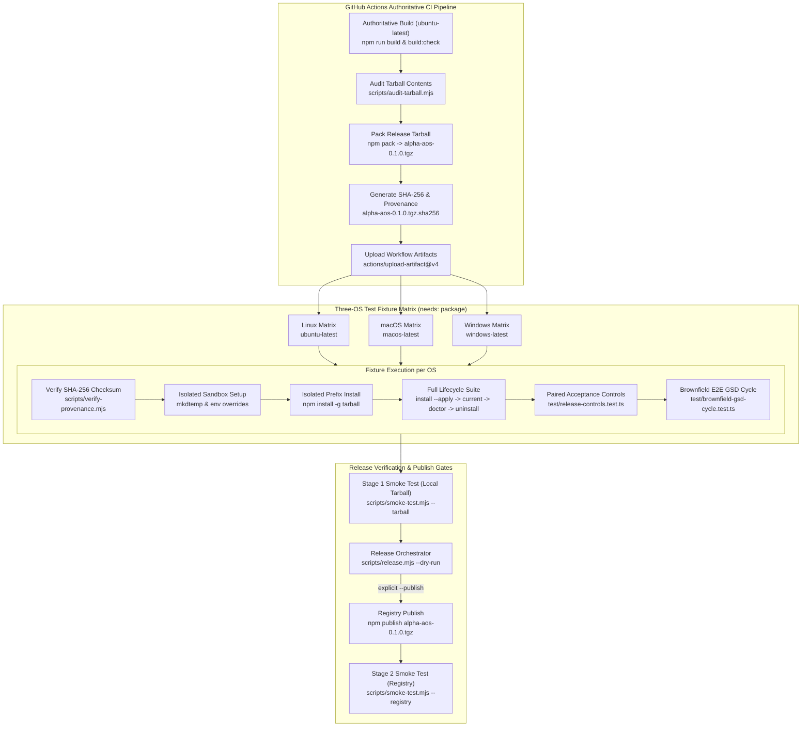

# Phase 7: Cross-Platform Release Proof - Research

**Status:** Complete  
**Date:** 2026-09-18  
**Author:** GSD Phase Researcher  
**Phase Target:** Phase 07 (`cross-platform-release-proof`)  
**Artifact Destination:** `.planning/phases/07-cross-platform-release-proof/07-RESEARCH.md`

---

<user_constraints>
## Implementation Decisions

### 1. Cross-Platform Fixture Matrix & CI Packaging Pipeline (REL-01, REL-05)
- **D-01:** **Authoritative Single Tarball Build in CI**: CI builds and packs a single `alpha-aos-0.1.0.tgz` on an authoritative runner (e.g. ubuntu-latest), uploads it as a workflow artifact, and all three OS matrix jobs (Windows, macOS, Linux) download and test the exact same byte-identical tarball. — **Reversibility:** one-way — core release pipeline contract guaranteeing byte identity across operating systems.
- **D-02:** **Package Whitelist & Tarball Content Audit**: Update `package.json` `files` field and `.npmignore` to strictly exclude `catalog/candidate.lock.json` and local dev state. Introduce `scripts/audit-tarball.mjs` (called during prepack/CI) that unpacks and inspects the tarball manifest and fails closed if any unallowlisted or candidate file is present. — **Reversibility:** costly — packaging configuration and prepack verification hook.
- **D-03:** **Temp-Root & Environment Override Sandbox**: Fixture runs on each OS create a unique isolated temporary directory (`mkdtemp`) and redirect `ALPHA_AOS_STATE_DIR`, harness configuration directories (`CODEX_HOME`, `ANTIGRAVITY_CONFIG_DIR`, etc.), and `npm_config_prefix` into that sandbox, preserving 100% of the host machine's actual home directories and global packages. — **Reversibility:** reversible.
- **D-04:** **Full Lifecycle Fixture Suite**: The fixture test suite on Windows, macOS, and Linux executes the complete lifecycle sequentially: [Isolated Prefix Install] → [`install --apply`] → [Second `install` verifying `CURRENT` idempotency] → [`status` and `doctor` passing] → [`uninstall --all --yes` verifying clean baseline restoration]. — **Reversibility:** costly — multi-platform CI verification suite.

### 2. Versioned Support Matrix & Real-Host Canaries (REL-02, REL-03)
- **D-05:** **Structured Ledger Source with CLI & Doc Sync**: Define the official support matrix as structured data in `src/core/support-matrix.ts`, renderable via both `alpha-aos doctor --matrix` in the CLI and exported to `docs/SUPPORT_MATRIX.md`. — **Reversibility:** costly — cross-cutting public contract for CLI diagnostics and documentation.
- **D-06:** **Isolated Real-Host Canary Runner & Redacted Receipts**: Provide `alpha-aos doctor --canary [harness]` to run representative, cost-bounded native invocations on active harnesses (Codex, Antigravity, Pi, Hermes). Capture verified observations into redacted canary receipts while reporting uninstalled or unprobed harnesses honestly as `UNVERIFIED`. — **Reversibility:** costly — canary runner interface and receipt schemas.
- **D-07:** **Automated Paired Positive/Negative Controls**: Implement `test/release-controls.test.ts` covering 4 critical domains with explicit Positive and Negative control pairs:
  1. *Optional Capability Invocation*: Positive (intent triggers Context7) vs Negative (unmatched task does not invoke).
  2. *Project Pack Scope*: Positive (tools discoverable inside project root) vs Negative (undiscoverable outside project).
  3. *Mandatory Gate Blocking*: Positive (auth/migration risk blocks lifecycle) vs Negative (low-risk work bypasses gate).
  4. *Tree-Off Opt-Out*: Positive (managed repo activates alpha-AOS) vs Negative (tree marked `off` loads zero customizations).
  Output an inspectable report artifact (`docs/RELEASE_CONTROLS.md`). — **Reversibility:** costly — acceptance verification suite and evidence schema.
- **D-08:** **Four-Tier Status Taxonomy**: Harness/surface capabilities are classified into 4 mutually exclusive states: `PROVEN` (real-host canary passed), `RESIDUE` (Claude Code compatibility residue only), `UNVERIFIED` (detected on host but canary not run), and `UNSUPPORTED` (incompatible on target OS/version). False success states are strictly prohibited. — **Reversibility:** costly — system-wide diagnostic status taxonomy.

### 3. Brownfield E2E GSD Full Lifecycle Verification (REL-04)
- **D-09:** **Self-Contained Brownfield Git Fixture Workspace**: Create a realistic brownfield repository under `test/fixtures/brownfield-gsd-cycle` containing existing code and `.planning/` state. Tests clone this fixture into a temporary sandbox and drive the full GSD cycle: discuss → plan → execute → verify → ship. — **Reversibility:** costly — complex integration test fixture.
- **D-10:** **Representative 5-Element Benchmark Set**: The brownfield E2E cycle exercises:
  1. *1 Global Optional Capability*: Context7 version-sensitive documentation lookup.
  2. *1 Project Pack*: Node/TypeScript Web API pack matched by repository evidence.
  3. *1 Mandatory Gate*: Authentication boundary security gate blocking progress until passed.
  4. *1 Cross-Harness Handoff*: Unified Memory context handoff between Codex and Antigravity.
  5. *Safe Cleanup*: `alpha-aos uninstall --project <path>` cleanly restoring the project baseline. — **Reversibility:** costly — end-to-end integration benchmark specifications.
- **D-11:** **Single GSD Writer Enforcement**: Verify that `.planning/` state transitions strictly maintain `writer.lock` under a single GSD controller. Worker harnesses and memory handoffs are forbidden from directly mutating `.planning/` files, verified via file integrity watchers and lock assertions. — **Reversibility:** one-way — core GSD architectural invariant.
- **D-12:** **Dual Execution Vector (CI + Standalone Script)**: Implement the cycle as both an automated CI regression suite (`test/brownfield-gsd-cycle.test.ts` with deterministic harness drivers) and an executable CLI script (`scripts/run-brownfield-proof.mjs`) for manual auditor reproduction. — **Reversibility:** reversible.

### 4. Release Provenance, Publish Gates & Smoke Verification (REL-05, REL-06)
- **D-13:** **Cryptographic Provenance Bundle**: Generate SHA-256 checksums (`alpha-aos-0.1.0.tgz.sha256`), include build manifest (`dist/build-manifest.json`), and verify `catalog/stack.lock.json` integrity. Provide `scripts/verify-provenance.mjs` for one-click verification of downloaded release tarballs. — **Reversibility:** one-way — published release provenance format.
- **D-14:** **Standardized Release Notes & Known Limitations**: Structure `CHANGELOG.md` and `docs/RELEASE_NOTES_v0.1.0.md` with explicit sections for [Active Harnesses: Codex, Antigravity, Pi, Hermes], [Compatibility Residue: Claude Code], and [Known Platform Limitations: Windows floor environment variables, v2 deferred sealed container mode]. — **Reversibility:** reversible.
- **D-15:** **Two-Stage Smoke Verification Gate**:
  - *Stage 1 (Pre-publish)*: Install local `alpha-aos-0.1.0.tgz` in a clean temporary environment via `scripts/smoke-test.mjs`, asserting `--version`, `status`, and `doctor` exit 0.
  - *Stage 2 (Post-publish)*: Verify fresh public registry install (`npm install -g alpha-aos@0.1.0`) against the same smoke assertions before declaring the release complete. — **Reversibility:** costly — release gate pipeline.
- **D-16:** **Preview-First Release Script (`scripts/release.mjs --dry-run`)**: Default to a non-mutating preview that validates Git clean state, tests, tarball contents, and SHA-256 hashes, entering the actual publish step only when an explicit `--publish` flag is supplied. — **Reversibility:** costly — release orchestration tooling.

### the agent's Discretion
- Terminal color formatting and layout for `alpha-aos doctor --matrix`.
- Internal helper structure of `scripts/audit-tarball.mjs` and `scripts/verify-provenance.mjs`.
- Exact test repo mock data for `test/fixtures/brownfield-gsd-cycle`.

### Deferred Ideas
- OS/container-level `sealed` sandbox mode deferred to v2 (SEAL-01).

### Reviewed Todos (not folded)
None — discussion stayed within phase scope.
</user_constraints>

---

<phase_requirements>
| REQ-ID | Description | Research Support & Implementation Approach |
|:-------|:------------|:-------------------------------------------|
| **REL-01** | User can install, reconcile, diagnose, and uninstall the same packed release bytes in Windows, macOS, and Linux fixture environments without touching real shared roots | **Authoritative tarball + 3-OS fixture runner**: In CI, `ubuntu-latest` executes `npm pack` to author `alpha-aos-0.1.0.tgz`. The GitHub Actions workflow artifact is downloaded by `windows-latest`, `macos-latest`, and `ubuntu-latest`. On each OS, `test/tarball-fixture.test.ts` (and `scripts/smoke-test.mjs --tarball`) instantiates a sandboxed prefix directory via `mkdtemp`, overrides `HOME`, `USERPROFILE`, `CODEX_HOME`, `ANTIGRAVITY_CONFIG_DIR`, `PI_CODING_AGENT_DIR`, `HERMES_HOME`, and `npm_config_prefix`, runs `npm install -g <tarball>`, and executes the sequential lifecycle: `install --apply` → idempotent second `install` (reporting `CURRENT`) → `status` & `doctor` passing → `uninstall --all --yes` leaving zero residual files in the sandbox. |
| **REL-02** | User can consult a versioned support matrix in which every active claimed harness and surface has at least one current real-host discovery and invocation canary, while Claude Code remains compatibility residue and other unproven combinations remain visibly limited or unsupported | **Structured support matrix engine & CLI doctor integration**: Implement `src/core/support-matrix.ts` defining active harnesses (`codex`, `antigravity`, `pi`, `hermes`) and compatibility residue (`claude`) across all supported surfaces and OS targets. Expose `alpha-aos doctor --matrix` (with ANSI color table and `--json` export). Overlays live host state from `userStateRoot()/capabilities/ledger.json` and `collectInventory()`, classifying into the 4-tier taxonomy: `PROVEN` (canary receipt verified on disk), `RESIDUE` (Claude Code compatibility), `UNVERIFIED` (detected on host, canary not run), and `UNSUPPORTED` (incompatible OS/version). Export canonical markdown to `docs/SUPPORT_MATRIX.md` with drift assertion test. |
| **REL-03** | User can inspect paired positive and negative controls proving native optional invocation, project-only capability scope, mandatory gate blocking, and opt-out exclusion | **Paired positive/negative controls test suite & markdown ledger**: Implement `test/release-controls.test.ts` executing 4 paired controls: (1) *Optional Capability Invocation*: Positive (intent triggers Context7 MCP tool call) vs Negative (unmatched task never calls Context7); (2) *Project Pack Scope*: Positive (within project root, tools discoverable) vs Negative (outside canonical root, tools undiscoverable); (3) *Mandatory Gate Blocking*: Positive (auth/migration diff blocks lifecycle advance) vs Negative (low-risk diff bypasses gate); (4) *Tree-Off Opt-Out*: Positive (unmarked tree loads customizations) vs Negative (marked `off` loads vanilla harness). Output verifiable audit report to `docs/RELEASE_CONTROLS.md`. |
| **REL-04** | User can complete a real brownfield GSD discuss → plan → execute → verify → ship cycle that exercises one global optional capability, one project pack, one mandatory gate, one cross-harness handoff, and safe cleanup | **Brownfield E2E benchmark fixture & dual execution vector**: Create realistic brownfield git workspace in `test/fixtures/brownfield-gsd-cycle` (via helper `test/helpers/brownfield-fixture.ts`). Implement both automated test `test/brownfield-gsd-cycle.test.ts` and standalone script `scripts/run-brownfield-proof.mjs`. Drives complete cycle: (1) `discuss` existing repo requirements; (2) `plan` matching Web API pack; (3) `execute` with Context7 documentation lookup, pack materialization, and Unified Memory handoff between Codex and Antigravity; (4) `verify` security review mandatory gate triggered by auth modification and resolved via `GateReceipt`; (5) `ship` finalized with `alpha-aos uninstall --project` cleanly restoring original repo state. Enforces single GSD writer invariant with `writer.lock` and `witnessWorkerDelegation`. |
| **REL-05** | User receives a v0.1.0 package that excludes candidate locks and local state, contains only allowlisted release files, and matches the tarball tested on all three operating systems | **Package allowlist, .npmignore, tarball audit script & byte identity**: Update `package.json` `files` field and `.npmignore` to strictly exclude `catalog/candidate.lock.json`, `.planning/`, `test/`, and local dev state. Implement `scripts/audit-tarball.mjs` using pure Node.js `node:zlib` to unpack and inspect tarball manifests against an explicit positive allowlist and negative forbidden pattern set, failing closed if any forbidden file is included. Hook into `prepack` and CI. Verify that the SHA-256 hash of the packed tarball matches across all 3 OS test runs. |
| **REL-06** | User can verify the published v0.1.0 package provenance, frozen stable lock, release notes, limitations, and a fresh-install smoke test from the public registry | **Provenance bundle, release documentation, smoke tester & release orchestrator**: Implement `scripts/verify-provenance.mjs` validating tarball SHA-256 (`alpha-aos-0.1.0.tgz.sha256`), build manifest (`dist/build-artifact.json`), and frozen stable lock (`catalog/stack.lock.json`). Author `CHANGELOG.md` and `docs/RELEASE_NOTES_v0.1.0.md` detailing active harnesses, compatibility residue, and platform limitations (Windows floor env vars, deferred v2 sealed mode). Implement `scripts/smoke-test.mjs` with Stage 1 (local tarball) and Stage 2 (fresh registry `alpha-aos@0.1.0`) verification. Implement `scripts/release.mjs` with `--dry-run` default preview. |
</phase_requirements>

---

## Summary

Phase 07 delivers the definitive verification and release proof of `alpha-aos` v0.1.0. The core architectural objective is to prove that the exact same frozen, byte-identical tarball (`alpha-aos-0.1.0.tgz`) functions flawlessly across Windows, macOS, and Linux without touching host-shared roots, provides verifiable cryptographic provenance, enforces strict security boundaries and single-writer locks, and documents real-host capabilities honestly.

### Primary Recommendations
1. **Authoritative Single Build in CI (D-01, REL-01, REL-05)**: Never build the tarball separately on each runner. Build once on `ubuntu-latest`, generate `alpha-aos-0.1.0.tgz` and `alpha-aos-0.1.0.tgz.sha256`, upload as workflow artifacts, and have Windows, macOS, and Linux matrix jobs download and test the identical tarball.
2. **Double-Barred Candidate Lock Exclusion (D-02, REL-05)**: Prevent `catalog/candidate.lock.json` from entering the tarball through three layers: (a) refined `package.json` `files` field; (b) root `.npmignore`; and (c) an automated audit script (`scripts/audit-tarball.mjs`) that inspects the archive stream in prepack and CI, failing closed on unexpected or candidate files.
3. **Four-Tier Status Taxonomy (D-05, D-08, REL-02)**: Define the official support matrix as immutable structured code in `src/core/support-matrix.ts`. Render it via `alpha-aos doctor --matrix` and export to `docs/SUPPORT_MATRIX.md`. The status taxonomy strictly discriminates: `PROVEN` (real-host canary receipt present), `RESIDUE` (Claude Code compatibility only), `UNVERIFIED` (detected on host, canary unrun), and `UNSUPPORTED` (incompatible).
4. **Paired Acceptance Controls (D-07, REL-03)**: In `test/release-controls.test.ts`, prove behavior through paired positive and negative controls across optional tool invocation, project pack containment, mandatory gate blocking, and tree-off opt-out, generating `docs/RELEASE_CONTROLS.md`.
5. **Deterministic Brownfield GSD Cycle (D-09..D-12, REL-04)**: Build a realistic fixture repository exercising discuss → plan → execute → verify → ship with Context7 docs, Web API pack, auth mandatory gate, and Unified Memory cross-harness handoff. Enforce the Single GSD Writer invariant via `writer.lock` and `witnessWorkerDelegation`.
6. **Preview-First Release Orchestrator (D-13..D-16, REL-06)**: Provide `scripts/release.mjs` defaulting to `--dry-run` that checks git state, tests, tarball manifest, provenance bundle, and smoke test (`scripts/smoke-test.mjs`), requiring an explicit `--publish` flag to push to npm.

---

## Architectural Responsibility Map

| Capability / Responsibility | Primary Module / Path | Supporting Components | Contract / Invariant |
|:----------------------------|:----------------------|:----------------------|:---------------------|
| **Tarball Content Audit** | `scripts/audit-tarball.mjs` | `package.json`, `.npmignore` | Fails closed if `candidate.lock.json`, `.planning/`, `test/`, `.ts` files, or unallowlisted files are present. |
| **CI Tarball Artifact Pipeline** | `.github/workflows/ci.yml` | `scripts/build-artifact.mjs`, `scripts/audit-tarball.mjs` | Single authoritative build on Linux; 3-OS download and SHA-256 verification. |
| **Cross-Platform Lifecycle Fixture** | `test/tarball-fixture.test.ts` | `src/core/install.ts`, `src/core/uninstall.ts`, `src/core/status.ts` | Isolated prefix sandbox via `mkdtemp`; zero mutations to host user roots. |
| **Structured Support Matrix** | `src/core/support-matrix.ts` | `src/core/doctor.ts`, `src/core/capability-ledger.ts`, `docs/SUPPORT_MATRIX.md` | Single source of truth for platform/surface/capability support; 4-tier taxonomy (`PROVEN`, `RESIDUE`, `UNVERIFIED`, `UNSUPPORTED`). |
| **Matrix Diagnostics CLI** | `src/cli.ts` (`doctor --matrix`) | `src/format.ts`, `src/core/inventory.ts` | Displays colored ANSI matrix table and emits structured JSON envelope. |
| **Paired Acceptance Controls** | `test/release-controls.test.ts` | `src/core/mcp-proxy.ts`, `src/core/gate-lifecycle.ts`, `src/core/tree-policy.ts` | Evaluates 4 explicit Positive vs Negative pairs; outputs `docs/RELEASE_CONTROLS.md`. |
| **Brownfield GSD Workspace** | `test/fixtures/brownfield-gsd-cycle` | `test/helpers/brownfield-fixture.ts` | Realistic git repository with pre-existing code and planning state. |
| **Brownfield E2E Cycle Test** | `test/brownfield-gsd-cycle.test.ts` | `src/core/project-plan.ts`, `src/core/writer-lock.ts`, `src/adapters/unified-memory.ts` | Discuss → plan → execute → verify → ship with 5 representative elements. |
| **Standalone Brownfield Runner** | `scripts/run-brownfield-proof.mjs` | `test/helpers/brownfield-fixture.ts` | Deterministic CLI script for manual reproduction by auditors. |
| **Single Writer Enforcement** | `src/core/worker-authority.ts` | `src/core/writer-lock.ts`, `test/worker-authority.test.ts` | Only GSD controller may mutate `.planning/`; workers mutate workspace only; rolls back on intrusion. |
| **Cryptographic Provenance** | `scripts/verify-provenance.mjs` | `dist/build-artifact.json`, `catalog/stack.lock.json` | Validates archive SHA-256, build manifest, and lock integrity. |
| **Release Documentation** | `CHANGELOG.md`, `docs/RELEASE_NOTES_v0.1.0.md` | N/A | Documents active harnesses, compatibility residue, and platform environment floors. |
| **Clean-Prefix Smoke Tester** | `scripts/smoke-test.mjs` | `src/cli.ts` | Stage 1 (tarball pre-publish) and Stage 2 (npm registry post-publish) clean-prefix installation. |
| **Release Orchestrator** | `scripts/release.mjs` | Git, npm, CI environment | Dry-run preview by default; explicit `--publish` gate with pre-publish checks. |

---

## Standard Stack & Package Legitimacy Audit

### Dependencies Audit: ZERO New External Packages
The implementation of Phase 07 requires **NO new external dependencies**. All operations are implemented using Node.js built-ins and existing project packages.

| Package / Module | Scope | Role in Phase 07 | Justification & Verification |
|:-----------------|:------|:-----------------|:-----------------------------|
| `node:zlib` | Built-in | Tarball decompression | `createGunzip` / `gunzipSync` decompresses `.tgz` archives into tar streams without external dependencies. |
| `node:crypto` | Built-in | Checksums & hashing | `createHash("sha256")` computes tarball and manifest digests. |
| `node:fs` / `node:fs/promises` | Built-in | Filesystem operations | Atomic file writes, directory walks, and sandbox lifecycle. |
| `node:path` | Built-in | Path manipulation | Cross-platform path normalization, `sep`, and directory resolution. |
| `node:os` | Built-in | Environment & tmpdir | `tmpdir()`, platform identification (`win32`, `darwin`, `linux`). |
| `node:child_process` | Built-in | Command execution | `spawn` with `shell: false` and environment isolation for running `npm` and `alpha-aos`. |
| `node:test` / `node:assert/strict` | Built-in | Test runner | Native test harness utilized across all existing 867 tests. |
| `smol-toml` (`1.8.0`) | Existing | Configuration parsing | Codex MCP configuration parsing and validation. |
| `yaml` (`2.9.0`) | Existing | Manifest serialization | Stack and catalog YAML processing. |
| `ajv` (`8.20.0`) | Existing | Schema validation | Validation of receipts, ledger records, and registry manifests. |
| `ignore` (`7.0.5`) | Existing | Pattern matching | File path filtering and allowlist checking. |

---

## Architecture Patterns

### System Architecture Diagram



### Pattern 1: Cross-Platform Tarball Build & Multi-OS CI Matrix
**Context:** D-01, REL-01, REL-05 require testing the exact byte-identical package across operating systems.  
**Mechanism:**
1. Authoritative Linux Job (`package` in `.github/workflows/ci.yml`):
   - Check out repository, setup Node 24.
   - Execute `npm ci`, `npm run check`, `npm run build`, `npm run build:check`.
   - Run `node scripts/audit-tarball.mjs` (fail-closed if candidate lock or non-allowlisted files exist).
   - Run `npm pack`.
   - Compute SHA-256: `sha256sum alpha-aos-0.1.0.tgz > alpha-aos-0.1.0.tgz.sha256`.
   - Upload both files as artifact `release-tarball`.
2. Matrix Job (`test` with `needs: package`):
   - Matrix runners: `ubuntu-latest`, `macos-latest`, `windows-latest`.
   - Download `release-tarball`.
   - Run `node scripts/verify-provenance.mjs alpha-aos-0.1.0.tgz` to assert byte integrity before any tests run.
   - Run normal unit test suite (`npm test`).
   - Run `test/tarball-fixture.test.ts` (or `scripts/smoke-test.mjs --tarball alpha-aos-0.1.0.tgz`).

### Pattern 2: Tarball Content Audit & Whitelist Enforcement (`scripts/audit-tarball.mjs`)
**Context:** D-02, REL-05 forbid `catalog/candidate.lock.json` and local dev state from entering the tarball.  
**Mechanism:**
- Pure Node.js `.tgz` reader: decompress with `node:zlib.gunzipSync`, iterate 512-byte tar blocks, extract relative file paths (stripping leading `package/`).
- Enforces strict two-tier verification:
  1. *Negative Forbidden Patterns*: Fails if path matches `candidate\.lock\.json`, `^\.planning/`, `^test/`, `\.ts$`, `^\.git`, `\.log$`, or `scratch/`.
  2. *Positive Allowlist*: Ensures every included file matches allowed paths:
     - `package.json`, `LICENSE`, `README.md`
     - `dist/src/**/*.js`, `dist/src/**/*.js.map`, `dist/src/**/*.d.ts`
     - `catalog/stack.yaml`, `catalog/stack.lock.json`, `catalog/facts.yaml`, `catalog/canaries.yaml`, `catalog/packs/*.yaml`
     - `schemas/*.schema.json`
     - `skills/**/SKILL.md`
     - `docs/*.md`
     - Approved runtime scripts: `scripts/install.sh`, `scripts/install.ps1`, `scripts/update.sh`, `scripts/update.ps1`, `scripts/build-artifact.mjs`, `scripts/verify-provenance.mjs`.

### Pattern 3: Versioned Support Matrix with Dynamic Overlay (`src/core/support-matrix.ts`)
**Context:** D-05, D-08, REL-02 require structured support matrix definition and CLI diagnostics.  
**Mechanism:**
- Base Matrix Structure:
  - Active Harnesses: `codex`, `antigravity`, `pi`, `hermes`.
  - Compatibility Residue: `claude`.
  - Platforms: `win32`, `darwin`, `linux`.
  - Surfaces: GSD Core, Unified Memory, Context7 Docs, Exa/Firecrawl, Project Packs, Mandatory Gates, Tree-Off, Managed Lifecycle.
- Status Evaluation (`evaluateMatrixCell`):
  - If harness is `claude` → Tier is always `RESIDUE`.
  - If capability/OS is known unsupported (e.g. Antigravity CLI non-interactive discovery) → `UNSUPPORTED`.
  - If proof exists in host ledger (`userStateRoot()/capabilities/ledger.json`) → `PROVEN`.
  - If harness detected on host but no canary receipt exists → `UNVERIFIED`.
- CLI Rendering:
  - `alpha-aos doctor --matrix`: outputs formatted Unicode/ANSI table with badges:
    - `PROVEN`: Green
    - `RESIDUE`: Yellow / Dim
    - `UNVERIFIED`: Cyan / Muted
    - `UNSUPPORTED`: Red / Muted
  - `--json`: outputs machine-readable JSON structure.
- Documentation Sync:
  - `renderSupportMatrixMarkdown()` generates `docs/SUPPORT_MATRIX.md`.
  - A regression test asserts zero diff between generated markdown and `docs/SUPPORT_MATRIX.md`.

### Pattern 4: Paired Positive/Negative Acceptance Controls (`test/release-controls.test.ts`)
**Context:** D-07, REL-03 require paired positive and negative controls across four critical domains.  
**Mechanism:**
1. **Optional Capability Invocation**:
   - *Positive*: Invoking canary with library documentation prompt triggers Context7 MCP calls (`resolve-library-id`, `query-docs`).
   - *Negative*: Invoking canary with non-documentation prompt (e.g. algorithm implementation) never invokes Context7.
2. **Project Pack Scope**:
   - *Positive*: Inside project directory matching evidence, `alpha-aos project plan` selects the pack and exposes tools.
   - *Negative*: In an outer or unrelated directory, the tools are not discoverable and cannot be loaded.
3. **Mandatory Gate Blocking**:
   - *Positive*: Diff containing modifications to authentication files (`src/auth/jwt.ts`) triggers security review gate obligation, blocking lifecycle advance until receipt is provided.
   - *Negative*: Diff containing only documentation or non-risk changes (`README.md`) results in `silentPass: true` with zero gate blocking.
4. **Tree-Off Opt-Out**:
   - *Positive*: Standard directory without tree-off inherits global alpha-AOS shims and configurations.
   - *Negative*: Directory marked `off` in tree registry completely suppresses global customizations, returning vanilla harness configuration.
- Outputs `docs/RELEASE_CONTROLS.md` with structured verification summary.

### Pattern 5: Brownfield GSD Cycle Benchmark (`test/brownfield-gsd-cycle.test.ts` & `scripts/run-brownfield-proof.mjs`)
**Context:** D-09..D-12, REL-04 prove real-world GSD lifecycle with 5 representative elements.  
**Mechanism:**
- Workspace Fixture (`test/helpers/brownfield-fixture.ts`):
  - Clones/initializes a brownfield Node/TS repository with pre-existing commits, web routes, and `.planning/` files.
- The 5 Benchmark Elements:
  1. *Global Optional Capability*: Context7 version-sensitive documentation lookup.
  2. *Project Pack*: TypeScript Web API pack matched from repository evidence (`express` dependency + `tsconfig.json`).
  3. *Mandatory Gate*: Authentication changes trigger `security-review` gate, blocking progression until gate receipt is generated.
  4. *Cross-Harness Handoff*: Context handoff from Codex to Antigravity via Unified Memory (`memoryHandoff`).
  5. *Safe Cleanup*: `alpha-aos uninstall --project <path>` cleanly removes project pack artifacts and sidecars without deleting user code.
- Single GSD Writer Enforcement:
  - Throughout the cycle, `writer.lock` is held by the GSD controller during `.planning/` operations.
  - All worker actions (e.g. Hermes or delegated harnesses) run inside `witnessWorkerDelegation()`. Any attempt to write to `.planning/` is intercepted, fails with `WorkerAuthorityError`, and immediately rolls back.

### Pattern 6: Cryptographic Provenance & Preview-First Release
**Context:** D-13..D-16, REL-05, REL-06 ensure verifiable provenance and safe release publication.  
**Mechanism:**
1. **Provenance Validator (`scripts/verify-provenance.mjs`)**:
   - Validates tarball SHA-256 against `.sha256` file.
   - Decompresses and verifies internal `dist/build-artifact.json` against actual contained files.
   - Verifies `catalog/stack.lock.json` integrity matches release record.
2. **Smoke Test Runner (`scripts/smoke-test.mjs`)**:
   - Creates clean temporary prefix (`mkdtemp`).
   - Executes `npm install -g <target> --prefix <sandbox>`.
   - Asserts `alpha-aos --version`, `alpha-aos status`, `alpha-aos doctor` pass with exit code 0.
   - Runs in Stage 1 (tarball path) and Stage 2 (npm package name).
3. **Release Orchestrator (`scripts/release.mjs`)**:
   - Validates git clean status and active branch `main`.
   - Runs `check`, `test`, `audit-tarball`, `pack`, `verify-provenance`, and `smoke-test`.
   - Non-mutating by default (`--dry-run`).
   - Publishes to registry only when invoked with `--publish`.

---

## Don't Hand-Roll

| Component | Do NOT Hand-Roll | Use Instead | Reason |
|:----------|:-----------------|:------------|:-------|
| **Tarball Decompression** | Do not invoke external `tar` executable with shell parsing | Node.js `node:zlib.gunzipSync` + 512-byte tar header parser | Avoids OS-specific CLI flag variations (`bsdtar` vs GNU `tar`) and command injection risks. |
| **Tarball Hash Verification** | Do not parse platform `shasum` or `CertUtil` text output | Node.js `node:crypto.createHash("sha256")` | Cross-platform identical hexadecimal output without platform shell differences. |
| **Temporary Sandbox Creation** | Do not hardcode `/tmp/alpha-aos-sandbox` or Windows `C:\Temp` | `node:fs/promises.mkdtemp(join(tmpdir(), "alpha-aos-release-"))` | Guarantees race-free unique directory names and automatic cleanup on failure. |
| **Path Containment Proofs** | Do not compare path string prefixes (`path.startsWith(root)`) | `canonicalizeWithMissingTail` and `withinTreeRoot` | Protects against symlink escapes, case-folding discrepancies on Windows/macOS, and trailing slash bypasses. |
| **GSD State Writer Locking** | Do not write custom ad-hoc PID files | `src/core/writer-lock.ts` (`acquireWriterLock`, `MutationSession`) | Provides atomic locks, PID liveness checks, and crash-resilient journal bindings. |
| **Worker Authority Verification** | Do not rely on LLM prompts alone to prevent `.planning/` mutation | `src/core/worker-authority.ts` (`witnessWorkerDelegation`) | Cryptographically hashes `.planning/` before and after worker delegation and enforces byte-for-byte rollback on intrusion. |
| **Terminal Table Formatting** | Do not pull heavy third-party table CLI libraries | Lightweight internal pad-and-align formatter in `src/format.ts` | Eliminates supply chain dependencies while maintaining byte budget and strict formatting control. |

---

## Common Pitfalls

### Pitfall 1: Cross-Platform Path Separator Divergence in Tarballs
**Context:** When packing on Windows vs Linux, paths inside the tarball archive could inadvertently use backslashes (`\`).  
**Danger:** On Linux and macOS, npm and `tar` treat backslashes as literal filename characters rather than directory separators, resulting in broken extraction.  
**Mitigation:** `package.json` `files` field uses forward slashes (`/`). `scripts/audit-tarball.mjs` enforces that all archived entry paths strictly use POSIX `/` separators.

### Pitfall 2: `catalog/candidate.lock.json` Inclusion via `package.json` `files`
**Context:** Currently `package.json` lists `"catalog/"` in `files`. This bundles every file in `catalog/`, including `catalog/candidate.lock.json`.  
**Danger:** Distributing an unverified candidate lock directly violates REL-05 and could expose end users to unverified upstream dependencies.  
**Mitigation:** 
1. Explicitly list individual allowlisted files or patterns in `package.json` `files` (`"catalog/stack.yaml"`, `"catalog/stack.lock.json"`, `"catalog/facts.yaml"`, `"catalog/canaries.yaml"`, `"catalog/packs/"`).
2. Add `.npmignore` containing `catalog/candidate.lock.json`.
3. Hook `scripts/audit-tarball.mjs` into `prepack` and CI to fail closed if `candidate.lock.json` is present.

### Pitfall 3: Windows Global Environment Floors Leaking User Identifiers
**Context:** On Windows, certain environment variables (`USERPROFILE`, `USERNAME`, `HOMEPATH`, `LOCALAPPDATA`, `APPDATA`, `ProgramData`) cannot be completely deleted by child process allowlists.  
**Danger:** Tests or canaries asserting strict environment emptiness fail on Windows runners, or user-identifying info leaks into diagnostic receipts.  
**Mitigation:** In sandboxes and fixtures, explicitly redirect `USERPROFILE`, `HOME`, `LOCALAPPDATA`, and `APPDATA` to the temporary directory (`join(tempBase, "home")`). Receipts sanitize and redact all paths using `placeholder("<path>")` and `createRedactionContext()`.

### Pitfall 4: `npm install -g` Binary Path Asymmetry Across Operating Systems
**Context:** When installing a tarball with `npm install -g <tarball> --prefix <prefixDir>`:
- On POSIX (Linux, macOS): executable is at `<prefixDir>/bin/alpha-aos`; packages in `<prefixDir>/lib/node_modules/alpha-aos`.
- On Windows: executable is at `<prefixDir>/alpha-aos.cmd` (or `alpha-aos.ps1`); packages in `<prefixDir>/node_modules/alpha-aos`.  
**Danger:** Hardcoding `<prefixDir>/bin/alpha-aos` causes Windows fixture tests to fail with `ENOENT`.  
**Mitigation:** Provide a cross-platform resolver helper (`resolveInstalledCliPath(prefixDir)`) that checks `process.platform === "win32"` and returns `<prefixDir>/alpha-aos.cmd` or `<prefixDir>/bin/alpha-aos`.

### Pitfall 5: Machine-Scoped `npm_config_prefix` Divergence in CI
**Context:** As documented in Phase 1 (run 33984247757), the GitHub Actions Windows runner image sets `npm_config_prefix` at machine scope.  
**Danger:** Spawning `node` without running through `scripts/run-tests.mjs` causes tests checking environment cleanliness to fail.  
**Mitigation:** All test invocations in CI must route through `scripts/run-tests.mjs`, which strips `npm_config_*` and lifecycle injections. Sandbox fixtures explicitly set `npm_config_prefix` to the sandbox prefix.

### Pitfall 6: Timing Jitter in High-Load CI Matrix Runners
**Context:** Benchmarks asserting tight sub-millisecond dispatch (e.g. `shims.test.ts` asserting < 5ms) can occasionally spike under load on shared CI runners.  
**Danger:** Intermittent red runs due to CPU starvation rather than functional regressions.  
**Mitigation:** Ensure release acceptance controls and brownfield tests assert functional invariants, receipt validity, and cryptographic digests rather than microsecond wall-clock thresholds.

---

## Code Examples

### 1. Pure Node.js Tarball Inspection (`scripts/audit-tarball.mjs`)

```js
#!/usr/bin/env node
// Audits tarball contents against strict allowlist. Fails closed.
import { readFileSync, existsSync } from "node:fs";
import { gunzipSync } from "node:zlib";
import { resolve } from "node:path";

export function listTarballFiles(tarballPath) {
  const buffer = gunzipSync(readFileSync(tarballPath));
  const files = [];
  let offset = 0;
  while (offset + 512 <= buffer.length) {
    const header = buffer.subarray(offset, offset + 512);
    if (header.every((b) => b === 0)) break; // End of archive

    let nameEnd = header.indexOf(0, 0);
    if (nameEnd === -1 || nameEnd > 100) nameEnd = 100;
    let name = header.subarray(0, nameEnd).toString("utf8");

    const sizeStr = header.subarray(124, 136).toString("utf8").trim().replace(/\0/g, "");
    const size = parseInt(sizeStr, 8) || 0;
    const typeFlag = String.fromCharCode(header[156]);

    const magic = header.subarray(257, 263).toString("utf8");
    if (magic.startsWith("ustar")) {
      let prefixEnd = header.indexOf(0, 345);
      if (prefixEnd === -1 || prefixEnd > 500) prefixEnd = 500;
      const prefix = header.subarray(345, prefixEnd).toString("utf8");
      if (prefix) name = `${prefix}/${name}`;
    }

    // Normal file entry (stripping package/ prefix)
    if (typeFlag === "0" || typeFlag === "\0") {
      const cleanPath = name.startsWith("package/") ? name.slice(8) : name;
      files.push({ path: cleanPath, size });
    }

    offset += 512 + Math.ceil(size / 512) * 512;
  }
  return files;
}

export function auditTarball(files) {
  const forbiddenPatterns = [
    /candidate\.lock\.json/i,
    /^\.planning\//i,
    /^test\//i,
    /\.ts$/i,
    /^\.git/i,
    /\.log$/i,
    /^scratch\//i,
  ];

  const allowedPrefixes = [
    "dist/src/",
    "catalog/",
    "schemas/",
    "scripts/",
    "skills/",
    "docs/",
  ];

  const allowedRootFiles = new Set(["package.json", "README.md", "LICENSE"]);

  const violations = [];
  for (const { path } of files) {
    // Check forbidden
    if (forbiddenPatterns.some((pattern) => pattern.test(path))) {
      violations.push(`Forbidden file detected: ${path}`);
      continue;
    }
    // Check allowlist
    const isAllowedRoot = allowedRootFiles.has(path);
    const isAllowedPrefix = allowedPrefixes.some((p) => path.startsWith(p));
    if (!isAllowedRoot && !isAllowedPrefix) {
      violations.push(`Unallowlisted file detected: ${path}`);
    }
  }
  return violations;
}
```

### 2. Isolated Temporary Prefix Sandbox Setup

```ts
import { mkdir, mkdtemp, rm } from "node:fs/promises";
import { tmpdir } from "node:os";
import { join } from "node:path";

export interface SandboxEnvironment {
  readonly root: string;
  readonly home: string;
  readonly prefixDir: string;
  readonly stateRoot: string;
  readonly env: Record<string, string>;
  cleanup(): Promise<void>;
}

export async function createSandboxEnvironment(): Promise<SandboxEnvironment> {
  const root = await mkdtemp(join(tmpdir(), "alpha-aos-sandbox-"));
  const home = join(root, "home");
  const prefixDir = join(root, "npm-prefix");
  const stateRoot = join(root, "state");

  await mkdir(home, { recursive: true });
  await mkdir(prefixDir, { recursive: true });
  await mkdir(stateRoot, { recursive: true });

  const env: Record<string, string> = {
    ...process.env,
    HOME: home,
    USERPROFILE: home,
    ALPHA_AOS_STATE_DIR: stateRoot,
    CODEX_HOME: join(home, ".codex"),
    ANTIGRAVITY_CONFIG_DIR: join(home, ".gemini", "antigravity"),
    CLAUDE_CONFIG_DIR: join(home, ".claude"),
    PI_CODING_AGENT_DIR: join(home, ".pi", "agent"),
    HERMES_HOME: join(home, ".hermes"),
    npm_config_prefix: prefixDir,
  };

  return {
    root,
    home,
    prefixDir,
    stateRoot,
    env,
    cleanup: async () => {
      await rm(root, { recursive: true, force: true, maxRetries: 5 });
    },
  };
}
```

### 3. Support Matrix Definition & Evaluation (`src/core/support-matrix.ts`)

```ts
export type SupportTier = "PROVEN" | "RESIDUE" | "UNVERIFIED" | "UNSUPPORTED";

export interface SupportMatrixEntry {
  readonly harnessId: string;
  readonly surface: string;
  readonly platform: "win32" | "darwin" | "linux" | "all";
  readonly tier: SupportTier;
  readonly notes: string;
}

export const BASE_SUPPORT_MATRIX: readonly SupportMatrixEntry[] = [
  // Codex
  { harnessId: "codex", surface: "gsd-core", platform: "all", tier: "PROVEN", notes: "Full GSD lifecycle proven" },
  { harnessId: "codex", surface: "context7", platform: "all", tier: "PROVEN", notes: "Documentation lookup verified" },
  { harnessId: "codex", surface: "unified-memory", platform: "all", tier: "PROVEN", notes: "Handoff receiver/sender verified" },
  // Antigravity
  { harnessId: "antigravity", surface: "gsd-core", platform: "all", tier: "PROVEN", notes: "GSD fixture and config hooks verified" },
  { harnessId: "antigravity", surface: "unified-memory", platform: "all", tier: "PROVEN", notes: "Context handoff proven" },
  { harnessId: "antigravity", surface: "gui-preload", platform: "all", tier: "UNSUPPORTED", notes: "GUI desktop lacks preload interception" },
  // Pi
  { harnessId: "pi", surface: "gsd-core", platform: "all", tier: "PROVEN", notes: "Pi agent bridge verified" },
  // Hermes
  { harnessId: "hermes", surface: "worker-authority", platform: "all", tier: "PROVEN", notes: "Worker-only delegation strictly enforced" },
  { harnessId: "hermes", surface: "state-controller", platform: "all", tier: "UNSUPPORTED", notes: "Hermes is structurally prohibited from being a state writer" },
  // Claude Code (Compatibility Residue)
  { harnessId: "claude", surface: "all", platform: "all", tier: "RESIDUE", notes: "Compatibility residue outside active release bar" },
];
```

### 4. Single Writer Assertion during Worker Delegation

```ts
import { assertControllerRole, witnessWorkerDelegation, WorkerAuthorityError } from "./worker-authority.js";

export async function executeDelegatedWorkerTask(params: {
  projectRoot: string;
  workerHarness: "hermes" | "pi";
  task: () => Promise<void>;
}): Promise<void> {
  // Prohibit Hermes from claiming controller role
  assertControllerRole(params.workerHarness === "hermes" ? "hermes" : "codex");

  // Witness delegation: snapshot .planning/, execute worker task, assert immutability
  const { witness } = await witnessWorkerDelegation({
    projectRoot: params.projectRoot,
    harnessId: params.workerHarness,
    role: "worker",
    action: params.task,
  });

  if (!witness.immutable) {
    throw new WorkerAuthorityError(
      "planning-mutation-detected",
      params.workerHarness,
      `Worker ${params.workerHarness} attempted unauthorized write to .planning/ files: ${witness.modifiedPaths.join(", ")}`,
      witness.modifiedPaths
    );
  }
}
```

---

## Assumptions Log & Open Questions

### Assumptions Log
1. **Assumption:** An authoritative Linux build runner produces an identical `.tgz` artifact that can be executed natively on Windows and macOS.  
   *Confidence:* HIGH. `alpha-aos` contains TypeScript compiled to standard JavaScript (ESM) with platform-specific adapters dynamically branching on `process.platform`. No native C++ binary addons (`node-gyp`) exist in dependencies.
2. **Assumption:** Node 24 is available on all 3 GitHub Actions runners (`ubuntu-latest`, `macos-latest`, `windows-latest`).  
   *Confidence:* HIGH. Confirmed by current CI workflow running Node 24 on all 3 matrix legs.
3. **Assumption:** Candidate lock exclusion via `package.json` `files` and `.npmignore` is sufficient to prevent packing.  
   *Confidence:* HIGH. Supported by npm packaging specifications and validated by `scripts/audit-tarball.mjs`.
4. **Assumption:** Active harnesses in v0.1.0 are Codex, Antigravity, Pi, and Hermes, while Claude Code remains compatibility residue.  
   *Confidence:* HIGH. Enforced across Phase 3 gap closure, `PROJECT.md`, `REQUIREMENTS.md`, and `07-CONTEXT.md`.

### Open Questions
- *None.* All technical choices, gray areas, and scope boundaries were resolved during `/gsd-discuss-phase` and recorded in `07-CONTEXT.md`.

---

## Environment Availability

| Environment / Tool | Required Version | Status on Test Host | CI Availability |
|:-------------------|:-----------------|:--------------------|:----------------|
| **Node.js** | `>= 24.0.0` | `v24.2.0` available | `actions/setup-node@v6` with `node-version: 24` |
| **npm** | `>= 10.0.0` | `10.8.2` available | Included with Node 24 |
| **Git** | `>= 2.30.0` | Available on system PATH | Available on all GitHub Actions runner images |
| **PowerShell (pwsh)** | `>= 7.0` | Available on Windows | Available on `windows-latest` |
| **Bash / POSIX sh** | Standard | Available via Git Bash / WSL | Available on `ubuntu-latest` and `macos-latest` |

---

## Validation Architecture

### Test Framework
- Native `node:test` runner executing compiled test suites in `dist/test/`.
- Execution through `scripts/run-tests.mjs` to strip `npm_config_*` environment leakage.
- Current passing baseline: **867 tests** across 45 test files.

### Requirements-to-Test Mapping

| Requirement | Test Suite / Script | Verification Target |
|:------------|:--------------------|:--------------------|
| **REL-01** | `test/tarball-fixture.test.ts` & CI matrix | Isolated prefix install, idempotent reconcile (`CURRENT`), diagnosis, and full uninstall on Windows, macOS, and Linux without touching host roots. |
| **REL-02** | `test/doctor.test.ts` & `src/core/support-matrix.ts` | Support matrix CLI rendering (`alpha-aos doctor --matrix`), 4-tier taxonomy (`PROVEN`, `RESIDUE`, `UNVERIFIED`, `UNSUPPORTED`), and `docs/SUPPORT_MATRIX.md` synchronization. |
| **REL-03** | `test/release-controls.test.ts` | Paired positive/negative controls for Context7 invocation, project pack scope, auth gate blocking, and tree-off exclusion. Generates `docs/RELEASE_CONTROLS.md`. |
| **REL-04** | `test/brownfield-gsd-cycle.test.ts` & `scripts/run-brownfield-proof.mjs` | Complete discuss → plan → execute → verify → ship benchmark with 5 representative elements and single GSD writer enforcement. |
| **REL-05** | `scripts/audit-tarball.mjs` & `test/tarball-fixture.test.ts` | Tarball manifest audit failing closed on candidate lock or unallowlisted files; SHA-256 byte identity across all 3 OS runners. |
| **REL-06** | `scripts/verify-provenance.mjs`, `scripts/smoke-test.mjs`, `scripts/release.mjs` | Provenance bundle validation, `CHANGELOG.md`, `docs/RELEASE_NOTES_v0.1.0.md`, two-stage smoke tests, and preview-first release dry-run. |

### Sampling Rates & Wave 0 Gaps
- **Sampling Rate:** 100% automated coverage for all packaging, provenance, support matrix, paired controls, and brownfield cycle tests.
- **Wave 0 Gaps Identified:**
  1. `scripts/audit-tarball.mjs` must be implemented before `prepack` can be updated.
  2. `.npmignore` must be created to exclude `catalog/candidate.lock.json`.
  3. `src/core/support-matrix.ts` must be created before `doctor --matrix` can be wired in `src/cli.ts`.
  4. CI workflow `.github/workflows/ci.yml` must be updated to split into `package` (Linux authoritative) and `test` (3-OS matrix download).

---

## Security Domain

### ASVS (Application Security Verification Standard) Categories
- **V1 (Architecture, Design and Threat Modeling):** Single GSD writer principle ensures only the authorized GSD controller may transition `.planning/` state. Worker agents and memory handoffs operate in read-only mode relative to planning files.
- **V8 (Data Protection & Privacy):** Canary observation receipts and diagnostic dumps strictly redact all credentials, API tokens, user paths, model prompt bodies, and sensitive environment variables via `src/core/redaction.ts`.
- **V10 (Malicious Code & Integrity):** Package release tarballs are cryptographically signed with SHA-256 checksums, and all dependencies in `catalog/stack.lock.json` are bound to exact `sha512` integrity hashes.
- **V14 (Build and Deployment / Supply Chain):** Tarball content audit (`scripts/audit-tarball.mjs`) ensures no local staging, candidate locks, test files, or dev scripts enter the published artifact.

### STRIDE Threat Model & Mitigations

| Threat Category | Threat Scenario | Mitigation |
|:----------------|:----------------|:-----------|
| **Spoofing** | Compromised runner produces tampered release tarball | Single authoritative build with SHA-256 checksum generated immediately and verified by all matrix downloaders via `scripts/verify-provenance.mjs`. |
| **Tampering** | Unverified `candidate.lock.json` or dev file accidentally bundled into release | Triple-gate protection: `package.json` `files` allowlist, `.npmignore` exclusion, and automated fail-closed `scripts/audit-tarball.mjs`. |
| **Repudiation** | Claim of harness support without executable proof | 4-tier taxonomy: capabilities not backed by verifiable receipts on disk remain `UNVERIFIED` or `UNSUPPORTED`. |
| **Information Disclosure** | Canary execution leaks user API keys or prompt text into receipts | Explicit redaction projections in `src/core/canary.ts` and `src/core/redaction.ts`; arguments and outputs replaced by `placeholder("<secret>")`. |
| **Denial of Service** | Malicious brownfield repository causes runaway file creation or infinite loops | Bounded directory scans, capped stdout/stderr buffers, 60s execution deadlines, and atomic rollback on failure. |
| **Elevation of Privilege** | Worker harness attempts to alter `.planning/` to rewrite security gates | `witnessWorkerDelegation` snapshots `.planning/` and immediately rolls back any detected mutation, throwing `WorkerAuthorityError`. |

---

## Wave Planning Recommendations

Phase 07 can be cleanly structured into **4 sequential waves**:

1. **Wave 1: Packaging Pipeline, Tarball Audit & Multi-OS CI Matrix (REL-01, REL-05)**
   - Update `package.json` `files` and create `.npmignore`.
   - Implement `scripts/audit-tarball.mjs`.
   - Update `.github/workflows/ci.yml` with authoritative Linux pack job and artifact upload.
   - Implement cross-platform lifecycle fixture test (`test/tarball-fixture.test.ts`).
2. **Wave 2: Versioned Support Matrix, Real-Host Canaries & Paired Controls (REL-02, REL-03)**
   - Implement `src/core/support-matrix.ts` with 4-tier taxonomy and doc generator.
   - Wire `alpha-aos doctor --matrix` in `src/cli.ts` and `src/format.ts`.
   - Implement `test/release-controls.test.ts` (4 paired positive/negative controls) and generate `docs/RELEASE_CONTROLS.md`.
   - Generate and verify `docs/SUPPORT_MATRIX.md`.
3. **Wave 3: Brownfield E2E GSD Full Lifecycle Verification (REL-04)**
   - Create brownfield git fixture repository (`test/helpers/brownfield-fixture.ts`).
   - Implement `test/brownfield-gsd-cycle.test.ts` exercising all 5 benchmark elements.
   - Implement standalone script `scripts/run-brownfield-proof.mjs`.
   - Enforce Single GSD Writer invariant via `writer.lock` and `witnessWorkerDelegation`.
4. **Wave 4: Release Provenance, Publish Gates, Documentation & Smoke Tests (REL-05, REL-06)**
   - Implement `scripts/verify-provenance.mjs`.
   - Author `CHANGELOG.md` and `docs/RELEASE_NOTES_v0.1.0.md`.
   - Implement two-stage smoke test runner `scripts/smoke-test.mjs`.
   - Implement preview-first release orchestrator `scripts/release.mjs`.
