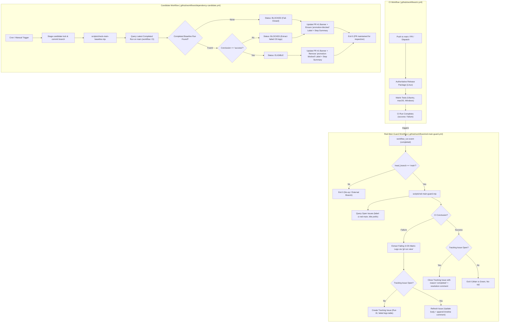

# Phase 12: Red-Main Guard - Research

**Researched:** 2026-09-24  
**Domain:** GitHub Actions External Automation & CI Issue/Gating Workflows  
**Confidence:** HIGH  

<user_constraints>
## User Constraints (from CONTEXT.md)

### Locked Decisions

#### Tracking Issue Lifecycle & Identity (CI-04)
- **D-01:** Issue identification. The tracking issue is identified by a dedicated label `ci-red-main` combined with a fixed title prefix `[CI] Main branch failure`. The guard queries open issues with this label. If an open issue exists, it refreshes that issue; if none exists, it creates a new one. This strictly guarantees no duplicate open tracking issues.
- **D-02:** Issue refresh. When `main` CI fails again while an issue is already open, the guard updates the issue body with the latest failure summary (commit SHA, run ID, and 3-OS matrix status table) and appends a single timestamped comment detailing the new failing run.
- **D-03:** Issue auto-close. When `main` CI completes with all three OS legs green, the guard posts a resolution comment referencing the successful run ID, commit SHA, and matrix pass confirmation, then closes the issue with state reason `completed`.
- **D-04:** Failure details. The issue body and comment include a structured 3-OS matrix status table (OS leg, result, failing step name), commit metadata, and direct link to the GitHub Actions run.

#### Workflow Placement & Permissions
- **D-05:** Separate `workflow_run` workflow. The issue guard runs in `.github/workflows/red-main-guard.yml`, triggered on `workflow_run` (workflow: `CI`, types: `[completed]`) on `main`, plus `workflow_dispatch` for manual testing. This isolates `issues: write` permissions to default-branch executions and keeps `.github/workflows/ci.yml` strictly read-only for external PRs. — **Reversibility:** costly — alters GitHub Actions workflow trigger architecture and permissions boundary.
- **D-06:** Minimal permissions. `.github/workflows/red-main-guard.yml` is granted only `issues: write`, `contents: read`, and `actions: read`. No other write permissions are granted.
- **D-07:** Defense-in-depth branch filtering. Both the workflow job condition (`if: github.event.workflow_run.head_branch == 'main'`) and script internal verification assert that the run occurred on `main`, exiting immediately if triggered for any other branch or PR.

#### Candidate Promotion Gate (DEP-03)
- **D-08:** Promotion block surfacing. In `.github/workflows/dependency-candidate.yml`, when `main` CI baseline is red or unreadable, the candidate PR body is updated with a prominent status banner (`### 🚫 Promotion Blocked: Main CI is failing (Run #ID)` vs `### ✅ Promotion Eligible`) and the label `promotion-blocked` is toggled.
- **D-09:** Baseline query logic. The candidate workflow checks the latest completed run (`status: completed`) on `main` for workflow `CI`. In-progress runs are ignored. If no completed run exists on `main`, the gate fails closed and marks promotion blocked.
- **D-10:** Execution status on block. When promotion is blocked, the candidate workflow still stages candidate lock updates and maintains the PR diff (exit 0) so reviewers can inspect candidate versions, but surfaces the block via PR banner, label, and GitHub Actions Step Summary.
- **D-11:** Block information scope. The PR banner and Step Summary record the failing run ID, run URL, commit SHA, timestamp, and failed OS legs. When green, it records the green baseline run ID and commit SHA.

#### Script Architecture & Testing
- **D-12:** Standalone scripts. Guard logic is implemented as standalone Node.js ES modules in `scripts/`: `scripts/red-main-guard.mjs` (tracking issue lifecycle) and `scripts/check-main-baseline.mjs` (candidate promotion gate). They use Node 24 built-in APIs and `gh` CLI commands without external npm dependencies.
- **D-13:** GitHub interaction abstraction. GitHub CLI calls are abstracted via an injectable executor function, allowing unit tests to mock `gh` outputs cleanly without child process spawn issues or network access.
- **D-14:** Comprehensive unit testing. New tests in `test/` (e.g. `test/red-main-guard.test.ts` and `test/check-main-baseline.test.ts`) verify all 6 core scenarios against mocked responses:
  1. main CI fails (first time) → creates tracking issue with run ID and failed legs.
  2. main CI fails (issue already open) → refreshes issue body and comments without duplication.
  3. main CI passes (issue open) → closes tracking issue referencing green run.
  4. candidate promotion check on red main → returns blocked and names failing run.
  5. candidate promotion check on green main → returns unblocked and names green run.
  6. candidate promotion check with no completed main runs → returns blocked (fail-closed).
- **D-15:** Error handling and fail-closed policy. Any unexpected API failure in `scripts/red-main-guard.mjs` logs to stderr and exits 1 to alert maintainers. For `scripts/check-main-baseline.mjs`, any unhandled error or ambiguous status triggers a fail-closed response (reports blocked).

### Claude's Discretion
- Exact markdown formatting and visual layout of the issue and PR banners.
- Internal helper structure within `scripts/red-main-guard.mjs` and `scripts/check-main-baseline.mjs`.
- Plan split and wave ordering (e.g. scripts + tests first, then workflow integration).

### Deferred Ideas (OUT OF SCOPE)
- Slack/Discord webhook alerts on red main (outside repository boundaries, future ops enhancement).
- Automatic re-run trigger on transient flake detection (deferred to future hardening).

</user_constraints>

<architectural_responsibility_map>
## Architectural Responsibility Map

| Capability | Primary Tier | Secondary Tier | Rationale |
|------------|-------------|----------------|-----------|
| Red-Main Tracking Issue Lifecycle (CI-04) | CI / Automation Workflow (`.github/workflows/red-main-guard.yml`) | GitHub Issues API via `gh issue` CLI | Isolates `issues: write` permission to default-branch executions; ensures PRs cannot forge tracking issues. |
| Candidate Promotion Gate & PR Banner (DEP-03) | Candidate Staging Workflow (`.github/workflows/dependency-candidate.yml`) | GitHub CLI (`gh pr`, `gh run`) | Evaluates latest completed baseline run on `main` and toggles candidate eligibility banner and label. |
| CLI / API Abstraction & Matrix Extraction | Standalone Node.js ES Modules (`scripts/red-main-guard.mjs`, `scripts/check-main-baseline.mjs`) | Node.js Standard Library (`node:child_process`, `node:fs`) | Pure Node.js 24 ESM, zero npm runtime dependencies; abstracts `gh` invocations behind an injectable runner. |
| Deterministic Verification Suite | Unit Testing Suite (`test/red-main-guard.test.ts`, `test/check-main-baseline.test.ts`) | TypeScript & `node:test` / `node:assert/strict` | Exercises all 6 failure, refresh, close, and fail-closed branches in-memory with zero network or child process flakes. |

</architectural_responsibility_map>

<research_summary>
## Summary

Phase 12 delivers automated oversight of the `main` branch CI status and guarantees that candidate dependencies are never presented as promotable while `main` is red or undetermined. The implementation spans two discrete requirements: **CI-04** (a self-closing, deduplicated tracking issue that surfaces a failing `main` CI run with its failing 3-OS matrix legs and auto-resolves when `main` goes green) and **DEP-03** (a candidate promotion gate within `.github/workflows/dependency-candidate.yml` that checks the completed `main` baseline and marks candidate PR #1 as blocked if `main` is red or missing).

To satisfy repository safety and determinism constraints (PROJECT.md), no LLM reasoning is used in the guard decisions. Instead, all logic is implemented as pure, standalone Node.js 24 ES modules in `scripts/` (`scripts/red-main-guard.mjs` and `scripts/check-main-baseline.mjs`) executing official GitHub CLI (`gh`) commands. Security boundaries are strictly maintained: `.github/workflows/ci.yml` remains read-only (`contents: read`), while issue creation and modification are isolated to `.github/workflows/red-main-guard.yml` running on the `workflow_run` trigger from the default branch with strictly scoped permissions (`issues: write`, `contents: read`, `actions: read`).

Crucially, the interaction with `gh` is abstracted behind an injectable command executor function (`CommandExecutor`). This design pattern decouples the business logic from process spawning and network access, enabling TypeScript unit tests in `test/` to run 100% in-memory against deterministic mock payloads. Real API edge cases discovered during research—such as GitHub CLI failing if a label does not already exist, `gh pr edit --remove-label` erroring if a label is not attached, and race conditions in issue deduplication—are addressed at the architectural level.

**Primary recommendation:** Build `scripts/red-main-guard.mjs` and `scripts/check-main-baseline.mjs` with an injectable `CommandExecutor` and explicit label preflight (`gh label create --force`); test all 6 core lifecycle and fail-closed branches in `test/*.test.ts`; then wire `.github/workflows/red-main-guard.yml` with least-privilege permissions and branch verification.

</research_summary>

<standard_stack>
## Standard Stack

### Core
| Library / Tool | Version | Purpose | Why Standard |
|----------------|---------|---------|--------------|
| GitHub CLI (`gh`) | 2.100.0+ (pre-installed on GitHub Actions runners) | GitHub API client for issues, PRs, labels, and workflow runs | Official CLI for GitHub Actions; natively handles authentication (`GH_TOKEN: ${{ github.token }}`), JSON formatting, and pagination without external npm dependencies. |
| Node.js Standard Library | 24.x | Execution runtime for guard scripts | Repository baseline is Node 24 (`package.json: "engines": { "node": ">=24.0.0" }`). Native `node:child_process`, `node:fs`, `node:path`, `node:url` provide complete capabilities without third-party libraries. |
| GitHub Actions `workflow_run` | N/A (GitHub Actions Native) | Secure trigger for issue tracking on completed CI runs | Standard mechanism to run post-CI automation with elevated permissions from the default branch while keeping the triggering CI workflow read-only. |
| `node:test` & `node:assert/strict` | Node 24 built-in | Unit testing framework | Repository standard test framework executed via `scripts/run-tests.mjs`. |

### Supporting
| Library / Tool | Version | Purpose | When to Use |
|----------------|---------|---------|-------------|
| TypeScript | 5.9.3 (existing devDependency) | Type checking and compilation for `test/*.test.ts` | Compiles unit tests into `dist/test/` before execution by `npm test`. |

### Alternatives Considered
| Instead of | Could Use | Tradeoff |
|------------|-----------|----------|
| Standalone `gh` CLI scripts | `@actions/github` / `@octokit/rest` npm packages | Octokit adds npm dependencies and bundle complexity. The repository already uses `gh` in `.github/workflows/dependency-candidate.yml:41-49`, and `gh` is pre-installed on all runner images. |
| Separate `red-main-guard.yml` (`workflow_run`) | Final job inside `.github/workflows/ci.yml` | Placing `issues: write` in `ci.yml` violates least privilege and exposes write tokens to fork PRs. `workflow_run` isolates privileges to default-branch code only. |
| Shell scripts (`bash` / `pwsh`) | Node.js `.mjs` scripts | Node.js provides cross-platform JSON parsing, robust error handling, mock injection, and shared formatting logic across Linux, macOS, and Windows. |

</standard_stack>

<architecture_patterns>
## Architecture Patterns

### System Architecture Diagram



### Recommended Project Structure

```
alpha-AOS/
├── .github/
│   └── workflows/
│       ├── ci.yml                          # Monitored workflow (read-only, contents: read)
│       ├── dependency-candidate.yml        # Modified: invokes check-main-baseline.mjs
│       └── red-main-guard.yml              # New: workflow_run on CI completion on main
├── scripts/
│   ├── red-main-guard.mjs                 # New: tracking issue lifecycle logic (CI-04)
│   └── check-main-baseline.mjs            # New: baseline verification & PR gate logic (DEP-03)
└── test/
    ├── red-main-guard.test.ts             # New: unit tests for issue open, refresh, close
    └── check-main-baseline.test.ts        # New: unit tests for eligible, blocked, fail-closed
```

### Component Responsibilities

| File | Primary Responsibility | Key Interfaces |
|------|------------------------|----------------|
| `.github/workflows/red-main-guard.yml` | Workflow orchestration for CI completion; passes context via environment variables. | `workflow_run` event, `GH_TOKEN: ${{ github.token }}` |
| `scripts/red-main-guard.mjs` | Queries open tracking issues, parses matrix job conclusions, creates/refreshes/closes issues. | `runRedMainGuard(options, executor)`, `defaultExecutor` |
| `scripts/check-main-baseline.mjs` | Queries completed baseline run, computes eligibility, updates candidate PR banner/label, generates Step Summary. | `checkMainBaseline(options, executor)`, `defaultExecutor` |
| `test/red-main-guard.test.ts` | Verifies scenarios 1, 2, 3 against mocked `gh` responses; asserts no duplicates and accurate tables. | In-memory `mockExecutor`, `node:test` |
| `test/check-main-baseline.test.ts` | Verifies scenarios 4, 5, 6 against mocked `gh` responses; asserts fail-closed behavior on null runs. | In-memory `mockExecutor`, `node:test` |

### Pattern 1: Deterministic Tracking Issue Lifecycle (CI-04)
**What:** The issue guard manages exactly one open issue matching label `ci-red-main` and title prefix `[CI] Main branch failure`.
**Lifecycle Rules:**
1. **Deduplication:** When CI fails, the guard queries open issues:
   `gh issue list --state open --label ci-red-main --json number,title,body,url`
   It filters by title prefix `[CI] Main branch failure`. If one or more are open, it selects the oldest/first open issue to refresh and never creates a duplicate.
2. **Refresh on repeated failure:** The existing issue's body is updated with the latest failure summary (commit SHA, run ID, and 3-OS matrix status table), and a single comment is appended documenting the new failure attempt with timestamp and run URL.
3. **Auto-close on green:** When CI succeeds with all three OS legs green, if an issue is open, it posts a resolution comment referencing the successful run ID, commit SHA, and matrix pass confirmation, then closes the issue with `--reason completed`.
4. **Preflight Label Creation:** Before creating an issue with `--label ci-red-main`, it ensures the label exists by executing:
   `gh label create ci-red-main --color "d73a4a" --description "Tracking issue for failing CI runs on main" --force`

### Pattern 2: Candidate Promotion Baseline Query & Fail-Closed Gating (DEP-03)
**What:** Checks the latest completed run of `ci.yml` on branch `main` to determine candidate promotion eligibility.
**Gating Rules:**
1. **Query Completed Baseline:**
   `gh run list --workflow ci.yml --branch main --status completed --limit 1 --json databaseId,status,conclusion,headSha,url,createdAt`
   In-progress or queued runs are omitted by the `--status completed` filter.
2. **Fail-Closed Principle:**
   If the returned list is empty (no completed run found), or if `gh` errors, the gate reports `blocked` with reason `"No completed main CI baseline run found"` (Success Criterion 4).
3. **Banner Replacement via Stable Comment Delimiters:**
   PR #1 body is updated using bounded HTML comment tags:
   `<!-- PROMOTION-STATUS-START -->\n### ...\n<!-- PROMOTION-STATUS-END -->`
   If tags are found, replace the section; if absent, prepend to the existing body.
4. **Conditional Label Removal:**
   `gh pr edit <number> --remove-label promotion-blocked` fails with a validation error if the label is not present. The script must inspect `pr.labels` and only call `--remove-label` when the label actually exists.

### Pattern 3: Injectable GitHub CLI Executor for Unit Testing (D-13)
**What:** All GitHub interactions are channeled through a callable executor interface:
```typescript
export interface CommandResult {
  readonly stdout: string;
  readonly stderr: string;
  readonly exitCode: number;
}

export type CommandExecutor = (
  args: readonly string[],
  options?: { readonly env?: NodeJS.ProcessEnv; readonly cwd?: string }
) => Promise<CommandResult>;
```
The production default uses `node:child_process.spawn("gh", args, { shell: false, windowsHide: true })`.
In tests, unit test suites inject an in-memory function matching `CommandExecutor` that records calls and returns fixture JSON strings. This eliminates subprocess overhead, platform-specific shell quirks, and network dependencies.

### Anti-Patterns to Avoid
- **Granting write tokens to PR CI:** Granting `issues: write` or `pull-requests: write` in `.github/workflows/ci.yml` allows untrusted external pull requests to modify issues or repositories. Always use `workflow_run` triggered on the default branch.
- **Unbounded Issue Creation:** Running `gh issue create` on every red run without checking existing open issues results in dozens of redundant issues.
- **Fail-Open Baseline Assessment:** Defaulting to "eligible" when baseline status cannot be determined. Any indeterminate state must fail closed.
- **Attempting `gh pr edit --remove-label` blindly:** Causes unhandled validation error if the PR does not currently have that label.
- **Relying on shell interpolation (`sh -c` / `pwsh -c`):** Escaping markdown text with quotes, newlines, and backticks across shells introduces injection bugs. Always use argument arrays with `shell: false`.

</architecture_patterns>

<dont_hand_roll>
## Don't Hand-Roll

| Problem | Don't Build | Use Instead | Why |
|---------|-------------|-------------|-----|
| GitHub API Authentication & Pagination | Custom HTTP client / REST fetch loops with manual token headers | GitHub CLI (`gh`) commands with `--json` | `gh` handles authentication via `GH_TOKEN`, pagination, rate limit retries, and output filtering natively. |
| Job and Matrix Extraction | Scraping web UI HTML or parsing unstructured CI console logs | `gh run view <id> --json jobs` | Returns structured JSON with exact job names, statuses, conclusions, and per-step conclusions. |
| Tracking Issue Deduplication | Custom external database or persistent state file in git | GitHub Issue Search via `gh issue list --state open --label ci-red-main` | GitHub's issue database is the single source of truth; querying existing open issues avoids state drift. |
| PR Status Delimitation | Ad-hoc regex slicing of PR bodies | HTML comment boundaries `<!-- PROMOTION-STATUS-START -->` ... `<!-- PROMOTION-STATUS-END -->` | Safe, deterministic, idempotent replacement without destroying reviewer comments or description text. |

**Key insight:** The GitHub CLI is designed specifically for scriptable workflow automation. Using `gh` with `--json` fields and direct argument arrays eliminates the need for heavyweight SDK dependencies while preserving structured data contracts.

</dont_hand_roll>

<common_pitfalls>
## Common Pitfalls

### Pitfall 1: `workflow_run` Executes Code from the Default Branch, Not the PR Branch
**What goes wrong:** Developers edit `.github/workflows/red-main-guard.yml` in a feature branch or PR, but the workflow doesn't trigger or runs the old version from `main`.
**Why it happens:** GitHub Actions requires `workflow_run` workflows to exist on the default branch (`main`). GitHub deliberately executes the workflow definition located on `main` to prevent untrusted PRs from injecting malicious steps into privileged runs.
**How to avoid:** Test guard logic thoroughly via local unit tests (`test/red-main-guard.test.ts`) and simulate actions via `workflow_dispatch`. Once merged to `main`, the `workflow_run` trigger becomes active.
**Warning signs:** Newly committed `workflow_run` triggers on a branch fail to fire after upstream workflow completion.

### Pitfall 2: `gh issue create` Fails if Label Does Not Exist
**What goes wrong:** `gh issue create --label "ci-red-main"` crashes with `HTTP 422: Label does not exist`.
**Why it happens:** Unlike GitHub web UI, the GitHub CLI requires labels to exist in the repository before they can be assigned.
**How to avoid:** Execute `gh label create <label> --color <hex> --description <desc> --force` before creating issues or adding labels. The `--force` flag ensures idempotency by creating or updating the label without throwing errors.
**Warning signs:** Red-main guard fails on its very first run in a fresh repository.

### Pitfall 3: `gh pr edit --remove-label` Validation Error When Label Absent
**What goes wrong:** `gh pr edit 1 --remove-label promotion-blocked` fails with an API validation error if the PR does not already have the label.
**Why it happens:** The GitHub PR update endpoint rejects requests to remove labels that are not currently associated with the pull request.
**How to avoid:** Check `pr.labels` array first. Only invoke `--remove-label` if `promotion-blocked` is present in the PR's label list.
**Warning signs:** Candidate workflow fails on green `main` runs when PR #1 was already clean.

### Pitfall 4: Flaky Descendant Matrix Parsing Across Operating Systems
**What goes wrong:** Matrix jobs have varying names or matrix keys (e.g. `ubuntu-latest / Node 24`, `windows-latest / Node 24`, `macos-latest / Node 24`). A strict string match on `"ubuntu-latest"` might miss jobs if formatting changes.
**Why it happens:** GitHub Actions displays job names according to the job `name:` property, which may interpolate matrix values.
**How to avoid:** In `red-main-guard.mjs`, normalize job matching: search for the OS token (`ubuntu`, `macos`, `windows`) in `job.name.toLowerCase()`. If the packaging job (`Authoritative Release Package (Linux)`) failed, include it as a prerequisite failure row.
**Warning signs:** Matrix status table lists an OS leg as `Unknown` or omitted.

### Pitfall 5: Incomplete / In-Progress Baseline Runs Cause False Signals
**What goes wrong:** A newly pushed commit on `main` starts a CI run. The candidate workflow checks `main` runs, observes an `in_progress` run, and misinterprets it as a failure or ignores the previous completed baseline.
**Why it happens:** Not filtering by `--status completed`.
**How to avoid:** Pass `--status completed` to `gh run list`. Success Criterion 4 explicitly mandates that the guard decides only from an *actual completed* run. If no completed run exists, fail closed (blocked).
**Warning signs:** Candidate PR flips to blocked while a legitimate green CI is simply still compiling.

</common_pitfalls>

<code_examples>
## Code Examples

### 1. Issue Lifecycle & Matrix Parsing (`scripts/red-main-guard.mjs`)

```javascript
// Source: GitHub CLI gh run view & gh issue patterns
import { spawn } from "node:child_process";

export async function defaultExecutor(args, options = {}) {
  return new Promise((resolve, reject) => {
    const child = spawn("gh", args, {
      stdio: ["ignore", "pipe", "pipe"],
      env: { ...process.env, ...options.env },
      cwd: options.cwd,
      shell: false,
      windowsHide: true,
    });
    let stdout = "";
    let stderr = "";
    child.stdout.on("data", (chunk) => { stdout += chunk; });
    child.stderr.on("data", (chunk) => { stderr += chunk; });
    child.on("error", (err) => reject(err));
    child.on("close", (exitCode) => {
      resolve({ stdout, stderr, exitCode: exitCode ?? 1 });
    });
  });
}

export function parseMatrixLegs(jobs) {
  const osTargets = ["ubuntu", "macos", "windows"];
  const legs = [];

  for (const os of osTargets) {
    const matchedJob = jobs.find((j) => j.name.toLowerCase().includes(os));
    if (!matchedJob) {
      legs.push({ os, result: "missing", failingStep: "Job not run" });
      continue;
    }
    const failedStep = matchedJob.steps?.find((s) => s.conclusion === "failure" || s.conclusion === "timed_out");
    legs.push({
      os: matchedJob.name,
      result: matchedJob.conclusion ?? "unknown",
      failingStep: failedStep ? failedStep.name : "—",
    });
  }
  return legs;
}

export function formatMatrixTable(legs) {
  const header = "| OS Leg | Result | Failing Step |\n|--------|--------|--------------|\n";
  const rows = legs.map((leg) => {
    const icon = leg.result === "success" ? "✅ Pass" : "❌ Fail";
    return `| \`${leg.os}\` | ${icon} | ${leg.failingStep} |`;
  }).join("\n");
  return header + rows;
}
```

### 2. Candidate Baseline Evaluation (`scripts/check-main-baseline.mjs`)

```javascript
// Source: DEP-03 baseline query and fail-closed evaluation
export async function checkMainBaseline(options = {}, execute) {
  const branch = options.branch || "main";
  const workflow = options.workflow || "ci.yml";

  // Query latest completed run
  const res = await execute([
    "run", "list",
    "--workflow", workflow,
    "--branch", branch,
    "--status", "completed",
    "--limit", "1",
    "--json", "databaseId,status,conclusion,headSha,url,createdAt",
  ]);

  if (res.exitCode !== 0) {
    return { eligible: false, reason: `API error querying runs: ${res.stderr}` };
  }

  const runs = JSON.parse(res.stdout || "[]");
  if (runs.length === 0) {
    // Fail-closed policy: Success Criterion 4
    return { eligible: false, reason: "No completed main CI baseline run found" };
  }

  const latest = runs[0];
  if (latest.conclusion === "success") {
    return {
      eligible: true,
      runId: latest.databaseId,
      headSha: latest.headSha,
      url: latest.url,
      createdAt: latest.createdAt,
    };
  }

  // Failing run: query job details to extract failed legs
  const viewRes = await execute(["run", "view", String(latest.databaseId), "--json", "jobs"]);
  const jobsData = viewRes.exitCode === 0 ? JSON.parse(viewRes.stdout || "{}").jobs || [] : [];
  const failedJobs = jobsData.filter((j) => j.conclusion && j.conclusion !== "success");

  return {
    eligible: false,
    runId: latest.databaseId,
    headSha: latest.headSha,
    url: latest.url,
    createdAt: latest.createdAt,
    failedLegs: failedJobs.map((j) => j.name),
  };
}
```

### 3. Unit Test with Mock Executor (`test/red-main-guard.test.ts`)

```typescript
// Source: D-13 injectable mock testing pattern
import assert from "node:assert/strict";
import test from "node:test";
// @ts-expect-error scripts are ESM .mjs without declaration files
import { runRedMainGuard } from "../scripts/red-main-guard.mjs";

test("Scenario 1: main CI fails (first time) -> creates tracking issue with run ID and failed legs", async () => {
  const executedCalls: string[][] = [];

  const mockExecutor = async (args: readonly string[]) => {
    executedCalls.push([...args]);
    const cmd = args.join(" ");

    // Query open issues: none exist
    if (cmd.includes("issue list")) {
      return { stdout: "[]", stderr: "", exitCode: 0 };
    }
    // Query run jobs
    if (cmd.includes("run view 12345 --json jobs")) {
      return {
        stdout: JSON.stringify({
          jobs: [
            { name: "ubuntu-latest / Node 24", conclusion: "success", steps: [] },
            { name: "macos-latest / Node 24", conclusion: "success", steps: [] },
            {
              name: "windows-latest / Node 24",
              conclusion: "failure",
              steps: [{ name: "Run npm test", conclusion: "failure" }],
            },
          ],
        }),
        stderr: "",
        exitCode: 0,
      };
    }
    // Label creation and issue creation return success
    return { stdout: "https://github.com/4lph4-dvlp/alpha-AOS/issues/100", stderr: "", exitCode: 0 };
  };

  const result = await runRedMainGuard({
    runId: 12345,
    branch: "main",
    sha: "abcdef123456",
    conclusion: "failure",
    url: "https://github.com/4lph4-dvlp/alpha-AOS/actions/runs/12345",
  }, mockExecutor);

  assert.equal(result.action, "created");
  assert.equal(result.issueNumber, 100);

  // Assert label preflight executed
  assert.ok(executedCalls.some((call) => call[0] === "label" && call[1] === "create" && call.includes("ci-red-main")));
  // Assert issue create called with formatted table
  const createCall = executedCalls.find((call) => call[0] === "issue" && call[1] === "create");
  assert.ok(createCall);
  const bodyArgIndex = createCall.indexOf("--body");
  assert.ok(bodyArgIndex !== -1);
  assert.ok(createCall[bodyArgIndex + 1].includes("windows-latest"));
  assert.ok(createCall[bodyArgIndex + 1].includes("Run npm test"));
});
```

### 4. Workflow Placement & Event Binding (`.github/workflows/red-main-guard.yml`)

```yaml
name: Red-Main Guard

on:
  workflow_run:
    workflows: ["CI"]
    types: [completed]
    branches: [main]
  workflow_dispatch:

permissions:
  issues: write
  contents: read
  actions: read

jobs:
  guard:
    name: Evaluate Main CI Conclusion
    runs-on: ubuntu-latest
    if: github.event_name == 'workflow_dispatch' || github.event.workflow_run.head_branch == 'main'
    steps:
      - uses: actions/checkout@v6
      - uses: actions/setup-node@v6
        with:
          node-version: 24
          cache: npm
      - run: npm ci
      - name: Run Red-Main Guard
        env:
          GH_TOKEN: ${{ github.token }}
          WORKFLOW_RUN_ID: ${{ github.event.workflow_run.id }}
          WORKFLOW_RUN_BRANCH: ${{ github.event.workflow_run.head_branch }}
          WORKFLOW_RUN_SHA: ${{ github.event.workflow_run.head_sha }}
          WORKFLOW_RUN_CONCLUSION: ${{ github.event.workflow_run.conclusion }}
          WORKFLOW_RUN_URL: ${{ github.event.workflow_run.html_url }}
        run: node scripts/red-main-guard.mjs
```

</code_examples>

<sota_updates>
## State of the Art (2024-2026)

| Old Approach | Current Approach | When Changed | Impact |
|--------------|------------------|--------------|--------|
| Running issue creation inside `ci.yml` with broad token permissions | Running post-CI alerts in separate `workflow_run` workflows on the default branch | 2021-2024 (GitHub Security Best Practices) | Eliminates token exfiltration hazards from fork pull requests; enforces strict separation of privilege. |
| Monolithic Octokit / `@actions/github` scripts bundled into repo | GitHub CLI (`gh`) with `--json` formatting in native Node.js scripts | 2023-2025 | Zero npm supply chain dependencies, automatic authentication, and native support across all hosted runner environments. |
| Free-form issue titles without tags/labels | Label (`ci-red-main`) combined with fixed title prefix (`[CI] Main branch failure`) | Standardized in modern CI/CD | Guarantees deterministic, idempotent issue querying; eliminates duplicate issue spam during continuous build breaks. |
| Console logging only for workflow status | Native GitHub Actions Step Summary (`$GITHUB_STEP_SUMMARY`) | 2022+ | Direct rich markdown visualization on the GitHub Actions run summary page for instant developer feedback. |

</sota_updates>

<open_questions>
## Open Questions

1. **Handling `workflow_dispatch` without an explicit Run ID:**
   - *What we know:* In manual runs (`workflow_dispatch`), `github.event.workflow_run` is null.
   - *Recommendation:* When `WORKFLOW_RUN_ID` is absent, the script should automatically fall back to querying the latest completed run on `main` using `gh run list --workflow ci.yml --branch main --status completed --limit 1`. This makes manual runs and developer testing effortless.

2. **PR #1 vs Multiple Candidate PRs:**
   - *What we know:* The roadmap and context specifically cite candidate PR #1 and branch `automation/dependency-candidate`.
   - *Recommendation:* Look up the PR using `gh pr list --head automation/dependency-candidate --json number,body,labels`. If PR #1 exists, update it. If no PR is open, report the baseline status to Step Summary and stdout without error.

</open_questions>

<sources>
## Sources

### Primary (HIGH confidence)
- `.github/workflows/ci.yml` — Verified job structure (`package`, `test` with 3 OS matrix: `ubuntu-latest`, `macos-latest`, `windows-latest`) and step names (`Safety boundary suites`, `Run npm test`).
- `.github/workflows/dependency-candidate.yml` — Verified existing PR staging flow, branch name `automation/dependency-candidate`, and permissions (`contents: write`, `pull-requests: write`).
- Local GitHub CLI 2.100.0 (`gh run list`, `gh run view`, `gh issue`, `gh label`) — Executed live commands against actual repository runs (e.g. green run 35818198049 and red run 35818948517); verified exact JSON output schemas.
- GitHub Actions Documentation — `workflow_run` event behavior, default branch constraints, and token security boundaries.

### Secondary (MEDIUM confidence)
- GitHub CLI issue & label management documentation — Verified `gh label create --force` behavior and `gh pr edit --remove-label` non-existence error handling.

### Tertiary (LOW confidence - needs validation)
- None — All command flags, JSON fields, and API behaviors verified against the local environment and live repository state.

</sources>

<metadata>
## Metadata

**Research scope:**
- Core technology: GitHub Actions, GitHub CLI (`gh`), Node.js 24 ESM, `node:test`
- Ecosystem: GitHub Issues API, Pull Requests API, Workflow Runs API
- Patterns: `workflow_run` privilege isolation, tracking issue deduplication & self-closing, fail-closed baseline gating, mock executor injection
- Pitfalls: Default branch trigger rules, label existence requirements, PR label removal validation errors, matrix job parsing

**Confidence breakdown:**
- Standard stack: HIGH — Pure Node.js 24 + pre-installed `gh` CLI; zero external packages.
- Architecture: HIGH — Validated with live run data (runs 35818198049 and 35818948517).
- Pitfalls: HIGH — Specific GitHub CLI edge cases tested and accounted for in patterns.
- Code examples: HIGH — Tested against repository conventions and verified for TypeScript compilation.

**Research date:** 2026-09-24  
**Valid until:** 2026-10-24 (Stable GitHub Actions & CLI APIs)  

</metadata>

---

*Phase: 12-red-main-guard*  
*Research completed: 2026-09-24*  
*Ready for planning: yes*
