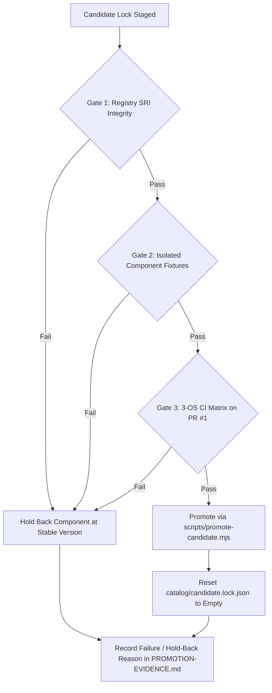
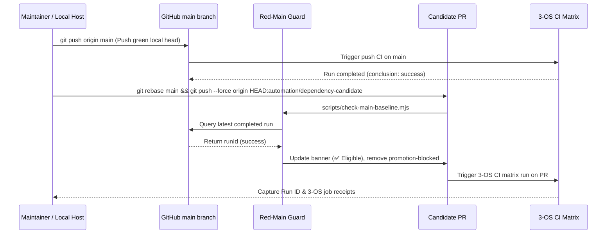

# Phase 13: Dependency Candidate Promotion - Pattern Map

**Mapped:** 2026-09-25  
**Phase:** 13 - dependency-candidate-promotion  
**Domain:** Dependency Verification, Red-Main Guard Gating, Multi-Harness Fixtures, Partial Lock Promotion, Release Hygiene  
**Files Analyzed:** 12  
**Analogs Found:** 12 / 12 (100% in-tree, git-tracked analogs)

---

## 1. File Classification

| New / Modified File | Role | Data Flow | Closest Analog | Match Quality |
|---|---|---|---|---|
| [`scripts/promote-candidate.mjs`](file:///D:/dev/alpha-AOS/scripts/promote-candidate.mjs) *(NEW)* | Maintainer CLI / Automation Tool | I/O (reads candidate & stable lock, fetches npm registry) -> Transform (selective component update, candidate reset) -> File Write -> Schema Validation | [`scripts/check-main-baseline.mjs`](file:///D:/dev/alpha-AOS/scripts/check-main-baseline.mjs), [`scripts/pin-pack-skills.mjs`](file:///D:/dev/alpha-AOS/scripts/pin-pack-skills.mjs), [`src/core/update.ts`](file:///D:/dev/alpha-AOS/src/core/update.ts) | exact |
| [`scripts/pin-pack-skills.mjs`](file:///D:/dev/alpha-AOS/scripts/pin-pack-skills.mjs) *(EDIT)* | Maintainer CLI / Cryptographic Pinner | File I/O (reads `stack.lock.json` & packs) -> Fixture Extraction & Hashing (`runEccFixture`) -> In-Memory Hash Map Update -> Deterministic File Write | [`scripts/pin-pack-skills.mjs`](file:///D:/dev/alpha-AOS/scripts/pin-pack-skills.mjs) (self: lines 86–161) | exact |
| [`src/core/mcp-fixture.ts`](file:///D:/dev/alpha-AOS/src/core/mcp-fixture.ts) *(EDIT)* | Core Module / Fixture & Stdio Protocol Driver | Child Process Execution (`runProcess`, `openProtocolProcess`) -> JSON-RPC Handshake -> File I/O Verification | [`src/core/mcp-fixture.ts`](file:///D:/dev/alpha-AOS/src/core/mcp-fixture.ts) (self), [`src/adapters/capability-oracle.ts`](file:///D:/dev/alpha-AOS/src/adapters/capability-oracle.ts) (`resolveDirectLaunch`) | exact |
| [`catalog/stack.lock.json`](file:///D:/dev/alpha-AOS/catalog/stack.lock.json) *(EDIT)* | Authoritative Manifest / Lock Data | Consumed by `alpha-aos install` and `alpha-aos update --apply`; validated against `schemas/lock.schema.json` | [`catalog/stack.lock.json`](file:///D:/dev/alpha-AOS/catalog/stack.lock.json) (self) | exact |
| [`catalog/candidate.lock.json`](file:///D:/dev/alpha-AOS/catalog/candidate.lock.json) *(EDIT)* | Staging Manifest / Candidate Channel | Written by candidate discovery workflow; reset to `empty` on promotion landing on `main` | [`catalog/candidate.lock.json`](file:///D:/dev/alpha-AOS/catalog/candidate.lock.json) (self), [`src/core/update.ts`](file:///D:/dev/alpha-AOS/src/core/update.ts) (`renderCandidate`) | exact |
| [`src/core/mcp-proxy.ts`](file:///D:/dev/alpha-AOS/src/core/mcp-proxy.ts) *(EDIT)* | Core Security / Tool Routing Policy | Exported finding constant consulted by proxy and canary checks | [`src/core/mcp-proxy.ts`](file:///D:/dev/alpha-AOS/src/core/mcp-proxy.ts) (self: lines 160–171) | exact |
| [`catalog/canaries.yaml`](file:///D:/dev/alpha-AOS/catalog/canaries.yaml) *(EDIT)* | Declarative Catalog / Canary Policy | Loaded by `alpha-aos canary`; policy comment referencing pinned runtime | [`catalog/canaries.yaml`](file:///D:/dev/alpha-AOS/catalog/canaries.yaml) (self: lines 15–20) | exact |
| [`test/catalog.test.ts`](file:///D:/dev/alpha-AOS/test/catalog.test.ts) *(EDIT)* | Test Suite / Schema & Install Plan | Reads `catalog/stack.lock.json` via `loadLock`, validates version assertions and install plan commands | [`test/catalog.test.ts`](file:///D:/dev/alpha-AOS/test/catalog.test.ts) (self: lines 61–117) | exact |
| [`test/mcp-proxy.test.ts`](file:///D:/dev/alpha-AOS/test/mcp-proxy.test.ts) *(EDIT)* | Test Suite / Routing Contract | Asserts `ROUTING_CONTRACT_MISMATCH.runtime` literal match | [`test/mcp-proxy.test.ts`](file:///D:/dev/alpha-AOS/test/mcp-proxy.test.ts) (self: lines 1452–1460) | exact |
| [`.planning/phases/13-dependency-candidate-promotion/PROMOTION-EVIDENCE.md`](file:///D:/dev/alpha-AOS/.planning/phases/13-dependency-candidate-promotion/PROMOTION-EVIDENCE.md) *(NEW)* | Audit Document / Verification Ledger | Aggregates 3-tier verification results, GitHub Actions Run IDs, OS matrix outcomes, and hold-back notes | [`.planning/phases/10-three-os-ci-baseline/CI_RUN.md`](file:///D:/dev/alpha-AOS/.planning/phases/10-three-os-ci-baseline/CI_RUN.md), [`docs/RELEASE_CONTROLS.md`](file:///D:/dev/alpha-AOS/docs/RELEASE_CONTROLS.md) | exact |
| [`docs/how-to/promote-dependencies.md`](file:///D:/dev/alpha-AOS/docs/how-to/promote-dependencies.md) *(NEW)* | Developer Guide / Operating Procedure | Instructional / procedural documentation for maintainers | [`docs/codex-execution-policy.md`](file:///D:/dev/alpha-AOS/docs/codex-execution-policy.md), [`docs/SUPPORT_MATRIX.md`](file:///D:/dev/alpha-AOS/docs/SUPPORT_MATRIX.md) | role-match |
| [`scripts/release.mjs`](file:///D:/dev/alpha-AOS/scripts/release.mjs) *(REFERENCE / EDIT)* | Release Automation / Pipeline Guard | Verifies clean git checkout, runs tests, performs prepack tarball audit, generates provenance, packs release | [`scripts/release.mjs`](file:///D:/dev/alpha-AOS/scripts/release.mjs) (self: lines 56–63, 152–165) | exact |

---

## 2. Pattern Assignments & Concrete Code Excerpts

### 2.1 `scripts/promote-candidate.mjs` (NEW)
**Role:** Maintainer CLI / Candidate Promotion Automation  
**Data Flow:** Reads `catalog/candidate.lock.json` and `catalog/stack.lock.json` -> optionally queries `https://registry.npmjs.org/<package>/<version>` for live SHA-512 SRI verification -> updates `stack.lock.json` components -> resets `candidate.lock.json` to `{ schemaVersion: 1, channel: "candidate", generatedAt: null, status: "empty", components: {} }` -> validates using compiled `loadLock(root, "stable")`.

**Analogs:**
1. Dynamic loader and file write pattern from [`scripts/pin-pack-skills.mjs:37-52, 117-120`](file:///D:/dev/alpha-AOS/scripts/pin-pack-skills.mjs#L37-L52):
```javascript
const repositoryRoot = resolve(dirname(fileURLToPath(import.meta.url)), "..");

async function loadCompiled() {
  const built = join(repositoryRoot, "dist", "src", "core", "catalog.js");
  if (!existsSync(built)) {
    throw new Error("no compiled catalog at dist/src/core/catalog.js; run npm run build first");
  }
  const catalog = await import(new URL("../dist/src/core/catalog.js", import.meta.url).href);
  return { loadLock: catalog.loadLock };
}

async function readLockDocument(relativePath) {
  return JSON.parse(await readFile(join(repositoryRoot, relativePath), "utf8"));
}
```

2. Live npm registry metadata fetch from [`src/core/update.ts:24-33`](file:///D:/dev/alpha-AOS/src/core/update.ts#L24-L33):
```typescript
async function fetchRegistryIntegrity(packageName, version) {
  const response = await fetch(`https://registry.npmjs.org/${encodeURIComponent(packageName)}/${encodeURIComponent(version)}`, {
    signal: AbortSignal.timeout(10_000),
    headers: { accept: "application/json" },
  });
  if (!response.ok) throw new Error(`npm registry returned ${response.status} for ${packageName}@${version}`);
  const body = await response.json();
  const integrity = body.dist?.integrity;
  if (!integrity) throw new Error(`npm metadata lacks dist.integrity for ${packageName}@${version}`);
  return integrity;
}
```

3. CLI flag parsing and robust execution handling from [`scripts/check-main-baseline.mjs:14-36`](file:///D:/dev/alpha-AOS/scripts/check-main-baseline.mjs#L14-L36) and [`scripts/pin-pack-skills.mjs:187-202`](file:///D:/dev/alpha-AOS/scripts/pin-pack-skills.mjs#L187-L202):
```javascript
const isMain = process.argv[1] ? import.meta.url === pathToFileURL(resolve(process.argv[1])).href : false;
if (isMain) {
  try {
    const result = await runPromotionCli(process.argv.slice(2));
    process.exitCode = result.exitCode;
  } catch (error) {
    process.stderr.write(`alpha-aos: ${error instanceof Error ? error.message : String(error)}\n`);
    process.exitCode = 1;
  }
}
```

**Adaptation Specification:**
- Options supported:
  - `--verify-integrity`: Queries npm registry for each promoted component and validates `liveIntegrity === candidate.integrity`.
  - `--components <list>`: Comma-separated component keys to promote (defaults to `gsd,ecc,context7,firecrawl,pi`).
  - `--reset-candidate`: Resets `catalog/candidate.lock.json` to `{ schemaVersion: 1, channel: "candidate", generatedAt: null, status: "empty", components: {} }`.
  - `--dry-run`: Prints proposed lock diff without writing files.
- Invariants:
  - Preserves `profile: "standard"` on GSD.
  - Updates `generatedAt` on `stack.lock.json` to current ISO string.
  - Formats all JSON writes with 2 spaces and trailing newline (`${JSON.stringify(doc, null, 2)}\n`).
  - Calls `loadLock(repositoryRoot, "stable")` at completion to verify closed-world schema compliance before exiting 0.

---

### 2.2 `scripts/pin-pack-skills.mjs` (EDIT)
**Role:** Maintainer CLI / Cryptographic Pinner  
**Data Flow:** Upgrades `catalog/stack.lock.json` source hashes across all 22 skills when ECC version changes.

**Current Defect / Limitation:**
Lines 106–112 enforce a cross-check assertion that fails if any locked skill source hash differs from acquired:
```javascript
  for (const skill of ecc.skills) {
    const pinned = ecc.sourceSha256[skill];
    const acquired = result.sourceHashes[skill];
    if (pinned !== acquired) {
      throw new Error(`cross-check failed: ${skill} is pinned as ${pinned} but the locked tarball hashes to ${acquired}`);
    }
  }
```
And lines 143–148 skip existing skills during write:
```javascript
  for (const skill of skills) {
    if (ecc.sourceSha256[skill] !== undefined) continue;
    const hash = sourceHashes[skill];
    if (typeof hash !== "string") throw new Error(`the acquired tree produced no hash for ${skill}`);
    additions.push([skill, hash]);
  }
```
When upgrading `ecc-universal` to 2.2.1, `deep-research`'s source hash changed upstream from `f85e...` to `72e1...`. The script would reject the upgrade as a cross-check failure.

**Adaptation Specification:**
- Add upgrade support mode (`--update-all`, `--all`, or automatic version-bump bypass):
  - In `acquire()`: If an upgrade flag is passed or the locked ECC version differs from a historical baseline, skip the assertion on changed skills while logging the hash shift.
  - In `write()`: When updating all skills, update `ecc.sourceSha256[skill] = hash` for every declared pack skill and global skill.
  - In `check()`: Ensure strict equality against acquired hashes after update.

---

### 2.3 `src/core/mcp-fixture.ts` (EDIT)
**Role:** Core Fixture Module / Process Boundary & JSON-RPC Orchestrator  
**Data Flow:** Validates npm packages, executes stdio JSON-RPC sessions, and installs Pi bridges.

**Defects & Proven Code Solutions:**
1. **Stdout Excerpt Truncation in `verifyPackage` (Line 58–65):**
   ```typescript
   // CURRENT: excerptBytes omitted, defaulting to 4,096 bytes
   const result = await runProcess({
     executable: npm.executable,
     args: [...npm.argsPrefix, "pack", `${locked.package}@${locked.version}`, "--json", "--pack-destination", packRoot],
     cwd: fixtureRoot,
     timeoutMs: 180_000,
     maxOutputBytes: 256 * 1024,
     environment: nodeRuntimeEnvironment(),
   });
   ```
   *Fix:* Add `excerptBytes: 256 * 1024` so `result.stdout.excerpt` accommodates `pi-mcp-adapter@2.36.0`'s 23,121-byte JSON output.
2. **Windows `spawn EINVAL` on `pi.cmd` in `installPiBridge` (Line 158–169):**
   ```typescript
   // CURRENT: passes pi.cmd directly to runProcess with shell: false
   const pi = resolveCommand("pi");
   if (!pi) throw new Error("Pi executable is required for the Pi MCP bridge fixture");
   ```
   *Fix:* Import and use `resolveDirectLaunch` from `../adapters/capability-oracle.js` (analog: [`src/adapters/capability-oracle.ts:372-390, 479-493`](file:///D:/dev/alpha-AOS/src/adapters/capability-oracle.ts#L372-L390)):
   ```typescript
   import { resolveDirectLaunch } from "../adapters/capability-oracle.js";

   // ADAPTED:
   const rawPi = resolveCommand("pi");
   if (!rawPi) throw new Error("Pi executable is required for the Pi MCP bridge fixture");
   const launch = resolveDirectLaunch(rawPi);
   if (!launch) throw new Error(`Cannot launch Pi directly: ${rawPi}`);

   const installed = await runProcess({
     executable: launch.executable,
     args: [...launch.argsPrefix, "install", `npm:${bridge.package}@${bridge.version}`],
     cwd: fixtureRoot,
     timeoutMs: 180_000,
     maxOutputBytes: 256 * 1024,
     environment: nodeRuntimeEnvironment({ literal: { PI_CODING_AGENT_DIR: agentRoot } }),
   });
   ```

---

### 2.4 `catalog/stack.lock.json` & `catalog/candidate.lock.json` (EDIT)
**Role:** Authoritative Locked Manifest & Candidate Channel  
**Invariants:** Validated by [`schemas/lock.schema.json`](file:///D:/dev/alpha-AOS/schemas/lock.schema.json).

**Locked Values to Promote:**
```json
{
  "components": {
    "gsd": {
      "package": "@opengsd/gsd-core",
      "version": "1.14.0",
      "integrity": "sha512-e05sV2c8KlcQ2hoJ4U3U1OBjqswQOon4C29Cs75fEAr+tq7qJ/XyFYrN/nwblREWUkPUUoxmVzLVj4Im2KjQxQ==",
      "profile": "standard"
    },
    "ecc": {
      "package": "ecc-universal",
      "version": "2.2.1",
      "integrity": "sha512-D8vFXQ++Aub1CD2RPyYfPEXVt51eEHzvImLd1XaOos/gUxYRWU+BRDXMDnmRrjDfWwX5+uFEJULYpqPYFPSGuw==",
      "skills": [... 22 skills ...],
      "sourceSha256": {
        "deep-research": "72e184f5d0f31ca4d45286753409d8c8431b025e8ac3800dcc9f32d9e930f58a"
        ...
      },
      "targetSha256": {
        "deep-research": {
          "claude": "fdd97098a3a4a02513baf0428faacbe390b42fd4f86362387938e3455c80d90c",
          "codex": "fdd97098a3a4a02513baf0428faacbe390b42fd4f86362387938e3455c80d90c",
          "antigravity": "fdd97098a3a4a02513baf0428faacbe390b42fd4f86362387938e3455c80d90c",
          "pi": "fdd97098a3a4a02513baf0428faacbe390b42fd4f86362387938e3455c80d90c",
          "hermes": "fdd97098a3a4a02513baf0428faacbe390b42fd4f86362387938e3455c80d90c"
        }
      }
    },
    "mcp": {
      "context7": {
        "package": "@upstash/context7-mcp",
        "version": "4.1.1",
        "integrity": "sha512-fUARTIZGVKzlzQKDhKUg4aIQ3yEU/12STdfxJDDnLMSN7yyHiPvNHI05iFwxkv3vC8G76Wp27MwK6Jucl/C5pA=="
      },
      "exa": {
        "package": "exa-mcp-server",
        "version": "3.4.1",
        "integrity": "sha512-X6g4J9LXLJZ0uK52G8KE/KCaxpaD+wkEHzjkoDTYkC+afxfm5xqWgih3i0hgTfyufl6PggkLeR0L6rDAxW6ETg=="
      },
      "firecrawl": {
        "package": "firecrawl-mcp",
        "version": "3.25.2",
        "integrity": "sha512-Z0PWA9UD757p8w1ahAh6Fyqm28uDc8ng7OkTE3NE0x1F85vAeU4/MMmx1l+xtmDm8OSpybriMjNJZavca4ijfA=="
      }
    },
    "mcpBridges": {
      "pi": {
        "package": "pi-mcp-adapter",
        "version": "2.36.0",
        "integrity": "sha512-aX7Hf1FMGoHFjjx2Y4t12Hkue83CiBQmZaeQQ0mg+2wxOzbIOYdWzEkh1bmKlLHKiH6zRWlxWitsr+RaiXvoRQ=="
      }
    }
  }
}
```

**Candidate Lock Reset Target (`catalog/candidate.lock.json`):**
```json
{
  "schemaVersion": 1,
  "channel": "candidate",
  "generatedAt": null,
  "status": "empty",
  "components": {}
}
```

---

### 2.5 `src/core/mcp-proxy.ts` & `catalog/canaries.yaml` (EDIT)
**Role:** Routing Finding & Canary Policy Synchronization  
**Analogs:** [`src/core/mcp-proxy.ts:160-171`](file:///D:/dev/alpha-AOS/src/core/mcp-proxy.ts#L160-L171) & [`catalog/canaries.yaml:15-20`](file:///D:/dev/alpha-AOS/catalog/canaries.yaml#L15-L20)

**Code Edit in `src/core/mcp-proxy.ts`:**
```typescript
export const ROUTING_CONTRACT_MISMATCH: RoutingContractFinding = Object.freeze({
  code: ROUTING_CONTRACT_MISMATCH_CODE,
  runtime: "ecc-universal@2.2.1", // updated from 2.2.0 per D-07, D-09
  document: "skills/deep-research/SKILL.md",
  namesNotPublished: Object.freeze(["web_search_advanced_exa", "crawling_exa"]),
  namesDeniedByPolicy: Object.freeze(["firecrawl_search"]),
  reconciledBy: RESEARCH_ROUTING_INSTRUCTION_SOURCE,
  why:
    "the pinned research instructions direct discovery at a tool the extraction server publishes but alpha-AOS policy " +
    "denies, and extraction at two tools the discovery server does not publish at all; the allowlist is unchanged and " +
    "the contract is restated in an alpha-AOS-owned instruction instead",
} as const);
```

**YAML Comment Edit in `catalog/canaries.yaml`:**
```yaml
# The pinned third-party research instructions (`ecc-universal@2.2.1`
# `skills/deep-research/SKILL.md`) name two tools no pinned server publishes and
# one the alpha-AOS proxy denies; that disagreement is recorded as the finding
```

---

### 2.6 `test/catalog.test.ts` & `test/mcp-proxy.test.ts` (EDIT)
**Role:** Regression & Unit Test Suites  
**Analogs:** [`test/catalog.test.ts:61-117`](file:///D:/dev/alpha-AOS/test/catalog.test.ts#L61-L117) & [`test/mcp-proxy.test.ts:1452-1460`](file:///D:/dev/alpha-AOS/test/mcp-proxy.test.ts#L1452-L1460)

**Literal Assertions Updated:**
- `test/catalog.test.ts`:
  - Line 67: `assert.equal(lock.components.gsd?.version, "1.14.0");`
  - Line 68: `assert.equal(lock.components.ecc?.version, "2.2.1");`
  - Line 73: `assert.equal(lock.components.ecc?.sourceSha256["deep-research"], "72e184f5d0f31ca4d45286753409d8c8431b025e8ac3800dcc9f32d9e930f58a");`
  - Line 76: `assert.equal(lock.components.mcpBridges?.pi?.version, "2.36.0");`
  - Line 108: `assert.match(plan.find((action) => action.id === "ecc:runtime")?.command ?? "", /ecc-universal@2\.2\.1/u);`
  - Line 111: `assert.equal(plan.find((action) => action.id === "mcp-bridge:pi")?.command, "pi install npm:pi-mcp-adapter@2.36.0");`
- `test/mcp-proxy.test.ts`:
  - Line 1457: `assert.equal(ROUTING_CONTRACT_MISMATCH.runtime, "ecc-universal@2.2.1", ...);`

---

### 2.7 `.planning/phases/13-dependency-candidate-promotion/PROMOTION-EVIDENCE.md` (NEW)
**Role:** Formal Verification Ledger & Audit Record  
**Analog:** [`.planning/phases/10-three-os-ci-baseline/CI_RUN.md`](file:///D:/dev/alpha-AOS/.planning/phases/10-three-os-ci-baseline/CI_RUN.md) & [`docs/RELEASE_CONTROLS.md`](file:///D:/dev/alpha-AOS/docs/RELEASE_CONTROLS.md)

**Document Structure Pattern:**
```markdown
# Dependency Candidate Promotion Evidence: Phase 13

**Evaluated:** 2026-09-25
**Baseline Run ID:** <main-baseline-run-id>
**PR #1 Run ID:** <pr-1-run-id>
**PR #1 Head SHA:** <pr-1-head-sha>
**Overall Status:** PROMOTED (5 of 5 candidate components verified)

## 1. Component Verification Summary Matrix
| Component | Candidate Version | Registry SHA-512 SRI | Isolated Fixture Result | 3-OS CI Result | Promotion Verdict |
|---|---|---|---|---|---|
| `@opengsd/gsd-core` | `1.14.0` | `sha512-e05s...` (MATCH) | PASS (4 harnesses) | PASS | **PROMOTED** |
| `ecc-universal` | `2.2.1` | `sha512-D8vF...` (MATCH) | PASS (22 skills) | PASS | **PROMOTED** |
| `@upstash/context7-mcp` | `4.1.1` | `sha512-fUAR...` (MATCH) | PASS (stdio tools/list) | PASS | **PROMOTED** |
| `firecrawl-mcp` | `3.25.2` | `sha512-Z0PW...` (MATCH) | PASS (stdio tools/list) | PASS | **PROMOTED** |
| `pi-mcp-adapter` | `2.36.0` | `sha512-aX7H...` (MATCH) | PASS (direct launch + install) | PASS | **PROMOTED** |
| `exa-mcp-server` | `3.4.1` | Unchanged | PASS | PASS | **RETAINED** |

## 2. Red-Main Guard Baseline Verification
- Latest Completed Main CI Run: `<run-id>` (conclusion: `success`)
- `check-main-baseline.mjs` Output: `eligible: true`
- PR #1 Status: `promotion-blocked` label removed, banner displays `✅ Eligible`

## 3. PR #1 GitHub Actions 3-OS CI Matrix Evidence
- Run ID: `<run-id>`
- Jobs table: Authoritative Package (Linux), windows-latest, macos-latest, ubuntu-latest

## 4. GSD Core 1.14.0 4-Harness Fixture Receipt
- Codex: 23 skills, stop-hook smoke pass
- Claude: 23 skills, sentinels verified
- Antigravity: 23 skills, sentinels verified
- Pi: 0 skills (delegates to adapter), sentinels verified

## 5. ECC 2.2.1 Skills Diff & Hash Pinning Receipt
- 21 skills: Byte-identical
- `deep-research`: Diff documented (minor Step 2 prompt refinements)
- Target hash invariance: Rendered output hashes to `fdd97098...` across all 5 harnesses
```

---

### 2.8 `docs/how-to/promote-dependencies.md` (NEW)
**Role:** Developer Guide / Standard Operating Procedure  
**Analog:** [`docs/codex-execution-policy.md`](file:///D:/dev/alpha-AOS/docs/codex-execution-policy.md) and [`docs/SUPPORT_MATRIX.md`](file:///D:/dev/alpha-AOS/docs/SUPPORT_MATRIX.md)

**Sections Pattern:**
1. **Overview & Principles:** Continuous discovery, unverified staging, independent component gates, immutable supply chain locks.
2. **Phase Boundary & Architecture:** `catalog/candidate.lock.json` vs. `catalog/stack.lock.json`.
3. **Red-Main Guard Gating:** Preventing promotion onto red baseline commits (`check-main-baseline.mjs`).
4. **The 3-Tier Promotion Gate Sequence:**
   - Tier 1: Registry SRI integrity verification.
   - Tier 2: Isolated component fixtures (GSD 4-harness, ECC pack skills, MCP stdio & Pi bridge).
   - Tier 3: GitHub Actions 3-OS matrix CI execution.
5. **Executing Promotion:** Maintainer workflow using `node scripts/promote-candidate.mjs` and `node scripts/pin-pack-skills.mjs write`.
6. **Code & Test Synchronization:** Synchronizing runtime constants while preserving historical docs (D-07).
7. **Release Sanitation (Strategy B-1):** Ensuring `.planning/` and internal scratch files are never distributed in npm packages or public release branches.

---

## 3. Cross-Cutting Architectural Patterns

### Pattern 1: 3-Tier Independent Component Gate Promotion
Each candidate component must independently satisfy three gates before inclusion in `catalog/stack.lock.json`:



### Pattern 2: PR #1 Rebase & Red-Main Guard Baseline Orchestration
PR #1 cannot be evaluated if `origin/main` is red. The execution lifecycle:



### Pattern 3: Atomic Pack Skill Re-Pinning on Upstream Bumps
When ECC is bumped from 2.2.0 to 2.2.1:
1. `scripts/promote-candidate.mjs` updates `ecc.version` and `ecc.integrity` in `catalog/stack.lock.json`.
2. `scripts/pin-pack-skills.mjs write --all` downloads the 2.2.1 tarball, extracts the 19 pack skills + 3 global skills, computes `sourceSha256`, and updates the lock atomically.
3. `renderDeepResearchSkill` target hash is verified to remain `fdd97098...` across all 5 harnesses.
4. `scripts/pin-pack-skills.mjs check` verifies all 22 skills pass integrity checks.

### Pattern 4: Strategy B-1 Clean Release & Clone Distribution Sanitation
- **Package Archives:** [`scripts/audit-tarball.mjs`](file:///D:/dev/alpha-AOS/scripts/audit-tarball.mjs) strictly enforces that `.planning/`, `candidate.lock.json`, `test/`, and `scratch/` are never included in npm distribution packages.
- **Git Clone Distributions:** Maintainers publish releases to release tags and clean distribution branches where internal planning artifacts are excluded or stripped, ensuring external consumers receive only production files.

---

## 4. Anti-Patterns & Common Pitfalls to Avoid

| Pitfall | Root Cause | Existing Pattern Solution |
|---|---|---|
| **Buffer truncation in `verifyPackage`** | `runProcess` default `excerptBytes: 4096` truncates large `npm pack --json` stdout (23 KB for `pi-mcp-adapter@2.36.0`), causing `SyntaxError: Unterminated string in JSON`. | Explicitly set `excerptBytes: 256 * 1024` in `src/core/mcp-fixture.ts:58-65`. |
| **Windows `spawn EINVAL` on `pi.cmd`** | Passing `.cmd` batch scripts directly to Node `spawn({ shell: false })` throws `EINVAL` on Windows. | Use `resolveDirectLaunch` from `src/adapters/capability-oracle.ts` to execute `node <cli.js>` without a shell. |
| **Pinner cross-check crash on version bump** | `scripts/pin-pack-skills.mjs` asserts `pinned === acquired` for all existing skills; upstream change to `deep-research` crashes the pinner. | Add version-bump awareness or `--all` flag to `scripts/pin-pack-skills.mjs` to re-derive all 22 skills. |
| **Stale test literals breaking `npm test`** | Unit tests in `test/catalog.test.ts` and `test/mcp-proxy.test.ts` assert exact locked version strings. | Synchronize all test literals in the same commit as lock promotion, keeping historical documentation unchanged per D-07. |
| **Red baseline deadlock** | `origin/main` has an older failing run; running `check-main-baseline.mjs` immediately marks PR #1 blocked. | Fast-forward `origin/main` with local green commits first, verify CI passes on `main`, then rebase PR #1. |
| **Candidate channel pollution** | Leaving candidate dependencies in `candidate.lock.json` on `main` causes ambiguity. | Always reset `catalog/candidate.lock.json` to `status: "empty"`, `components: {}` upon promotion landing on `main` (D-03). |

---

## PATTERN MAPPING COMPLETE
