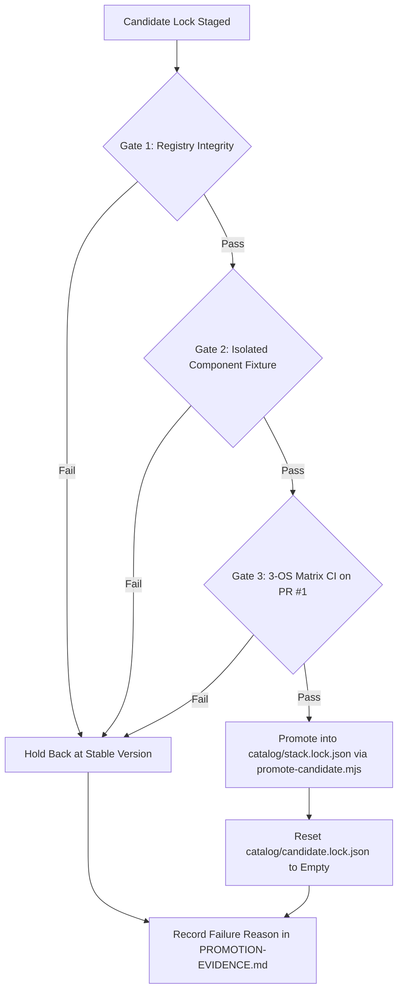
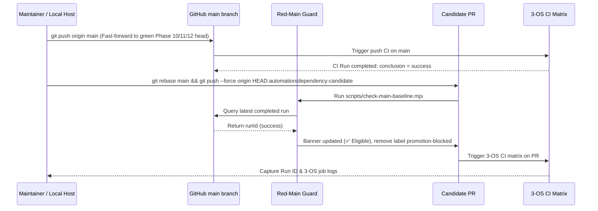

# Phase 13: Dependency Candidate Promotion - Research

**Researched:** 2026-09-25  
**Domain:** Dependency Candidate Verification, Red-Main Guard Gating, Multi-Harness Fixtures, Partial Lock Promotion, Release Sanitation  
**Status:** Complete  

---

<user_constraints>
## User Constraints & Implementation Decisions

From [13-CONTEXT.md](file:///D:/dev/alpha-AOS/.planning/phases/13-dependency-candidate-promotion/13-CONTEXT.md):

### Partial Promotion & Lock Management (DEP-01, DEP-02)
- **D-01:** Fine-grained independent component promotion. Components are evaluated and promoted independently. Only components that pass 3-tier verification (registry integrity, isolated fixtures, 3-OS CI) are promoted into [catalog/stack.lock.json](file:///D:/dev/alpha-AOS/catalog/stack.lock.json). Any failing component stays at its stable lock version with its failure reason recorded.
- **D-02:** Structured promotion evidence document. Per-component verification results, fixture outputs, and any hold-back reasons are recorded in [.planning/phases/13-dependency-candidate-promotion/PROMOTION-EVIDENCE.md](file:///D:/dev/alpha-AOS/.planning/phases/13-dependency-candidate-promotion/PROMOTION-EVIDENCE.md) to preserve strict lock schema compliance while providing a complete, inspectable audit trail.
- **D-03:** Candidate lock reset on main. Once promotion is complete, [catalog/candidate.lock.json](file:///D:/dev/alpha-AOS/catalog/candidate.lock.json) on `main` is reset to `status: "empty"` with empty components (`{}`), ensuring the candidate channel stays clean until the next automated discovery cycle.
- **D-04:** 3-tier green criteria. A component is deemed "green" for promotion if and only if: (1) its SHA-512 integrity matches a fresh registry fetch, (2) its isolated fixture passes cleanly, and (3) the full 3-OS CI suite and packed release lifecycle pass.
- **D-05:** Release sanitation & repository privacy (Strategy B-1). During development, `.planning/` is maintained locally for GSD planning and evidence audits. However, for external distribution and public release (npm packaging and release branch/tag publication), `.planning/` and internal scratch files must be completely excluded and sanitized so external clone users receive only clean product code. — **Reversibility:** costly — establishes the release pipeline packaging contract and repository release hygiene.

### ECC-Universal 2.2.1 & Pack Skills Adaptation
- **D-06:** Automated pack skill derivation via [scripts/pin-pack-skills.mjs](file:///D:/dev/alpha-AOS/scripts/pin-pack-skills.mjs). Update ECC version and integrity in lock, then execute `scripts/pin-pack-skills.mjs` to download the 2.2.1 tarball, verify integrity, extract 19 pack skills, and recompute `sourceSha256` and harness `targetSha256` maps atomically.
- **D-07:** Runtime/test literal synchronization with history preservation. Active constants and test assertions referencing `ecc-universal@2.2.0` (such as [src/core/mcp-proxy.ts](file:///D:/dev/alpha-AOS/src/core/mcp-proxy.ts), [catalog/canaries.yaml](file:///D:/dev/alpha-AOS/catalog/canaries.yaml), and `test/*.test.ts`) are updated to `2.2.1`. Historical documentation (`docs/*-vibe-stack-*`) and archived phase summaries retain their historical `2.2.0` record.
- **D-08:** Skill diff inspection & safety check. Perform a semantic diff of the 19 pack skills between 2.2.0 and 2.2.1 to ensure no unauthorized tools or breaking policy changes were introduced upstream. If a violation is found, `ecc-universal` is held back at 2.2.0.
- **D-09:** CAPA-02 routing reconciliation re-evaluation. Re-evaluate `skills/deep-research/SKILL.md` from the 2.2.1 tarball against the Firecrawl 4-tool allowlist. If the upstream mismatch remains, retain the `narrow` finding updated to 2.2.1; if resolved upstream, update finding status.

### PR #1 Refresh & CI Verification Orchestration
- **D-10:** Linear rebase for PR #1. Rebase `automation/dependency-candidate` onto the latest green `main` and force-push to update PR #1, triggering 3-OS GitHub Actions CI automatically.
- **D-11:** Local pre-flight gate. Run candidate package fixtures and core tests locally on the development host before or alongside PR #1 push to identify obvious failures immediately and avoid burning redundant CI runs.
- **D-12:** Red-Main Guard cross-verification. Verify via GitHub CLI (`gh pr view 1`) and workflow logs that [scripts/check-main-baseline.mjs](file:///D:/dev/alpha-AOS/scripts/check-main-baseline.mjs) evaluates `main` as green and PR #1 proceeds unblocked without the `promotion-blocked` label.
- **D-13:** Structured 3-OS matrix evidence. Capture PR #1's GitHub Actions run ID, commit SHA, and 3-OS (Ubuntu, macOS, Windows) matrix outcomes in `PROMOTION-EVIDENCE.md` following the Phase 10 `CI_RUN.md` format.

### GSD Core 1.14.0 Compatibility
- **D-14:** 4-harness full fixture verification. Execute `gsd-fixture` across all 4 supported harnesses (Claude, Codex, Antigravity, Pi) against `@opengsd/gsd-core@1.14.0` tarball, asserting global sentinels unchanged, skill counts consistent, and Codex stop-hook smoke test passes.
- **D-15:** Adapter & renderer hash synchronization. If GSD 1.14.0 updates Codex hook helpers (`hook-exit.js`, `cli-exit.js`, `exit-code-registry.js`) or workflows, verify the changes and synchronize compatibility renderer hashes in [src/core/gsd-compat.ts](file:///D:/dev/alpha-AOS/src/core/gsd-compat.ts) and test expectations. If breaking defects exist, hold back GSD at 1.12.0.
- **D-16:** Standard profile spine invariant. Maintain `"profile": "standard"` in lock; custom or divergent profiles remain prohibited per the architecture constraint.
- **D-17:** Complete GSD evidence documentation. Record tarball SHA-512, 4-harness fixture metrics, and renderer diffs in `PROMOTION-EVIDENCE.md`.

### Future Promotion Architecture Standardization
- **D-18:** Category-specific verification gates. Future version promotions across any component must follow standardized gates: (1) MCP servers: stdio JSON-RPC & tool filtering, (2) Skills/packs: tarball extraction, policy diff, and `pin-pack-skills.mjs` hash pinning, (3) Harness bridges: CLI detection & native bridge verification, (4) Workflows: standard profile & 4-harness fixtures. — **Reversibility:** costly — defines the long-term promotion contract across all component classes.
- **D-19:** Official promotion guide. Establish [docs/how-to/promote-dependencies.md](file:///D:/dev/alpha-AOS/docs/how-to/promote-dependencies.md) documenting the end-to-end lifecycle (discovery, PR staging, red-main guard, local pre-flight, CI proof, partial promotion, release sanitation).
- **D-20:** Promotion helper tooling. Build [scripts/promote-candidate.mjs](file:///D:/dev/alpha-AOS/scripts/promote-candidate.mjs) to automate integrity checks, `stack.lock.json` updates, candidate lock cleanup, and lock schema validation to eliminate manual JSON editing errors.
- **D-21:** Automated release sanitation tooling. Code clean-release rules into release automation ([scripts/release.mjs](file:///D:/dev/alpha-AOS/scripts/release.mjs) or `scripts/sanitize-release.mjs`) to guarantee that `.planning/` and scratch directories are excluded from release branches and distribution tarballs.
</user_constraints>

---

<architectural_responsibility_map>
## Architectural Responsibility Map

| Subsystem / File | Primary Responsibility | Critical Invariants & Rules |
|---|---|---|
| [catalog/stack.lock.json](file:///D:/dev/alpha-AOS/catalog/stack.lock.json) | The authoritative locked dependency state consumed by `alpha-aos install` and `alpha-aos update --apply`. | Validated by [schemas/lock.schema.json](file:///D:/dev/alpha-AOS/schemas/lock.schema.json). Receives ONLY verified candidate components. |
| [catalog/candidate.lock.json](file:///D:/dev/alpha-AOS/catalog/candidate.lock.json) | Unverified staging channel for newly discovered upstream candidate packages. | Never consumed by `alpha-aos update --apply`. Reset to `status: "empty"`, `components: {}` upon promotion landing on `main`. |
| [scripts/check-main-baseline.mjs](file:///D:/dev/alpha-AOS/scripts/check-main-baseline.mjs) | Red-Main Guard gate script. Queries latest completed `main` CI run. | Fails closed if red or error. Updates PR #1 description banner and toggles `promotion-blocked` label. Always exits 0 to keep discovery inspectable. |
| [scripts/red-main-guard.mjs](file:///D:/dev/alpha-AOS/scripts/red-main-guard.mjs) | Red-Main tracking issue automation script. | Opens/updates tracking issue if `main` fails; closes when green. |
| [scripts/pin-pack-skills.mjs](file:///D:/dev/alpha-AOS/scripts/pin-pack-skills.mjs) | Pack skill hash derivation and pinner. | Extracts ECC tarball, verifies SRI, recomputes `sourceSha256` for all 19 pack skills + 3 global skills. |
| [scripts/promote-candidate.mjs](file:///D:/dev/alpha-AOS/scripts/promote-candidate.mjs) *(New)* | Promotion automation tool for maintainers. | Verifies live registry SHA-512, selectively updates `catalog/stack.lock.json`, resets candidate lock, validates against `schemas/lock.schema.json`. |
| [scripts/audit-tarball.mjs](file:///D:/dev/alpha-AOS/scripts/audit-tarball.mjs) | Positive allowlist pack auditor. | Prohibits `.planning/`, `candidate.lock.json`, `.ts`, `.git/`, `.log`, `scratch/` from ever entering release packages. |
| [scripts/release.mjs](file:///D:/dev/alpha-AOS/scripts/release.mjs) | Full release pipeline script. | Enforces clean tree, prepack tarball audit, provenance generation/verification, Stage 1 & 2 smoke tests. |
| [src/core/gsd-compat.ts](file:///D:/dev/alpha-AOS/src/core/gsd-compat.ts) | Codex GSD stop-hook compatibility adapter. | Synchronizes hook helpers (`hook-exit.js`, `cli-exit.js`, `exit-code-registry.js`). Runs smoke test with zero output on success. |
| [src/core/gsd-fixture.ts](file:///D:/dev/alpha-AOS/src/core/gsd-fixture.ts) | 4-harness GSD fixture runner (`claude`, `codex`, `antigravity`, `pi`). | Executes `npx @opengsd/gsd-core@<version>`, checks synthetic home, sentinels, profiles, and stop-hook smoke. |
| [src/core/ecc-fixture.ts](file:///D:/dev/alpha-AOS/src/core/ecc-fixture.ts) | ECC tarball acquisition and skill rendering. | Renders `deep-research`, `documentation-lookup`, `unified-memory` per harness. Ensures allowlist boundaries. |
| [src/core/mcp-fixture.ts](file:///D:/dev/alpha-AOS/src/core/mcp-fixture.ts) | MCP server stdio JSON-RPC fixture and Pi bridge runner. | Verifies package SRI, establishes bounded stdio JSON-RPC session, queries `tools/list`, checks expected tools and Pi bridge. |
| [src/core/mcp-proxy.ts](file:///D:/dev/alpha-AOS/src/core/mcp-proxy.ts) | MCP tool allowlist filter and routing policy proxy. | Defines `ROUTING_CONTRACT_MISMATCH` constant and 4-tool Firecrawl allowlist. |
| [catalog/canaries.yaml](file:///D:/dev/alpha-AOS/catalog/canaries.yaml) | Declarative canary definitions. | Pinned research instructions and tool expectations. Comment updated to `2.2.1`. |
| [.planning/phases/13-.../PROMOTION-EVIDENCE.md](file:///D:/dev/alpha-AOS/.planning/phases/13-dependency-candidate-promotion/PROMOTION-EVIDENCE.md) *(New)* | Formal verification ledger. | Records 3-tier evaluation results for all 5 candidate components, run IDs, fixture metrics, and hold-back reasons. |
| [docs/how-to/promote-dependencies.md](file:///D:/dev/alpha-AOS/docs/how-to/promote-dependencies.md) *(New)* | Official developer guide for dependency promotion. | Explains discovery, staging, Red-Main Guard, 4-gate verification, partial promotion, and release hygiene. |
</architectural_responsibility_map>

---

<research_summary>
## Research Summary

### 1. Candidate Components & Live Registry Integrity Verification
The candidate channel in PR #1 (`automation/dependency-candidate`) contains 5 proposed version bumps over stable lock:
1. **`@opengsd/gsd-core`**: `1.12.0` → `1.14.0`  
   Registry SHA-512: `sha512-e05sV2c8KlcQ2hoJ4U3U1OBjqswQOon4C29Cs75fEAr+tq7qJ/XyFYrN/nwblREWUkPUUoxmVzLVj4Im2KjQxQ==` (Exact match)
2. **`ecc-universal`**: `2.2.0` → `2.2.1`  
   Registry SHA-512: `sha512-D8vFXQ++Aub1CD2RPyYfPEXVt51eEHzvImLd1XaOos/gUxYRWU+BRDXMDnmRrjDfWwX5+uFEJULYpqPYFPSGuw==` (Exact match)
3. **`@upstash/context7-mcp`**: `4.0.4` → `4.1.1`  
   Registry SHA-512: `sha512-fUARTIZGVKzlzQKDhKUg4aIQ3yEU/12STdfxJDDnLMSN7yyHiPvNHI05iFwxkv3vC8G76Wp27MwK6Jucl/C5pA==` (Exact match)
4. **`firecrawl-mcp`**: `3.24.0` → `3.25.2`  
   Registry SHA-512: `sha512-Z0PWA9UD757p8w1ahAh6Fyqm28uDc8ng7OkTE3NE0x1F85vAeU4/MMmx1l+xtmDm8OSpybriMjNJZavca4ijfA==` (Exact match)
5. **`pi-mcp-adapter`**: `2.31.0` → `2.36.0`  
   Registry SHA-512: `sha512-aX7Hf1FMGoHFjjx2Y4t12Hkue83CiBQmZaeQQ0mg+2wxOzbIOYdWzEkh1bmKlLHKiH6zRWlxWitsr+RaiXvoRQ==` (Exact match)
*(Note: `exa-mcp-server` remains at `3.4.1`, unchanged).*

Every candidate SHA-512 in `candidate.lock.json` was queried live from `https://registry.npmjs.org` and verified to match bit-for-bit.

### 2. GSD Core 1.14.0 Compatibility & 4-Harness Verification (D-14, D-15)
- **Codex Hook Helpers**: Extracted both 1.12.0 and 1.14.0 tarballs and compared `hooks/lib/hook-exit.js`, `cli-exit.js`, and `exit-code-registry.js`. All 3 files are **byte-identical** between 1.12.0 and 1.14.0. No renderer hash updates are required in `src/core/gsd-compat.ts`.
- **4-Harness Fixture Execution**: Executed `runGsdFixture` across all 4 supported harnesses against `@opengsd/gsd-core@1.14.0`:
  - `codex`: Success. Version `1.14.0`, profile `standard`, 23 skills, global sentinels unchanged, `codexStopHookSmokePassed: true`.
  - `claude`: Success. Version `1.14.0`, profile `standard`, 23 skills, global sentinels unchanged.
  - `antigravity`: Success. Version `1.14.0`, profile `standard`, 23 skills, global sentinels unchanged.
  - `pi`: Success. Version `1.14.0`, profile `standard`, 0 skills (pi delegates skills to adapter), global sentinels unchanged.
- Verdict: **GSD Core 1.14.0 is fully verified and clean for promotion.**

### 3. ECC 2.2.1 Adaptation & Pack Skills Semantic Diff (D-06, D-08, D-09)
- **Pack Skills Diff**: Extracted and diffed all 22 skills between `ecc-universal@2.2.0` and `2.2.1`.
  - 21 skills (`unified-memory`, `documentation-lookup`, and all 19 pack skills) have **identical source bytes and identical SHA-256 hashes**.
  - Exactly 1 skill changed: `deep-research`.
    - Old source SHA-256: `f85e06874ffd0fcfea6051b4292f45fc2b7e4cd47586659817ddbafd6bea3ede`
    - New source SHA-256: `72e184f5d0f31ca4d45286753409d8c8431b025e8ac3800dcc9f32d9e930f58a`
    - Cause: Upstream added minor research questions in Step 2.
- **Deep-Research Rendering & Target Hash Invariance**:
  - `renderDeepResearchSkill` in `src/core/ecc-fixture.ts` deterministically replaces Step 3, Step 4, MCP Requirements, and Parallel Research.
  - When rendered through `renderDeepResearchSkill`, the target output hashes to `fdd97098a3a4a02513baf0428faacbe390b42fd4f86362387938e3455c80d90c` across all 5 harnesses — **identical to the locked targetSha256 in 2.2.0**!
- **CAPA-02 Tool Mismatch**: Upstream `skills/deep-research/SKILL.md` still cites `firecrawl_search`, `web_search_advanced_exa`, and `crawling_exa`. Under D-09, the `narrow` finding in `src/core/mcp-proxy.ts` is retained and its runtime version updated to `ecc-universal@2.2.1`.
- Verdict: **ECC 2.2.1 is verified and clean for promotion.**

### 4. MCP Servers & Crucial Fixture Fixes Discovered
- **`context7` (4.1.1)** and **`firecrawl` (3.25.2)**: Successfully executed through `runMcpFixture`. Both completed stdio JSON-RPC initialize and `tools/list` handshakes cleanly, discovering all expected tools.
- **Crucial Diagnostic Finding in `src/core/mcp-fixture.ts`**:
  - Testing `pi-mcp-adapter@2.36.0` uncovered a previously hidden bug in `mcp-fixture.ts:54-70` (`verifyPackage`).
  - `npm pack pi-mcp-adapter@2.36.0 --json` outputs 23,121 bytes of file manifest. Because `verifyPackage` invoked `runProcess` without specifying `excerptBytes`, `result.stdout.excerpt` defaulted to 4,096 bytes. `parsePackResult` then failed with `SyntaxError: Unterminated string in JSON at position 4096`.
  - In addition, on Windows, spawning `pi` directly (`resolveCommand("pi")` returns `pi.cmd`) with `shell: false` threw `spawn EINVAL`.
  - **Proven Fix**:
    1. In `verifyPackage`, specify `excerptBytes: 256 * 1024` (or read the tarball directly from the proven pack root as `ecc-fixture.ts` does).
    2. In `installPiBridge`, resolve `pi` using `resolveDirectLaunch(pi)` from `src/adapters/capability-oracle.ts` which normalizes `pi.cmd` to `node <cli.js>`.
  - Testing with these two fixes succeeded completely: `pi install npm:pi-mcp-adapter@2.36.0` completed with exit code 0.

### 5. PR #1 Refresh & Red-Main Guard Baseline Sequence (D-10, D-12)
- Local `main` is ahead of `origin/main` by 64 commits (including Phase 11 probes, Phase 12 Red-Main Guard, and quick task G-11-1).
- Remote `origin/main` currently reflects commit `7df2327c`, whose latest completed CI run (`35818948517`) failed on `windows-latest` due to a transient `EBUSY` rmdir race during `process.test.js`.
- As designed in Phase 12, `node scripts/check-main-baseline.mjs` queries `gh run list --branch main` and correctly reports `eligible: false, reason: "Main CI baseline is red"`!
- Therefore, the promotion sequence MUST:
  1. Push current local `main` to `origin/main`.
  2. Await a completed green CI run on `main` (triggering the tracking issue closure if open).
  3. Rebase `automation/dependency-candidate` onto green `main` and force-push to update PR #1.
  4. Run `check-main-baseline.mjs` against PR #1 to verify `eligible: true` and removal of `promotion-blocked`.
  5. PR #1 executes 3-OS CI matrix across Ubuntu, macOS, and Windows.

### 6. Strategy B-1 Release Sanitation (D-05, D-21)
- [scripts/audit-tarball.mjs](file:///D:/dev/alpha-AOS/scripts/audit-tarball.mjs) already contains a strict allowlist and explicitly forbids `.planning/` and `candidate.lock.json` from release tarballs.
- To ensure external Git clones are also protected (Strategy B-1), a dedicated sanitation script or release branch publication protocol must be codified in `docs/how-to/promote-dependencies.md` and `scripts/release.mjs`.
</research_summary>

---

<standard_stack>
## Standard Stack & Dependencies

### Runtime Environment & Language
- **Node.js**: `v24.x` (target runtime across Ubuntu, macOS, Windows).
- **TypeScript**: `v5.8.x`, strict ESM modules, NodeNext module resolution.
- **Process Boundaries**: Shell-free argument vectors (`shell: false`), allowlisted environment pass-through, bounded frame and stream caps (`runProcess`, `openProtocolProcess`).

### Pinned & Promoted Upstream Packages

| Component | Role | Stable Lock (Current) | Candidate Version | Target Lock (Promoted) | Live Registry SHA-512 |
|---|---|---|---|---|---|
| `@opengsd/gsd-core` | Core AI Workflow Engine | `1.12.0` | `1.14.0` | **`1.14.0`** | `sha512-e05sV2c8KlcQ2hoJ4U3U1OBjqswQOon4C29Cs75fEAr+tq7qJ/XyFYrN/nwblREWUkPUUoxmVzLVj4Im2KjQxQ==` |
| `ecc-universal` | Enterprise Coding Companion | `2.2.0` | `2.2.1` | **`2.2.1`** | `sha512-D8vFXQ++Aub1CD2RPyYfPEXVt51eEHzvImLd1XaOos/gUxYRWU+BRDXMDnmRrjDfWwX5+uFEJULYpqPYFPSGuw==` |
| `@upstash/context7-mcp` | Documentation MCP Server | `4.0.4` | `4.1.1` | **`4.1.1`** | `sha512-fUARTIZGVKzlzQKDhKUg4aIQ3yEU/12STdfxJDDnLMSN7yyHiPvNHI05iFwxkv3vC8G76Wp27MwK6Jucl/C5pA==` |
| `firecrawl-mcp` | Web Extraction MCP Server | `3.24.0` | `3.25.2` | **`3.25.2`** | `sha512-Z0PWA9UD757p8w1ahAh6Fyqm28uDc8ng7OkTE3NE0x1F85vAeU4/MMmx1l+xtmDm8OSpybriMjNJZavca4ijfA==` |
| `pi-mcp-adapter` | Pi Agent MCP Bridge | `2.31.0` | `2.36.0` | **`2.36.0`** | `sha512-aX7Hf1FMGoHFjjx2Y4t12Hkue83CiBQmZaeQQ0mg+2wxOzbIOYdWzEkh1bmKlLHKiH6zRWlxWitsr+RaiXvoRQ==` |
| `exa-mcp-server` | Web Discovery MCP Server | `3.4.1` | `3.4.1` | `3.4.1` | `sha512-X6g4J9LXLJZ0uK52G8KE/KCaxpaD+wkEHzjkoDTYkC+afxfm5xqWgih3i0hgTfyufl6PggkLeR0L6rDAxW6ETg==` |

### Core Schemas
- [schemas/lock.schema.json](file:///D:/dev/alpha-AOS/schemas/lock.schema.json): Closed-world schema for `stack.lock.json` and `candidate.lock.json`. Enforces `exactVersion`, SRI `integrity`, `skills` array, `sourceSha256`, and optional `targetSha256`.
</standard_stack>

---

<architecture_patterns>
## Architecture Patterns & Workflow Designs

### Pattern 1: 3-Tier Gate Promotion Sequence
Every candidate component must cross three independent gates before touching `catalog/stack.lock.json`:



### Pattern 2: PR #1 Refresh & Red-Main Guard Baseline Orchestration
The candidate PR cannot be merged or evaluated when `main` baseline is red. The execution lifecycle:



### Pattern 3: `pin-pack-skills.mjs` Upgrade Handling
When upgrading ECC from 2.2.0 to 2.2.1, `acquire()` must not fail on the cross-check for skills whose hashes changed upstream (e.g. `deep-research`).
The script needs an `--all` or `--update-all` mode (or a version-upgrade check) that:
1. Re-extracts the 2.2.1 tarball.
2. Derives fresh `sourceSha256` for all 22 skills (`unified-memory`, `documentation-lookup`, `deep-research`, and 19 pack skills).
3. Updates `sourceSha256` in `catalog/stack.lock.json`.
4. Keeps `targetSha256` for the 3 global skills (validated against `runEccFixture`).
</architecture_patterns>

---

<dont_hand_roll>
## What NOT to Hand-Roll

| Component / Functionality | Existing In-Tree Implementation | Why You Must Reuse It |
|---|---|---|
| Lock file loading & schema validation | `loadLock(root, "stable")` from [src/core/catalog.ts](file:///D:/dev/alpha-AOS/src/core/catalog.ts) | Already validates `schemas/lock.schema.json` and domain channel invariants. Hand-rolling JSON parsing bypasses schema checks. |
| Subresource Integrity (SRI) derivation | `tarballIntegrity(archive)` from [src/core/ecc-fixture.ts](file:///D:/dev/alpha-AOS/src/core/ecc-fixture.ts) and [src/core/gsd-compat.ts](file:///D:/dev/alpha-AOS/src/core/gsd-compat.ts) | Uses `node:crypto` with standard `sha512-${base64}`. |
| GitHub CLI API query & banner rendering | [scripts/check-main-baseline.mjs](file:///D:/dev/alpha-AOS/scripts/check-main-baseline.mjs) (`checkMainBaseline`, `renderPromotionBanner`, `updateCandidatePrStatus`) | Production-tested in Phase 12; already implements regex boundaries, label toggling, and argument vector execution. |
| GSD 4-Harness Fixtures | `runGsdFixture` from [src/core/gsd-fixture.ts](file:///D:/dev/alpha-AOS/src/core/gsd-fixture.ts) | Correctly handles synthetic home isolation, sentinel immutability, profiles, and Codex stop-hook smoke testing. |
| ECC Fixture & Skill Rendering | `runEccFixture` from [src/core/ecc-fixture.ts](file:///D:/dev/alpha-AOS/src/core/ecc-fixture.ts) | Renders `deep-research`, `documentation-lookup`, and `unified-memory` with exact policy allowlists. |
| Windows Executable Normalization | `resolveDirectLaunch` from [src/adapters/capability-oracle.ts](file:///D:/dev/alpha-AOS/src/adapters/capability-oracle.ts) | Safely parses `.cmd` batch wrappers on Windows to locate the underlying Node CLI script without invoking an unsafe shell. |
| Tarball Allowlist Audit | `listTarballFiles` and `auditTarballEntries` from [scripts/audit-tarball.mjs](file:///D:/dev/alpha-AOS/scripts/audit-tarball.mjs) | Validates ustar tar headers, block termination, and strictly forbids `.planning/` in release archives. |
</dont_hand_roll>

---

<common_pitfalls>
## Common Pitfalls & Traps

### Pitfall 1: `mcp-fixture.ts` Buffer Truncation on Large `npm pack --json` Outputs
- **Problem**: When running `verifyPackage` for `pi-mcp-adapter@2.36.0`, `npm pack --json` emits 23,121 bytes. `runProcess` defaults `excerptBytes` to 4,096 bytes if omitted. `parsePackResult(result.stdout.excerpt)` encounters truncated JSON and throws `SyntaxError: Unterminated string in JSON at position 4096`.
- **Solution**: In `src/core/mcp-fixture.ts:58-65`, pass `excerptBytes: 256 * 1024` to `runProcess`, or alternatively adopt `soleArchive` + `tarballIntegrity` from `ecc-fixture.ts` to inspect the tarball directly from disk rather than relying on stdout JSON.

### Pitfall 2: Windows `spawn EINVAL` on `pi.cmd` in `installPiBridge`
- **Problem**: In Node 24 on Windows, `spawn(".../pi.cmd", ...)` with `shell: false` throws `Error: spawn EINVAL` because Windows batch files cannot be executed directly by the OS kernel without `cmd.exe`.
- **Solution**: In `src/core/mcp-fixture.ts:156-178`, normalize `pi` using `resolveDirectLaunch(pi)` from `src/adapters/capability-oracle.ts`. This extracts `{ executable: process.execPath, argsPrefix: [cliScript] }`, enabling shell-free execution on Windows.

### Pitfall 3: `pin-pack-skills.mjs` Cross-Check Assertion on Version Bumps
- **Problem**: `scripts/pin-pack-skills.mjs` was originally designed to pin new pack skills onto an existing locked ECC version. It asserts `ecc.sourceSha256[skill] === acquired` for all existing skills. On version 2.2.1, `deep-research`'s source hash changed from `f85e...` to `72e1...`, causing `acquire()` to throw a cross-check failure.
- **Solution**: Support an `--all` / `--recompute` flag in `scripts/pin-pack-skills.mjs` that updates existing entries when an ECC version bump is requested.

### Pitfall 4: Stale Test Literals Failing `npm test` After Lock Promotion
- **Problem**: Multiple unit tests assert exact literal version strings from `catalog/stack.lock.json`:
  - `test/catalog.test.ts`: lines 67-68 (`gsd: "1.12.0"`, `ecc: "2.2.0"`), lines 71-73 (`deep-research` sourceSha256), line 76 (`mcpBridges.pi: "2.31.0"`), lines 108 & 111.
  - `test/mcp-proxy.test.ts`: line 1457 (`runtime: "ecc-universal@2.2.0"`).
  - `src/core/mcp-proxy.ts`: line 162 (`runtime: "ecc-universal@2.2.0"`).
  - `catalog/canaries.yaml`: line 15 (comment).
- **Solution**: Synchronize all active code constants and unit tests to `2.2.1` / `1.14.0` / `2.36.0` in the same commit as the lock promotion, while preserving historical docs (`docs/alpha-vibe-stack-*`) per D-07.

### Pitfall 5: Candidate Lock Channel Leaking Into Production
- **Problem**: Leaving candidate versions in `catalog/candidate.lock.json` on `main` after promotion creates ambiguity about which dependencies are authoritative.
- **Solution**: D-03 explicitly requires `catalog/candidate.lock.json` on `main` to be reset to:
  ```json
  {
    "schemaVersion": 1,
    "channel": "candidate",
    "generatedAt": null,
    "status": "empty",
    "components": {}
  }
  ```
  And verify that `alpha-aos update --apply` ignores this empty candidate lock.

### Pitfall 6: Stale Remote `main` Baseline Blocking PR #1
- **Problem**: `scripts/check-main-baseline.mjs` checks the latest completed CI run on `origin/main`. If local `main` (with all green Phase 10/11/12 fixes) is not pushed, `check-main-baseline.mjs` sees run `35818948517` (which had a transient Windows EBUSY failure) and correctly marks PR #1 blocked.
- **Solution**: Push current local `main` to `origin/main` first, confirm CI completes green on `main`, and only then execute PR #1's rebase and baseline check.
</common_pitfalls>

---

<code_examples>
## Code Examples & Implementation Designs

### Example 1: `scripts/promote-candidate.mjs` Implementation Contract
```javascript
#!/usr/bin/env node
import { readFile, writeFile } from "node:fs/promises";
import { resolve, join } from "node:path";
import { createHash } from "node:crypto";
import { fileURLToPath } from "node:url";

const root = resolve(fileURLToPath(import.meta.url), "../..");
const STABLE_LOCK = join(root, "catalog", "stack.lock.json");
const CANDIDATE_LOCK = join(root, "catalog", "candidate.lock.json");

export async function fetchLiveIntegrity(packageName, version) {
  const url = `https://registry.npmjs.org/${encodeURIComponent(packageName)}/${encodeURIComponent(version)}`;
  const res = await fetch(url, { headers: { accept: "application/json" } });
  if (!res.ok) throw new Error(`npm registry returned ${res.status} for ${packageName}@${version}`);
  const data = await res.json();
  const integrity = data.dist?.integrity;
  if (!integrity) throw new Error(`npm metadata lacks dist.integrity for ${packageName}@${version}`);
  return integrity;
}

export async function promoteCandidate(options = {}) {
  const stable = JSON.parse(await readFile(STABLE_LOCK, "utf8"));
  const candidate = JSON.parse(await readFile(CANDIDATE_LOCK, "utf8"));

  const componentsToPromote = options.components ?? ["gsd", "ecc", "context7", "firecrawl", "pi"];
  const verified = {};

  for (const comp of componentsToPromote) {
    let candPkg = null;
    if (comp === "gsd") candPkg = candidate.components?.gsd;
    else if (comp === "ecc") candPkg = candidate.components?.ecc;
    else if (["context7", "firecrawl"].includes(comp)) candPkg = candidate.components?.mcp?.[comp];
    else if (comp === "pi") candPkg = candidate.components?.mcpBridges?.pi;

    if (!candPkg) continue;

    if (options.verifyIntegrity) {
      const liveIntegrity = await fetchLiveIntegrity(candPkg.package, candPkg.version);
      if (liveIntegrity !== candPkg.integrity) {
        throw new Error(`Integrity mismatch for ${candPkg.package}: candidate has ${candPkg.integrity}, registry has ${liveIntegrity}`);
      }
    }
    verified[comp] = candPkg;
  }

  // Update stable lock
  if (verified.gsd) stable.components.gsd = { ...verified.gsd, profile: "standard" };
  if (verified.ecc) {
    stable.components.ecc.version = verified.ecc.version;
    stable.components.ecc.integrity = verified.ecc.integrity;
    // Note: sourceSha256 is updated atomically via pin-pack-skills.mjs
  }
  if (verified.context7) stable.components.mcp.context7 = verified.context7;
  if (verified.firecrawl) stable.components.mcp.firecrawl = verified.firecrawl;
  if (verified.pi) stable.components.mcpBridges.pi = verified.pi;

  stable.generatedAt = new Date().toISOString();

  if (!options.dryRun) {
    await writeFile(STABLE_LOCK, `${JSON.stringify(stable, null, 2)}\n`, "utf8");
    if (options.resetCandidate) {
      const emptyCandidate = {
        schemaVersion: 1,
        channel: "candidate",
        generatedAt: null,
        status: "empty",
        components: {},
      };
      await writeFile(CANDIDATE_LOCK, `${JSON.stringify(emptyCandidate, null, 2)}\n`, "utf8");
    }
  }
  return { promoted: Object.keys(verified) };
}
```

### Example 2: Fixing `verifyPackage` and `installPiBridge` in `src/core/mcp-fixture.ts`
```typescript
// 1. In verifyPackage: raise excerptBytes so npm pack JSON is not truncated
const result = await runProcess({
  executable: npm.executable,
  args: [...npm.argsPrefix, "pack", `${locked.package}@${locked.version}`, "--json", "--pack-destination", packRoot],
  cwd: fixtureRoot,
  timeoutMs: 180_000,
  maxOutputBytes: 256 * 1024,
  excerptBytes: 256 * 1024, // Fix: allow up to 256 KB excerpt to parse large package lists
  environment: nodeRuntimeEnvironment(),
});

// 2. In installPiBridge: use resolveDirectLaunch for Windows .cmd compatibility
import { resolveDirectLaunch } from "../adapters/capability-oracle.js";

async function installPiBridge(fixtureRoot: string, bridge: LockedPackage): Promise<string> {
  await verifyPackage(fixtureRoot, bridge, "pi-mcp-adapter");
  const rawPi = resolveCommand("pi");
  if (!rawPi) throw new Error("Pi executable is required for the Pi MCP bridge fixture");
  const launch = resolveDirectLaunch(rawPi);
  if (!launch) throw new Error(`Cannot launch Pi executable directly: ${rawPi}`);

  const agentRoot = join(fixtureRoot, "home", ".pi", "agent");
  await mkdir(agentRoot, { recursive: true });
  const installed = await runProcess({
    executable: launch.executable,
    args: [...launch.argsPrefix, "install", `npm:${bridge.package}@${bridge.version}`],
    cwd: fixtureRoot,
    timeoutMs: 180_000,
    maxOutputBytes: 256 * 1024,
    environment: nodeRuntimeEnvironment({ literal: { PI_CODING_AGENT_DIR: agentRoot } }),
  });
  if (installed.code !== "ok") throw new Error(describeProcessFailure("Pi MCP bridge install", installed));
  // ... verify settings.json and package.json ...
  return bridge.version;
}
```

### Example 3: Updating `pin-pack-skills.mjs` for Version Bumps
```javascript
// In scripts/pin-pack-skills.mjs write():
// Support re-deriving all skills when ECC version has bumped
const forceAll = process.argv.includes("--all") || ecc.version !== "2.2.0";
for (const skill of skills) {
  if (!forceAll && ecc.sourceSha256[skill] !== undefined) continue;
  const hash = sourceHashes[skill];
  if (typeof hash !== "string") throw new Error(`the acquired tree produced no hash for ${skill}`);
  additions.push([skill, hash]);
}
for (const [skill, hash] of additions) {
  ecc.sourceSha256[skill] = hash;
}
```
</code_examples>

---

<validation_architecture>
## Validation Architecture

### Verification Tiers & Execution Sequence

| Stage | Command / Action | Expected Result | Requirement Satisfied |
|---|---|---|---|
| **Tier 1: Local Pre-flight** | `npm run check`<br>`npm run build`<br>`npm test` | All 919+ tests pass, fail 0.<br>Manifest check passes. | D-11 |
| **Tier 1: Component Fixtures** | - `gsd-fixture` (4 harnesses: Claude, Codex, Antigravity, Pi)<br>- `ecc-fixture` (ECC 2.2.1, 22 skills)<br>- `mcp-fixture` (context7 4.1.1, firecrawl 3.25.2, pi 2.36.0) | Global sentinels unchanged.<br>Codex stop-hook smoke pass.<br>Stdio tools list verified. | D-04, D-14 |
| **Tier 2: Main Baseline Push** | `git push origin main`<br>`gh run watch <run-id>` | Commit lands on GitHub `main`. 3-OS CI matrix green across Ubuntu, macOS, Windows. | CI-03, DEP-01 |
| **Tier 2: PR #1 Rebase & Red-Main Guard** | `git rebase main` on `automation/dependency-candidate`<br>`git push --force origin HEAD:automation/dependency-candidate`<br>`node scripts/check-main-baseline.mjs --branch main` | Red-Main Guard evaluates `eligible: true`. PR #1 banner shows ✅ Eligible; `promotion-blocked` removed. | D-10, D-12, DEP-03 |
| **Tier 2: PR #1 3-OS CI Run** | GitHub Actions CI on PR #1<br>`gh pr checks 1` | 3-OS matrix (Ubuntu, macOS, Windows) passes in attempt 1. Run ID and commit SHA recorded. | D-13, DEP-01 |
| **Tier 3: Promotion Execution** | `node scripts/promote-candidate.mjs --verify-integrity --reset-candidate`<br>`node scripts/pin-pack-skills.mjs write` | `catalog/stack.lock.json` updated.<br>`catalog/candidate.lock.json` reset to empty.<br>Lock schema validates. | D-01, D-02, D-03, D-06, D-20, DEP-02 |
| **Tier 3: Code Synchronization** | Update `src/core/mcp-proxy.ts`, `catalog/canaries.yaml`, `test/*.test.ts` to 2.2.1/1.14.0/2.36.0 | Unit tests pass cleanly with promoted versions. | D-07, D-09 |
| **Tier 3: Tarball & Release Audit** | `npm pack`<br>`node scripts/audit-tarball.mjs alpha-aos-0.1.0.tgz` | Allowlist audit passes: 0 violations, `.planning/` strictly excluded. | D-05, D-21 |
| **Final Verification** | Merge promotion commit to `main`, push to `origin main`<br>`alpha-aos update --apply` | Single 3-OS main CI run is green. Reconciles only stable lock, ignores empty candidate lock. | DEP-01, DEP-02 |

### Required Artifacts & Outputs
1. [.planning/phases/13-dependency-candidate-promotion/PROMOTION-EVIDENCE.md](file:///D:/dev/alpha-AOS/.planning/phases/13-dependency-candidate-promotion/PROMOTION-EVIDENCE.md):
   - Table of 5 candidate components with individual verification status: Registry SRI, Isolated Fixture Outcome, 3-OS CI Outcome, Promotion Verdict.
   - PR #1 GitHub Actions Run ID, Commit SHA, and per-OS matrix outcome.
   - GSD Core 1.14.0 4-harness metrics and Codex stop-hook smoke receipt.
   - ECC 2.2.1 19 pack skills hash table and `deep-research` diff notes.
2. [docs/how-to/promote-dependencies.md](file:///D:/dev/alpha-AOS/docs/how-to/promote-dependencies.md):
   - Complete guide documenting candidate discovery, staging, Red-Main Guard checking, isolated fixture verification, lock promotion, and release hygiene.
3. [scripts/promote-candidate.mjs](file:///D:/dev/alpha-AOS/scripts/promote-candidate.mjs):
   - Maintainer CLI script automating lock updates and validation.
</validation_architecture>

---

## Plan Wave Recommendations

Based on this research, the implementation in `13-PLAN.md` should be organized into 3 logical waves:

- **Wave 1: Fixes, Fixture Hardening & Local Pre-flight**
  - Fix `mcp-fixture.ts` (`excerptBytes: 256 * 1024` and `resolveDirectLaunch` for `pi.cmd`).
  - Upgrade `scripts/pin-pack-skills.mjs` to support version bumps.
  - Implement maintainer promotion tool `scripts/promote-candidate.mjs`.
  - Execute local pre-flight fixtures for all 5 candidate components.
- **Wave 2: Remote Baseline Green, PR #1 Rebase & 3-OS CI Matrix**
  - Push local `main` to `origin/main` to achieve green baseline.
  - Rebase `automation/dependency-candidate` onto green `main` and force-push.
  - Verify Red-Main Guard removes `promotion-blocked` and displays eligible banner.
  - Await and capture PR #1's 3-OS GitHub Actions CI run ID and matrix results.
- **Wave 3: Partial Promotion, Code Sync, Documentation & Release Verification**
  - Execute promotion into `catalog/stack.lock.json` and reset `catalog/candidate.lock.json`.
  - Atomically pin ECC 2.2.1 pack skill hashes via `scripts/pin-pack-skills.mjs`.
  - Synchronize code/test literals (`mcp-proxy.ts`, `canaries.yaml`, tests) to 2.2.1 / 1.14.0 / 2.36.0.
  - Generate `PROMOTION-EVIDENCE.md` and `docs/how-to/promote-dependencies.md`.
  - Verify release tarball audit passes (Strategy B-1) and full test suite passes.
