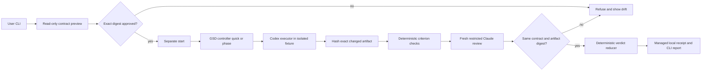

# Phase 14: Contract and Vertical Tracer - Research

**Researched:** 2026-09-29  
**Domain:** Opt-in autonomous development, contract approval, measured acceptance, native agent CLI handoff  
**Confidence:** MEDIUM overall (repository and local probes HIGH; production adapter handoff unproven)

<user_constraints>
## User Constraints (from CONTEXT.md)

### Locked Decisions

#### 승인 절차
- **D-01:** 최종 계약 승인은 CLI에서 한다. 대화 중 계약을 다듬을 수 있지만, 읽기 전용 CLI 미리보기를 확인한 뒤 정확한 계약 digest를 명시해 승인한다.
- **D-02:** 승인과 실행 시작은 별도 명령이다. `start`는 이미 승인된 계약 digest를 요구한다.
- **D-03:** 미리보기와 계약에는 허용된 경로와 효과 종류를 함께 보여준다. 변경될 모든 파일을 미리 열거할 필요는 없으며, 실제 변경 파일은 실행 결과에 기록한다.
- **D-04:** 승인 후 계약이 바뀌면 이전 digest의 실행을 거부하고, 바뀐 계약 항목과 새 미리보기·digest를 보여줘 재승인을 안내한다. 설계가 정한 목표·효과·권한·역할 변경의 재승인 경계는 유지한다.

#### 위임 범위
- **D-05:** 제어자는 승인된 경로와 GSD 계획 안에서 구현 방식, 파일 구성, 필수 기준을 입증할 테스트 보강을 추가 승인 없이 결정할 수 있다. 계약 자체의 목표·권한·효과·필수 기준을 약화시키는 변경은 이 위임에 포함되지 않는다.
- **D-06:** 의미 있는 구현 방향, 파일 구성 또는 검증 선택마다 무엇을 선택했고 왜 선택했는지 결정 시점에 기록한다. 모든 작은 도구 호출에 별도 설명을 붙일 필요는 없다.
- **D-07:** 계약에 의존성 변경 권한이 명시된 경우 제어자가 필요한 의존성을 추가할 수 있고 이유를 기록한다. 변경 후 `alpha-aos-control`의 plan/status 점검을 실행하며, 새 프로젝트 팩 적용에는 기존의 별도 정확한 plan digest 승인이 필요하다.
- **D-08:** 원래 예정된 측정 방법을 사용할 수 없으면 동일한 필수 기준을 실제로 입증하는 대체 방법을 선택하고 동등한 이유를 기록할 수 있다. 입증이 부족하면 `unknown`으로 판정하며 기준을 몰래 바꾸지 않는다.

#### 첫 수직 경로의 작업
- **D-09:** 실제 에이전트가 격리된 소형 CLI 프로젝트에서 개발 작업을 수행한다. 이 저장소 자체를 첫 tracer의 변경 대상으로 삼지 않는다.
- **D-10:** 작업은 입력 파일을 읽어 명시된 JSON 결과를 생성하는 기능이다. 정상 입력과 잘못된 입력의 동작을 측정 가능한 기준으로 포함한다. 구체적인 입력 형식과 값은 계획에서 결정하되 기대 출력과 오류 처리는 계약에 고정한다.
- **D-11:** 의도적인 실패에서는 실행자가 성공을 주장하거나 0으로 종료해도 결과 JSON이 필수 기준과 다르면 거부해야 한다. 변경된 산출물에 오래된 검토 결과를 대입해 거부하는 별도 테스트도 로드맵에 따라 수행한다.
- **D-12:** 올바른 결과의 수락과 결함이 심어진 결과의 거부는 각각 독립된 실제 에이전트 실행으로 입증한다. Phase 14의 증명을 실패 후 자동 수정 반복에 의존시키지 않는다.

#### 판정 및 근거
- **D-13:** CLI의 첫 판정 화면은 필수 기준별로 판정, 측정 결과, 독립 검토 결과, 산출물 digest, 실패 이유를 함께 보여준다.
- **D-14:** 자동 측정은 통과했어도 독립 검토자가 같은 기준에서 재현 가능한 결함과 근거를 제시하고 확인되면 두 결과를 함께 보여주고 `rejected`로 판정한다. 단순 주장만으로 수락을 뒤집거나 결함을 자동 실행하지 않는다.
- **D-15:** 필수 기준을 측정할 수 없거나 검토자가 판단을 보류한 `unknown`은 빠진 근거와 해당하는 다음 조치(재실행, 환경 복구, 기준 명확화 등)를 명시한다.
- **D-16:** 로컬 관리 상태에 조회 가능한 판정 영수증을 둔다. 영수증은 계약 revision·digest, 산출물 digest, 측정 결과와 독립 검토 근거를 묶어 정확한 revision의 판정을 재확인할 수 있게 한다.

### the agent's Discretion

- 실제 bootstrap 에이전트 쌍은 로드맵의 native probe 결과에 따라 선정한다. 검증되지 않은 하네스·역할 조합의 지원을 주장하지 않는다.
- 격리 CLI 프로젝트의 입력 형식, 구체적인 예제 데이터, 파일 배치, 명령 이름 및 테스트 설계는 위 결정과 승인된 설계의 안전 경계를 만족하도록 연구·계획 단계에서 정한다.

### Deferred Ideas (OUT OF SCOPE)

None — discussion stayed within Phase 14 scope. The approved roadmap separately schedules durable recovery (15), five-harness adapters (16), full GSD bridge (17), broad capability routing (18), review/repair loop (19), complete entry experience (21), and release proof (22).
</user_constraints>

<phase_requirements>
## Phase Requirements

| ID | Description | Research Support |
|---|---|---|
| CON-01 | Versioned, reviewable approved contract | Closed schema, stable digest, preview/approve split |
| CON-02 | Delegated routine choices, recorded rationale | Decision receipt before consequential implementation/test choices |
| CON-03 | Stale authority requires new revision | Re-read and compare exact digest before start and before effects |
| AUTO-01 | Explicit per-task opt-in | No supervisor path from ordinary GSD; approval records task consent |
| AUTO-02 | Consent, scope, authority, duration on contract | Preview and receipt expose these; unapproved effects stop |
| AUTO-03 | Ordinary GSD remains conversational | Negative entry and next-task noninheritance tests |
| RUN-01 | Real GSD-governed implementation through verdict | Isolated JSON CLI tracer, real Codex executor, real fresh Claude reviewer |
| REV-01 | Verdict per mandatory criterion, including unknown | Deterministic check/review reducer and exact-revision receipt |
</phase_requirements>

## Summary

Phase 14 should prove a narrow, falsifiable path: CLI preview → exact-digest approval → separate start → GSD-owned work → independent criterion checks → fresh read-only review → receipt and per-criterion verdict. The authorized scope is one isolated JSON-transform CLI project and two independent real agent runs, one correct and one deliberately defective. GSD alone writes project lifecycle state; alpha-AOS writes contract, attempt, decisions, and verdict data under its managed state root. [VERIFIED: .planning/ROADMAP.md:41-59] [VERIFIED: docs/design/autonomous-work/README.md:5-13] [VERIFIED: .planning/phases/14-contract-and-vertical-tracer/14-CONTEXT.md:8-57]

Codex CLI 0.158.0 and Claude Code 2.1.281 are installed on this Windows host. In this research session, an isolated `codex exec` invocation wrote the requested JSON artifact and exited 0; a separate `claude -p --restricted --tools Read` session read an isolated file and returned the expected content in JSON. Those are **observed native CLI abilities**, not yet proof that production launches succeed through alpha-AOS's declared environment or that the full tracer passes. The planner should fix the bootstrap pair as **Codex executor / Claude reviewer**, with the invoking GSD controller as the sole lifecycle writer, and require a production-path canary before advertising this pair. [VERIFIED: local CLI probes 2026-09-29, temp artifacts and process output] [VERIFIED: src/core/process.ts:421-510] [CITED: https://github.com/openai/codex/blob/main/codex-rs/exec/src/cli.rs] [CITED: https://github.com/anthropics/claude-code/blob/main/CHANGELOG.md]

**Primary recommendation:** Plan the approval and deterministic verdict core first, then drive two separate live tracer executions through the same bounded adapter and exact-artifact review seam. [VERIFIED: .planning/ROADMAP.md:47-59]

## Architectural Responsibility Map

| Capability | Primary Tier | Secondary Tier | Rationale |
|---|---|---|---|
| Contract preview, approval, start, report | CLI / local control plane | Managed local state | Explicit command boundary and exact digest; no server is part of this phase. [VERIFIED: src/cli.ts:138-160] [VERIFIED: docs/design/autonomous-work/README.md:57-60] |
| GSD quick/phase execution | GSD controller agent | alpha-AOS dispatch/evidence | The controller follows installed GSD; alpha-AOS does not write `.planning/` status. [VERIFIED: docs/design/autonomous-work/WORKFLOW.md:12-24] |
| JSON-transform implementation | Isolated fixture project / Codex executor | GSD controller | Agent edits only approved fixture roots. [VERIFIED: .planning/phases/14-contract-and-vertical-tracer/14-CONTEXT.md:33-39] |
| Deterministic checks | Local criterion runner | Fixture project | Output bytes, JSON shape, and error behavior come from direct execution, not agent prose. [VERIFIED: docs/design/autonomous-work/README.md:39-45] |
| Fresh review and verdict | Claude reviewer plus deterministic reducer | Managed receipt | Reviewer reads exact artifact; reducer binds evidence and refuses stale/missing data. [VERIFIED: docs/design/autonomous-work/README.md:39-45] |

## Project Constraints (from AGENTS.md)

- GSD Core `standard` is the only lifecycle/state authority; route any `.planning/` transition through its workflow. [VERIFIED: AGENTS.md:13-26,159-164,265-275]
- Keep Windows 11, macOS, and Linux portability; Node `>=24.0.0`, npm `>=10.0.0`, and Git; use native adapters and report unsupported parity. [VERIFIED: AGENTS.md:13-26,40-80]
- Make mutations previewable, root-bounded, snapshotted, and rollback-aware; stale evidence cannot trigger deletion. [VERIFIED: AGENTS.md:13-26,159-164]
- Do not place credential values in contract, prompt, CLI arguments, receipt, log, or repository file; launch environment defaults to an explicit allowlist. [VERIFIED: AGENTS.md:13-26,118-122]
- Do not substitute config-file presence for native discovery plus a meaningful read-only invocation. [VERIFIED: AGENTS.md:13-26]
- Match TypeScript style, named exports, `.js` relative imports, strict compiler options, boundary validation, `node:test`, targeted tests during work and full suite at phase gate. [VERIFIED: AGENTS.md:87-126] [VERIFIED: AGENTS.md:265-275]
- Use `alpha-aos gsd-context execute-phase` outline and bounded step reads for GSD execution; invoke `alpha-aos-control` after manifest/dependency/scaffold changes. [VERIFIED: AGENTS.md:1-12]

## Standard Stack

| Component | Version / observed state | Purpose | Evidence |
|---|---|---|---|
| Node.js, TypeScript, `node:test` | Node 24.13.1 on host; TypeScript 5.9.3 pinned | CLI, schema logic, checks, tests | [VERIFIED: local `node --version` probe 2026-09-29] [VERIFIED: package.json:42-65] |
| Existing `runProcess` / `openProtocolProcess` | Repository implementation | Shell-free, deadline-bound, output-capped child execution | [VERIFIED: src/core/process.ts:20-82,421-510,512-553] |
| Codex CLI | 0.158.0 observed | Native executor | [VERIFIED: local `codex --version`, `codex exec --help`, isolated write probe 2026-09-29] [CITED: https://github.com/openai/codex/blob/main/codex-rs/exec/src/cli.rs] |
| Claude Code CLI | 2.1.281 observed | Fresh read-only reviewer | [VERIFIED: local `claude --version`, `claude --help`, isolated Read probe 2026-09-29] [CITED: https://github.com/anthropics/claude-code/blob/main/CHANGELOG.md] |
| Existing `reviewedDigest`, `applyFileTransaction`, schema validation | Repository implementation | Digest and atomic managed receipts | [VERIFIED: src/core/component-session.ts:60-71] [VERIFIED: src/core/gate-receipt.ts:78-112] |

**Install:** No new package is required for the recommended Phase 14 slice. This uses the existing pinned dependencies and installed agent CLIs. Therefore no external-package legitimacy audit is triggered; any later dependency choice must run that gate before installation. [VERIFIED: package.json:42-65] [VERIFIED: .planning/phases/14-contract-and-vertical-tracer/14-CONTEXT.md:26-32]

## Native Bootstrap Pair: Evidence and Required Gate

| Role | Observed | Only documented / still to prove |
|---|---|---|
| Codex executor | `codex-cli 0.158.0`; `codex exec --ephemeral --sandbox workspace-write --skip-git-repo-check --json -C <temp>` wrote `{"probe":"written"}` plus newline to a temp project; terminal JSONL event and exit 0 observed. [VERIFIED: local probe 2026-09-29] | Production invocation through absolute native executable and declared `EnvironmentPolicy`; bounds/termination; exact expected JSONL terminal event; no out-of-root change. [VERIFIED: src/core/process.ts:421-510] |
| Claude reviewer | `2.1.281 (Claude Code)`; fresh `claude -p` with `--restricted --tools Read --permission-mode plan --permission-prompts none --no-session-persistence --output-format json` read a temp artifact and returned `CHECK_OK`, `is_error:false`, a session id, and exit 0. [VERIFIED: local probe 2026-09-29] | Production read-only confinement and environment; no review of executor's previous context; schema validation and exact artifact digest in the report. [CITED: https://github.com/anthropics/claude-code/blob/main/CHANGELOG.md] |
| Other installed CLIs | Pi 0.87.1, Hermes 0.21.5+2472.g8afaab3, Antigravity `agy` 1.2.12 were version/help probed. [VERIFIED: local CLI probes 2026-09-29] | No Phase 14 role or composition claim; role matrix belongs to Phase 16. [VERIFIED: .planning/ROADMAP.md:61-99] |

On Windows, the PATH result for `codex` is a `.cmd`/PowerShell shim, and `normalizeProcessSpec` allows a direct executable but rejects arbitrary interpreted shims. The installed npm package contains a native `codex.exe`; the JS entry resolves that binary. The adapter must resolve the native platform executable (or an explicitly reviewed Node JS entry) and pass an absolute executable to `runProcess`. Do not pass `codex.cmd` to `runProcess` or bypass the boundary with a shell. [VERIFIED: local `where.exe codex` and installed `@openai/codex/bin/codex.js` read 2026-09-29] [VERIFIED: src/core/process.ts:884-909]

The CLI probes inherited the operator shell environment; `materializeEnvironment` defaults to `{}` and only passes named keys. The production canary must exercise the *same* explicit environment policy as `start`, with no auth values emitted. A version/help probe cannot prove credential and tool availability. [VERIFIED: src/core/process.ts:279-312] [VERIFIED: local CLI probes 2026-09-29]

## Architecture Patterns

### System Architecture Diagram



The diagram is the recommended Phase 14 decomposition; the GSD/controller and agent boundaries follow the approved design. [VERIFIED: docs/design/autonomous-work/README.md:9-13,27-45] [VERIFIED: .planning/ROADMAP.md:41-59]

### Proposed file ownership for plans

| New or existing file | Responsibility |
|---|---|
| `schemas/task-contract.schema.json`, `src/core/task-contract.ts`, `test/task-contract.test.ts` | Closed contract/revision schema, canonical digest, preview, exact approval, changed-field refusal. |
| `src/core/task-receipt.ts`, `test/task-receipt.test.ts` | Managed approval, decision, check, review, and final verdict receipts with strict reading. |
| `src/adapters/task-codex.ts`, `src/adapters/task-claude.ts`, `test/task-agents.test.ts` | Fixed native bootstrap pair, version-bound probe, bounded launch, normalized events, review isolation. |
| `src/core/task-check.ts`, `src/core/task-verdict.ts`, `test/task-verdict.test.ts` | Deterministic JSON CLI oracle and per-criterion reduction. |
| `src/core/task-gsd.ts`, `test/task-gsd.test.ts` | Minimal GSD quick/phase dispatch boundary; no direct lifecycle writes. |
| `src/cli.ts`, `src/format.ts`, `test/task-cli.test.ts` | Preview/approve/start/report commands and first-screen evidence table. |
| `test/task-tracer.integration.ts`, `test/fixtures/task-json-cli/` | Two separate real isolated agent invocations and stale-review substitution. |

These are **planner-suggested new paths**, not claims that the files already exist. Existing analogs: `src/core/project-plan.ts` and `src/cli.ts` for exact plan approval; `src/core/gate-receipt.ts` for strict managed receipts; `src/core/process.ts` for bounded launch. [VERIFIED: src/cli.ts:1118-1220] [VERIFIED: src/core/gate-receipt.ts:78-155] [VERIFIED: src/core/process.ts:421-510]

### Contract and approval pattern

Use a closed schema; construct a canonical digestable view of every approval-relevant field; sort unordered collections with one comparator; separate mutable approval metadata from digest content; domain-separate the SHA-256 digest; recompute from current contract source at approval **and start**. An approval record contains contract id, revision, digest, explicit consent and time. If any goal, scope/root, criterion, effect, role, or resource authority changes, issue a new revision and show the changed field names and new digest before approval. The existing `reviewedDigest` uses a kind prefix and JSON serialization, so make ordering explicit before using it. [VERIFIED: src/core/component-session.ts:60-71] [VERIFIED: src/core/project-plan.ts:1176-1181] [VERIFIED: .planning/phases/14-contract-and-vertical-tracer/14-CONTEXT.md:10-31] [CITED: https://nodejs.org/docs/latest-v24.x/api/crypto.html]

The approved design's field inventory is: DATA_K7m2Q4p9_START `id`, `revision`, `goal`, `scope`, `criterion[]`, `allowedRoots`, `allowedEffects`, `agentPolicy` (`controller`, `executor`, `reviewer`), `resourcePolicy`, `mode: autopilot`, `approval`, `digest` DATA_K7m2Q4p9_END. Treat these as the source contract; decide exact nested shapes in the plan and test canonicalization against key order, set order, changed authorities, and Unicode/path normalization. [VERIFIED: docs/design/autonomous-work/README.md:9-10]

### Exact artifact and verdict pattern

Hash the **post-execution** fixture output/source snapshot and identify it by one digest in both measured check and reviewer request/report. A reviewer report must carry contract id/revision/digest, artifact digest, criterion id, verdict, and evidence reference; validate schema, freshness and session identity before reduction. Check failure means rejected; missing or unusable evidence means unknown; a confirmed reproducible reviewer defect on a measured pass means rejected with both records shown. The runner, not the executor's message or process exit 0, determines mandatory criteria. [VERIFIED: docs/design/autonomous-work/README.md:39-45] [VERIFIED: docs/design/autonomous-work/VALIDATION.md:1-24] [VERIFIED: .planning/phases/14-contract-and-vertical-tracer/14-CONTEXT.md:36-52]

Use the existing gate receipt's sorted path/content hashing idea, but do not use the gate receipt itself as the task verdict: its DATA_R8v1N2s5_START `status = ... exitCode === 0 ? "passed" : "failed"` DATA_R8v1N2s5_END is too weak for a semantic JSON criterion. [VERIFIED: src/core/gate-receipt.ts:20-37,43-70]

### GSD bridge pattern

For Phase 14, the approved controller calls the installed GSD `quick` workflow for the tiny isolated project or the installed `execute-phase` workflow when a planned phase is appropriate; it reads the workflow preamble and every applicable step, records the GSD artifact/commit result, and does not set phase status itself. `alpha-aos gsd-context` is a bounded **reader**, not an executor. The installed quick outline has eight numbered steps; execute-phase has initialization, wave, gate, verification and roadmap steps, so a prompt that merely mentions GSD is not a bridge. [VERIFIED: src/core/gsd-context.ts:6-70] [VERIFIED: local `alpha-aos gsd-context quick|execute-phase --json` outlines 2026-09-29] [VERIFIED: docs/design/autonomous-work/WORKFLOW.md:12-24]

If a tracer changes a package manifest or installs a dependency, invoke the `alpha-aos-control` plan/status checkpoint before further application work; any newly offered pack sync requires a **separate reviewed exact plan digest**. The simplest tracer should avoid external dependencies while still test-driving this checkpoint on a manifest-change fixture. [VERIFIED: .planning/phases/14-contract-and-vertical-tracer/14-CONTEXT.md:26-31] [VERIFIED: docs/design/autonomous-work/README.md:19-26]

## Don't Hand-Roll

| Problem | Use instead | Why |
|---|---|---|
| Child timeout, stdout caps, env allowlist, descendant termination | `runProcess` / `openProtocolProcess` | Already enforces and tests these boundaries. [VERIFIED: src/core/process.ts:421-510,553-620] |
| Managed receipt writes and rollback | `applyFileTransaction` plus strict schema reader | Already provides root proof and transaction history. [VERIFIED: src/core/transaction.ts:193-250] [VERIFIED: src/core/gate-receipt.ts:78-155] |
| GSD lifecycle state machine | Installed GSD workflow | GSD is the sole lifecycle writer. [VERIFIED: docs/design/autonomous-work/WORKFLOW.md:3-24] |
| Secret scrubbing and output rendering | Existing redaction/formatter seam | CLI already centralizes observable output. [VERIFIED: src/cli.ts:295-310] [VERIFIED: AGENTS.md:118-122] |
| New JSON library or test runner | Existing Node/TypeScript, AJV, `node:test` | Already pinned and integrated. [VERIFIED: package.json:42-65] |

## Common Pitfalls

1. **Exit 0 becomes acceptance.** The seeded bad agent can say success and exit 0 while its JSON differs. Run the oracle independently and reject. [VERIFIED: .planning/phases/14-contract-and-vertical-tracer/14-CONTEXT.md:36-43]
2. **Stale or partial review.** Bind both check and review to exact contract revision/digest and artifact digest; rehash immediately before final verdict, refuse any mismatch before GSD completion. [VERIFIED: docs/design/autonomous-work/VALIDATION.md:1-24]
3. **Review claim overturns measurements.** Require reproducible finding and confirmation, preserve measured pass plus reviewer evidence in rejected receipt; otherwise record unknown/unsupported claim. [VERIFIED: .planning/phases/14-contract-and-vertical-tracer/14-CONTEXT.md:45-52]
4. **Windows shim or unbounded raw spawn.** `codex.cmd` is not directly executable under the current policy. Resolve native absolute binary and keep `shell:false`, deadline, cap and tree cleanup. [VERIFIED: src/core/process.ts:421-510,884-909] [VERIFIED: local installed Codex package inspection 2026-09-29]
5. **Truncated/redacted JSON parsed as a full report.** `runProcess` returns a bounded redacted excerpt, not arbitrary unlimited raw stdout; use schema-bounded agent output, an adequate explicit excerpt cap, reject `outputCapped`, and confirm terminal event and parse completeness. For JSONL Codex, use `openProtocolProcess` only after an actual production-path frame test. [VERIFIED: src/core/process.ts:48-81,315-350,512-553]
6. **Ordinary GSD silently starts autopilot.** No global mode bit or inheritable previous-task flag. `start` must require task-specific approved digest, and ordinary GSD/next-task tests must observe zero supervisor invocations. [VERIFIED: docs/design/autonomous-work/VALIDATION.md:7-9] [VERIFIED: .planning/phases/14-contract-and-vertical-tracer/14-CONTEXT.md:15-20]
7. **Treating a CLI help/version probe as role proof.** The two local live probes are promising but production environment, cancellation and handoff need their own receipts. Unsupported role claims stay unadvertised. [VERIFIED: local CLI probes 2026-09-29] [VERIFIED: docs/design/autonomous-work/VALIDATION.md:26-29]

## Code Examples

Recommended digest pattern, adapted to the existing implementation (the new contract-specific digestable view must be schema validated and stably ordered first): [VERIFIED: src/core/component-session.ts:60-71]

```typescript
// Source: src/core/component-session.ts:65-67; do not include approval metadata in content.
const digest = reviewedDigest("task-contract", digestableContract);
```

Recommended bounded one-shot launch shape; explicit environment, absolute executable, cwd and caps must be supplied by the adapter: [VERIFIED: src/core/process.ts:35-82,421-510]

```typescript
// Source: src/core/process.ts:48-82,421-510.
const result = await runProcess({
  executable: nativeExecutable,
  args: nativeArgs,
  cwd: isolatedProjectRoot,
  timeoutMs: 120_000,
  maxOutputBytes: 256 * 1024,
  environment: reviewedEnvironment,
});
```

Here `"task-contract"` is a proposed new domain separator, not an existing enum. The exact numeric limits shown are existing defaults, quoted verbatim as DATA_H6x9P2n4_START `const DEFAULT_TIMEOUT_MS = 120_000;` and `const DEFAULT_MAX_OUTPUT_BYTES = 256 * 1024;` DATA_H6x9P2n4_END; the plan should choose bounded tracer-specific budgets after measuring actual JSONL output. [VERIFIED: src/core/process.ts:231-232]

## Validation Architecture

`workflow.nyquist_validation` is DATA_Y3t8L9b2_START `"nyquist_validation": true` DATA_Y3t8L9b2_END. The existing package scripts are DATA_J5r2D9m4_START `"check": "tsc -p tsconfig.json --noEmit"` and `"test": "npm run build && node scripts/run-tests.mjs"` DATA_J5r2D9m4_END. [VERIFIED: .planning/config.json:24] [VERIFIED: package.json:42-52]

| Property | Value |
|---|---|
| Framework | Node built-in `node:test` with TypeScript compile [VERIFIED: package.json:42-52] |
| Config | `tsconfig.json`, `scripts/run-tests.mjs` [VERIFIED: package.json:42-52] |
| Targeted run | `npm run build && node scripts/run-tests.mjs --files dist/test/task-contract.test.js dist/test/task-verdict.test.js dist/test/task-cli.test.js` (new test names are plan proposals; runner accepts terminal `--files`). [VERIFIED: scripts/run-tests.mjs:89-125] |
| Full gate | `npm test && npm run check` [VERIFIED: package.json:42-52] |

| Requirement | Test and observable assertion | Type | Wave 0 |
|---|---|---|---|
| CON-01/03 | Canonical key/set order, changed goal/scope/criterion/effect/role invalidates approval; preview has no write; old digest refused with changed fields | unit + CLI | `test/task-contract.test.ts`, `test/task-cli.test.ts` |
| CON-02/AUTO-02 | Routine decision and rationale receipt; unapproved authority/effect stops; alternative check still proves original criterion | unit | `test/task-contract.test.ts`, `test/task-verdict.test.ts` |
| AUTO-01/03 | Ordinary GSD path and subsequent task cause zero supervisor starts; exact approval and separate start required | CLI integration | `test/task-cli.test.ts` |
| RUN-01 | Independent real Codex success and seeded-defect executions against isolated JSON CLI project; current output and invalid-input behavior measured | live integration | `test/task-tracer.integration.ts`, `test/fixtures/task-json-cli/` |
| REV-01 | Per-criterion pass/fail/unknown, evidence table, fresh Claude session, exact artifact receipt; stale review substituted and refused | unit + live integration | `test/task-verdict.test.ts`, `test/task-tracer.integration.ts` |

The live integration test should run only when both exact-version CLIs and usable auth are present, report **not proven** when skipped, and be a required Phase 14 acceptance gate on the target host. Unit fixtures can exercise malformed JSONL, timeout, output cap, missing terminal event, reviewer abstention, stale digest and false pass deterministically without spending agent calls. A green unit suite cannot replace the two independent real-agent traces. [VERIFIED: .planning/ROADMAP.md:47-59] [VERIFIED: docs/design/autonomous-work/VALIDATION.md:1-29]

**Sampling:** Targeted new tests per task; full `npm test` and `npm run check` at phase gate; isolated live positive and negative traces once production adapters are ready. [VERIFIED: AGENTS.md:1-12,265-275] [VERIFIED: docs/design/autonomous-work/WORKFLOW.md:19-21]

## Security Domain

OWASP ASVS 5.0 category numbers differ from older ASVS 4.x shorthand. The relevant current chapters are 02 Validation and Business Logic, 06 Authentication, 07 Session Management, 08 Authorization, and 11 Cryptography. This is a local CLI with inherited harness authentication, so implement task authority and input validation rather than a new login/session service. [CITED: https://cornucopia.owasp.org/taxonomy/asvs-5.0] [VERIFIED: docs/design/autonomous-work/README.md:5-10]

| ASVS 5.0 area | Applies | Phase 14 control |
|---|---|---|
| 02 Validation and Business Logic | yes | Closed contract/review schemas, criterion-level deterministic verdict, fail closed on missing evidence. [VERIFIED: docs/design/autonomous-work/README.md:39-45] |
| 06 Authentication | inherited | Native agent CLI credentials remain in approved environment; no new account/auth protocol. [VERIFIED: src/core/process.ts:29-46,279-312] |
| 07 Session Management | agent-session isolation | Fresh reviewer with no prior executor session; no persisted task-wide autopilot consent. [VERIFIED: docs/design/autonomous-work/README.md:27-37] |
| 08 Authorization | yes | Exact contract digest/authority before start and before new effects; root bounds; GSD controller only. [VERIFIED: docs/design/autonomous-work/README.md:9-13,27-37] |
| 11 Cryptography | yes for integrity | Existing Node SHA-256 digest and transaction pattern; no custom crypto primitive. [VERIFIED: src/core/component-session.ts:60-71] [CITED: https://nodejs.org/docs/latest-v24.x/api/crypto.html] |

Threats to test: approval replay after contract mutation (spoofing/privilege escalation), path escape during agent writes (tampering), stale report substitution (tampering), prompt/output injection from agent text (elevation), and credential disclosure through logs or command arguments (information disclosure). Treat reviewer text as data and never execute suggested commands from it. [VERIFIED: docs/design/autonomous-work/VALIDATION.md:1-24] [VERIFIED: AGENTS.md:13-26] [VERIFIED: docs/design/autonomous-work/README.md:27-45]

## Environment Availability

| Dependency | Available | Evidence / limit |
|---|---|---|
| Windows host, Node, npm, Git | yes | Windows; Node 24.13.1, npm 11.8.0, Git 2.55.0.windows.3 observed. [VERIFIED: local CLI probes 2026-09-29] |
| Codex CLI | yes, local partial role proof | 0.158.0; isolated model response and temp write observed; declared-env production launch pending. [VERIFIED: local CLI probes 2026-09-29] |
| Claude Code CLI | yes, local partial role proof | 2.1.281; isolated restricted file read observed; exact-revision review through production adapter pending. [VERIFIED: local CLI probes 2026-09-29] |
| GSD | yes, installed workflow reader | Quick and execute-phase outlines returned; actual tracer GSD execution pending. [VERIFIED: local `alpha-aos gsd-context` outlines 2026-09-29] |

No dependency is presently known missing. macOS/Linux native pair behavior, production declared environment, process cancellation, and full GSD tracer remain **unproven**, not unsupported; record exact outcomes during implementation. [VERIFIED: local probe scope 2026-09-29] [VERIFIED: .planning/ROADMAP.md:47-59]

## Assumptions Log

| # | Claim | Risk if wrong |
|---|---|---|
| A1 | The local Codex/Claude credentials will work under the minimal explicit `EnvironmentPolicy` rather than the ambient probe environment. [ASSUMED] | Production adapter cannot run; must name and repair required environment keys without logging values. |
| A2 | A protocol-session parser can consume this Codex version's entire JSONL event stream within a chosen cap. [ASSUMED] | Use bounded `runProcess` with explicit parseable excerpt, or mark adapter unverified. |
| A3 | The first real tracer can use GSD quick in a fresh isolated project without a broader project setup. [ASSUMED] | Route through actual minimal planned phase workflow; never fake GSD artifacts. |

## Open Questions

1. **Production process environment:** Which credential/config variable names are strictly needed by native Codex and Claude under `runProcess`? Answer with a redacted, real launch canary before the role pair is treated as proved. [ASSUMED]
2. **GSD quick fixture startup:** What minimal files does installed GSD need in the isolated project? Plan the actual GSD step and record generated artifact/commit proof. [ASSUMED]
3. **Artifact snapshot definition:** Choose a deterministic manifest of changed source and output files (excluding volatile agent logs) so both checks and reviewer hash exactly the same bytes. This is a planner choice constrained by the approved exact-revision requirement. [VERIFIED: docs/design/autonomous-work/README.md:39-45]

## Sources

- Approved local design: `docs/design/autonomous-work/README.md`, `WORKFLOW.md`, `VALIDATION.md`; `.planning/REQUIREMENTS.md`, `.planning/ROADMAP.md`, `14-CONTEXT.md` (read 2026-09-29). [VERIFIED: local files read this session]
- Repository source: `src/core/process.ts`, `component-session.ts`, `gate-receipt.ts`, `gsd-context.ts`, `src/cli.ts`, `src/adapters/harnesses.ts`, `package.json`, `scripts/run-tests.mjs` (read 2026-09-29). [VERIFIED: local files read this session]
- [Codex exec CLI source](https://github.com/openai/codex/blob/main/codex-rs/exec/src/cli.rs), via Context7 `/openai/codex` (retrieved 2026-09-29). [CITED: https://github.com/openai/codex/blob/main/codex-rs/exec/src/cli.rs]
- [Claude Code changelog](https://github.com/anthropics/claude-code/blob/main/CHANGELOG.md), via Context7 `/anthropics/claude-code` (retrieved 2026-09-29). [CITED: https://github.com/anthropics/claude-code/blob/main/CHANGELOG.md]
- [Node.js 24 crypto](https://nodejs.org/docs/latest-v24.x/api/crypto.html) and [child process](https://nodejs.org/docs/latest-v24.x/api/child_process.html), via Context7 (retrieved 2026-09-29). [CITED: https://nodejs.org/docs/latest-v24.x/api/crypto.html] [CITED: https://nodejs.org/docs/latest-v24.x/api/child_process.html]
- [OWASP ASVS 5.0 taxonomy](https://cornucopia.owasp.org/taxonomy/asvs-5.0) (retrieved 2026-09-29). [CITED: https://cornucopia.owasp.org/taxonomy/asvs-5.0]

## Metadata

**Confidence breakdown:** Contract/verdict boundaries HIGH (approved design and code); stack HIGH (pinned repo and observed versions); native pair MEDIUM (real local probes, production launch pending); GSD bridge MEDIUM (installed workflow inspected, isolated execution pending); cross-OS LOW (not probed). `classify-confidence --provider context7` returned MEDIUM. [VERIFIED: local `gsd_run query classify-confidence` 2026-09-29]

**Research date:** 2026-09-29  
**Valid until:** 2026-10-06 for fast-moving native CLI interfaces; re-probe exact versions before the live tracer.
