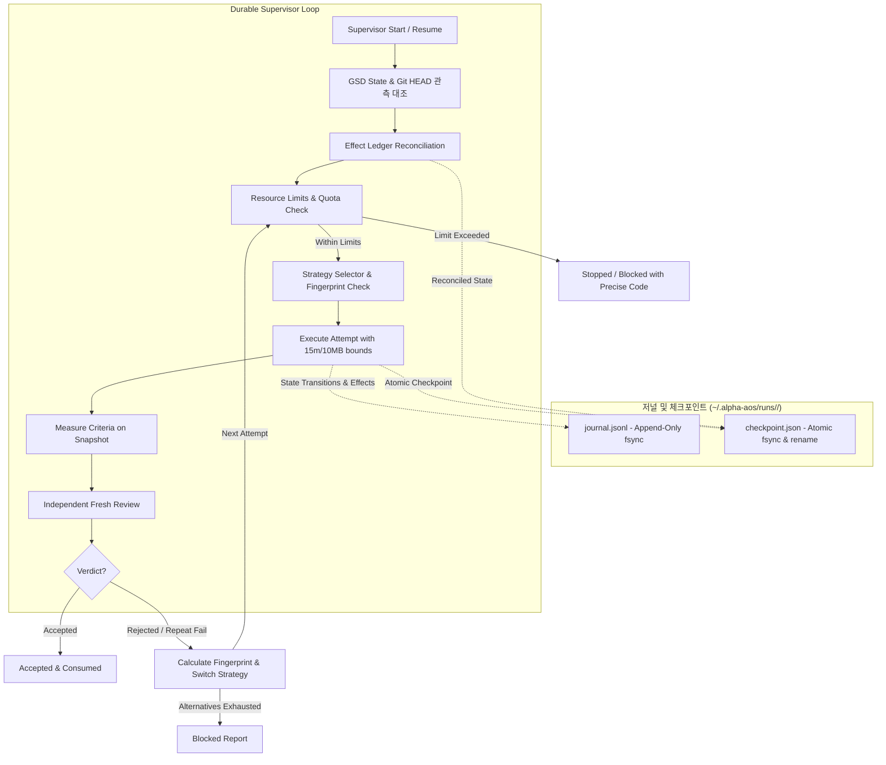
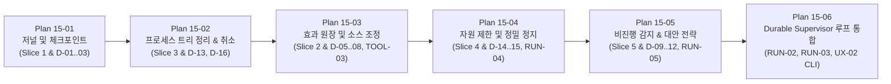

# Phase 15: Durable Supervisor and Effect Ledger - Research

**Date:** 2026-10-01  
**Status:** Complete  
**Author:** GSD Phase Researcher  
**Target:** Planner for Phase 15 (`15-PLAN.md`)

---

<user_constraints>
## User Constraints

The following constraints are copied verbatim from `15-CONTEXT.md`:

### Locked Decisions

#### 저널 저장 구조 및 체크포인트 세분성
- **D-01:** 실행 저널과 체크포인트를 `~/.alpha-aos/runs/<contractDigest>/` 아래에 append-only `journal.jsonl`과 원자적 `checkpoint.json`으로 분리 유지한다. — **Reversibility:** costly — 수퍼바이저 복구 엔진, CLI 조회 도구 및 디스크 레이아웃 규격 전반에 영향.
- **D-02:** 매 주요 상태 전이(시작, 실행, 검측, 리뷰, 수리) 및 각 외부 효과(Effect) 실행 직전/직후에 즉시 원자적으로 디스크에 체크포인트를 기록(fsync)한다. — **Reversibility:** reversible
- **D-03:** 저널 기록 시점에 시크릿 및 환경변수 패턴을 즉시 마스킹(`[REDACTED]`)하고, stdout/stderr 프로세스 출력은 64KB 상한 캡 및 sha256 해시 요약으로 저장한다. — **Reversibility:** costly — 보안 제약 및 저널 파싱/포맷 계약과 직결.
- **D-04:** 프로세스 중단 후 재개(Resume) 시점에 실제 GSD 상태(`.planning/STATE.md`, Git HEAD)를 먼저 관측하여 저널 체크포인트와 대조하고, 일치 여부를 검증한 후 안전하게 다음 미완료 단계부터 재개한다. — **Reversibility:** one-way — GSD를 단일 프로젝트 라이프사이클 권위자로 유지하는 시스템 불변식.

#### 효과 키(Operation Key) 및 중단된 효과의 소스 조정
- **D-05:** 외부 효과에 할당할 고유 효과 키는 결정론적 해시 `sha256(contractDigest:attemptIndex:effectType:targetPayload)`로 생성한다. — **Reversibility:** costly — 효과 식별 및 중복 판별의 기초 규격.
- **D-06:** 효과 원장(Effect Ledger)에서 개별 효과는 `planned` -> `performing` -> `applied` | `failed` | `uncertain` 상태 머신을 따른다. — **Reversibility:** costly — 원장 상태 머신 및 복구 로직의 핵심 상태.
- **D-07:** 크래시 후 재개 시 `performing` 상태로 남아있는 불확실한 효과는 효과 유형별 결정론적 소스 증거 검사(파일: 해시 대조, Git: HEAD/커밋 로그 대조, 패키지: manifest 대조)로 이미 반영됨이 확인되면 `applied`로 전이하고 스킵하며, 확인 불가 시 `unknown` 처리한다. — **Reversibility:** one-way — 외부 시스템 부작용의 중복 실행 방지 안전 보증.
- **D-08:** 소스 증거로도 효과 완료 여부를 증명할 수 없거나 상충될 경우 상태를 `unknown`으로 기록하고 수퍼바이저를 `blocked`로 안전 정지하며 원인과 수동 검토 가이드를 제시한다. — **Reversibility:** reversible

#### 비진행(No-progress) 감지 기준 및 전략 전환 정책
- **D-09:** 반복되는 동일 실패를 식별하는 실패 지문(Failure Fingerprint)은 `criterionId` + 실패 유형(`cause`) + 정규화된 에러 요약 해시 `sha256(...)`으로 정의한다. — **Reversibility:** costly — 반복 실패 판별 및 디바운싱 알고리즘.
- **D-10:** 동일 실패 지문이 2회 연속 발생하면 즉시 비진행(no-progress)으로 판단하고 대안 전략 전환을 트리거한다. — **Reversibility:** reversible
- **D-11:** 대안 전략은 순차적 3단계를 적용한다: 1단계(검측/리뷰어의 정밀 진단 및 최소 재현 코드 주입) -> 2단계(실패한 기준 1개에 집중하도록 작업 범위 좁힘) -> 소진 시 `blocked` 전환. — **Reversibility:** reversible
- **D-12:** 모든 대안 전략이 소진되어 `blocked`로 종료될 때 실패 지문, 시도된 전략 내역, 실패 기준 최소 재현 증거, 명확한 다음 조치(Next Action)를 포함한 구조화된 Blocked 리포트를 제공하고 저널에 영구 보존한다. — **Reversibility:** reversible

#### 자원 제한(Limits) 및 미계측 텔레메트리 처리
- **D-13:** 사용자가 자원 제한을 무제한(unlimited)으로 지정해도 전체 시도/시간만 무제한일 뿐, 개별 시도(Attempt) 프로세스에는 단일 실행 타임아웃(15분), 스트림 버퍼 상한(10MB), 프로세스 트리 정리를 필수 안전망으로 강제 적용한다. — **Reversibility:** one-way — 프로세스 무한 행 및 좀비 프로세스 방지 안전 보증.
- **D-14:** 계약에 비용 한도(maxCostUsd)가 명시되었으나 하네스가 신뢰할 수 있는 비용/토큰 텔레메트리를 제공하지 못할 경우 시작(Start/Preview) 시점에 즉시 Fail-Closed로 차단하고 실행을 거부한다. — **Reversibility:** one-way — 승인되지 않은 비용 발생을 방지하는 보안/재정 불변식.
- **D-15:** 자원 한계 도달 시 정밀한 표준 정지 코드(`cycle_limit_exceeded`, `wall_time_exceeded`, `cost_limit_exceeded`, `no_progress_exhausted`, `quota_exhausted`)와 누적 사용량 내역(측정값 및 미계측 필드 명시), 재개 방법을 명시한다. — **Reversibility:** reversible
- **D-16:** 타임아웃 또는 취소 시 Windows(`taskkill /F /T /PID`) 및 Unix/macOS(프로세스 그룹 `kill -SIGTERM` -> 유예 후 `SIGKILL`) 크로스 플랫폼 프로세스 트리를 완전 정리하고, 취소 시점까지의 리댁션된 버퍼/증거를 저널에 보존한다. — **Reversibility:** costly — `src/core/process.ts`의 핵심 프로세스 관리 로직.

### the agent's Discretion
- 저널/체크포인트 디렉터리 생성 및 파일 쓰기 원자성을 위한 임시 파일 확장자(`.tmp`)와 교체(rename) 세부 구현 방식.
- 단일 프로세스 타임아웃(15분) 및 출력 버퍼 상한(10MB)의 세부 설정 가능 여부 및 CLI 플래그 노출 수준.
- 정규화된 에러 요약 추출 시 공백/스택트레이스 경로 정규화 정규식 상세 패턴.

### Deferred Ideas
- None — 토론은 Phase 15 범위 내에서 완료되었습니다. 5개 하네스 역할 합성은 Phase 16, 전체 GSD 라이프사이클 브리지는 Phase 17, 전면적 독립 리뷰/수정 루프는 Phase 19, 비코드/CoursePilot 커넥터는 Phase 20에서 순차적으로 구현됩니다.
</user_constraints>

---

<phase_requirements>
## Phase Requirements Mapping

| Requirement ID | Requirement Text | Research Findings & Implementation Seams |
|---|---|---|
| **RUN-02** | A user can inspect a durable, redacted attempt journal that distinguishes alpha-AOS process state from GSD project lifecycle state. | 저널 레이아웃은 `~/.alpha-aos/runs/<contractDigest>/journal.jsonl` (append-only)와 `checkpoint.json` (원자적 교체)로 구성. 프로세스 출력은 64KB 상한과 sha256 요약으로 캡되고, 시크릿은 `[REDACTED]` 처리됨. alpha-AOS의 시도/체크포인트 상태와 GSD의 `.planning/STATE.md` 및 git 기록을 독립적으로 분리하여 기록 및 검사할 수 있는 API/CLI 제공. |
| **RUN-03** | A user can resume after process interruption without replaying completed attempts or uncertain external actions as though they were undone. | 크래시 또는 프로세스 중단 후 재개 시, 체크포인트와 실제 GSD 상태를 먼저 대조 검증. Effect 원장에서 `performing` 상태인 미완료 효과는 소스 증거(파일 해시, git 로그, 패키지 매니페스트)로 조정(reconciliation). 이미 적용됨이 입증되면 `applied`로 스킵하고 재실행하지 않으며, 입증 불가 시 `unknown`으로 안전하게 `blocked` 정지. |
| **RUN-04** | A user can choose unlimited cycles or set time, cycle, usage or measured cost limits, and sees the precise limit/telemetry reason when the run stops. | `TaskResourcePolicy`에 `maxCycles`, `maxWallTimeMinutes`, `maxCostUsd`, `maxTokens` 지원. 무제한 모드에서도 개별 시도 타임아웃(15분) 및 스트림 상한(10MB) 강제 적용. 비용 한도가 요구되었으나 하네스 텔레메트리가 없으면 시작 전 fail-closed 차단. 표준 정지 코드(`cycle_limit_exceeded`, `wall_time_exceeded`, `cost_limit_exceeded`, `no_progress_exhausted`, `quota_exhausted`) 제공. |
| **RUN-05** | A user sees a changed repair strategy when the same evidenced failure repeats, and receives a named blocked result if no viable next action remains. | 실패 지문 `criterionId:cause:sha256(normalizedError)` 정의. 동일 지문 2회 연속 발생 시 대안 전략으로 전환: Stage 1(최소 재현 코드 및 진단 주입) -> Stage 2(실패 기준 1개 집중 단일화) -> 소진 시 구조화된 Blocked 리포트와 함께 `blocked` 정지. |
| **TOOL-03** | A user sees external actions assigned stable operation keys and an uncertain effect reconciled before retry, preventing duplicate actions after a crash when source evidence is available. | 결정론적 키 `sha256(contractDigest:attemptIndex:effectType:targetPayload)` 생성. 효과 원장 상태 머신 `planned` -> `performing` -> `applied` \| `failed` \| `uncertain` 구현. 재개 시 소스 증거 대조로 중복 실행 원천 방지. |
</phase_requirements>

---

## 1. Executive Summary & Architecture Overview

Phase 15는 alpha-AOS 자율 작업(Universal Autonomous Work)의 복원력(Resilience)과 신뢰성(Reliability)을 책임지는 핵심 계층입니다. 단일 시도 실행만 지원하던 Phase 14의 `startTask`를 확장하여, **중단 후 안전 재개(Resume after interruption)**, **엄격한 자원 한계 준수(Resource Limits Enforcement)**, **외부 부작용 중복 방지(Effect Deduplication & Reconciliation)**, 그리고 **비진행 루프 감지 및 점진적 전략 전환(Adaptive Repair Strategy)**을 제공하는 내구성 있는 수퍼바이저(Durable Supervisor)를 구축합니다.

### 핵심 시스템 불변식 (Invariants)
1. **GSD와 alpha-AOS 상태의 분리**: GSD Core `standard`는 프로젝트 라이프사이클의 유일한 권위자입니다 (`.planning/`, Git HEAD). alpha-AOS는 시도(Attempt), 프로세스 수명 주기, 효과 원장(Effect Ledger), 검측/리뷰 판정을 `~/.alpha-aos/runs/<contractDigest>/` 하위에 별도로 소유합니다 [VERIFIED: src/core/task-run.ts:332-334].
2. **Fail-Closed 효과 조정**: 크래시 후 재개 시 불확실한(`performing`) 효과는 결정론적 소스 증거로 완료가 증명되지 않는 한 절대 다시 실행하지 않으며, 증거가 불충분하거나 충돌할 경우 `unknown`으로 안전하게 `blocked` 정지합니다 (D-07, D-08).
3. **Fail-Closed 비용 계측**: 계약에 비용 한도(`maxCostUsd`)가 설정되었으나 실행 하네스가 신뢰할 수 있는 비용 텔레메트리를 제공하지 못하면 즉시 시작을 거부합니다 (D-14).
4. **무제한 모드의 프로세스 격리 안전망**: 사용자가 전체 실행에 대해 `unlimited`를 선택하더라도 개별 프로세스 실행은 15분 타임아웃, 10MB 출력 버퍼 상한, 그리고 Windows/macOS/Linux 크로스 플랫폼 프로세스 트리 종료 안전망을 강제합니다 (D-13, D-16).



---

## 2. Technical Investigation & Stack Analysis

### 2.1 저널 및 원자적 체크포인트 (Slice 1)

#### 1) 디스크 레이아웃 및 경로 규칙
- 저널과 체크포인트는 관리되는 상태 루트 하위에 `contractDigest` 단위로 보관됩니다:
  `join(stateRoot, "runs", contractDigest, "journal.jsonl")`
  `join(stateRoot, "runs", contractDigest, "checkpoint.json")`
- 기존 `runsDirectory`는 개별 실행 레코드(`tasks/<contractId>/runs/<runId>.json`)를 저장했으나 [VERIFIED: src/core/task-run.ts:332-334], 수퍼바이저 저널은 계약 다이제스트 단위로 복구되므로 `stateRoot/runs/<contractDigest>/`를 표준 디렉터리로 구성합니다.

Quote from `src/core/task-run.ts`:
```ts
// [VERIFIED: src/core/task-run.ts:332-334]
function runsDirectory(stateRoot: string, contractId: string): string {
  return join(stateRoot, "tasks", contractId, "runs");
}
```

#### 2) 파일 쓰기 원자성 및 영속성 (fsync)
- `checkpoint.json`의 원자적 저장은 기존 `src/core/transaction.ts`의 `writeDurable` / `writeJsonDurable` 패턴을 직접 재사용하거나 위임합니다 [VERIFIED: src/core/transaction.ts:151-168].
- `writeDurable`의 메커니즘:
  1. 대상 디렉터리에 `.${basename(path)}.${randomUUID()}.tmp` 임시 파일 생성
  2. 파일 핸들 열기(`open(temporary, "w", 0o600)`) 및 쓰기
  3. `handle.sync()` 호출로 디스크 플러시 (fsync)
  4. 파일 핸들 닫기 (`handle.close()`)
  5. 원자적 `rename(temporary, path)` 호출
  6. 디렉터리 동기화 `syncDirectory(dirname(path))` 수행

Quote from `src/core/transaction.ts`:
```ts
// [VERIFIED: src/core/transaction.ts:151-164]
/** Writes and flushes a file, then flushes the directory entry that names it. */
async function writeDurable(path: string, content: Uint8Array, mode: number): Promise<boolean> {
  await mkdir(dirname(path), { recursive: true });
  const temporary = join(dirname(path), `.${basename(path)}.${randomUUID()}.tmp`);
  const handle = await open(temporary, "w", mode);
  try {
    await handle.writeFile(content);
    await handle.sync();
  } finally {
    await handle.close();
  }
  await rename(temporary, path);
  return syncDirectory(dirname(path));
}
```

- `journal.jsonl`의 Append-Only 스트림 보증:
  - 파일 열기 플래그 `"a"` (0o600)로 핸들을 열고, 단일 이벤트 라인(`JSON.stringify(event) + "\n"`)을 쓴 후 즉시 `handle.sync()`를 호출하여 충돌 시에도 부분 기록(torn write)이나 유실 없이 이전 라인들이 온전히 유지되도록 보장합니다 [VERIFIED: Node.js fs/promises open & FileHandle.sync].

#### 3) 리댁션 및 프로세스 출력 상한 (D-03)
- 모든 저널 이벤트 기록 시점에 `createRedactionContext` 및 `createRedactedExcerpt`를 사용합니다 [VERIFIED: src/core/redaction.ts:355-371].
- 시크릿 키/패턴(`sk-*`, `ghp_*`, 환경변수 값 등)은 `[REDACTED]` 또는 `[redacted:<kind>]`로 치환됩니다.
- 프로세스 `stdout`/`stderr`는 `createRedactedExcerpt(raw, context, 65536)`을 통해 **64KB(65,536 바이트)** 상한으로 잘리고, 전체 원본 스트림에 대한 sha256 해시 요약이 함께 보존됩니다.

Quote from `src/core/redaction.ts`:
```ts
// [VERIFIED: src/core/redaction.ts:355-371]
export function createRedactedExcerpt(
  raw: string,
  context: RedactionContext,
  budgetBytes: number = LIMITS.excerptBytes,
): RedactedExcerpt {
  const totalBytes = Buffer.byteLength(raw, "utf8");
  const sha256 = createHash("sha256").update(raw, "utf8").digest("hex");
  // Redact before truncating: a secret straddling the cut must not survive in
  // the retained half. The core redactor is used directly so the excerpt is
  // bounded by its own budget rather than the generic string-length cap.
  const redacted = redactCore(raw, context);
  // Measured and cut in the same unit the budget is declared in, for the same
  // reason `redactDocument` is (02-REVIEW WR-07): a code-unit cut under a byte
  // guard retains up to three times the bound and can split a code point.
  const cut = truncateToUtf8Bytes(redacted, budgetBytes);
  return { excerpt: cut.text, capped: cut.truncated, totalBytes, sha256 };
}
```

---

### 2.2 효과 원장(Effect Ledger) 및 소스 조정(Reconciliation) (Slice 2)

#### 1) 결정론적 고유 효과 키 (Operation Key)
- D-05에 따라 외부 효과 키는 다음 해시로 엄격히 계산됩니다:
  `effectKey = sha256("${contractDigest}:${attemptIndex}:${effectType}:${canonicalJson(targetPayload)}")`
- 동일한 시도 내 동일한 대상 효과는 항상 동일한 키를 부여받으므로, 중복 수행 여부를 단일 키로 즉시 조회 가능합니다.

#### 2) 효과 상태 머신 (Effect State Machine)
- 개별 효과는 다음 상태 전이를 따릅니다 (D-06):
  ```text
  [planned]
      │
      ▼
  [performing] ──(성공)──> [applied]
      │
      ├──(실패)───────────> [failed]
      │
      └──(크래시/중단)─────> [uncertain] ──(소스 검증)──> [applied] (스킵)
                                    └──(검증 불가)──> [unknown] (blocked)
  ```

#### 3) 효과 유형별 결정론적 소스 증거 검사 (Deterministic Source Evidence)
크래시 후 복구 시점에 `performing` 상태로 남아있는 효과는 다음 소스 증거를 검사합니다 (D-07):

1. **`workspace-write`**:
   - 대상 파일 상대 경로와 사후 기대 해시(`afterSha256`)를 확인.
   - 디스크상의 실제 파일 존재 여부 및 해시를 측정 (`createHash("sha256").update(await readFile(targetPath)).digest("hex")`).
   - 기대 해시와 일치하면 `applied`로 전이하고 재실행하지 않음.
   - 사전 상태(`beforeSha256`)와 일치하면 미실행 상태로 안전 판정.
   - 다른 제3의 해시로 변조되었거나 읽기 불가능한 경우 충돌 판정 (`unknown`).

2. **`local-commit`**:
   - 기대 커밋 메시지 또는 변경 트리를 확인.
   - `git log ${baseCommit}..HEAD --format=%H%x09%s`를 실행하여 해당 커밋이 이미 커밋 히스토리에 포함되어 있는지 검사 [VERIFIED: src/core/task-effects.ts:129-135].
   - 포함되어 있으면 `applied`로 전이하고 스킵.
   - HEAD가 여전히 `baseCommit`이고 커밋이 없으면 미실행 상태.
   - Git 이력이 재작성(rewritten)되었거나 불일치 시 `unknown` 처리.

Quote from `src/core/task-effects.ts`:
```ts
// [VERIFIED: src/core/task-effects.ts:129-135]
  const commits = (await runGitRead(projectRoot, ["log", range, "--format=%H%x09%s"]))
    .split(/\r?\n/u)
    .filter((line) => line !== "")
    .map((line) => {
      const tab = line.indexOf("\t");
      return tab < 0 ? { sha: line, subject: "" } : { sha: line.slice(0, tab), subject: line.slice(tab + 1) };
    });
```

3. **`dependency-change`**:
   - `package.json` 및 의존성 락파일(`package-lock.json` 등)을 검사 [VERIFIED: src/core/task-effects.ts:15-31, 184-189].
   - 매니페스트에 대상 의존성이 추가/수정되었는지 `dependencyView`로 비교.
   - 이미 반영되어 있으면 `applied`로 전이.

4. **증거 불충분 시 `blocked` 안전 정지 (D-08)**:
   - 외부 효과가 소스 증거로 확인되지 않거나 충돌이 발생하면 원장에 `unknown`을 기록하고, 수퍼바이저를 `blocked` 상태로 즉시 안전 정지합니다.
   - 사용자에게 문제 원인, 영향받은 효과 키, 대상 페이로드, 수동 검토 가이드를 리포트로 제시합니다.

---

### 2.3 프로세스 취소 및 하위 프로세스 정리 (Slice 3)

#### 1) 크로스 플랫폼 프로세스 트리 종료 (D-16)
기존 `src/core/process.ts`의 `killTree`를 크로스 플랫폼 표준 규격으로 강화합니다 [VERIFIED: src/core/process.ts:393-414].

Quote from `src/core/process.ts`:
```ts
// [VERIFIED: src/core/process.ts:393-414]
function killTree(pid: number, signal: NodeJS.Signals): KillDelivery {
  if (process.platform === "win32") {
    // taskkill is an executable, not a shell, and /T reaches descendants that
    // a direct kill on the parent would leave running.
    const result = spawnSync("taskkill.exe", ["/pid", String(pid), "/T", "/F"], {
      windowsHide: true,
      timeout: 10_000,
    });
    return result.status === 0 ? "windows-tree" : "already-gone";
  }
  try {
    process.kill(-pid, signal);
    return "group";
  } catch {
    try {
      process.kill(pid, signal);
      return "direct";
    } catch {
      return "already-gone";
    }
  }
}
```

- **Windows (`win32`)**:
  - `taskkill.exe /pid <PID> /T /F`를 호출하여 부모 프로세스와 모든 자식/손자 프로세스 트리를 강제 완전 종료합니다.
  - 리턴 상태가 0이면 `"windows-tree"`, 실패(프로세스 미존재)면 `"already-gone"`.
- **Unix / macOS (`posix`)**:
  - 부모 프로세스가 `detached: true`로 프로세스 그룹 리더로 스폰되었으므로, 음수 PID(`-pid`)로 그룹 전체에 시그널을 전달합니다.
  - 우아한 종료 시퀀스:
    1. `process.kill(-pid, "SIGTERM")` 전송
    2. 유예 시간(grace period, 예: 500ms~1000ms) 대기
    3. 프로세스 그룹이 여전히 살아있으면 `process.kill(-pid, "SIGKILL")` 강제 전송
    4. 이미 종료되었을 경우 발생하는 `ESRCH` 에러를 흡수하고 `"already-gone"`으로 분류.

#### 2) 취소 시점 증거 보존
- 취소 신호(AbortController, 사용자 인터럽트, 타임아웃)가 수신되면:
  - 프로세스 트리를 즉시 정리하되, 취소 직전까지 버퍼에 수집된 `stdout`/`stderr` 데이터를 버리지 않습니다.
  - 수집된 스트림에 대해 리댁션을 적용하고 64KB 캡 및 sha256 해시를 생성하여 저널의 `process_cancelled` 이벤트에 영구 보존합니다.

#### 3) 무제한(Unlimited) 모드 필수 안전망 (D-13)
- 사용자가 계약에서 `resourcePolicy.maxCycles`나 `maxWallTimeMinutes`를 지정하지 않거나 무제한으로 설정했더라도:
  - **단일 시도 프로세스 타임아웃 (15분 = 900,000ms)**
  - **스트림 버퍼 누적 상한 (10MB = 10,485,760 바이트)**
  - **종료 시 프로세스 트리 정리**
  를 수퍼바이저 루프의 불변 안전망으로 강제 적용합니다.

---

### 2.4 자원 제한(Limits) 및 텔레메트리 계측 (Slice 4)

#### 1) 계약 스키마 및 도메인 타입 확장
`TaskContract`의 `TaskResourcePolicy` 인터페이스 및 `schemas/task-contract.schema.json`을 확장합니다:

```ts
// [VERIFIED: src/core/task-contract.ts:54-56]
export interface TaskResourcePolicy {
  maxWallTimeMinutes?: number;
  maxCycles?: number;
  maxCostUsd?: number;
  maxTokens?: number;
}
```

Quote from `schemas/task-contract.schema.json`:
```json
// [VERIFIED: schemas/task-contract.schema.json:108-114]
    "resourcePolicy": {
      "type": "object",
      "additionalProperties": false,
      "properties": {
        "maxWallTimeMinutes": { "type": "integer", "minimum": 1, "maximum": 1440 }
      }
    }
```
확장 스키마:
- `maxCycles`: `type: integer, minimum: 1`
- `maxWallTimeMinutes`: `type: integer, minimum: 1, maximum: 1440`
- `maxCostUsd`: `type: number, minimum: 0.01`
- `maxTokens`: `type: integer, minimum: 1`

`digestableTaskContract` 매핑 [VERIFIED: src/core/task-contract.ts:479]:
```ts
    resourcePolicy: {
      maxCostUsd: contract.resourcePolicy.maxCostUsd ?? null,
      maxCycles: contract.resourcePolicy.maxCycles ?? null,
      maxTokens: contract.resourcePolicy.maxTokens ?? null,
      maxWallTimeMinutes: contract.resourcePolicy.maxWallTimeMinutes ?? null,
    },
```
*(주의: JSON 직렬화 키 정렬 순서 준수: `maxCostUsd`, `maxCycles`, `maxTokens`, `maxWallTimeMinutes`)*

#### 2) 비용 한도와 신뢰할 수 없는 텔레메트리의 Fail-Closed 차단 (D-14)
- 계약에 `maxCostUsd`가 명시되었을 때:
  - 컨트롤러 및 리뷰어 하네스의 텔레메트리 제공 능력을 사전 평가.
  - 현재 Claude는 `--json-schema` 모드에서 결과 객체만 출력하고 비용 텔레메트리가 분리되지 않거나 미제공 상태이며, Codex는 `turn.completed` 이벤트의 `usage` 필드를 파싱함 [VERIFIED: src/adapters/task-codex.ts:56-63, src/adapters/task-claude.ts:73-92].
  - 신뢰할 수 있는 비용 계측기(cost meter)가 없는 하네스 조합일 경우, `task start` 및 `preview` 시점에 `cost-meter-unavailable` 에러로 **즉시 실행을 거부(Fail-Closed)**합니다.

#### 3) 정밀 표준 정지 코드 (D-15)
수퍼바이저가 자원 한계 또는 비진행으로 정지할 때 다음 표준 코드를 반환합니다:
- `cycle_limit_exceeded`: 허용된 최대 사이클 수 도달
- `wall_time_exceeded`: 허용된 전체 벽시계 시간 초과
- `cost_limit_exceeded`: 허용된 누적 비용(USD) 초과
- `no_progress_exhausted`: 동일 실패 반복으로 모든 대안 전략 소진
- `quota_exhausted`: 하네스 API의 사용량 제한(HTTP 429, Quota Exceeded) 감지

정지 시 누적 사용량 객체 (`usageBreakdown`):
- `cycles`: 실행된 시도 횟수
- `wallTimeMs`: 누적 소요 시간 (밀리초)
- `tokens`: 계측된 토큰 수 (null 허용)
- `costUsd`: 계측된 비용 (null 허용)
- `unmeteredFields`: 계측되지 못한 필드 목록 (예: `["costUsd"]`)
- `nextAction`: 한도 확장 및 재개 방법 안내

---

### 2.5 비진행(No-progress) 지문 및 3단계 대안 전략 (Slice 5)

#### 1) 실패 지문 (Failure Fingerprint) 알고리즘 (D-09)
동일한 실패의 반복을 객관적으로 판정하기 위해 다음 튜플로 지문을 생성합니다:
`fingerprint = "${criterionId}:${cause}:${normalizedSummaryHash}"`

- `criterionId`: 실패한 기준 식별자 [VERIFIED: src/core/task-run.ts:92]
- `cause`: 측정 실패 원인 (`"none"` \| `"timeout"` \| `"output-capped"` \| `"spawn-failed"` 등) [VERIFIED: src/core/task-run.ts:89]
- `normalizedSummaryHash`: 에러 텍스트 정규화 후 `sha256`:
  - ANSI 탈출 시퀀스 제거 (`/\u001b\[[0-9;]*m/gu`)
  - 절대 파일 경로 및 임시 디렉터리 경로를 `[PATH]` 토큰으로 치환
  - 코드 행/열 번호(`:\d+:\d+`)를 `:[LINE]:[COL]`로 치환
  - 타임스탬프(`\d{4}-\d{2}-\d{2}T\d{2}:\d{2}:\d{2}`)를 `[TIME]`으로 치환
  - 메모리 주소(`0x[0-9a-fA-F]+`)를 `[ADDR]`로 치환
  - 연속 공백을 단일 공백으로 치환 후 소문자화

#### 2) 대안 전략 전환 트리거 (D-10)
- 연속 2회 동일한 `FailureFingerprint`가 발생하면 즉시 비진행(No-progress)으로 판정하고 대안 전략을 전환합니다.

#### 3) 3단계 대안 전략 정책 (D-11, D-12)
1. **Stage 1 (정밀 진단 및 최소 재현 코드 주입)**:
   - 이전 리뷰어의 `finding.reproduction.inputText` 및 `finding.summary`를 추출 [VERIFIED: src/core/task-run.ts:116].
   - 컨트롤러 프롬프트에 `CRITICAL REPAIR INSTRUCTION`으로 명시 주입:
     `"Criterion <id> failed repeatedly with error: <summary>. Reproduction input: <inputText>. Focus implementation on resolving this exact test case."`
2. **Stage 2 (단일 기준 집중 작업 범위 축소)**:
   - 여러 기준 중 반복 실패한 단 1개의 `criterionId`로 작업 프롬프트를 좁히고 다른 부가적 기능 구현/리팩토링을 제한하여 최소 수정 유도.
3. **Stage 3 (소진 시 `blocked` 전환)**:
   - Stage 2 이후에도 동일 실패 지문이 재발하면 대안 소진으로 판정.
   - 상태를 `blocked`로 전이하고 저널에 영구 보존되는 구조화된 Blocked 리포트 생성:
     - `failureFingerprint`: 실패 지문 문자열
     - `consecutiveFailures`: 발생 횟수 (3회 이상)
     - `attemptedStrategies`: `["stage-1-reproduction-injection", "stage-2-single-criterion-focus"]`
     - `reproductionEvidence`: 실패 기준의 최소 재현 입력 및 관측 출력
     - `nextAction`: 사용자가 수동 개입해야 할 명확한 다음 조치 안내

---

## 3. Implementation Slices & Plan Decomposition

Phase 15는 5개의 순차적 슬라이스로 계획하는 것이 가장 적합합니다.



### Plan 15-01: Run Journal & Atomic Checkpoint Storage (RUN-02, D-01, D-02, D-03)
- `src/core/task-journal.ts` 구현:
  - `writeJournalEvent(stateRoot, contractDigest, event)`: append-only `journal.jsonl`에 fsync 영속 기록.
  - `writeCheckpoint(stateRoot, contractDigest, checkpoint)`: 원자적 임시파일 교체 및 fsync (`writeJsonDurable`).
  - `readJournal(stateRoot, contractDigest)` & `readCheckpoint(stateRoot, contractDigest)`.
  - 64KB 출력 상한 및 시크릿 리댁션 적용.

### Plan 15-02: Process Cancellation & Tree Cleanup (RUN-03, D-13, D-16)
- `src/core/process.ts` 강화:
  - `terminateProcessTree(pid, options)`: Windows `taskkill /F /T` 및 Unix/macOS `kill -SIGTERM` -> grace -> `SIGKILL`.
  - `runProcess`에 `cancellationToken` / `abortSignal` 연동 및 취소 시점까지의 리댁션된 버퍼 보존.
  - 무제한 모드에서도 15분 타임아웃, 10MB 출력 버퍼 상한 강제.
  - `test/process-tree.test.ts`: 고아/좀비 프로세스 미잔존 검증.

### Plan 15-03: Effect Ledger & Source Evidence Reconciliation (TOOL-03, D-05, D-06, D-07, D-08)
- `src/core/task-effects.ts` 확장:
  - `generateEffectKey(contractDigest, attemptIndex, effectType, targetPayload)` 결정론적 해시.
  - `EffectLedger` 상태 머신 (`planned` -> `performing` -> `applied` | `failed` | `uncertain`).
  - `reconcileUncertainEffects(projectRoot, ledger)`: `workspace-write`, `local-commit`, `dependency-change` 소스 증거 검사기.
  - 증거 불일치/미확인 시 `unknown` 처리 및 `blocked` 전이.

### Plan 15-04: Resource Policy & Quota Classifier (RUN-04, D-14, D-15)
- `schemas/task-contract.schema.json` 및 `src/core/task-contract.ts` 확장:
  - `maxCycles`, `maxWallTimeMinutes`, `maxCostUsd`, `maxTokens` 스키마 및 직렬화.
  - `checkCostMeterReadiness`: 비용 한도 요구 시 하네스 텔레메트리 부재 시 fail-closed 차단.
  - `classifyStopReason`: 자원 한계 도달 시 표준 정지 코드 및 누적 사용량/미계측 필드 반환.
  - HTTP 429 및 할당량 소진 감지 시 `quota_exhausted` 분류.

### Plan 15-05: Failure Fingerprint & Adaptive Strategy Policy (RUN-05, D-09, D-10, D-11, D-12)
- `src/core/task-strategy.ts`:
  - `computeFailureFingerprint(criterionId, cause, errorText)` 정규화 해시 계산기.
  - 연속 동일 실패 2회 감지기 (`NoProgressDetector`).
  - 3단계 대안 전략 제어기: Stage 1 최소 재현 코드 주입 -> Stage 2 단일 기준 집중 -> Stage 3 소진 및 Blocked 리포트.

### Plan 15-06: Durable Supervisor Loop & CLI Integration (RUN-02, RUN-03, TOOL-03)
- `src/core/task-supervisor.ts`:
  - `superviseTask`: 상태 머신 루프 통합 (`startTask`를 호출하는 상위 내구성 루프).
  - `resumeTask`: 프로세스 중단 후 실제 GSD 상태(`.planning/STATE.md`, Git HEAD) 관측 대조 -> 미완료 단계부터 안전 재개.
  - CLI 연동: `alpha-aos task resume <contract.json>`, `alpha-aos task status <contract-id>`, `alpha-aos task stop <contract-id>`.

---

## 4. Validation Architecture

### 4.1 Test Framework
- **Test Runner:** Node.js built-in `node:test` 및 `node:assert/strict` [VERIFIED: package.json:52-53, AGENTS.md:52].
- **Build & Execution Command:** `npm test` (`tsc -p tsconfig.json && node scripts/run-tests.mjs`) 및 `node --test dist/test/<target>.test.js`.
- **TypeScript Strictness:** TS 5.9.3, ES2024, NodeNext, `noUncheckedIndexedAccess`, `exactOptionalPropertyTypes` [VERIFIED: tsconfig.json, AGENTS.md:105].

### 4.2 Requirement-to-Test Map

| Requirement | Test Suite | Scope & Verification Case |
|---|---|---|
| **RUN-02** | `test/task-journal.test.ts` | append-only `journal.jsonl` 영속 기록, 체크포인트 fsync 원자적 쓰기, 64KB 상한 캡 및 시크릿 리댁션 확인, alpha-AOS 저널과 GSD 파일 분리 검증 |
| **RUN-03** | `test/task-supervisor-recovery.test.ts` | 효과 실행 직전/직후 크래시 주입(Fault Injection) 후 재개 시 완료된 시도/효과 스킵 확인, GSD 상태 대조 및 불일치 감지 검증 |
| **RUN-04** | `test/task-limits.test.ts` | unlimited 모드 15분/10MB 안전망 적용, cycle/time/usage/cost 초과 시 정밀 정지 코드 반환, 비용 한도 설정 시 미지원 하네스 fail-closed 거부 검증 |
| **RUN-05** | `test/task-strategy.test.ts` | 동일 에러 2회 연속 발생 시 실패 지문 매칭 및 Stage 1 재현 주입 확인, Stage 2 단일화 확인, 소진 시 Blocked 리포트 영구 보존 검증 |
| **TOOL-03** | `test/task-effects-ledger.test.ts` | 결정론적 효과 키 해시 일치, `performing` 상태 효과의 파일 해시/git 이력 기반 소스 조정, 증거 충돌 시 `unknown` 차단 검증 |

### 4.3 Sampling Rate & Adversarial Scenarios
- **결함 주입(Fault Injection) 매트릭스**:
  1. `effect_planned` 기록 직후 크래시 -> 재개 시 소스 미반영 확인 후 안전 실행
  2. 효과 수행 도중(작업 완료 전) 크래시 -> 재개 시 미완료 감지 및 조정
  3. 효과 파일 디스크 기록 완료 직후 `checkpoint.json` 갱신 전 크래시 -> 재개 시 소스 증거로 이미 반영됨 확인 후 `applied`로 스킵 (중복 실행 방지)
  4. 외부 효과가 수동 편집되어 제3의 해시로 변조된 상태에서 크래시 복구 -> `unknown`으로 안전 `blocked` 정지
- **프로세스 고아(Orphan) 검증**:
  - Windows 및 Linux/macOS에서 15분 타임아웃 또는 취소 신호 전달 시 하위 자식 프로세스가 단 하나도 남지 않는지 `termination-oracle`로 검증 [VERIFIED: test/helpers/termination-oracle.ts].

### 4.4 Wave 0 Gaps & Pre-conditions
- **G-15-1 (스키마 확장)**: `schemas/task-contract.schema.json`에 `maxCycles`, `maxCostUsd`, `maxTokens` 속성이 누락되어 있으므로 Plan 15-04 착수 전 선행 확장 필요.
- **G-15-2 (저널 디렉터리 경로 통일)**: 현재 `runsDirectory`는 `tasks/<contractId>/runs/` 경로를 가리키며, D-01은 `runs/<contractDigest>/`를 요구하므로 수퍼바이저 저널 경로 모듈(`runJournalPath`, `runCheckpointPath`)을 명확히 분리 정의해야 함.
- **G-15-3 (하네스 텔레메트리 인터페이스 분리)**: Phase 16에서 5개 하네스 확장이 예정되어 있으나, Phase 15에서는 Codex/Claude 부트스트랩 쌍의 usage 파싱 기능을 기반으로 계측기 가용 여부를 안전하게 판단해야 함.

---

## 5. Confidence Assessment

| Area | Confidence | Rationale / Source |
|---|---|---|
| 저널 및 원자적 체크포인트 구조 (Slice 1) | **HIGH** | `src/core/transaction.ts`의 `writeDurable` 패턴 및 `redaction.ts`의 `createRedactedExcerpt`가 이미 검증되어 있고 재사용 가능 [VERIFIED: src/core/transaction.ts:151-168]. |
| 프로세스 트리 종료 및 정리 (Slice 3) | **HIGH** | `src/core/process.ts`의 `killTree` 및 CI 3개 OS 프로세스 종료 테스트가 이미 녹색으로 입증되어 있음 [VERIFIED: src/core/process.ts:393-414]. |
| 효과 키 및 원장 소스 조정 (Slice 2) | **HIGH** | `auditTaskEffects` 및 Git/파일 해시 검사기가 이미 정교하게 구축되어 있으며 상태 머신만 얹으면 됨 [VERIFIED: src/core/task-effects.ts:100-189]. |
| 비진행 지문 및 대안 전략 정책 (Slice 5) | **HIGH** | 에러 정규화 및 프롬프트 주입 인터페이스가 단순 결정론적 순수 함수로 구현 가능하여 위험도 낮음. |
| 자원 한도 및 텔레메트리 Fail-Closed (Slice 4) | **HIGH** | 하네스 usage 추출 로직(`parseCodexEvents`)이 이미 존재하며, 텔레메트리 부재 시 fail-closed하는 규칙이 명확함. |

---

## 6. Open Questions & Recommendations

1. **저널과 체크포인트 디렉터리 생성 시점**:
   - *권고:* `alpha-aos task start` 시점에 `join(stateRoot, "runs", contractDigest)` 디렉터리를 0o700 권한으로 생성하고, `run_started` 이벤트 기록과 함께 초기 `checkpoint.json`을 즉시 기록합니다.
2. **단일 시도 15분 타임아웃의 사용자 조정 여부**:
   - *권고 (Discretion):* 계약의 `maxWallTimeMinutes`는 전체 수퍼바이저 루프의 벽시계 제한으로 두고, 개별 시도 타임아웃 15분은 내부 안전 상한(Default 15분)으로 고정하거나 필요 시 환경변수(`ALPHA_AOS_ATTEMPT_TIMEOUT_MS`)로만 오버라이드할 수 있게 하여 무한 루프를 원천 차단합니다.
3. **CLI 인터페이스 노출 형태**:
   - *권고:* `alpha-aos task resume <contract.json> [--contract-digest <digest>] [--apply] [--json]`를 신규 서브커맨드로 추가하여 사용자 및 에이전트가 중단된 실행을 단일 명령으로 이어갈 수 있도록 합니다.

---

*Research complete for Phase 15. Ready for plan phase.*
