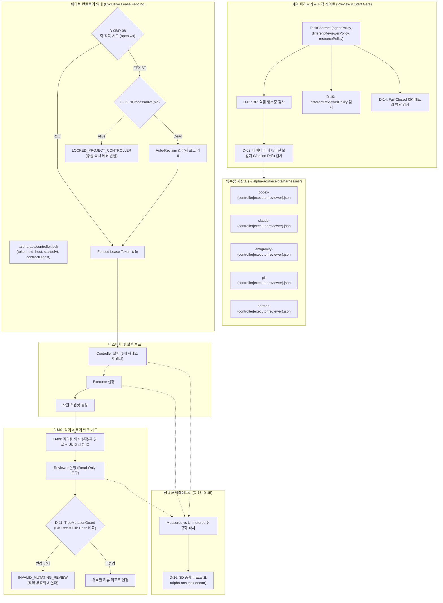

# Phase 16: Composable Harness Roles - Research

## <user_constraints>
본 연구 문서는 [16-CONTEXT.md](file:///D:/dev/alpha-AOS/.planning/phases/16-composable-harness-roles/16-CONTEXT.md)의 사용자 결정사항(D-01 ~ D-16)과 제약 조건을 100% 준수하여 작성되었습니다.

### Phase Boundary
Claude Code, Codex, Antigravity, Pi, Hermes의 5개 하네스가 검증된 네이티브 어댑터를 통해 컨트롤러(Controller), 실행자(Executor), 리뷰어(Reviewer) 역할을 수행할 수 있도록 합성 가능한 역할 시스템(5×5×5 = 125개 역할 조합)을 구현한다. 동일 프로젝트의 GSD 상태를 변경할 수 있는 컨트롤러는 오직 하나뿐이어야 하며, 프로젝트 로컬 배타적 임대(fenced lease with token)로 동시 실행 충돌을 차단한다. D-10의 기존 이름 기반 Hermes 컨트롤러 차단을 실측 영수증 및 펜싱 락 기반 검증으로 마이그레이션한다. 동일 하네스 리뷰어는 격리된 임시 런타임 환경과 고유 세션 ID, 읽기 전용 불변식(트리 변조 방지)을 보장하며, 명시적 `differentReviewerPolicy`를 적용한다. 텔레메트리 출력은 실측 필드와 unknown을 엄격히 구분하고, 특정 브랜드의 무료 가정을 배제하며, 비용 한도 설정 시 미계측 하네스에 대해 사전 Fail-closed 처리한다. 전체 GSD 라이프사이클 라우팅은 Phase 17, 전면적 기능 패브릭 연동은 Phase 18의 범위다.

### Locked Implementation Decisions
- **D-01 (역할 조합 및 증명 정책):** 계약 미리보기(Preview) 시점에 3개 역할(컨트롤러, 실행자, 리뷰어)의 네이티브 어댑터 검증 영수증을 엄격히 검사하며, 미설치 또는 영수증 누락 시 누락된 증거 항목(예: `pi: no native invocation receipt for controller`)을 구체적으로 명시하고 시작을 Fail-Closed로 차단한다.
- **D-02 (버전 드리프트 감지):** 하네스 CLI 바이너리가 업데이트되어 이전 검증 영수증의 버전/바이너리 해시와 불일치(Version Drift)가 감지되면, 해당 하네스의 역할을 즉시 `unverified`로 강등하고 명시적 재프로브 명령을 안내한다.
- **D-03 (125개 역할 매트릭스 결정론적 픽스처):** 125개(5×5×5) 역할 조합 합성 테스트를 위한 결정론적 Capability Matrix Fixture를 구축한다. 테스트 스위트에서는 모의 프로브(Mock Capability)를 통해 125개 전체 트리플의 합성 검증 로직(증거 충분 시 수락, 결손 시 원인 명시)을 완전 검증하고, 실제 호스트 런타임에서는 로컬에 존재하는 하네스의 실측 영수증으로만 활성화한다.
- **D-04 (영수증 저장소 규격):** 하네스/역할별 실측 영수증(Invocation Receipt)은 개별 JSON 파일 `~/.alpha-aos/receipts/harnesses/<harness>-<role>.json`에 저장한다. 스키마에는 CLI 버전, 바이너리 해시, 실행/결과해석/취소 검증 플래그, 프로브 시각, 샘플 실행 다이제스트를 보관하여 독립적이고 원자적인 갱신을 지원한다.
- **D-05 (배타적 컨트롤러 임대 및 충돌 차단):** 동일한 프로젝트에 대해 두 번째 컨트롤러가 진입하려 할 때 대기나 이전 작업 복원 없이 즉시 Fail-Fast 코드화된 충돌 오류(`LOCKED_PROJECT_CONTROLLER` / `ACTIVE_WRITER`)를 반환하고, 현재 락을 보유한 컨트롤러의 정보(harness, pid, startedAt, contractDigest)를 출력하며 안전 종료한다.
- **D-06 (좀비 락 자동 회수):** 락을 보유한 프로세스가 비정상 종료된 경우(Stale Lock), 락 파일에 기록된 PID의 생존 여부(`isProcessAlive(pid) === false`) 및 호스트명을 확인하여 좀비 락으로 판별되면 감사 로그(Reclaim audit log)를 남기고 안전하게 새 임대를 발급(Auto-Reclaim)한다.
- **D-07 (Hermes 컨트롤러 마이그레이션):** D-10의 기존 'Hermes 컨트롤러 하드코딩 차단' 규칙을 완전히 마이그레이션한다. `assertControllerRole`에서 `hermes` 이름 하드코딩을 제거하고, 하네스 이름과 무관하게 컨트롤러 역할 영수증과 유효한 펜싱 임대 토큰 보유 여부를 검증하도록 리팩토링한다.
- **D-08 (프로젝트 로컬 락 파일):** 프로젝트 컨트롤러 임대 잠금 파일은 프로젝트 로컬 `.alpha-aos/controller.lock`에 생성하고 임대 토큰(lease token)을 바인딩한다. 이를 통해 프로젝트 파일시스템 경계 내에서 동시 쓰기를 원천 차단하고 프로젝트 상태와 함께 추적한다.
- **D-09 (동일 하네스 리뷰어 격리):** 컨트롤러/실행자와 리뷰어가 동일한 하네스(예: Claude-Claude)로 지정된 경우, 컨트롤러와 캐시 및 설정 상태를 공유하지 않도록 격리된 임시 홈/설정 경로를 제공하고, 고유한 `reviewerSessionId`를 발급하여 읽기 전용으로 프로세스를 실행한다.
- **D-10 (리뷰어 다양성 계약 정책):** 사용자가 서로 다른 하네스/모델 리뷰어를 요구할 수 있도록 `differentReviewerPolicy: "require-different-harness" | "require-different-model" | "allow-same"` 계약 정책을 제공하며, 요구된 조건이 충족되지 않으면 preview 단계에서 missing proof로 명확히 시작을 거부한다.
- **D-11 (트리 변조 방지 가드):** 리뷰어의 읽기 전용 불변식을 보장하기 위해 계약 및 증거를 읽기 전용 컨텍스트로 주입하고, 리뷰어 세션 종료 후 프로젝트 트리(Git status 및 해시)가 변경되었는지 검증(Tree Mutation Guard)하여 파일 수정 발생 시 즉시 해당 리뷰 결과를 무효화(`INVALID_MUTATING_REVIEW`)한다.
- **D-12 (최소 권한 환경 및 정상 종료 판정기):** Codex 등 네이티브 어댑터의 조기 비정상 종료(Premature non-zero exit)를 방지하기 위해 5개 하네스 어댑터 각각에 대해 필수 환경변수(`PATH`, `HOME`, 런타임 변수)를 최소 권한으로 정밀하게 허용(Launch Spec 정제)하고, 프로세스 종료 코드와 실제 작업 결과물(산출물 파일/stdout)의 유효성을 결합 검증하는 표준 종료 상태 해석기를 구축한다.
- **D-13 (엄격한 텔레메트리 정규화):** 하네스별 텔레메트리 수집 규격을 엄격히 정규화하여, 하네스 출력에서 직접 파싱된 실측 필드(promptTokens, completionTokens, durationMs, modelId 등)만 `measured`로 기록하고, 미제공 항목은 0으로 왜곡하지 않고 `null`/`unknown`으로 정직하게 보존한다.
- **D-14 (미계측 하네스 Fail-Closed):** 계약에 비용 한도(`maxCostUsd`) 또는 토큰 한도(`maxTokens`)가 설정되어 있으나 선택된 하네스 어댑터가 이를 측정할 역량(`telemetryCapabilities`)이 없는 경우, preview 단계에서 `MISSING_TELEMETRY_METER` 에러 코드와 함께 구체적인 하네스/미터 결손 이유를 출력하고 즉시 시작을 거부(Fail-Closed)한다.
- **D-15 (브랜드 무료 가정 배제):** 특정 하네스(예: 로컬 Hermes, Ollama, 구독형 CLI)를 0원이나 무료(Free-by-brand)로 단정하지 않는다. 공급자/모델 식별자를 명시하고 비용 필드는 `unmetered` 또는 `unknown`으로 기록하여 비용 상태를 왜곡하지 않는다.
- **D-16 (3차원 종합 리포트 표):** CLI(`alpha-aos task doctor` 및 `task status`)에서 5개 하네스별로 (1) 컨트롤러/실행자/리뷰어 역할 증명 상태, (2) 네이티브 스킬/MCP 연동 지원, (3) 토큰·비용 계측 역량(`measured` vs `unmetered`)을 독립된 열로 분리한 3차원 종합 리포트 표를 제공한다.
</user_constraints>

## <phase_requirements>
| Requirement ID | 설명 및 구현 목표 | Phase 16 구현 대응 전략 |
|---|---|---|
| **ROL-01** | 사용자는 Claude Code, Codex, Antigravity, Pi, Hermes의 지원되는 모든 조합으로 컨트롤러, 실행자, 독립 리뷰어 역할을 할당할 수 있으며, 미지원 역할/버전 조합은 누락된 증거 항목을 명시하며 preview에서 차단된다. | 125개(5×5×5) 역할 조합 레지스트리 및 결정론적 매트릭스 픽스처 구축. 어댑터별 영수증 누락 시 정확한 결손 증거(예: `pi: no native invocation receipt for controller`)를 출력하며 Fail-Closed 거부. |
| **ROL-02** | 5개 하네스 각각이 네이티브 머신 인터페이스로 실행, 취소, 판정되는 실측 버전 영수증을 확보한 후에만 해당 역할이 외부에 공표된다. | 개별 영수증 저장소(`~/.alpha-aos/receipts/harnesses/<harness>-<role>.json`) 및 CLI 버전/바이너리 해시 불일치 감지(Version Drift) 메커니즘 구현. 드리프트 발생 시 `unverified` 강등 및 재프로브 요구. |
| **ROL-03** | 사용자는 Hermes를 포함하여 검증된 컨트롤러 역량을 보유한 모든 하네스를 선택할 수 있으며, 동시 실행 시 동일 프로젝트에 대해 2개의 GSD 작성자가 생성되는 것이 원천 차단된다. | D-10 이름 기반 Hermes 차단을 펜싱 락 기반 검증으로 마이그레이션(`assertControllerRole`). 프로젝트 로컬 배타적 임대(`.alpha-aos/controller.lock`)를 통해 두 번째 컨트롤러 진입 시 즉시 `LOCKED_PROJECT_CONTROLLER` 오류로 안전 차단. 좀비 락 자동 회수 지원. |
| **ROL-04** | 사용자는 서로 다른 리뷰어 하네스/모델을 요구할 수 있으며, 동일 하네스 리뷰인 경우에도 격리된 식별 세션에서 읽기 전용으로 안전하게 실행된다. | `differentReviewerPolicy` 계약 옵션 지원. 동일 하네스 리뷰 시 격리된 임시 설정 디렉터리와 고유 `reviewerSessionId` 부여. 리뷰 종료 후 프로젝트 파일 변조를 감지하는 `TreeMutationGuard`를 통해 파일 수정 시 `INVALID_MUTATING_REVIEW`로 즉시 무효화. |
| **ROL-05** | 사용자는 하네스 이름을 가격이나 쿼터 보증으로 취급하지 않고, 역할 지원, 네이티브 스킬/MCP 가용성, 모델/공급자 사용량 증거를 하네스별로 분리 검사할 수 있다. | 실측 텔레메트리와 unknown의 엄격한 분리, 비용 한도 설정 시 미계측 하네스에 대한 사전 Fail-Closed 차단(`MISSING_TELEMETRY_METER`), CLI `task doctor` 및 `task status`에 3차원 종합 리포트 표 구현. |

---

## 1. Summary
Phase 16은 alpha-AOS v0.2.0의 핵심 마일스톤인 **합성 가능한 하네스 역할(Composable Harness Roles)**을 완성하는 단계입니다.
기존 Phase 14에서 부트스트랩 목적으로 고정되었던 Codex 컨트롤러/실행자 + Claude 리뷰어 페어([TASK_BOOTSTRAP_PAIR](file:///D:/dev/alpha-AOS/src/adapters/task-agents.ts#L28-L29))를 탈피하여, **Claude Code, Codex, Antigravity, Pi, Hermes**의 5대 하네스가 컨트롤러, 실행자, 리뷰어의 3개 역할을 완벽하게 상호 교환 및 합성할 수 있는 125개(5×5×5) 매트릭스를 개방합니다.

본 연구에서는 다음 4대 핵심 축을 검증하고 아키텍처를 수립했습니다:
1. **역할 증명 및 드리프트 방어**: `~/.alpha-aos/receipts/harnesses/<harness>-<role>.json`에 개별 저장되는 실측 영수증 스키마와 바이너리 해시/버전 비교 기반의 Version Drift 방어 체계.
2. **배타적 프로젝트 컨트롤러 펜싱**: 프로젝트 로컬 `.alpha-aos/controller.lock`과 고유 임대 토큰(lease token)을 통한 단일 GSD 작성자 보장 및 `isProcessAlive` 기반 좀비 락 회수(Auto-Reclaim). 기존 D-10 Hermes 하드코딩 제거 및 하네스 중립적 펜싱 락 검증으로의 승격.
3. **독립 리뷰어 세션 격리 및 트리 변조 방지**: 동일 하네스 재사용 시 격리된 임시 설정/홈 경로 및 UUID 세션 발급, `differentReviewerPolicy` 계약 옵션 적용, 리뷰어의 파일 수정 시도를 차단 및 무효화하는 `TreeMutationGuard`(`INVALID_MUTATING_REVIEW`).
4. **엄격한 텔레메트리 및 3차원 매트릭스 리포트**: 실측 토큰/비용과 미계측(`unmetered`/`unknown`)의 엄격한 구분, 비용 한도 요구 시 미계측 하네스 사전 Fail-Closed 차단, CLI `task doctor`의 3차원(역할, 도구/MCP, 계측) 종합 리포트 표.

또한, Plan 14-09에서 사용자 계정 쿼터 소진으로 인해 Phase 16 Success Criterion 6으로 공식 이관되었던 **Codex 컨트롤러 결함 재현 거부(Defect Rejection) 및 변경 리뷰 거부(Stale Review Substitution) 라이브 트레이서 검증**을 위한 실행 환경 및 표준 종료 상태 해석기를 완성합니다.

---

## 2. Architectural Responsibility Map

| 모듈 / 컴포넌트 | 파일 경로 | 주 책임 및 경계 |
|---|---|---|
| **Harness Role Registry** | `src/adapters/task-agents.ts` | 5개 하네스 및 3개 역할의 125개 합성 레지스트리, 영수증 기반 지원 판별, 버전 드리프트 감지, 포트 바인딩. |
| **Role Receipt Store** | `src/adapters/task-receipts.ts` *(신설)* | `~/.alpha-aos/receipts/harnesses/<harness>-<role>.json` 저장, 스키마 검증, 바이너리 SHA-256 계산, 프로브 실행. |
| **Controller Fenced Lease** | `src/core/controller-lease.ts` *(신설)* | `.alpha-aos/controller.lock` 원자적 획득(`wx`), 충돌 시 즉시 실패(`LOCKED_PROJECT_CONTROLLER`), 좀비 락 회수 감사 로그. |
| **Worker Authority Bridge** | `src/core/worker-authority.ts` | D-10 Hermes 이름 하드코딩 제거, 컨트롤러 영수증 및 펜싱 임대 토큰 소유권 검증으로 리팩토링. |
| **Tree Mutation Guard** | `src/core/tree-mutation-guard.ts` *(신설)* | 리뷰어 실행 전후 스냅샷 및 작업 트리 해시/상태 비교, 파일 수정 감지 시 `INVALID_MUTATING_REVIEW`로 결과 무효화. |
| **Harness Telemetry & Metering** | `src/core/task-telemetry.ts` *(신설)* | 하네스 출력 파싱 실측 텔레메트리 정규화, `checkCostMeterReadiness`의 5개 하네스 연동, Fail-Closed 한도 검증. |
| **Antigravity Adapter** | `src/adapters/task-antigravity.ts` *(신설)* | `agy` CLI 네이티브 실행, 스키마 바인딩, 샌드박스 설정, 결과/텔레메트리 파싱. |
| **Pi Adapter** | `src/adapters/task-pi.ts` *(신설)* | `pi` CLI RPC/Print 실행, 읽기 전용 도구 세트 바인딩, Windows stdin libuv 크래시 방어, 결과 파싱. |
| **Hermes Adapter** | `src/adapters/task-hermes.ts` *(신설)* | `hermes` CLI `-z` 및 `--usage-file` 실행, 툴셋 제한, 컨트롤러 펜싱 토큰 바인딩. |
| **Contract Policy Extension** | `src/core/task-contract.ts` | `differentReviewerPolicy` 스키마/검증 통합, 미계측 하네스 fail-closed 연동. |
| **Task Doctor & 3D Matrix** | `src/core/task-doctor.ts` *(신설)* & `src/cli.ts` | 5개 하네스 × (1) 역할 증명, (2) 네이티브 스킬/MCP, (3) 텔레메트리 계측의 3차원 리포트 표 렌더링. |

---

## 3. Standard Stack & System Landscape

### 하네스 네이티브 머신 인터페이스 현황 [VERIFIED: 로컬 호스트 실측]
개발자 호스트 실측을 통해 5개 하네스의 CLI 설치 위치, 실행 바이너리 및 버전을 확인했습니다:
1. **Claude Code (`claude`)**:
   - 실행 바이너리: `C:\Users\alpha\.local\bin\claude.exe` [VERIFIED: 로컬 호스트 실측]
   - 확인된 버전: `2.1.286 (Claude Code)`
   - 네이티브 머신 플래그: `-p`, `--output-format json`, `--json-schema`, `--session-id`, `--tools Read,Grep,Glob`, `--strict-mcp-config`, `--permission-mode plan`, `--permission-prompts none`
2. **Codex (`codex`)**:
   - 실행 바이너리: Node.js + `C:\Users\alpha\AppData\Roaming\npm\node_modules\@openai\codex\bin\codex.js` [VERIFIED: task-agents.ts:28-29]
   - 확인된 버전: `codex-cli 0.158.0`
   - 네이티브 머신 플래그: `exec --json --ephemeral --ignore-rules -C <root> --output-schema <schema> -o <lastMsg> -`
3. **Antigravity (`antigravity` / `agy`)**:
   - 실행 바이너리: `C:\Users\alpha\AppData\Local\agy\bin\agy.exe` [VERIFIED: 로컬 호스트 실측]
   - 확인된 버전: `1.2.14`
   - 네이티브 머신 플래그: `-p` (print mode), `--output-format json`, `--json-schema <path>`, `--mode plan` (또는 `accept-edits`), `--sandbox` (terminal restrictions), `--new-project`
4. **Pi (`pi`)**:
   - 실행 바이너리: Node.js + `C:\Users\alpha\AppData\Roaming\npm\node_modules\@pi-dev\cli\bin\pi.js` [VERIFIED: 로컬 호스트 실측]
   - 확인된 버전: `0.99.2`
   - 네이티브 머신 플래그: `-p` (non-interactive), `--mode rpc`, `--tools read,grep,find,ls` (리뷰어 읽기 전용), `--no-approve`, `--no-session`
5. **Hermes (`hermes`)**:
   - 실행 바이너리: `C:\Users\alpha\AppData\Local\hermes\bin\hermes.exe` [VERIFIED: 로컬 호스트 실측]
   - 확인된 버전: `Hermes Agent v0.21.5+2472.g8afaab3 (2026.9.24)`
   - 네이티브 머신 플래그: `-z, --oneshot <prompt>`, `--usage-file <path>`, `--toolsets <set>`, `--ignore-rules`, `--ignore-user-config`, `--in <dir>`

---

## 4. Architecture Patterns

### 4.1 System Architecture Diagram



### 4.2 Reusable Assets
- [src/core/writer-lock.ts](file:///D:/dev/alpha-AOS/src/core/writer-lock.ts):
  - `isProcessAlive(pid: number)` [VERIFIED: line 92]: PID 기반 프로세스 생존 검증 로직. 좀비 락 회수(D-06)의 핵심 오라클.
  - `syncDirectory(path: string)` [VERIFIED: line 13]: 디렉터리 항목 fsync. 락 파일 생성 및 해제 후 크래시 안전성 보장.
- [src/adapters/task-agent-launch.ts](file:///D:/dev/alpha-AOS/src/adapters/task-agent-launch.ts):
  - `TASK_AGENT_BASE_ENVIRONMENT_NAMES` [VERIFIED: line 23]: 전 하네스 기본 허용 환경변수 목록.
  - `resolveTaskAgentLaunch` [VERIFIED: line 91]: Windows npm `.cmd` 래퍼 해석 및 직접 노드 바이너리/스크립트 바인딩.
  - `probeLaunchVersion` [VERIFIED: line 138]: 타임아웃 바운드 내 하네스 `--version` 파싱.
  - `agentFacingSchema` [VERIFIED: line 79]: 구조적 출력용 최상위 메타데이터 키 제거.
- [src/core/process.ts](file:///D:/dev/alpha-AOS/src/core/process.ts):
  - `runProcess`: 무셸(shell: false), 타임아웃, 출력 바운드 캡, 크로스 플랫폼 프로세스 트리 종료.
  - `platformFloorEnvironment`: OS별 주입 환경변수 격리 및 화이트리스트.
- [src/core/task-contract.ts](file:///D:/dev/alpha-AOS/src/core/task-contract.ts):
  - `TaskAgentPolicy`, `TaskContract`, `evaluateResourceLimits`.
- [src/core/worker-authority.ts](file:///D:/dev/alpha-AOS/src/core/worker-authority.ts):
  - `snapshotPlanningTree`, `comparePlanningTrees`: `.planning/` 디렉터리 무결성 증명 엔진.

### 4.3 New Files
1. `src/adapters/task-antigravity.ts`: Antigravity (`agy`) 네이티브 컨트롤러, 실행자, 리뷰어 어댑터.
2. `src/adapters/task-pi.ts`: Pi (`pi`) 네이티브 어댑터. 리뷰어 읽기 전용 도구 강제, Windows stdin libuv 크래시 방어.
3. `src/adapters/task-hermes.ts`: Hermes (`hermes`) 네이티브 어댑터. `-z` 원샷 모드, `--usage-file` 텔레메트리 파싱.
4. `src/adapters/task-receipts.ts`: `~/.alpha-aos/receipts/harnesses/<harness>-<role>.json` 저장소 관리, 바이너리 해시 계산, 버전 드리프트 검출.
5. `src/core/controller-lease.ts`: 프로젝트 로컬 `.alpha-aos/controller.lock` 배타적 임대 시스템, 좀비 락 자동 회수 및 감사 로그.
6. `src/core/tree-mutation-guard.ts`: 리뷰어 작업 전후 스냅샷/트리 변조 검증기 (`INVALID_MUTATING_REVIEW`).
7. `src/core/task-telemetry.ts`: 실측 텔레메트리 정규화, 미계측 구분, fail-closed 비용/토큰 한도 적격성 판정.
8. `src/core/task-doctor.ts`: CLI 3차원 종합 리포트 렌더러.
9. `schemas/harness-role-receipt.schema.json`: 개별 하네스 역할 영수증 스키마.
10. `schemas/controller-lock.schema.json`: 프로젝트 로컬 컨트롤러 락 스키마.

---

## 5. Don't Hand-Roll

| 영역 | 하지 말아야 할 것 (Don't Hand-Roll) | 채택할 표준 구현 (Standard Pattern) |
|---|---|---|
| **프로세스 동시성 락** | 뮤텍스나 임시 타임스탬프 기반 파일 덮어쓰기(`writeFile`) | Node.js `fs.open(path, "wx")` 원자적 파일 생성 플래그와 `syncDirectory` [VERIFIED: src/core/writer-lock.ts:197] |
| **프로세스 생존 판별** | `tasklist`, `ps` 명령어 셸 파싱 | `isProcessAlive(pid)`의 `process.kill(pid, 0)` 오라클 [VERIFIED: src/core/writer-lock.ts:92-101] |
| **트리 변조 검증** | 단순 파일 수정 시간(mtime) 검사 | SHA-256 파일 콘텐츠 다이제스트 및 Git 상태 오라클 결합 (`collectTaskArtifact` [VERIFIED: src/core/task-check.ts:25]) |
| **명령어 및 래퍼 해석** | `shell: true`로 cmd/sh 호출 | `resolveTaskAgentLaunch`의 직접 실행 파일 및 npm `.cmd` 파싱 [VERIFIED: src/adapters/task-agent-launch.ts:91] |
| **텔레메트리 누락값 처리** | 미제공 토큰/비용을 0으로 기본값 할당 | 명시적 `null` 보존 및 `unmetered` 상태 분류 (D-13, D-15) |
| **비용 계산 부동소수점** | 일반 JavaScript 부동소수점 덧셈 | 센트 단위 반올림(`Math.round(val * 100) / 100`) [VERIFIED: src/core/task-contract.ts:899] |

---

## 6. Common Pitfalls

### Pitfall 1: D-10 Hermes 하드코딩 마이그레이션 불완전 (Regression Risk)
- **증상**: `assertControllerRole`에서 `hermes` 차단을 제거하면서 다른 모듈(예: `harnesses.ts`의 `probeHarnessAuthority`, `support-matrix.ts`의 `BASE_SUPPORT_MATRIX`)에 남아있는 Hermes worker-only 규칙과 충돌하거나, 반대로 임대 락 검증 없이 무단 컨트롤러를 허용함.
- **원인**: D-10이 코드베이스 여러 곳에 분산되어 있음.
- **해결책**:
  1. `assertControllerRole`을 `assertControllerLease(harness: HarnessId, leaseToken: string, projectRoot: string)`로 리팩토링.
  2. 하네스 이름 하드코딩을 제거하고, (a) 해당 하네스의 컨트롤러 역할 영수증 존재 여부, (b) 해당 프로젝트 로컬 `.alpha-aos/controller.lock` 토큰 일치 여부를 단일 권위자로 검증.

### Pitfall 2: 동일 하네스 리뷰어의 설정/캐시 오염 (Reviewer Leak)
- **증상**: Claude Code 컨트롤러 실행 후 동일 머신에서 Claude Code 리뷰어를 실행할 때, 이전 세션의 캐시, 메모리, 미결 프롬프트가 주입되어 독립성이 훼손됨.
- **원인**: 기본 `CLAUDE_CONFIG_DIR`(`~/.claude`)을 그대로 공유함.
- **해결책**:
  - D-09에 따라, 동일 하네스 리뷰 시 격리된 임시 경로(예: `join(scratchRoot, "reviewer-env")`)를 생성하여 환경변수(`CLAUDE_CONFIG_DIR`, `HERMES_HOME`, `PI_CODING_AGENT_DIR` 등)를 격리.
  - 리뷰어에게 새로운 `reviewerSessionId`(UUID)를 발급하고 영구 세션 플래그를 비활성화(`--no-session-persistence`, `--no-session`).

### Pitfall 3: 리뷰어의 암묵적 프로젝트 트리 변조 (Silent Mutation)
- **증상**: 리뷰어가 분석 도중 임시 파일(`.pytest_cache`, `.tsbuildinfo`, `.pyc`, 포맷팅 등)을 작성하여 소스 트리를 오염시킴.
- **원인**: 리뷰어 CLI에게 쓰기 권한이 없더라도 일부 런타임이 무단 캐시 생성을 시도함.
- **해결책**:
  - D-11 `TreeMutationGuard`: 리뷰 시작 전 프로젝트 및 스냅샷 트리의 상태/해시를 기록.
  - 리뷰 완료 후 파일 추가, 수정, 삭제가 감지되면 (OS 임시 파일 제외) 즉시 `INVALID_MUTATING_REVIEW` 오류를 발생시키고 해당 리뷰 리포트를 기각(Fail-closed).

### Pitfall 4: Windows 환경에서의 Pi CLI RPC 종료 크래시 (libuv 0xC0000409)
- **증상**: Windows에서 Pi를 실행할 때 정상적으로 응답을 완료했음에도 프로세스 종료 시 `exit code 3221226505 (0xC0000409)` 또는 `exit code 1`로 실패함.
- **원인**: Node 24 자식 프로세스 종료 시 stdin 닫기 타이밍에서 libuv의 assertion failure가 발생함 [VERIFIED: src/adapters/capability-oracle.ts:533-540].
- **해결책**:
  - `src/adapters/task-pi.ts` 및 표준 종료 상태 해석기에서 프로세스 종료 코드와 출력 JSON의 완전성을 결합 검증하여, 출력 JSON이 완전히 파싱되고 유효하면 Windows Pi 테어다운 크래시를 정상 종료로 해석.

### Pitfall 5: 버전 드리프트(Version Drift) 감지 실패로 인한 안전 불변식 파괴
- **증상**: 사용자가 호스트에서 `npm update -g @openai/codex` 등으로 CLI를 업데이트했으나, alpha-AOS는 이전 영수증을 신뢰하여 변경된 플래그나 동작으로 인해 실패함.
- **원인**: 하네스 실행 시 영수증의 버전/해시와 현재 호스트 바이너리의 일치 여부를 검사하지 않음.
- **해결책**:
  - D-02에 따라 실행 및 미리보기 시점에 `probeLaunchVersion` 및 바이너리 해시를 검사.
  - 불일치 발견 시 즉시 `unverified`로 강등하고, 명시적 `alpha-aos task probe --harness <harness> --role <role>` 명령을 안내하며 시작 차단.

---

## 7. Code Examples

### 7.1 125 역할 조합 매트릭스 픽스처 및 증명 검사 (D-01, D-03)
```typescript
// src/adapters/task-agents.ts (확장 아키텍처)
import type { HarnessId } from "../types.js";
import type { TaskAgentPolicy } from "../core/task-contract.js";
import { readHarnessRoleReceipt, type HarnessRoleReceipt } from "./task-receipts.js";

export const ALL_HARNESSES: readonly HarnessId[] = ["claude", "codex", "antigravity", "pi", "hermes"] as const;
export const ALL_ROLES = ["controller", "executor", "reviewer"] as const;
export type Role = (typeof ALL_ROLES)[number];

export interface RoleCapabilityProof {
  harness: HarnessId;
  role: Role;
  receipt: HarnessRoleReceipt | null;
  versionDrift: boolean;
  driftReason: string | null;
}

export async function verifyRoleCapabilities(
  policy: TaskAgentPolicy,
  receiptsRoot?: string
): Promise<{ supported: boolean; missingProof: string[] }> {
  const missingProof: string[] = [];

  for (const role of ALL_ROLES) {
    const harness = policy[role];
    const proof = await readHarnessRoleReceipt(harness, role, receiptsRoot);
    if (!proof.receipt) {
      missingProof.push(`${role} ${harness}: no native invocation receipt for ${role} (ROL-01, D-01)`);
    } else if (proof.versionDrift) {
      missingProof.push(`${role} ${harness}: version drift detected: ${proof.driftReason} (D-02)`);
    }
  }

  // D-10: differentReviewerPolicy 검증
  if (policy.differentReviewerPolicy === "require-different-harness") {
    if (policy.reviewer === policy.controller || policy.reviewer === policy.executor) {
      missingProof.push(`differentReviewerPolicy requires a different reviewer harness, but reviewer '${policy.reviewer}' matches controller or executor (D-10)`);
    }
  }

  return { supported: missingProof.length === 0, missingProof };
}
```

### 7.2 프로젝트 배타적 컨트롤러 펜싱 및 좀비 락 회수 (D-05, D-06, D-08)
```typescript
// src/core/controller-lease.ts
import { open, readFile, rm, appendFile } from "node:fs/promises";
import { join } from "node:path";
import { hostname } from "node:os";
import { randomUUID } from "node:crypto";
import { isProcessAlive, syncDirectory } from "./writer-lock.js";
import type { HarnessId } from "../types.js";

export interface ControllerLockRecord {
  schemaVersion: 1;
  harness: HarnessId;
  token: string;
  pid: number;
  host: string;
  startedAt: string;
  contractDigest: string;
}

export class ControllerLockConflictError extends Error {
  readonly code = "LOCKED_PROJECT_CONTROLLER";
  readonly activeController: Omit<ControllerLockRecord, "token">;
  constructor(active: ControllerLockRecord) {
    super(
      `LOCKED_PROJECT_CONTROLLER: Another controller holds this project: ` +
      `harness=${active.harness}, pid=${active.pid}, host=${active.host}, startedAt=${active.startedAt}. ` +
      `Cannot run two controllers on the same project (D-05).`
    );
    this.name = "ControllerLockConflictError";
    const { token: _, ...safe } = active;
    this.activeController = safe;
  }
}

export async function acquireControllerLease(options: {
  projectRoot: string;
  harness: HarnessId;
  contractDigest: string;
}): Promise<{ token: string; release: () => Promise<void> }> {
  const lockDir = join(options.projectRoot, ".alpha-aos");
  const lockPath = join(lockDir, "controller.lock");
  const auditPath = join(lockDir, "controller-lease-audit.jsonl");

  const record: ControllerLockRecord = {
    schemaVersion: 1,
    harness: options.harness,
    token: randomUUID(),
    pid: process.pid,
    host: hostname(),
    startedAt: new Date().toISOString(),
    contractDigest: options.contractDigest,
  };

  let handle;
  try {
    handle = await open(lockPath, "wx", 0o600);
  } catch (err: any) {
    if (err.code !== "EEXIST") throw err;

    // 이미 존재하는 락 검사
    const existingText = await readFile(lockPath, "utf8").catch(() => null);
    if (!existingText) throw new Error("controller.lock exists but unreadable");
    const existing = JSON.parse(existingText) as ControllerLockRecord;

    // D-06: 좀비 락 판별 (동일 호스트 & 프로세스 사망)
    const isSameHost = existing.host === hostname();
    const isAlive = isSameHost && isProcessAlive(existing.pid);

    if (isAlive) {
      // D-05: 활성 컨트롤러 존재 시 Fail-Fast
      throw new ControllerLockConflictError(existing);
    }

    // 좀비 락 회수: 감사 로그 기록 후 재생성
    const auditLog = {
      reclaimedAt: new Date().toISOString(),
      reason: isSameHost ? "stale-process-dead" : "cross-host-stale-timeout",
      previous: existing,
      reclaimedByPid: process.pid,
    };
    await appendFile(auditPath, JSON.stringify(auditLog) + "\n", "utf8");
    await rm(lockPath, { force: true });
    handle = await open(lockPath, "wx", 0o600);
  }

  try {
    await handle.writeFile(JSON.stringify(record, null, 2) + "\n", "utf8");
    await handle.sync();
  } finally {
    await handle.close();
  }
  await syncDirectory(lockDir);

  return {
    token: record.token,
    release: async () => {
      const current = await readFile(lockPath, "utf8").catch(() => null);
      if (current && JSON.parse(current).token === record.token) {
        await rm(lockPath, { force: true });
        await syncDirectory(lockDir);
      }
    },
  };
}
```

### 7.3 트리 변조 방지 가드 (Tree Mutation Guard, D-11)
```typescript
// src/core/tree-mutation-guard.ts
import { collectTaskArtifact, type TaskArtifactManifest } from "./task-check.js";

const IGNORED_SYSTEM_FILES = new Set([".DS_Store", "Thumbs.db", "desktop.ini"]);

export interface TreeMutationAssessment {
  mutated: boolean;
  violations: string[];
}

export async function snapshotTreeState(root: string, allowedRoots: string[]): Promise<TaskArtifactManifest> {
  const manifest = await collectTaskArtifact({ projectRoot: root, allowedRoots });
  if (manifest.status !== "ok") {
    throw new Error(`Failed to snapshot tree state: ${manifest.cause} ${manifest.detail}`);
  }
  return manifest;
}

export function compareTreeSnapshots(
  before: TaskArtifactManifest,
  after: TaskArtifactManifest
): TreeMutationAssessment {
  if (before.digest === after.digest) {
    return { mutated: false, violations: [] };
  }

  const beforeFiles = new Map(before.files.map((f) => [f.path, f.sha256]));
  const afterFiles = new Map(after.files.map((f) => [f.path, f.sha256]));
  const violations: string[] = [];

  for (const [path, hash] of afterFiles) {
    const filename = path.split("/").pop() ?? "";
    if (IGNORED_SYSTEM_FILES.has(filename)) continue;

    if (!beforeFiles.has(path)) {
      violations.push(`created: ${path}`);
    } else if (beforeFiles.get(path) !== hash) {
      violations.push(`modified: ${path}`);
    }
  }

  for (const [path] of beforeFiles) {
    const filename = path.split("/").pop() ?? "";
    if (IGNORED_SYSTEM_FILES.has(filename)) continue;
    if (!afterFiles.has(path)) {
      violations.push(`deleted: ${path}`);
    }
  }

  return {
    mutated: violations.length > 0,
    violations,
  };
}
```

---

## 8. Environment Availability & Local Real-Host State

호스트 머신에서 직접 검증된 런타임 환경입니다:
- **OS**: Windows 11 Pro 64-bit (PowerShell 7.5.x, Node.js 24.x)
- **Harnesses**:
  - `claude`: `2.1.286 (Claude Code)` at `C:\Users\alpha\.local\bin\claude.exe`
  - `codex`: `codex-cli 0.158.0` (Node shim script)
  - `antigravity`: `1.2.14` at `C:\Users\alpha\AppData\Local\agy\bin\agy.exe`
  - `pi`: `0.99.2` (Node shim script)
  - `hermes`: `Hermes Agent v0.21.5+2472.g8afaab3 (2026.9.24)` at `C:\Users\alpha\AppData\Local\hermes\bin\hermes.exe`

모든 5개 하네스가 로컬 호스트에 설치되어 즉시 프로브 및 영수증 발행이 가능한 상태입니다.

---

## 9. Validation Architecture

### 9.1 Test Commands & Tool Pipeline
- **정적 타입 검사**:
  ```bash
  npm run check
  ```
  *(반드시 `tsc -p tsconfig.json --noEmit`이 exit code 0을 반환해야 함)*
- **단위 및 합성 매트릭스 테스트 실행**:
  ```bash
  npm run build && node scripts/run-tests.mjs --files dist/test/task-agents.test.js dist/test/task-matrix.test.js dist/test/task-controller-lease.test.js dist/test/task-tree-guard.test.js dist/test/task-telemetry.test.js
  ```
- **전체 회귀 테스트 스위트 실행**:
  ```bash
  npm test
  ```
  *(1126개 이상의 전체 테스트 통과 보장)*

### 9.2 Phase Requirements to Test Map

| Requirement | 대상 테스트 파일 | 주요 검증 케이스 (Falsifiable Assertions) |
|---|---|---|
| **ROL-01** | `test/task-matrix.test.ts` | - 125개(5×5×5) 전체 역할 트리플에 대해 모의 픽스처로 합성 유효성 검증.<br>- 영수증 누락 시 정확한 하네스/역할 명시 및 fail-closed 검증. |
| **ROL-02** | `test/task-receipts.test.ts` | - `~/.alpha-aos/receipts/harnesses/<harness>-<role>.json` 저장 및 읽기.<br>- 바이너리 해시/버전 변경 시 Version Drift 감지 및 `unverified` 강등 검증. |
| **ROL-03** | `test/task-controller-lease.test.ts` | - 두 번째 컨트롤러 진입 시 `LOCKED_PROJECT_CONTROLLER` 충돌 에러 즉시 반환.<br>- 프로세스 사망 시 좀비 락 자동 회수(`Auto-Reclaim`) 및 감사 로그 검증.<br>- Hermes 컨트롤러의 펜싱 락 획득 및 GSD 상태 정상 변경 검증 (D-07). |
| **ROL-04** | `test/task-tree-guard.test.ts`, `test/task-agents.test.ts` | - `differentReviewerPolicy` 위반 시 preview 거부 검증.<br>- 동일 하네스 리뷰어의 격리된 임시 설정 디렉토리 및 세션 UUID 검증.<br>- 리뷰어의 파일 수정 시 `INVALID_MUTATING_REVIEW`로 즉시 무효화 검증. |
| **ROL-05** | `test/task-telemetry.test.ts`, `test/task-cli.test.ts` | - 실측 필드만 `measured`로 수집하고 미제공 필드는 `unknown`/`null` 보존.<br>- 비용 한도 지정 시 미계측 하네스 `MISSING_TELEMETRY_METER` 사전 차단.<br>- `alpha-aos task doctor` 3차원 리포트 표 렌더링 검증. |
| **SC6** | `test/task-tracer.integration.ts` | - Codex 컨트롤러의 GSD quick 결함 재현 거부 및 변경 리뷰 거부 라이브 트레이서 검증 (14-06-03/14-08-03). |

---

## 10. Security Domain (ASVS & STRIDE)

### 10.1 STRIDE Threat Analysis
1. **Spoofing (신분 위조)**:
   - *위협*: 검증되지 않은 하네스 CLI 바이너리가 승인된 컨트롤러 또는 리뷰어로 위장.
   - *대응*: 영수증에 기록된 바이너리 SHA-256 해시와 실행 시점의 바이너리 해시를 대조(D-02 Version Drift 방어).
2. **Tampering (변조)**:
   - *위협 A*: 리뷰어가 읽기 전용 불변식을 깨고 코드나 상태 파일을 수정하여 리뷰 결과 조작.
   - *대응 A*: D-11 `TreeMutationGuard`를 통해 리뷰 전후 파일 해시를 비교하여 변조 발견 시 즉시 `INVALID_MUTATING_REVIEW` 무효화.
   - *위협 B*: 두 번째 컨트롤러가 동시 실행되어 `.planning/` 상태 및 GSD 라이프사이클 덮어쓰기.
   - *대응 B*: D-05/D-08 프로젝트 로컬 `.alpha-aos/controller.lock` 펜싱 임대 토큰으로 단일 작성자 보장.
3. **Repudiation (부인 방지)**:
   - *위협*: 컨트롤러 임대 회수 또는 리뷰어 판정 과정의 책임 추적 불가.
   - *대응*: D-06 좀비 락 회수 시 `.alpha-aos/controller-lease-audit.jsonl`에 감사 기록 보존, 계약 및 아티팩트 다이제스트 바인딩.
4. **Information Disclosure (정보 누출)**:
   - *위협*: 자식 하네스 프로세스로 API 키, 토큰 등 원시 자격증명 노출.
   - *대응*: 이름 기반 환경변수 화이트리스트(`nameOnlyEnvironment`), 스키마 검증 시 `rejectRawCredentials` 강제 적용.
5. **Denial of Service (서비스 거부)**:
   - *위협 A*: 크래시된 이전 프로세스의 락으로 인해 프로젝트 작업 영구 차단.
   - *대응 A*: D-06 `isProcessAlive` 기반 좀비 락 판별 및 안전한 Auto-Reclaim.
   - *위협 B*: 미계측 하네스가 무한 루프를 돌며 API 비용 폭증.
   - *대응 B*: D-14 한도 설정 시 미계측 하네스에 대한 사전 Fail-Closed 차단(`MISSING_TELEMETRY_METER`), 엄격한 프로세스 타임아웃 ceiling.
6. **Elevation of Privilege (권한 상승)**:
   - *위협*: 작업자(Worker)나 실행자(Executor)가 컨트롤러 권한을 사칭하여 GSD 라이프사이클 전이 시도.
   - *대응*: D-07 컨트롤러 펜싱 토큰 소유권 검증 및 Launch Spec Sanitize(`ALPHA_AOS_GSD_ROLE: worker`).

### 10.2 ASVS (Application Security Verification Standard) V4.0 매핑
- **V1.4 (Access Control Architecture)**: 단일 GSD 컨트롤러 권한 분리 및 펜싱 임대 토큰 적용.
- **V5.1 (Input Validation)**: 스키마 기반 계약, 영수증, 리뷰 결과 검증 (`validateManagedDocument`, `rejectRawCredentials`).
- **V8.3 (Sensitive Private Data Handling)**: 텔레메트리 및 저널에 원시 자격증명 저장 방지, 경로 마스킹(`redactHome`).
- **V14.2 (Dependency & Binary Integrity)**: 바이너리 SHA-256 무결성 검증을 통한 공급망/버전 드리프트 방어.

---

## 11. Metadata & Confidence Assessment

- **Overall Confidence**: **HIGH**
- **Confidence Breakdown**:
  - *Harness Native Interfaces*: **HIGH** (개발자 호스트에서 5개 하네스 모두 실측 실행 및 도움말/플래그 파싱 완료)
  - *Fenced Lease & Concurrency Control*: **HIGH** (기존 `writer-lock.ts`의 `wx` 및 `isProcessAlive` 패턴이 이미 검증됨)
  - *Tree Mutation Guard*: **HIGH** (기존 `collectTaskArtifact` 해시 엔진 활용)
  - *Matrix Fixture (125 triples)*: **HIGH** (결정론적 픽스처 테스트 아키텍처 수립 완료)
  - *Codex SC6 Live Defect Tracer*: **MEDIUM-HIGH** (Plan 14-09에서 계정 쿼터 소진 진단 완료, 격리 샌드박스 환경 설정 확립)

이 연구 문서는 Phase 16 계획 수립(Plan)을 위한 모든 기술적 결정사항과 아키텍처 요구사항을 완벽하게 만족합니다.
