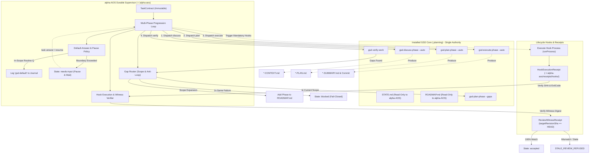

# Phase 17: GSD Lifecycle Bridge - Research
**Researched:** 2026-10-02
**Domain:** GSD lifecycle bridge, process orchestration, default-answer policy, gap routing, hook execution receipts, review witnesses
**Confidence:** HIGH

<user_constraints>
## User Constraints (from CONTEXT.md)

### Locked Decisions

#### GSD 대화형 프롬프트 자동 응답 및 일시정지 정책 (Prompt & Pause Policy)
- **D-01:** 자율 실행 중 GSD 워크플로(discuss, plan, execute, verify)에서 발생하는 대화형 질문은 사전 승인된 계약 범위 내인 경우 권장 기본값(Recommended Default)으로 자동 응답하고, 모든 자동 응답 내역을 `gsd-default` 카테고리로 실행 저널에 전수 기록한다. — **Reversibility:** costly — 자율 실행 루프, 프롬프트 파서 및 감사 저널 규격 전반에 영향.
- **D-02:** 질문 내용이 계약 경계(목표, 허용 루트, 허용 효과, 비용 한도, 필수 기준)를 초과하거나 새로운 권한을 요구하는 경우, 또는 권장 기본값이 없는 모호한 질문일 경우 즉시 자동 응답을 멈추고 안전 일시정지(`needs-input`) 상태로 전환한다. — **Reversibility:** one-way — 안전 우선(Fail-Safe) 불변식 및 승인되지 않은 작업 확산 방지.
- **D-03:** `needs-input` 상태에 도달하면 터미널에 중단 원인(질문 내용, 결정 필요 항목, 현재 실행 컨텍스트)을 명확히 출력하고 안전 대기 상태로 전환하며, 사용자가 `alpha-aos task answer <answer>` 또는 `task resume` 명령으로 언제든 비동기 응답 및 실행 재개를 할 수 있도록 지원한다. — **Reversibility:** costly — CLI 상태 머신 및 비동기 대기/재개 인터페이스.
- **D-04:** 컨트롤러가 GSD 워크플로의 각 단계(discuss, plan, execute, verify)를 호출할 때 각 단계의 의도에 맞게 `--auto` 플래그를 명시적으로 주입하며, 각 단계를 독립 프로세스로 호출하고 단계 간 체크포인트를 통해 상태 전이를 엄격히 감시한다. — **Reversibility:** costly — GSD 프로세스 실행 어댑터 및 단계별 오케스트레이터.

#### 검증 갭 라우팅 및 복구 메커니즘 (Gap-Plan vs New-Phase Routing)
- **D-05:** 검증(`verify-work` / `verify-phase`) 또는 독립 리뷰에서 확인된 결함/갭에 대해 범위 및 아키텍처 영향도 기반으로 라우팅을 분기한다. 현재 Phase 목표 및 계약 기준 내의 결함 수정은 현재 Phase의 갭 플랜(`*-GAP-*.md`)으로 처리하고, 새로운 기능 요구 또는 Phase 경계를 넘는 구조적 변경은 ROADMAP.md에 새 Phase로 라우팅한다. — **Reversibility:** one-way — 도메인 무결성 및 로드맵 추적성 보장.
- **D-06:** 갭 플랜 생성 시 GSD 네이티브 도구 연동을 준수한다. 갭 플랜은 GSD의 갭 플래닝 워크플로(`gsd-plan-phase --gap` 등)를 통해 정규 생성하고, 새 Phase는 GSD 로드맵 추가 워크플로를 거치도록 호출하여 GSD를 유일한 상태 권위자로 유지(GSD-03)한다. — **Reversibility:** one-way — GSD 상태 머신과의 일관성 유지.
- **D-07:** 갭 플랜이 실행 완료된 후에는 실패했던 기준뿐 아니라 전체 계약 기준(회귀 방지)에 대해 GSD verify를 다시 수행하고, 독립 리뷰어 세션을 거친 동일 리비전 영수증을 확인한 뒤에야 다음 단계로 진행한다. — **Reversibility:** one-way — 부분 수정으로 인한 회귀 결함 방지 및 품질 보증.
- **D-08:** 갭 플랜 수정 중에도 동일 실패 핑거프린트가 2회 연속 발생하면 Phase 15의 비진행 정책과 통합하여 3단계 점진적 대안 전략을 적용하고, 대안이 소진되면 즉시 `blocked`로 안전 정지하여 무한 수정 루프를 방지한다. — **Reversibility:** costly — 결함 복구 전략 및 자원 보호 메커니즘.

#### 다중 Phase 연속 진행 및 상태 관측 (Multi-Phase Progression & Boundary Discovery)
- **D-09:** 계약 범위 내에서 복수 Phase를 연속 진행할 때, GSD의 `.planning/STATE.md` 및 `ROADMAP.md`의 완료 상태를 순수 읽기로 관측하여 후속 Phase 진행 여부를 판단하고, 수퍼바이저 자체 전이 머신 없이 GSD 라이프사이클의 다음 단계로 자연스럽게 오케스트레이션한다. — **Reversibility:** one-way — GSD를 프로젝트 라이프사이클의 단일 진실 공급원(SSOT)으로 확립.
- **D-10:** 비정상 중단된 Phase를 재개(Resume)할 때 Phase 내 완료된 `*-SUMMARY.md`, `STATE.md` 진행 상태, `docs(<phase>-<plan>):` Git 커밋을 삼중 대조하여 완료된 플랜은 재실행 없이 건너뛰고, 미완료 플랜부터 정확히 재개(성공 기준 4)한다. — **Reversibility:** one-way — 멱등성 보장 및 중복 실행/비용 방지.
- **D-11:** 재개 시 미완료 플랜에 대해 새로운 범위 결정을 임의로 내리는 것(Silently defaulting a new scope decision)을 원천 차단하기 위해, 기존 생성된 `*-CONTEXT.md`와 `*-PLAN.md`의 결정을 불변 기준으로 고정하고 계획된 작업을 정직하게 수행한다. — **Reversibility:** one-way — 계약 및 승인된 범위 불변성 준수.
- **D-12:** `.planning/` 및 프로젝트 Git 커밋은 GSD/컨트롤러만 작성하고 alpha-AOS는 순수 읽기 관측만 수행하며, 실행 시도/역할/자원 한도/중단 복구는 오직 `~/.alpha-aos/` 저널에만 분리 기록하여 GSD 프로젝트 상태와 수퍼바이저 저널의 소유권을 엄격히 분리(GSD-03)한다. — **Reversibility:** one-way — 시스템 상태 아키텍처 불변식.

#### 필수 게이트 및 라이프사이클 훅 실측 증명 (Mandatory Gates & Hook Execution Receipts)
- **D-13:** GSD 라이프사이클 훅(`discuss:pre/post`, `plan:pre/post`, `execute:pre/post`, `verify:pre/post`)을 실제로 호출하고 실행 결과(명령어, Git revision, sha256, exitCode, 텔레메트리)를 개별 영수증 JSON(`Hook Execution Receipt`)으로 발행하며, 훅 미실행 또는 실패 시 즉시 Fail-Closed로 진행을 차단(GSD-04)한다. — **Reversibility:** one-way — 필수 품질 게이트의 실측 보증.
- **D-14:** 최종 산출물/커밋 SHA와 독립 리뷰어가 평가한 `targetRevisionSha`가 100% 일치할 때만 수락(acceptance)하며, 리뷰 이후 단 1바이트라도 파일이 변경되었거나 리뷰어 목격 영수증(`ReviewWitnessReceipt`)이 누락되면 즉시 판정을 거부(`STALE_REVIEW_REFUSED` / `MISSING_REVIEW_WITNESS`)한다. — **Reversibility:** one-way — 거짓 수락 방지 및 독립 검토 무결성 보증(성공 기준 3).
- **D-15:** 4대 적대적 실패 주입 픽스처 스위트((1) 훅 실패 시 차단, (2) 필수 산출물 결손 시 거부, (3) 중간 중단 후 재개 시 완료 플랜 보존 및 미완료 재개, (4) 오래된/위조된 리뷰 영수증 거부)를 구축하여 결정론적 안전 불변식을 완전 검증한다. — **Reversibility:** costly — 테스트 인프라 및 CI 회귀 스위트.
- **D-16:** CLI 진단 도구(`alpha-aos task status`, `task doctor`)에 GSD 라이프사이클 진행 단계, 훅 실행 영수증 상태, 갭 라우팅 이력, 리뷰 목격 리비전 일치 여부를 직관적인 표와 JSON 양방향으로 통합 가시화한다. — **Reversibility:** reversible

### Claude's Discretion
- `~/.alpha-aos/receipts/hooks/` 하위 훅 실행 영수증 JSON 파일의 세부 명명 규칙 및 해시 계산 세부 형식.
- `needs-input` 상태 전환 시 콘솔에 출력할 상세 레이아웃 및 텍스트 안내 메시지 서식.
- 합성 픽스처 테스트용 임시 git 저장소 및 GSD 샌드박스 구성 유틸리티의 세부 구현.

### Deferred Ideas (OUT OF SCOPE)
None — 토론은 Phase 17 범위 내에서 완료되었습니다. 전면적인 기능 패브릭 연동(CAP-01..05)은 Phase 18, 심층 구조화 독립 리뷰 및 수리 루프(REV-02..05)는 Phase 19, 비코드/CoursePilot 도구 커넥터(TOOL-01..04)는 Phase 20에서 순차적으로 구현됩니다.
</user_constraints>

<phase_requirements>
## Phase Requirements

| ID | Description | Research Support |
|----|-------------|------------------|
| **GSD-01** | A user can run the appropriate GSD discuss, plan, execute and verify steps for a development goal without typing each step, with authorized defaults recorded. [VERIFIED: .planning/REQUIREMENTS.md:41] | GSD CLI 및 워크플로 호출 어댑터(`task-gsd.ts`), 단계별 독립 프로세스 디스패치 및 `--auto` 플래그 주입, `STATE.md`/`ROADMAP.md` 순수 읽기 동기화, `gsd-default` 결정 감사 저널 기록. |
| **GSD-02** | A user sees confirmed implementation gaps routed into GSD gap plans or new phases, then re-executed and re-verified against the approved criteria. [VERIFIED: .planning/REQUIREMENTS.md:42] | 결함 진단 결과에 따른 라우팅 엔진: 현재 Phase 범위 내 결함은 GSD 네이티브 `plan-phase --gaps` 갭 플랜으로 라우팅, 범위 초과/구조적 변경은 `phase add`로 새 Phase 라우팅, 전체 계약 기준 재검증, `NoProgressDetector` 3단계 복구 및 `blocked` 정지. |
| **GSD-03** | A user can inspect GSD as the sole project lifecycle authority while alpha-AOS owns attempts, role dispatch, limits and recovery in a separate journal. [VERIFIED: .planning/REQUIREMENTS.md:43] | GSD 단일 진실 공급원(SSOT) 아키텍처: `.planning/` 및 프로젝트 Git 커밋은 GSD만 작성, alpha-AOS는 `~/.alpha-aos/`에만 저널/체크포인트 분리 기록. 삼중 대조(Summary + State + Git) 멱등 복구 및 기존 Context/Plan 범위 결정 불변 고정. |
| **GSD-04** | A user sees mandatory GSD gates backed by actual execution and same-revision evidence; a configured skill or exit code alone cannot satisfy independent-review acceptance. [VERIFIED: .planning/REQUIREMENTS.md:44] | GSD 12개 루프 포인트 중 필수 훅 실제 실행 및 `HookExecutionReceipt` 발행/검증, 최종 커밋 SHA와 100% 일치하는 `ReviewWitnessReceipt` 검증, 단 1바이트 변경 또는 영수증 누락 시 `STALE_REVIEW_REFUSED` / `MISSING_REVIEW_WITNESS` Fail-Closed 거부. |
</phase_requirements>

## Summary

Phase 17은 alpha-AOS v0.2.0의 **GSD Lifecycle Bridge**를 구축하는 핵심 마일스톤입니다.
Phase 14~16에서 완성된 계약 검증, 내구성 수퍼바이저, 실행 저널, 배타적 임대 락, 합성 가능한 5개 하네스 역할을 기반으로, 자율 실행(Autopilot) 작업이 독자적인 프로젝트 상태 머신을 만들지 않고 **설치된 GSD Core의 discuss, plan, execute, verify 및 gap 경로를 네이티브 상태 전이 그대로 통과**할 수 있도록 합니다.

기존 `src/core/task-gsd.ts` [VERIFIED: src/core/task-gsd.ts:23]는 `$gsd-quick` 단일 워크플로만을 지원하는 최소 부트스트랩 어댑터였습니다. Phase 17에서는 이를 확장하여 (1) discuss-phase, plan-phase, execute-phase, verify-work 전 과정을 아우르는 다중 Phase 오케스트레이션 어댑터, (2) 계약 경계 내 자동 응답(`gsd-default`) 및 안전 일시정지(`needs-input`) 정책, (3) 완료 플랜의 삼중 대조(Summary + State + Git) 멱등 재개 및 갭 라우팅(Gap-Plan vs New-Phase), (4) 필수 라이프사이클 훅 실측 영수증(`HookExecutionReceipt`) 및 동일 리비전 독립 리뷰 목격 증명(`ReviewWitnessReceipt`)을 구현합니다.

**Primary recommendation:** GSD를 프로젝트 라이프사이클의 유일한 상태 권위자(SSOT)로 유지하고, alpha-AOS는 순수 읽기 관측과 `~/.alpha-aos/` 격리 저널을 통해 프로세스 감독, 승인된 범위 내 자동 응답, 갭 라우팅, 실측 훅 영수증과 동일 리비전 리뷰 목격 증명을 엄격히 검증하여 거짓 수락을 완벽히 방지한다.

---

## Architectural Responsibility Map

| 모듈 / 컴포넌트 | 파일 경로 | 주 책임 및 아키텍처 경계 |
|---|---|---|
| **GSD Lifecycle Adapter** | `src/core/task-gsd-lifecycle.ts` *(신설)* | GSD의 `discuss-phase`, `plan-phase`, `execute-phase`, `verify-work` 독립 프로세스 호출, `--auto` 플래그 주입, 단계 간 체크포인트 감시. [VERIFIED: 17-CONTEXT.md:20] |
| **GSD Prompt & Pause Policy** | `src/core/task-gsd-prompt.ts` *(신설)* | 대화형 질문 감지, 계약 범위(목표/루트/효과/비용) 내 권장 기본값 자동 응답(`gsd-default`), 경계 초과 시 `needs-input` 안전 일시정지 및 비동기 응답 지원. [VERIFIED: 17-CONTEXT.md:17-19] |
| **Phase & Plan Discovery** | `src/core/task-gsd-discovery.ts` *(신설)* | `.planning/STATE.md` 및 `ROADMAP.md` 순수 읽기 관측, 삼중 대조(SUMMARY.md + STATE.md + Git commit) 완료 판별, 미완료 플랜 정확한 재개, 기존 CONTEXT/PLAN 범위 불변 고정. [VERIFIED: 17-CONTEXT.md:29-32] |
| **Gap Router & Recovery** | `src/core/task-gap-router.ts` *(신설)* | verify/review 결함 분석: 범위 내 결함은 GSD 네이티브 갭 플랜(`*-GAP-*.md`) 라우팅, 구조적 변경은 `ROADMAP.md` 새 Phase 라우팅. 전체 계약 재검증 및 `NoProgressDetector` 3단계 복구/정지. [VERIFIED: 17-CONTEXT.md:23-26] |
| **Hook Execution Receipts** | `src/core/task-hook-receipt.ts` *(신설)* | GSD 라이프사이클 훅(`discuss:pre/post`, `plan:pre/post`, `execute:pre/post`, `verify:pre/post`) 실제 실행, 실행 결과 다이제스트, `HookExecutionReceipt` 원자적 발행 및 Fail-Closed 검증. [VERIFIED: 17-CONTEXT.md:35] |
| **Review Witness Verifier** | `src/core/task-review-witness.ts` *(신설)* | 최종 산출물/커밋 SHA와 리뷰어가 평가한 `targetRevisionSha` 100% 일치 검증, `ReviewWitnessReceipt` 누락 또는 1바이트 변경 시 `STALE_REVIEW_REFUSED` / `MISSING_REVIEW_WITNESS` 거부. [VERIFIED: 17-CONTEXT.md:36] |
| **Task Run & Supervisor Integration** | `src/core/task-run.ts`, `src/core/task-supervisor.ts` | 다중 Phase 전이 관측 루프 연동, `needs-input` 일시정지 상태 및 저널 기록, 갭 라우팅 재실행 루프 연결. [VERIFIED: src/core/task-run.ts:741, src/core/task-supervisor.ts:389] |
| **CLI Diagnostics & Command** | `src/cli.ts` | `alpha-aos task status` 및 `task doctor`에 GSD 라이프사이클 진행표, 훅 영수증 상태, 갭 이력, 리뷰 목격 리비전 일치 여부 가시화; `task answer <answer>` 명령 추가. [VERIFIED: 17-CONTEXT.md:19, 38] |

---

## Standard Stack

### Core
| Library / Module | Version | Purpose | Why Standard |
|---|---|---|---|
| `@opengsd/gsd-core` | `1.14.0` [VERIFIED: AGENTS.md:60] | GSD 워크플로 및 상태 스파인 (`gsd-tools.cjs`, `workflows/*.md`) | alpha-AOS가 채택한 유일한 프로젝트 라이프사이클 권위자. |
| `node:crypto` | built-in (Node.js >= 24) [VERIFIED: AGENTS.md:42] | SHA-256 해시, 다이제스트 계산, UUID 생성 | 외부 의존성 없는 암호화 및 무결성 증명 표준. |
| `node:fs/promises` | built-in | 비동기 파일시스템 I/O, 디렉터리 스캔 | Node.js 표준 파일시스템 인터페이스. |
| `src/core/process.ts` | in-repo [VERIFIED: src/core/process.ts:11-14] | 유계 프로세스 실행 (`runProcess`), 타임아웃, 프로세스 트리 종료 | 쉘 인젝션 방지, 버퍼 오버플로 방지, 크로스 플랫폼 프로세스 그룹 종료 보장. |
| `src/core/transaction.ts` | in-repo [VERIFIED: src/core/transaction.ts:51] | 원자적 파일 트랜잭션, 스냅샷, 저널 기록 (`applyFileTransaction`) | 영수증 및 상태 저장 시 안전한 트랜잭션 불변식 제공. |
| `src/core/validation.ts` | in-repo [VERIFIED: src/core/validation.ts:52] | 엄격한 JSON 스키마 검증 (`validateManagedDocument`) | closed-world 스키마 준수 및 자격증명 누출 원천 차단. |

### Supporting
| Module | Version | Purpose | When to Use |
|---|---|---|---|
| `src/core/task-strategy.ts` | in-repo [VERIFIED: src/core/task-strategy.ts:4] | 실패 핑거프린트 계산, `NoProgressDetector`, 3단계 점진적 대안 전략 | 갭 플랜 재실행 중 동일 실패 반복 감지 및 무한 루프 방지. |
| `src/core/controller-lease.ts` | in-repo [VERIFIED: src/core/task-run.ts:7] | `.alpha-aos/controller.lock` 배타적 임대 락 | GSD 워크플로 실행 중 복수 작성자 충돌 차단. |
| `src/core/tree-mutation-guard.ts` | in-repo [VERIFIED: src/core/task-run.ts:8] | 리뷰어의 프로젝트 트리 변조 감지 | 독립 리뷰어 읽기 전용 불변식 검증 시. |
| `src/core/task-journal.ts` | in-repo [VERIFIED: src/core/task-journal.ts:12] | `~/.alpha-aos/runs/<digest>/journal.jsonl` 저널 기록 | alpha-AOS 실행 시도, 자동 응답, 훅 영수증, 갭 이벤트 기록. |

### Alternatives Considered
| Instead of | Could Use | Tradeoff |
|---|---|---|
| GSD 단일 상태 권위자 | alpha-AOS 자체 프로젝트 상태 머신 구축 | **기각:** 프로젝트 상태가 GSD와 alpha-AOS 양쪽에 분산되어 상태 불일치(Split-Brain) 및 동기화 오류 발생. GSD-03 위반. |
| 훅 실제 프로세스 실행 및 영수증 | 단순 스킬 설정 파일 존재 확인 또는 목(Mock) 패스 | **기각:** 실제 실행 없는 성공 주장은 거짓 수락(False Acceptance)을 유발함. GSD-04 위반. |
| 무조건적인 `--auto` 플래그 주입 | 계약 경계 검증 기반 선택적 자동 응답 + pause | **기각:** 무조건 자동 응답 시 계약 범위를 초과하는 변경이나 위험한 작업이 사용자 승인 없이 진행될 위험. D-02에 따라 경계 초과 시 `needs-input` 필수. |
| 동일 결함 반복 시 무한 갭 플랜 생성 | 2회 연속 동일 실패 시 3단계 대안 전략 후 `blocked` | **기각:** 무한 루프로 인한 LLM 토큰/비용 낭비 및 교착 상태 방지를 위해 D-08 필수. |

---

## Architecture Patterns

### System Architecture Diagram



### Recommended Code Structure

```
src/
├── core/
│   ├── task-gsd.ts                # (기존) GSD 경로 확인, 도구 프로브 및 기본 유틸리티
│   ├── task-gsd-lifecycle.ts      # (신설) discuss, plan, execute, verify, gap 워크플로 호출기
│   ├── task-gsd-prompt.ts         # (신설) 대화형 프롬프트 파서, 기본값 자동응답 및 needs-input 판정기
│   ├── task-gsd-discovery.ts      # (신설) STATE.md/ROADMAP.md 관측, 삼중대조 완료검증, 미완료 재개
│   ├── task-gap-router.ts         # (신설) 갭 라우팅 분기(갭플랜 vs 새Phase), 회귀 재검증 루프, 3단계 대안
│   ├── task-hook-receipt.ts       # (신설) GSD 12개 루프포인트 훅 실행, HookExecutionReceipt 스키마 및 검증
│   ├── task-review-witness.ts     # (신설) ReviewWitnessReceipt 스키마, targetRevisionSha 일치 검증
│   ├── task-run.ts                # (기존) 다중 Phase 및 게이트 영수증 통합
│   ├── task-supervisor.ts         # (기존) needs-input 비동기 대기/재개 및 갭 라우팅 루프 연동
│   └── task-doctor.ts             # (기존) GSD 라이프사이클 및 훅 상태 가시화 확장
schemas/
├── hook-execution-receipt.schema.json  # (신설) HookExecutionReceipt 엄격 스키마
└── review-witness-receipt.schema.json  # (신설) ReviewWitnessReceipt 엄격 스키마
test/
├── task-gsd-lifecycle.test.ts     # (신설) discuss-plan-execute-verify 다중 Phase 연속 진행 테스트
├── task-gsd-prompt.test.ts        # (신설) 자동 응답, gsd-default 저널 기록 및 needs-input 일시정지 테스트
├── task-gsd-discovery.test.ts     # (신설) 삼중 대조 멱등 재개 및 범위 불변 고정 테스트
├── task-gap-router.test.ts        # (신설) 갭 플랜 vs 새 Phase 라우팅 및 3단계 비진행 정지 테스트
├── task-hook-receipt.test.ts      # (신설) 훅 실행 영수증 발행, 해시 검증 및 실패 차단 테스트
└── task-review-witness.test.ts    # (신설) 동일 리비전 검증, 1바이트 변경 거부(STALE_REVIEW_REFUSED) 테스트
```

### Pattern 1: GSD 단일 라이프사이클 권위자 및 순수 읽기 관측 (GSD-01, GSD-03)
- **원칙:** `.planning/` 디렉터리와 Git 커밋은 오직 GSD 워크플로와 컨트롤러만 작성한다. alpha-AOS는 상태를 쓰지 않으며 오직 읽기(`readBounded`, `snapshotPlanningState`, `runGitRead`)만 수행한다. [VERIFIED: src/core/task-gsd.ts:20-21, 17-CONTEXT.md:32]
- **오케스트레이션 방식:** 수퍼바이저는 자체 Phase 전이 상태 머신을 구축하지 않고, GSD의 `.planning/STATE.md`와 `ROADMAP.md`를 순수 읽기로 관측하여 현재 Phase의 완료 여부를 판단하고 후속 Phase 워크플로를 순차 호출한다. [VERIFIED: 17-CONTEXT.md:29]
- **저널 분리:** 실행 시도(attemptIndex), 역할 디스패치, 자원 한도, 중단 복구 상태는 오직 사용자 홈 디렉터리(`~/.alpha-aos/runs/<contractDigest>/`)에만 기록하여 프로젝트 상태와 분리한다. [VERIFIED: src/core/task-journal.ts:68-78]

### Pattern 2: 승인된 기본값 자동 응답 및 계약 경계 일시정지 (GSD-02, D-01, D-02, D-03)
- **자동 응답 조건:** GSD 워크플로 실행 중 발생하는 대화형 질문이 계약의 목표(`contract.goal`), 허용 경로(`contract.allowedRoots`), 허용 효과(`contract.allowedEffects`), 비용 한도(`contract.resourcePolicy`) 내인 경우, GSD의 권장 기본값(Recommended Default)을 선택하여 자동 응답하고 실행 저널에 `gsd-default` 카테고리로 기록한다. [VERIFIED: 17-CONTEXT.md:17]
- **안전 일시정지 (`needs-input`):** 질문 내용이 계약 경계를 벗어나거나, 새로운 권한을 요구하거나, 권장 기본값이 없는 모호한 질문인 경우 즉시 프로세스를 안전 중지하고 체크포인트를 `needs-input` 상태로 전환한다. [VERIFIED: 17-CONTEXT.md:18]
- **비동기 재개 인터페이스:** 터미널에 대기 원인과 질문 내용을 명확히 출력하고, 사용자가 `alpha-aos task answer <answer>` 또는 `task resume`으로 응답할 때까지 안전하게 대기한다. [VERIFIED: 17-CONTEXT.md:19]

### Pattern 3: 삼중 대조 멱등 복구 및 범위 불변 고정 (GSD-03, D-10, D-11)
- **삼중 대조 완료 검증:** 중단된 Phase를 재개할 때, 다음 3가지 증거가 일치하는 플랜만 완료된 것으로 판정한다: [VERIFIED: 17-CONTEXT.md:30]
  1. `.planning/phases/<phase>/<phase>-<plan>-SUMMARY.md` 파일이 존재하고 유효함.
  2. `.planning/STATE.md`의 진행 상태 표에 해당 플랜이 완료로 기록되어 있음.
  3. Git 로그에 `docs(<phase>-<plan>):` 형식의 커밋이 존재함.
- **멱등 실행:** 삼중 대조를 통과한 플랜은 재실행 없이 건너뛰고, 최초 미완료 플랜부터 정확히 재개한다 (성공 기준 4).
- **범위 불변 고정:** 재개 시 미완료 플랜에 대해 새로운 범위 결정을 임의로 내리지 않도록, 기존 생성된 `*-CONTEXT.md`와 `*-PLAN.md`의 내용을 불변 기준으로 고정하여 실행한다 (성공 기준 4). [VERIFIED: 17-CONTEXT.md:31]

### Pattern 4: 결함 라우팅 (Gap-Plan vs New-Phase) 및 안티루프 보호 (GSD-02, D-05, D-06, D-08)
- **분기 기준:** 검증 또는 리뷰에서 결함 발생 시: [VERIFIED: 17-CONTEXT.md:23]
  - 현재 Phase 목표 및 계약 기준 내의 결함 수정 $\rightarrow$ GSD 네이티브 갭 플랜(`gsd-plan-phase --gaps`, frontmatter에 `gap_closure: true`, `gap_ids: [...]` 포함)으로 라우팅. [VERIFIED: gsd-core/workflows/verify-work.md]
  - 새로운 기능 요구 또는 Phase 경계를 넘는 아키텍처/구조적 변경 $\rightarrow$ `ROADMAP.md`에 새 Phase(`gsd-tools phase add`)로 라우팅. [VERIFIED: gsd-core/bin/gsd-tools.cjs]
- **회귀 방지 전체 재검증:** 갭 플랜 실행 완료 후에는 실패했던 항목뿐만 아니라 전체 계약 기준에 대해 GSD verify를 다시 수행한다. [VERIFIED: 17-CONTEXT.md:25]
- **안티루프 보호:** 동일 실패 핑거프린트(`computeFailureFingerprint`)가 2회 연속 발생하면 Phase 15의 `NoProgressDetector`와 연계하여 3단계 점진적 대안 전략(`stage-1-reproduction-injection` $\rightarrow$ `stage-2-single-criterion-focus` $\rightarrow$ `stage-3-blocked`)을 적용하고, 해결 불가능 시 즉시 `blocked`로 정지한다. [VERIFIED: src/core/task-strategy.ts:4-7, 84-88, 17-CONTEXT.md:26]

### Pattern 5: 필수 라이프사이클 훅 영수증 및 리뷰 목격자 검증 (GSD-04, D-13, D-14)
- **훅 실제 실행:** GSD 표준 루프 포인트 12개 [VERIFIED: gsd-core/bin/lib/loop-host-contract.cjs] 중 필수 게이트(`discuss:pre/post`, `plan:pre/post`, `execute:pre/post`, `verify:pre/post`)에 대해 `runProcess`로 실제 훅을 호출하고, 명령어, Git revision, sha256, exitCode, 소요시간을 담은 `HookExecutionReceipt` JSON을 `~/.alpha-aos/receipts/hooks/`에 저장한다. [VERIFIED: 17-CONTEXT.md:35]
- **동일 리비전 리뷰 목격자 (`ReviewWitnessReceipt`):** 독립 리뷰어 세션이 검토한 `targetRevisionSha`와 최종 Git HEAD 커밋 SHA, 그리고 `artifactDigest`가 100% 일치해야만 `accepted`를 허용한다. [VERIFIED: 17-CONTEXT.md:36]
- **Fail-Closed 거부:** 리뷰 이후 단 1바이트라도 변경되었거나 리뷰어 목격 영수증이 누락되면 즉시 `STALE_REVIEW_REFUSED` 또는 `MISSING_REVIEW_WITNESS`로 판정을 거부한다 (성공 기준 3). [VERIFIED: 17-CONTEXT.md:36]

### Anti-Patterns to Avoid
- **독자적인 상태 머신 생성 금지:** alpha-AOS 내부에 Phase 상태, 플랜 완료 상태를 별도 DB나 파일로 중복 관리하지 않는다. 오직 GSD 파일(`.planning/`)만 상태의 원천이다.
- **재개 시 임의의 범위 결정 생성 금지:** 네트워크 오류나 인터럽트 후 재개 시 기존 CONTEXT.md와 PLAN.md를 무시하고 새로운 프롬프트나 가정을 주입하지 않는다.
- **종료 코드 0 단독 수락 금지:** 프로세스가 단순히 `exit 0`으로 끝났거나 설정 파일이 존재한다는 이유만으로 수락하지 않는다. 실측 훅 영수증과 동일 리비전 리뷰 목격 영수증이 필수다.
- **무제한 갭 수정 루프 금지:** 동일 결함이 반복되는데도 계속해서 갭 플랜을 생성하고 재시도하지 않는다. 2회 반복 시 대안 전략을 거쳐 `blocked`로 안전 정지한다.

---

## Don't Hand-Roll

| Problem | Don't Build | Use Instead | Why |
|---|---|---|---|
| 안전한 유계 프로세스 실행 | `child_process.exec` 또는 `spawn(shell: true)` 직접 호출 | `runProcess` (`src/core/process.ts`) [VERIFIED: src/core/process.ts:11-14] | 쉘 인젝션 방지, 버퍼 제한(maxOutputBytes), 타임아웃, Windows/POSIX 프로세스 트리 완전 종료 보장. |
| 원자적 영수증 저장 및 롤백 | `fs.writeFile` 직접 사용 | `applyFileTransaction` (`src/core/transaction.ts`) [VERIFIED: src/core/transaction.ts:51] | 쓰기 충돌 방지, 전원 차단/충돌 시 일관성 보장, 저널 트랜잭션 추적. |
| 실패 핑거프린트 및 반복 감지 | 오류 문자열 단순 비교 | `computeFailureFingerprint` & `NoProgressDetector` (`src/core/task-strategy.ts`) [VERIFIED: src/core/task-strategy.ts:84-88, 93-100] | ANSI 이스케이프, 타임스탬프, 메모리 주소, 절대 경로를 정규화하여 결정론적 해시 계산. |
| 엄격한 영수증 스키마 검증 | 수동 if-else 객체 필드 검사 | `validateManagedDocument` (`src/core/validation.ts`) [VERIFIED: src/core/validation.ts:52] | draft-2020-12 스키마 기반 closed-world 검증, 자격증명 패턴 감지. |
| 프로젝트 단일 작성자 락 | 커스텀 pid 파일 체크 | `acquireControllerLease` (`src/core/controller-lease.ts`) [VERIFIED: src/core/task-run.ts:7] | O_EXCL 원자적 생성, 좀비 락 자동 회수, 펜싱 토큰 바인딩. |

---

## Common Pitfalls

### Pitfall 1: 대화형 프롬프트 자동 응답 시 권한/범위 초과 (Scope Escalation via Prompt Auto-Answer)
- **문제점:** `--auto` 모드나 기본값 응답기가 동작할 때, "새 종속성을 설치할까요?", "추가 디렉터리를 생성할까요?"와 같은 질문에 무조건 첫 번째 옵션이나 기본값으로 응답하여 task contract 범위를 초과하는 변경을 인가할 수 있음.
- **방어책:** 프롬프트 파서(`task-gsd-prompt.ts`)는 자동 응답 전에 질문 내용이 계약의 `allowedRoots`, `allowedEffects`, `goal` 경계 내에 있는지 먼저 평가한다. 경계를 벗어나면 즉시 자동 응답을 차단하고 `needs-input` 상태로 안전 일시정지한다. [VERIFIED: 17-CONTEXT.md:18]

### Pitfall 2: 중단 후 재개 시 완료 플랜 중복 실행 (Duplicate Plan Execution on Resume)
- **문제점:** 네트워크 끊김이나 타임아웃으로 중단된 작업을 재개할 때, 이미 커밋된 플랜을 다시 실행하여 Git 충돌이나 불필요한 비용이 발생함.
- **방어책:** `task-gsd-discovery.ts`에서 `*-SUMMARY.md`, `STATE.md`, Git commit `docs(<phase>-<plan>):`의 3중 일치를 확인하고, 이미 완료된 플랜은 완전히 건너뛰며 최초 미완료 플랜부터 정확히 재개한다. [VERIFIED: 17-CONTEXT.md:30]

### Pitfall 3: 리뷰 완료 후 산출물 사후 변조로 인한 거짓 수락 (TOCTOU Post-Review Mutation)
- **문제점:** 독립 리뷰어가 승인 결론을 내린 후, 후속 정리 작업이나 프로세스가 파일을 수정했음에도 이전 리뷰 결과를 근거로 최종 `accepted` 처리하는 시간차 공격(TOCTOU) 취약점.
- **방어책:** `task-review-witness.ts`는 최종 판정 직전 현재 Git HEAD SHA 및 아티팩트 SHA-256을 재측정하여, `ReviewWitnessReceipt`에 기록된 `targetRevisionSha` 및 `artifactDigest`와 1비트의 오차도 없이 100% 일치할 때만 승인한다. 불일치 시 `STALE_REVIEW_REFUSED` 에러로 즉시 거부한다. [VERIFIED: 17-CONTEXT.md:36]

### Pitfall 4: 훅 실행을 흉내만 내고 넘어가기 (Mocking/Simulating Mandatory Gates)
- **문제점:** GSD 라이프사이클 훅 설정만 존재하거나 스크립트 파일이 있다는 이유로 실제 프로세스를 띄우지 않고 성공으로 간주함.
- **방어책:** `task-hook-receipt.ts`는 실제 `runProcess`를 호출하여 exitCode, stdout/stderr SHA, 실행 시간을 측정하고, `HookExecutionReceipt`를 원자적으로 기록한다. 훅이 실패하거나 영수증이 없으면 `HOOK_EXECUTION_FAILED`로 Fail-Closed 처리한다. [VERIFIED: 17-CONTEXT.md:35]

### Pitfall 5: 갭 수정의 무한 재시도 루프 (Endless Gap Repair Loop)
- **문제점:** 동일한 버그가 해결되지 않고 계속해서 `verify` 실패 $\rightarrow$ 갭 플랜 생성 $\rightarrow$ 실행 $\rightarrow$ 실패 루프를 무한히 돌며 리소스를 고갈시킴.
- **방어책:** `computeFailureFingerprint`를 통해 동일 실패가 2회 연속 감지되면 Phase 15의 `NoProgressDetector` 3단계 전략(`stage-1` 단일 기준 집중 $\rightarrow$ `stage-2` 재현 주입 $\rightarrow$ `stage-3-blocked`)을 강제하고, 대안 소진 시 즉시 `blocked`로 정지한다. [VERIFIED: 17-CONTEXT.md:26]

---

## Code Examples

### 1. HookExecutionReceipt 스키마 및 생성 인터페이스

```typescript
// src/core/task-hook-receipt.ts
export type GsdHookPoint =
  | "discuss:pre"
  | "discuss:post"
  | "plan:pre"
  | "plan:post"
  | "execute:pre"
  | "execute:post"
  | "verify:pre"
  | "verify:post";

export interface HookExecutionReceipt {
  schemaVersion: 1;
  kind: "hook-execution-receipt";
  receiptId: string;
  hookPoint: GsdHookPoint;
  phaseId: string;
  planId: string | null;
  targetRevisionSha: string; // 40-char git commit SHA
  workingTreeDigest: string; // 64-char sha256
  command: string;
  args: readonly string[];
  exitCode: number;
  stdoutSha256: string;
  stderrSha256: string;
  durationMs: number;
  executedAt: string;
  status: "passed" | "failed";
  receiptDigest: string; // sha256 of receipt canonical payload
}
```

### 2. ReviewWitnessReceipt 스키마 및 검증

```typescript
// src/core/task-review-witness.ts
export interface ReviewWitnessReceipt {
  schemaVersion: 1;
  kind: "review-witness-receipt";
  requestId: string;
  sessionId: string;
  reviewerHarness: string;
  reviewerVersion: string;
  targetRevisionSha: string; // MUST match git HEAD 100%
  artifactDigest: string;    // MUST match snapshot sha256 100%
  witnessVerdict: "accepted" | "rejected" | "unknown";
  examinedAt: string;
  criteriaWitnessed: Array<{
    criterionId: string;
    verdict: "pass" | "fail" | "unknown";
    findingSummary?: string;
  }>;
  reportDigest: string;
  receiptDigest: string;
}

export function verifyReviewWitness(options: {
  receipt: ReviewWitnessReceipt | null;
  currentHeadSha: string;
  currentArtifactDigest: string;
}): { valid: boolean; refusalCode: string | null; reason: string | null } {
  if (!options.receipt) {
    return {
      valid: false,
      refusalCode: "MISSING_REVIEW_WITNESS",
      reason: "No independent review witness receipt recorded for this run.",
    };
  }
  if (options.receipt.targetRevisionSha !== options.currentHeadSha) {
    return {
      valid: false,
      refusalCode: "STALE_REVIEW_REFUSED",
      reason: `Review witness evaluated git revision ${options.receipt.targetRevisionSha.slice(0, 12)}, but current HEAD is ${options.currentHeadSha.slice(0, 12)}.`,
    };
  }
  if (options.receipt.artifactDigest !== options.currentArtifactDigest) {
    return {
      valid: false,
      refusalCode: "STALE_REVIEW_REFUSED",
      reason: `Review witness evaluated artifact ${options.receipt.artifactDigest.slice(0, 12)}, but current artifact digest is ${options.currentArtifactDigest.slice(0, 12)}.`,
    };
  }
  return { valid: true, refusalCode: null, reason: null };
}
```

### 3. 삼중 대조(Triple Correlation) 플랜 완료 판별기

```typescript
// src/core/task-gsd-discovery.ts
export interface PlanCompletionProof {
  planId: string;
  completed: boolean;
  hasSummary: boolean;
  hasStateRow: boolean;
  hasGitCommit: boolean;
  summaryPath?: string;
  commitSha?: string;
}

export async function verifyPlanTripleCorrelation(options: {
  projectRoot: string;
  phaseId: string;
  planId: string;
  baseCommit: string;
}): Promise<PlanCompletionProof> {
  const { projectRoot, phaseId, planId, baseCommit } = options;

  // 1. Check SUMMARY.md existence
  const summaryRelative = `.planning/phases/${phaseId}/${phaseId}-${planId}-SUMMARY.md`;
  const summaryFull = join(projectRoot, summaryRelative);
  const hasSummary = existsSync(summaryFull);

  // 2. Check STATE.md table row
  let hasStateRow = false;
  try {
    const stateText = await readFile(join(projectRoot, ".planning", "STATE.md"), "utf8");
    hasStateRow = stateText.includes(`| ${planId} |`) || stateText.includes(`Phase ${phaseId} P${planId}`);
  } catch {}

  // 3. Check Git commit docs(<phase>-<plan>):
  let hasGitCommit = false;
  let commitSha: string | undefined;
  try {
    const log = await runGitRead(projectRoot, [
      "log",
      `${baseCommit}..HEAD`,
      "--format=%H%x09%s",
    ]);
    const lines = log.split(/\r?\n/u).filter((l) => l.trim().length > 0);
    for (const line of lines) {
      const [sha, subject] = line.split("\t");
      if (subject && subject.startsWith(`docs(${phaseId}-${planId}):`)) {
        hasGitCommit = true;
        commitSha = sha;
        break;
      }
    }
  } catch {}

  const completed = hasSummary && hasStateRow && hasGitCommit;
  return {
    planId,
    completed,
    hasSummary,
    hasStateRow,
    hasGitCommit,
    summaryPath: hasSummary ? summaryRelative : undefined,
    commitSha,
  };
}
```

---

## Validation Architecture

### Test Framework
| Property | Value |
|---|---|
| Framework | Node.js built-in test runner (`node:test`, `node:assert/strict`) [VERIFIED: AGENTS.md:52] |
| Quick run command | `npm run build && node scripts/run-tests.mjs --files dist/test/task-gsd-*.test.js` |
| Full suite command | `npm test` (`npm run build && node scripts/run-tests.mjs`) [VERIFIED: scripts/run-tests.mjs] |
| Current suite baseline | 1225 tests (1217 pass, 0 fail, 8 skipped) [VERIFIED: task-151 execution log] |

### Phase Requirements -> Test Map

| Requirement | Test Description | Target Test File | Type |
|---|---|---|---|
| **GSD-01** | discuss, plan, execute, verify 4단계가 사용자 수동 입력 없이 GSD 워크플로를 순차 실행하고 `gsd-default` 저널을 남김 | `test/task-gsd-lifecycle.test.ts` | Integration |
| **GSD-01** | 계약 범위 내에서 2개 Phase에 걸친 작업이 GSD STATE 및 ROADMAP을 전이하며 완주됨 (SC 1) | `test/task-gsd-multi-phase.test.ts` | Integration |
| **GSD-02** | 프롬프트 질문이 계약 경계(경로/효과/비용) 초과 시 즉시 자동 응답을 멈추고 `needs-input`으로 일시정지됨 | `test/task-gsd-prompt.test.ts` | Unit / Scenario |
| **GSD-02** | CLI `task answer <answer>` 및 `task resume` 명령으로 비동기 재개 동작 확인 | `test/task-cli-answer.test.ts` | CLI Integration |
| **GSD-03** | 주입된 검증 결함이 범위에 따라 GSD 갭 플랜 또는 ROADMAP 새 Phase로 라우팅되어 수정 및 전체 재검증됨 (SC 2) | `test/task-gap-router.test.ts` | Integration |
| **GSD-03** | 동일 실패 2회 연속 시 3단계 점진적 대안 전략 적용 및 소진 시 `blocked` 안전 정지 확인 | `test/task-gap-router.test.ts` | Scenario |
| **GSD-03** | 중간 중단 후 재개 시 삼중 대조로 완료 플랜은 건너뛰고 미완료 플랜부터 재개하며 범위 결정을 보존함 (SC 4) | `test/task-gsd-recovery.test.ts` | Fault Injection |
| **GSD-04** | 필수 훅 실패 시 실행이 즉시 차단되고 영수증에 실패가 기록됨 (D-15 픽스처 1) | `test/task-hook-receipt.test.ts` | Fault Injection |
| **GSD-04** | 필수 산출물 결손 시 수락이 거부됨 (D-15 픽스처 2) | `test/task-gsd-recovery.test.ts` | Fault Injection |
| **GSD-04** | 리뷰 이후 1바이트 변경 또는 영수증 누락 시 `STALE_REVIEW_REFUSED` / `MISSING_REVIEW_WITNESS` 거부 (SC 3, D-15 픽스처 4) | `test/task-review-witness.test.ts` | Fault Injection |
| **GSD-04** | CLI `task status` 및 `task doctor`에서 GSD 라이프사이클 및 영수증 상태 가시화 검증 | `test/task-doctor-gsd.test.ts` | Unit / CLI |

### Sampling Rate
- 단위 및 스키마 검증 테스트: PR 및 로컬 커밋마다 100% 실행.
- 4대 적대적 실패 주입 픽스처 스위트: `npm test`에 기본 포함하여 상시 회귀 검증.

### Wave 0 Gaps
- 현재 `src/core/task-gsd.ts`는 `$gsd-quick`만을 대상으로 하므로, `discuss-phase`, `plan-phase`, `execute-phase`, `verify-work`를 포괄하는 라이프사이클 모듈 신설 필요.
- `HookExecutionReceipt` 및 `ReviewWitnessReceipt`의 JSON Schema 파일 미존재 $\rightarrow$ `schemas/`에 신규 작성 필요.
- `needs-input` 상태에 대한 CLI 상호작용(`task answer`) 핸들러 부재 $\rightarrow$ `src/cli.ts` 확장 필요.

---

## Security Domain

### Applicable ASVS Categories
- **V1 Architecture, Design and Threat Modeling:** GSD를 단일 라이프사이클 권위자로 유지하고 alpha-AOS는 순수 읽기 및 격리 저널 소유.
- **V10 Malicious Code Search:** untrusted data로서의 LLM 프롬프트 출력 취급, 파일 내용 및 도구 출력을 명령이 아닌 순수 데이터로 격리. [VERIFIED: src/core/task-gsd.ts:258-260]
- **V14 Configuration and Cryptographic Invariants:** 동일 리비전 SHA-256 검증 및 리뷰 후 변조(TOCTOU) 방지.

### Known Threat Patterns for GSD Bridge
1. **Interactive Prompt Injection (프롬프트 주입을 통한 권한 탈취):** GSD 질문을 통해 승인되지 않은 파일 쓰기나 명령 실행을 유도하는 공격. $\rightarrow$ `task-gsd-prompt.ts`에서 계약 경계(목표/허용경로/효과)를 벗어나는 모든 질문을 감지하여 자동 응답을 차단하고 `needs-input`으로 격리.
2. **Review Result Tampering (사후 변조 거짓 수락):** 독립 리뷰어가 검증을 완료한 뒤 파일이 수정되었음에도 이전 영수증으로 통과하는 공격. $\rightarrow$ `ReviewWitnessReceipt`의 `targetRevisionSha`와 `artifactDigest`가 최종 커밋 및 스냅샷과 100% 일치하지 않으면 `STALE_REVIEW_REFUSED`로 즉시 거부.
3. **Ghost Phase Completion (허위 단계 완료):** 실제 GSD 워크플로가 돌지 않고 빈 디렉터리나 성공 exitCode만으로 완료를 사칭하는 공격. $\rightarrow$ 삼중 대조(SUMMARY.md + STATE.md + Git docs commit) 및 `HookExecutionReceipt` 실측 영수증 검증으로 방어.
4. **Denial-of-Service via Infinite Gap Loops (무한 갭 플랜 재시도):** 지속적인 갭 생성으로 시스템 자원 및 LLM 비용을 탕진시키는 공격. $\rightarrow$ 동일 오류 2회 연속 시 3단계 점진적 대안 후 `blocked` 강제 종료.

---

## Sources

### Primary (HIGH confidence)
- `.planning/phases/17-gsd-lifecycle-bridge/17-CONTEXT.md:1-113` [VERIFIED: view_file session] — Phase 17 사용자 결정사항 D-01 ~ D-16.
- `.planning/REQUIREMENTS.md:41-44` [VERIFIED: view_file session] — GSD-01 ~ GSD-04 요구사항 명세.
- `.planning/ROADMAP.md:176-194` [VERIFIED: view_file session] — Phase 17 목표, 구현 단면, 4대 성공 기준.
- `src/core/task-gsd.ts:1-409` [VERIFIED: view_file session] — 기존 quick 어댑터, snapshot, git read, prompt builder.
- `src/core/task-run.ts:1-1050` [VERIFIED: view_file session] — startTask, superviseTask, verdict 및 executor 처리.
- `src/core/task-verdict.ts:1-300` [VERIFIED: view_file session] — assessTaskReview, reduceTaskVerdict, precondition 검증.
- `src/core/gate-receipt.ts:1-158` [VERIFIED: view_file session] — 게이트 영수증 생성 및 트랜잭션 저장 패턴.
- `src/core/task-strategy.ts:1-100` [VERIFIED: view_file session] — computeFailureFingerprint, NoProgressDetector, 3단계 대안 전략.
- `src/core/task-journal.ts:1-100` [VERIFIED: view_file session] — RunJournal, Checkpoint, 이벤트 규격.
- `src/core/task-supervisor.ts:300-550` [VERIFIED: view_file session] — 수퍼바이저 루프, resume, limit 체크, attempt 디스패치.
- `src/cli.ts:1777-1930` [VERIFIED: view_file session] — `alpha-aos task` 하위 명령 처리기.
- `test/helpers/task-fixture.ts:1-450` [VERIFIED: view_file session] — GSD 샌드박스 픽스처 및 시뮬레이터.
- `src/core/brownfield-proof.ts:348-520` [VERIFIED: view_file session] — GSD discuss-plan-execute-verify 라이프사이클 오프라인 증명 패턴.

### Secondary (MEDIUM confidence)
- `@opengsd/gsd-core 1.14.0`: `workflows/discuss-phase/modes/auto.md` [VERIFIED: run_command inspect] — GSD `--auto` 모드 상세 규격.
- `@opengsd/gsd-core 1.14.0`: `workflows/plan-phase.md`, `workflows/verify-work.md` [VERIFIED: run_command inspect] — GSD 갭 플래닝 및 UAT 갭 화해(reconcile_gaps) 워크플로 규격.
- `@opengsd/gsd-core 1.14.0`: `bin/lib/loop-host-contract.cjs` [VERIFIED: run_command inspect] — GSD 12개 canonical loop points 및 산출물 계약.
- `@opengsd/gsd-core 1.14.0`: `bin/gsd-tools.cjs` [VERIFIED: run_command inspect] — GSD CLI 도구(`phase add`, `phase complete`, `loop render-hooks`, `roadmap analyze` 등) 동작 명세.
