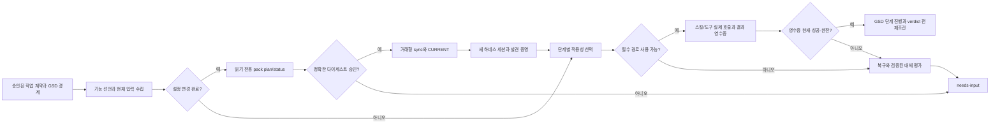

# Phase 18: Capability Fabric and Automatic Invocation - Research

**Researched:** 2026-10-03
**Domain:** GSD 단계별 기능 선택, 팩 활성화, 하네스 실측 영수증
**Confidence:** MEDIUM — 저장소 계약과 코드 경계는 직접 확인했으나 다섯 하네스의 새 실사용 영수증은 이 연구에서 실행하지 않았다. [VERIFIED: .planning/ROADMAP.md:213-228] [VERIFIED: docs/design/autonomous-work/VALIDATION.md:26-32]

<user_constraints>
## User Constraints (from CONTEXT.md)

## Implementation Decisions

### 설정 완료 감지와 팩 활성화
- **D-01:** 프로젝트 생성과 의존성 설치 등 연속된 설정 변경은 하나의 설정 작업으로 묶어 작업 종료 후 팩 계획·상태를 한 번 점검한다. 점검은 후속 애플리케이션 작업보다 먼저 끝나야 한다.
- **D-02:** 설정 작업이 실패했어도 파일이나 의존성 상태가 일부 변경됐다면 현재 상태의 팩 계획·상태를 읽기 전용으로 점검하고, 설정 실패를 해결하기 전까지 애플리케이션 작업을 멈춘다.
- **D-03:** 승인된 정확한 다이제스트로 팩을 동기화하고 `CURRENT`를 확인한 뒤에는 항상 새 에이전트 세션을 시작한다. 새 세션에서 프로젝트 전용 스킬과 MCP 도구의 발견을 다시 확인한다. 기존 세션의 도구 목록 재로드만으로 활성화를 주장하지 않는다.
- **D-04:** 초기 설정 이후 구현 중 manifest 또는 의존성이 다시 바뀌면, 변경을 묶을 수 있는 설정 작업 종료 후 다음 애플리케이션 작업 전에 팩을 재점검한다.
- **D-05:** 새 팩이나 변경된 계획의 동기화에는 해당 계획 다이제스트에 대한 구체적인 기존 승인 또는 새 사용자 승인이 필요하다. 이전 autopilot 동의나 오래된 승인으로 대체하지 않는다. 이 승인 경계는 기존 설계에서 이어받는다.

### 겹치는 기능의 선택과 결과 재사용
- **D-06:** 한 작업에 버전별 라이브러리 API 문서와 최신 외부 사례가 모두 필요하면 `documentation-lookup`/Context7과 `deep-research`/Exa·Firecrawl을 각각 호출해 서로 다른 근거를 결합한다.
- **D-07:** 승인된 프로젝트 전용 스킬과 전역 스킬이 같은 필요를 충족하면 프로젝트 전용 스킬을 우선한다. 중복된 전역 스킬을 생략한 이유를 기록한다. 서로 다른 근거가 필요한 경우에는 둘 다 선택한다.
- **D-08:** 작업 설명만으로 적용 여부가 불분명하면 계획, 저장소 파일, 현재 GSD 단계의 근거를 확인한다. 근거가 충분하면 기능을 선택하고, 필수 여부가 끝내 불분명하면 임의 호출이나 생략 대신 사용자 입력을 기다린다.
- **D-09:** 이전 GSD 단계에서 얻은 문서·외부 자료는 출처, 버전, 작업 범위가 그대로이고 현재 단계의 질문에도 충분할 때만 재사용한다. 현재 단계의 의무와 원래 실제 호출·결과 영수증을 명시적으로 연결한다. 출처·버전·범위 변경 또는 새 질문이 있으면 다시 호출한다. 재사용은 새 호출을 했다는 주장으로 기록하지 않는다.

### 필수 기능의 복구와 대체 경계
- **D-10:** 선택된 필수 기능을 사용할 수 없거나 호출이 실패하면 승인된 권한 안에서 현재 경로의 설정·발견 문제를 먼저 복구하고 재검증한다. 해결되지 않을 때 검증된 대체 경로를 평가한다.
- **D-11:** 대체 경로가 계약에 지정된 에이전트 역할이나 하네스를 바꿔야 한다면 대체 하네스, 달라지는 권한·비용·증거를 제시하고 새 계약 승인을 받기 전에는 전환하지 않는다.
- **D-12:** 다른 도구를 동등한 대체 경로로 인정하려면 같은 질문에 답할 수 있고 출처·버전·실제 호출 결과를 확인할 수 있어야 한다. 단순한 설치, 발견, 유사한 이름 또는 에이전트의 성공 주장만으로 대체 성공을 인정하지 않는다.
- **D-13:** 복구와 동등한 대체 경로가 실패한 뒤 사용자가 해결할 수 있는 조치가 남아 있으면 필요한 조치와 중단된 기능을 보여주고 `needs-input`에서 기다린다. 실행 가능한 경로가 없으면 구체적 사유와 함께 `blocked`로 기록한다.

### 호출 증거와 결과 표시
- **D-14:** 스킬이 MCP 도구 사용으로 이어지는 경우 스킬의 선택·활성화 증거와 MCP의 실제 호출·결과 영수증을 각각 확인하고 한 사용 경로로 연결한다. 한쪽만 확인된 경우 전체 경로를 사용했다고 판정하지 않는다.
- **D-15:** 실제 호출이 오류로 끝나면 호출 사실과 실패 결과를 별도로 표시하고 영수증을 보존한다. 실패를 성공한 사용으로 승격하지 않으며 오류와 복구·대체 경로 상태를 보여준다.
- **D-16:** 사람이 읽는 `task plan/status` 기본 화면은 이번 작업에 선택·실패·차단된 기능 및 주요 생략 이유를 요약한다. 전체 버전 결합 기능 목록, 적용·제외 상태와 이유는 별도 상세 보기와 JSON에서 확인할 수 있어야 한다.
- **D-17:** 하네스 버전, 팩 원본, manifest, 기능 원본 등 변경으로 증거가 무효가 되면 무엇이 바뀌었고 어떤 영수증이 무효가 됐는지, 재발견·재호출·재승인 중 필요한 다음 조치를 보여준다. 이전 영수증은 감사 기록으로 보존하되 현재 증명으로 재사용하지 않는다.

### the agent's Discretion
- 설정 작업의 시작·종료를 감지하고 연속 변경을 묶는 내부 이벤트 형식, 단 사용자에게 보이는 D-01·D-02·D-04 시점과 중단 규칙은 유지한다.
- 기능 간 중복 판단 및 결과 재사용을 위한 결정론적 데이터 표현, 단 D-06..D-09의 선택과 실제 영수증 연결 기준은 유지한다.
- 기본 요약, 상세 보기, JSON의 구체적인 필드 배열과 문구, 단 D-14..D-17의 상태와 증거를 빠짐없이 제공한다.

## Deferred Ideas

None — 논의된 사항은 모두 Phase 18 범위 안에 있다.
</user_constraints>

<phase_requirements>
## Phase Requirements

| ID | Description | Research Support |
|---|---|---|
| CAP-01 | 버전 결합 프로젝트별 전체 기능 목록과 설치·활성·미가용·제외 상태 | catalog/lock, 팩 3축 상태, 호스트 원장 및 하네스 역할 증거를 합성하는 읽기 전용 그래프. [VERIFIED: .planning/REQUIREMENTS.md:48-48] |
| CAP-02 | 설정 완료 점검, 다이제스트 승인·CURRENT·새 세션 | 설정 작업 경계 → plan/status → 승인 → sync → CURRENT → 새 세션 발견. [VERIFIED: .planning/REQUIREMENTS.md:49-49] |
| CAP-03 | GSD 경계에서 적용 기능 호출과 실제 결과 | 단계별 의무 및 호출 영수증을 판정 전제조건으로 연결. [VERIFIED: .planning/REQUIREMENTS.md:50-50] |
| CAP-04 | 변경 시 재선택, 복구·대체·명시적 중단 | 입력 지문 비교, 영수증 무효화, 복구와 needs-input/blocked 분기. [VERIFIED: .planning/REQUIREMENTS.md:51-51] |
| CAP-05 | 모든 선언 기능의 양·음성 픽스처와 다섯 하네스 실측 | 선언 기반 픽스처 완전성 검사, 버전별 호스트 지원 행렬. [VERIFIED: .planning/REQUIREMENTS.md:52-52] |
</phase_requirements>

## Summary

Phase 18의 성공 판정은 기능이 **목록에 있음 → 현재 작업에 적용됨 → 승인된 범위에서 활성화됨 → 해당 GSD 경계에서 실제 호출됨 → 결과가 성공함 → 같은 입력에 여전히 유효함**을 별도 증거로 연결해야 한다. 기존 팩 상태는 `deployment`, `nativeUse`, `support`의 별도 축이고, `nativeUse`의 정의는 `"discovered" | "invoked" | "unverified"`, 지원의 정의는 `"supported" | "unsupported" | "unverified"`이다. 이 값은 소스 정의를 그대로 옮겼다. [VERIFIED: src/types.ts:527-557] [VERIFIED: src/core/capability-ledger.ts:52-52] 설계 문서도 설치나 발견을 실제 사용으로 인정하지 않는다. [VERIFIED: docs/design/autonomous-work/README.md:15-23]

첫 구현 단면은 선언 목록과 증거 입력을 묶는 버전 결합 기능 그래프다. 그다음 설정 완료 신호와 팩 승인·새 세션을 연결하고, GSD 단계 의무·영수증·최종 판정을 붙인다. 현재 `runPackCheckpoint`는 읽기 전용이며 `task-run`이 의존성 변경 감사 후에만 호출한다. [VERIFIED: src/core/task-effects.ts:278-298] [VERIFIED: src/core/task-run.ts:930-972] `executeGsdStep`/다중 Phase 실행기는 존재하지만 검색된 생산 경로의 `startTask`와 수퍼바이저는 이를 직접 호출하지 않는다. 따라서 계획은 이 운영 연결을 명시적 작업으로 두어야 한다. [VERIFIED: src/core/task-gsd-lifecycle.ts:175-331] [VERIFIED: src/core/task-supervisor.ts:484-540] [VERIFIED: src/core/task-run.ts:749-870]

**Primary recommendation:** 하나의 결정론적 기능 의무 계획과 증거 검증기를 만들고, 설정·GSD·리뷰 경계에 연결한 뒤 그 검증 결과를 기존 `TaskPrecondition`으로 수락 판정에 주입한다. [VERIFIED: src/core/task-verdict.ts:14-27] [VERIFIED: src/core/task-verdict.ts:204-298]

## Architectural Responsibility Map

| Capability | Primary Tier | Secondary Tier | Rationale |
|---|---|---|---|
| 기능 선언·적용성·입력 지문 | alpha-AOS 코어 | catalog/lock | 선언과 결정 규칙은 호스트 발견과 분리해야 다이제스트가 호스트마다 달라지지 않는다. [VERIFIED: src/types.ts:542-548] |
| 프로젝트 팩 승인·동기화 | 프로젝트 계획/트랜잭션 | CLI | 기존 다이제스트 재검증과 거래형 쓰기를 재사용한다. [VERIFIED: src/core/project-pack-sync.ts:1282-1295] [VERIFIED: src/core/project-pack-sync.ts:1373-1404] |
| 새 세션 발견·실제 사용 | 하네스 어댑터 | capability ledger | 각 하네스의 실행·버전·호출 증거를 호스트 원장에 둔다. [VERIFIED: src/adapters/capability-oracle.ts:429-518] [VERIFIED: src/core/capability-ledger.ts:197-242] |
| GSD 경계 의무와 게이트 | task lifecycle / supervisor | verdict | GSD만 .planning 상태를 소유하고 alpha-AOS는 영수증을 검사한다. [VERIFIED: .planning/phases/17-gsd-lifecycle-bridge/17-CONTEXT.md:1-112] |
| 기본·상세·JSON 표시 | CLI / formatter | 코어 읽기 API | 기본 화면은 요약, 상세·JSON은 전체 증거를 드러낸다. [VERIFIED: src/cli.ts:1844-1868] [VERIFIED: src/format.ts:1332-1368] |

## Project Constraints (from AGENTS.md)

- GSD가 프로젝트 수명주기와 상태의 단일 권한자다. 연구의 구현 제안은 GSD 워크플로 진입과 게이트를 유지하고 `.planning/`을 별도 상태 엔진으로 복제하지 않는다. [VERIFIED: AGENTS.md:17-23]
- 사용자가 이번 세션에 전달한 AGENTS 실행 지침: 작업과 문맥은 필요한 제목·범위만 읽고 검색·출력을 제한한다. 설정 완료 후 `alpha-aos-control` 팩 평가를 수행한다.
- 사용자가 이번 세션에 전달한 AGENTS 실행 지침: 위임은 허가받은 경우에만 하고, 자식 소유 작업을 중복 수행하지 않는다. 쿼터 실패 때 맹목적 재시도나 미완료 작업 완료 처리를 하지 않는다.
- Windows/macOS/Linux 경로 처리, Node `">=24.0.0"`, npm `">=10.0.0"`, Git, 건조 실행·스냅샷·롤백, 비밀값 비기록, stable lock과 실측 호출 검증을 지킨다. 런타임 제약 값은 `package.json` 정의를 그대로 인용했다. [VERIFIED: AGENTS.md:15-23] [VERIFIED: package.json:44-46]
- 직접 저장소 편집은 GSD 워크플로에서 한다. Phase 18 실행 계획도 이에 맞춰야 한다. [VERIFIED: AGENTS.md:267-275]

## Standard Stack

| Component | Current in-repo version / contract | Use |
|---|---|---|
| Node.js, npm, TypeScript | `">=24.0.0"`, `">=10.0.0"`, `"typescript": "5.9.3"` | 기존 엄격 TypeScript, 빌드와 테스트. 정의 문자열 그대로. [VERIFIED: package.json:44-58] |
| `node:test`, `node:assert/strict` | Node 내장 | 기존 test/*.test.ts 픽스처와 같은 러너. [VERIFIED: package.json:29-35] [VERIFIED: test/task-gsd-lifecycle.test.ts:1-12] |
| `ajv` | `"ajv": "8.20.0"` | 새 영수증/그래프 JSON의 닫힌 스키마 검증을 기존 validation 경로에 합친다. 정의 문자열 그대로. [VERIFIED: package.json:43-48] [VERIFIED: src/core/task-hook-receipt.ts:75-106] |
| GSD + 안정 catalog/lock | `catalog/stack.yaml` → `catalog/stack.lock.json` | 프로젝트 상태 권한과 기능 선언·고정 입력. 이 파일명은 catalog의 `lock: catalog/stack.lock.json` 선언을 그대로 인용했다. [VERIFIED: catalog/stack.yaml:5-12] |
| 기존 capability ledger / canary / pack sync | 저장소 코드 | 발견과 호출의 호스트 증거, 팩 적용, 승인 다이제스트 검증. [VERIFIED: src/core/capability-ledger.ts:197-242] [VERIFIED: src/core/project-pack-sync.ts:1282-1404] |

**Installation:** 새 외부 패키지는 권장하지 않는다. 현재 phase의 필요한 런타임·검증 도구는 이미 `package.json`에 선언돼 있다. [VERIFIED: package.json:35-58] 새 패키지를 추가하기로 계획이 바뀌면 그때 공식 문서·정확한 registry 버전·legitimacy gate를 먼저 확인해야 한다. [ASSUMED]

## Package Legitimacy Audit

이 연구의 권장 구현은 새 외부 패키지 설치가 없다. 따라서 설치 대상 및 registry 검증 대상이 없다. [VERIFIED: package.json:35-58]

## Architecture Patterns

### System Architecture Diagram



이 흐름의 입력, 분기, 외부 하네스 경계와 수락 게이트는 Phase 18 결정 및 기존 검증기를 조합한 계획 제안이다. [VERIFIED: .planning/phases/18-capability-fabric-and-automatic-invocation/18-CONTEXT.md:1-114] [VERIFIED: src/core/task-verdict.ts:292-298]

### Recommended Project Structure

- `src/core/`: 기능 선언 합성, 의무 선택, 영수증 유효성 검사, setup 경계 관리. 기존 `project-plan.ts`, `task-effects.ts`, `task-gsd-lifecycle.ts`, `task-verdict.ts`를 재사용한다. [VERIFIED: src/core/task-effects.ts:278-298] [VERIFIED: src/core/task-gsd-lifecycle.ts:175-331]
- `src/adapters/`: 하네스별 새 세션 시작, 스킬/MCP 발견 및 실제 호출 관측. [VERIFIED: src/adapters/capability-oracle.ts:429-518] [VERIFIED: src/adapters/task-agents.ts:48-100]
- `schemas/`: 기능 의무·호출/결과 영수증의 닫힌 검증 계약. 기존 훅 영수증은 schema 검증 후 저장한다. [VERIFIED: src/core/task-hook-receipt.ts:75-106]
- `test/`: 선택 양·음성, 팩 전이, 다섯 하네스 증거, 실패 주입 픽스처. [VERIFIED: docs/design/autonomous-work/VALIDATION.md:7-32]

### Pattern 1: 선언과 호스트 증거의 분리

`catalog/stack.yaml`의 `globalSkills: [unified-memory, documentation-lookup, deep-research]`, `rolloutOrder: [context7, exa, firecrawl]`, owned skill 선언을 전체 목록의 시작점으로 사용한다. 선언 값은 소스 그대로 인용했다. [VERIFIED: catalog/stack.yaml:40-65] 팩별 스킬은 승인된 프로젝트 계획과 lock 출처를 결합하고, 하네스별 실제 상태는 원장과 역할 영수증에서 별도 합성한다. 호스트 사실을 승인용 계획 다이제스트에 넣지 않는 기존 원칙을 지킨다. [VERIFIED: src/types.ts:542-548] [VERIFIED: src/core/project-plan.ts:703-755]

### Pattern 2: 설정 작업은 하나의 장벽

설정 시작에서 manifest/lock/의존성 입력을 스냅샷으로 남기고, 연속 변경의 종료 또는 일부 변경 후 실패에서 한 번 plan/status를 수행한다. 점검이 끝나기 전 애플리케이션 실행을 막는다. 이 이벤트 표현은 설계 재량이나 D-01·D-02·D-04의 종료 시점·중단 규칙을 바꾸지 않는다. [VERIFIED: .planning/phases/18-capability-fabric-and-automatic-invocation/18-CONTEXT.md:1-114] 기존 `auditTaskEffects`의 `dependencyChanged`와 `dependencyPaths`는 한 탐지 입력이지만, 현재 호출 위치는 실행 이후이므로 장벽의 전부가 아니다. 이 값은 `TaskEffectAudit` 정의 그대로 인용했다. [VERIFIED: src/core/task-effects.ts:55-61] [VERIFIED: src/core/task-run.ts:930-972]

### Pattern 3: 단계별 의무 및 재사용

각 기능의 선언 ID, scope, source hash/version, 선택 근거, 권한, GSD step, 필수 여부, 필요 결과 질문을 정규화해 고정 순서로 계산한다. [ASSUMED] 이전 단계 자료 재사용은 원래 호출·결과 영수증 ID를 새 의무에 연결하고 출처·버전·범위·질문을 검사한다. 새 호출로 표시하지 않는다. [VERIFIED: .planning/phases/18-capability-fabric-and-automatic-invocation/18-CONTEXT.md:1-114] review는 `GsdStepKind = "discuss" | "plan" | "execute" | "verify"`에 아직 없으므로, review dispatch 경계에 별도 의무/영수증 연결을 계획해야 한다. 이 union은 정의 그대로 인용했다. [VERIFIED: src/core/task-gsd-lifecycle.ts:23-35] [VERIFIED: src/core/task-run.ts:1013-1082]

### Pattern 4: 결과 영수증을 판정에 연결

스킬 선택·활성화 증거와 MCP 호출·결과 증거를 별도 보존하고 동일 의무 ID에 묶는다. 오류 호출은 `invoked` 사실과 실패 결과를 분리한다. [VERIFIED: .planning/phases/18-capability-fabric-and-automatic-invocation/18-CONTEXT.md:1-114] 기존 `InvocationObservationEvidence.outcome = "ok" | "denied"`는 정의 그대로이며, proxy는 `client.callTool`이 반환한 다음 `"ok"` 관측을 남기므로 throw 또는 MCP `isError` 결과를 성공으로 오판하지 않도록 새 결과 계약을 설계·테스트해야 한다. [VERIFIED: src/core/capability-ledger.ts:161-169] [VERIFIED: src/core/mcp-proxy.ts:691-701] [VERIFIED: src/core/mcp-proxy.ts:822-829] 빠진 필수 영수증은 `TaskPrecondition.satisfied: false`로 넣으면 기존 reducer가 `"unknown"`으로 수락을 거부한다. 값은 소스 정의 그대로 인용했다. [VERIFIED: src/core/task-verdict.ts:14-27] [VERIFIED: src/core/task-verdict.ts:292-298]

### Anti-Patterns to Avoid

- 모델의 사용 주장 또는 설치·발견만으로 `invoked`나 성공을 만들지 않는다. [VERIFIED: docs/design/autonomous-work/README.md:15-23]
- 오래된 승인/영수증을 새 계획에 묵시적으로 적용하거나, 바뀐 팩을 자동 삭제하지 않는다. [VERIFIED: .planning/phases/18-capability-fabric-and-automatic-invocation/18-CONTEXT.md:1-114] [VERIFIED: AGENTS.md:18-23]
- 같은 질문의 프로젝트·전역 스킬을 이중 호출하지 않지만 서로 다른 증거 수집 경로는 결합한다. [VERIFIED: .planning/phases/18-capability-fabric-and-automatic-invocation/18-CONTEXT.md:1-114]
- 기존 세션의 도구 재로드를 새 세션 증명으로 대체하지 않는다. [VERIFIED: .planning/phases/18-capability-fabric-and-automatic-invocation/18-CONTEXT.md:1-114]

## Don't Hand-Roll

| Problem | Use existing seam | Why |
|---|---|---|
| 팩 근거 평가·계획 다이제스트·정확한 승인 | `planProjectCapabilities`, `approveProjectPlan`, `planProjectPackSync` | 기존 승인/드리프트 계약 보존. [VERIFIED: src/core/task-effects.ts:281-298] [VERIFIED: src/cli.ts:1360-1445] |
| 팩 파일 동기화·롤백 | `applyProjectPackSync`와 `applyFileTransaction` | 소스 해시·목적지 해시·스냅샷을 함께 검증한다. [VERIFIED: src/core/project-pack-sync.ts:1282-1404] |
| 하네스 발견과 실행 유계화 | `runDiscoveryOracle`, 역할 어댑터, `runProcess` | 기존 command/env/timeout 경계를 유지한다. [VERIFIED: src/adapters/capability-oracle.ts:429-518] |
| 훅 영수증·최종 수락 감소 | `executeHookWithReceipt`, `reduceTaskVerdict` | 별도 성공 규칙을 만들면 거짓 완료 경로가 생긴다. [VERIFIED: src/core/task-hook-receipt.ts:171-248] [VERIFIED: src/core/task-verdict.ts:204-298] |

## Common Pitfalls

1. **체크포인트가 너무 늦음:** 현재 `runPackCheckpoint`는 실행 뒤 의존성 변경 감사에서 호출된다. 설정과 애플리케이션 작업을 같은 dispatch에서 수행하면 D-01을 충족하지 못한다. 설정 종료 장벽을 실행 경계 앞에 둔다. [VERIFIED: src/core/task-run.ts:930-972]
2. **오류 호출의 성공 승격:** MCP `client.callTool`의 반환만 `"ok"` 관측하며 `isError`와 throw가 구분되지 않는다. 성공/실패 결과를 닫힌 영수증 상태로 모델링하고 실제 응답 검사를 한다. [VERIFIED: src/core/mcp-proxy.ts:691-701] [VERIFIED: src/core/capability-ledger.ts:161-169]
3. **GSD 단계 모듈만 검증:** `executeGsdStep`는 테스트에서 호출되지만 실제 task dispatcher와 수락 path에서 직접 호출되는 경로가 검색되지 않았다. 계획과 E2E 테스트가 운영 호출을 증명해야 한다. [VERIFIED: test/task-gsd-lifecycle.test.ts:62-156] [VERIFIED: src/core/task-supervisor.ts:484-540]
4. **다섯 하네스 지원 과장:** 기존 discovery oracle 정의는 `antigravity: null`, `pi: null`, `hermes: null`로 되어 있다. 이는 해당 oracle 경로의 현재 정의이며 그 하네스 전체의 사용 불가 선언은 아니다. 각 기능별 정확한 버전 실측 또는 `unverified`를 표시한다. 값은 소스 그대로 인용했다. [VERIFIED: src/adapters/capability-oracle.ts:313-325]
5. **원본 변경 뒤 오래된 증거 사용:** 원장 proof의 `boundInputs`, `harnessVersion`, `invocationEvidence`를 현재 입력과 비교하고 무엇이 무효인지 표시한다. 이전 증거는 감사용으로 둔다. 필드명은 정의 그대로 인용했다. [VERIFIED: src/core/capability-ledger.ts:197-234]

## Code Examples

계획자가 따라야 할 기존 패턴의 최소 호출 순서:

```typescript
// Existing source: src/core/task-effects.ts:281-298
const plan = await planProjectCapabilities(planOptions);
const ledger = await readCapabilityLedger(capabilityLedgerPath(stateRoot));
await reconcileProjectState(planOptions, ledgerHostEvidence(ledger));
```

위 식별자들은 기존 함수와 변수 정의에 있다. setup 장벽, 승인·sync, 새 세션과 필수 영수증 검사까지 위 코드만으로 완료된다고 해석하면 안 된다. [VERIFIED: src/core/task-effects.ts:281-298]

```typescript
// Existing source: src/core/task-run.ts:1143-1157
const verdict = reduceTaskVerdict({
  contract,
  artifactDigest: artifact.digest,
  measurements,
  review,
  confirmations,
  preconditions,
  refusal: artifactChanged ? "stale-artifact" : null,
});
```

`"stale-artifact"`는 소스 코드의 정확한 값이며 새 기능 의무 검증은 `preconditions`를 구성하기 전에 들어가야 한다. [VERIFIED: src/core/task-run.ts:1143-1157] [VERIFIED: src/core/task-verdict.ts:292-298]

## Implementation Order

1. **목록과 계약:** catalog/lock, 팩, 스킬, MCP, 제어 명령, GSD, native 도구, 훅을 빠짐없이 열거하고 적용·제외 이유를 정규화한다. 선언 1개당 양·음성 fixture를 요구한다. [VERIFIED: .planning/REQUIREMENTS.md:48-52]
2. **설정 장벽:** 설정 작업 종료 및 부분 실패 탐지, 읽기 전용 plan/status, 정확한 다이제스트 승인/대기, sync/CURRENT 검증을 연결한다. [VERIFIED: .planning/phases/18-capability-fabric-and-automatic-invocation/18-CONTEXT.md:1-114]
3. **새 세션:** 선택된 하네스의 별도 세션 식별자를 발급하고 프로젝트 스킬·MCP를 재발견한 후 적용을 허용한다. 발견 불가 셀은 정직하게 미증명 또는 차단한다. [VERIFIED: .planning/phases/18-capability-fabric-and-automatic-invocation/18-CONTEXT.md:1-114] [VERIFIED: docs/design/autonomous-work/VALIDATION.md:9-12]
4. **GSD 의무:** discuss/plan/execute/verify 실행기와 별도 review dispatch 앞뒤에 선택·호출·영수증 검사를 설치하고 필수 누락을 verdict precondition에 반영한다. [VERIFIED: src/core/task-gsd-lifecycle.ts:23-35] [VERIFIED: src/core/task-run.ts:1013-1157]
5. **변경·복구:** phase/task/manifest/lock/source/harness/tool 입력 지문을 재계산해 관련 영수증을 무효화하고, 현재 경로 복구 → 검증된 대체 → needs-input/blocked 순서로 분기한다. [VERIFIED: .planning/phases/18-capability-fabric-and-automatic-invocation/18-CONTEXT.md:1-114]
6. **표시·증명:** 기본 요약, 전체 상세/JSON, 다섯 하네스 실측 행렬과 실제 GSD 다단계 추적을 닫는다. [VERIFIED: .planning/ROADMAP.md:223-228]

## Assumptions Log

| # | Claim | Section | Risk if Wrong |
|---|---|---|---|
| A1 | 새로운 의무 그래프는 기존 TypeScript/AJV/Node 도구만으로 구현하고 외부 패키지를 추가하지 않는다. [ASSUMED] | Standard Stack | 설계 변경 시 패키지 검증과 설치 계획 추가 |
| A2 | 기능 의무 ID·입력 지문·영수증 연결을 신규 코어 타입으로 정규화한다. [ASSUMED] | Architecture Patterns | 기존 스키마와의 호환 설계 필요 |
| A3 | 실제 하네스 세션을 CI에서 모두 시작할 수 있다. [ASSUMED] | Validation Architecture | 불가능한 셀은 실호스트 검증 게이트 또는 unverified로 유지 |

## Open Questions

1. **RESOLVED — 실제 다섯 하네스 호스트 영수증 범위:** 구현 전에 호스트/모델/자격증명의 사용 가능성을 가정하지 않는다. `18-07`은 다섯 하네스의 정확한 executable/version/OS/session별 발견과 의미 있는 읽기 전용 호출·결과를 시도하고, 실측 성공한 셀만 광고한다. 미실행/접근 불가 셀은 이유를 붙인 `unverified`, 네이티브 경로가 없음이 입증된 셀은 `unsupported`로 둔다. 합성 fixture는 실제 호스트 지원을 승격하지 않는다. 실호스트 호출 여부 자체는 실행 시 확인하므로 이 연구가 실측했다고 주장하지 않는다. [VERIFIED: docs/design/autonomous-work/VALIDATION.md:26-32]
2. **RESOLVED — MCP 오류 결과 계약:** 관측 결과는 `"ok" | "denied" | "tool-error" | "transport-error"`로 구분한다. `client.callTool`의 `isError: true`는 `tool-error`, throw는 `transport-error`, 정책 거부는 `denied`이며 호출 시도 ID와 결과를 분리한다. 새 성공 증명에는 원본 결과 digest와 의무·세션 연결이 필수다. 기존 `ok|denied` 레코드는 읽기/감사 호환성을 유지하되 결과 digest가 없으면 새 필수 의무의 엄격한 성공으로 승격하지 않는다. `18-04`의 proxy 두 호출 경로와 영수증 schema가 이 계약을 구현한다. [VERIFIED: src/core/mcp-proxy.ts:420-427] [VERIFIED: src/core/mcp-proxy.ts:691-701]
3. **RESOLVED — 설정 완료 관찰 경계:** controller의 설정 작업(scaffolding, manifest 또는 dependency 변경)은 하나의 구간으로 분리해 시작 전 입력 스냅샷과 종료 시 effect-audit 변경 집합을 비교한다. controller dispatch가 정상 종료하거나 일부 상태를 바꾼 채 실패하면 해당 구간은 종료되며 읽기 전용 pack plan/status를 정확히 한 번 수행한다. 같은 dispatch에서 앱 작업까지 이어질 수 없도록 다음 애플리케이션 dispatch 전에 장벽을 검사하고, 혼합 작업은 설정 경계에서 분할하거나 중단한다. 부분 실패는 점검 후에도 앱 작업을 멈춘다. 재개 시 저장된 구간 ID와 effect 집합으로 점검 중복을 피하되 새로운 변경은 새 구간으로 분류한다. `18-03`의 순서·부분 실패 fixture가 관찰 가능성을 검증한다. [VERIFIED: src/core/task-run.ts:864-972] [VERIFIED: .planning/phases/18-capability-fabric-and-automatic-invocation/18-CONTEXT.md:1-114]

## Environment Availability

| Dependency | Required By | Available | Version / Evidence | Fallback |
|---|---|---|---|---|
| Node.js | 빌드·테스트·CLI | ✓ | `v24.13.1` 실측; 요구 `">=24.0.0"`. [VERIFIED: local `node --version`] [VERIFIED: package.json:35-41] | — |
| npm | 빌드·테스트 | ✓ | `11.8.0` 실측; 요구 `">=10.0.0"`. [VERIFIED: local `npm --version`] [VERIFIED: package.json:35-41] | — |
| Git | 상태·리비전 대조 | ✓ | `2.55.0.windows.3` 실측. [VERIFIED: local `git --version`] | — |
| 다섯 하네스 및 MCP 계정 | CAP-05 실호스트 증거 | 미확인 | 이 연구에서는 실행/결제되는 프로브를 수행하지 않았다. [ASSUMED] | 미실행 셀은 `unverified`; 광고 전 실측 |

**Missing dependencies with no fallback:** 현재 확인된 것은 없다. 하네스 실측 가능성은 미확인으로 남아 있다. [ASSUMED]

## Validation Architecture

### Test Framework

| Property | Value |
|---|---|
| Framework | Node 내장 `node:test` + TypeScript 5.9.3. [VERIFIED: test/task-gsd-lifecycle.test.ts:1-8] [VERIFIED: package.json:56-58] |
| Config file | `tsconfig.json`, `scripts/run-tests.mjs`. [VERIFIED: package.json:29-35] |
| Quick run command | `npm run build && node --test dist/test/task-effects.test.js dist/test/task-gsd-lifecycle.test.js dist/test/task-run.test.js` — 새 파일명은 구현 때 보강. [ASSUMED] |
| Full suite command | `npm test`, 추가로 `npm run check`. [VERIFIED: package.json:29-35] |

### Phase Requirements → Test Map

| Req | Meaningful test | File / gate |
|---|---|---|
| CAP-01 | 선언 전수와 상태 축/버전·제외 이유의 결정론적 JSON snapshot; 미선언 기능 누락 시 실패. [VERIFIED: .planning/REQUIREMENTS.md:48-48] | 새 `test/task-capability-inventory.test.ts` [ASSUMED] |
| CAP-02 | scaffolding+install을 한 번 묶고 앱 작업 전 checkpoint; 부분 실패 시 읽기 전용 점검·정지; stale/unapproved digest 거부; CURRENT 뒤 새 sessionId로 발견. [VERIFIED: .planning/ROADMAP.md:223-228] | 기존 `test/task-effects.test.ts`, `test/project-pack-sync.test.ts` 확장 및 통합 픽스처. [VERIFIED: test/task-effects.test.ts:1-8] [VERIFIED: test/project-pack-sync.test.ts:1-8] |
| CAP-03 | 각 GSD 경계와 review에 필수 호출·결과를 주입하고 빈/실패 영수증 때 성공 금지; Context7, Exa/Firecrawl, memory 경로 분리. [VERIFIED: .planning/ROADMAP.md:223-228] | 기존 `test/task-gsd-lifecycle.test.ts`, `test/task-run.test.ts`, `test/canary.test.ts` 확장. [VERIFIED: test/task-gsd-lifecycle.test.ts:1-8] [VERIFIED: test/task-run.test.ts:1-8] [VERIFIED: test/canary.test.ts:1-8] |
| CAP-04 | phase·manifest·pack·source·harness version·tool 변화 하나씩 주입해 재선택·무효 증거·복구/대체/대기·차단 확인. [VERIFIED: .planning/REQUIREMENTS.md:51-51] | 새 `test/task-capability-drift.test.ts` [ASSUMED] |
| CAP-05 | 선언당 matching/nonmatching fixture 완전성, 다섯 하네스별 installed/discovered/invoked/unsupported/unverified와 실제 결과 영수증; 성공 exit만으로 통과 금지. [VERIFIED: .planning/ROADMAP.md:223-228] | 기존 `test/capability-oracle.test.ts`, `test/capability-ledger.test.ts`, `test/task-gsd-adversarial.test.ts` 확장 + 실호스트 영수증 게이트. [VERIFIED: test/capability-oracle.test.ts:1-8] [VERIFIED: test/capability-ledger.test.ts:1-8] [VERIFIED: test/task-gsd-adversarial.test.ts:1-8] |

### Sampling Rate

- 작업마다 관련 `node --test dist/test/<해당 파일>.js` 실행 전에 빌드한다. 파일명은 계획에서 확정한다. [ASSUMED]
- wave마다 `npm run check`와 해당 통합 테스트를 수행하고, Phase 게이트에서 `npm test`를 실행한다. 스크립트 정의는 `package.json`에 있다. [VERIFIED: package.json:29-35]
- 최종 실호스트 행렬은 CLI/GUI 실제 영수증을 별도로 보관한다. 합성 픽스처로 광고 지원을 승격하지 않는다. [VERIFIED: docs/design/autonomous-work/VALIDATION.md:26-32]

### Wave 0 Gaps

- [ ] 전체 선언 목록과 양·음성 fixture의 coverage manifest; 새 catalog/스키마 필드가 늘 때 fixture 누락을 실패시킨다. [ASSUMED]
- [ ] 호출·결과·실패 영수증 닫힌 schema와 오래된 원장 proof 읽기 호환 fixture. [VERIFIED: src/core/capability-ledger.ts:216-222]
- [ ] setup 부분 실패/새 세션/5-harness fake adapter 통합 fixture; 실호스트 실행은 별도 검증. [ASSUMED]
- [ ] 운영 `startTask` → GSD lifecycle → 필수 의무 → verdict의 한 E2E trace. [VERIFIED: src/core/task-run.ts:749-1157] [VERIFIED: docs/design/autonomous-work/VALIDATION.md:26-32]

## Security Domain

### Applicable ASVS Categories

OWASP ASVS 5 기준 장 번호를 사용한다. ASVS는 웹 애플리케이션 검증 표준이므로 아래 CLI·하네스 통제 연결은 프로젝트의 보안 설계에 대한 유추 적용이다. [CITED: https://cornucopia.owasp.org/taxonomy/asvs-5.0]

| ASVS 5 category | Applies | Phase control |
|---|---|---|
| V2 Validation and Business Logic | 예 | 외부/하네스 출력은 데이터로 취급하고 닫힌 스키마·다이제스트로 검증한다. [CITED: https://cornucopia.owasp.org/taxonomy/asvs-5.0] [VERIFIED: src/core/task-hook-receipt.ts:75-106] |
| V6 Authentication | 간접 | MCP/하네스 자격증명은 이름만 기록하며 실제 권한은 기존 환경 경계 사용. [CITED: https://cornucopia.owasp.org/taxonomy/asvs-5.0] [VERIFIED: src/core/capability-ledger.ts:65-77] |
| V7 Session Management | 예 | 팩 변경 뒤 새 세션 ID와 새 발견 영수증을 요구한다. [CITED: https://cornucopia.owasp.org/taxonomy/asvs-5.0] [VERIFIED: .planning/phases/18-capability-fabric-and-automatic-invocation/18-CONTEXT.md:1-114] |
| V8 Authorization | 예 | 계약 권한·팩 다이제스트·하네스 역할 변경 재승인을 검사한다. [CITED: https://cornucopia.owasp.org/taxonomy/asvs-5.0] [VERIFIED: .planning/phases/18-capability-fabric-and-automatic-invocation/18-CONTEXT.md:1-114] |
| V11 Cryptography | 예 | 기존 SHA-256과 스냅샷/영수증 검증을 재사용한다. [CITED: https://cornucopia.owasp.org/taxonomy/asvs-5.0] [VERIFIED: src/core/task-hook-receipt.ts:67-70] [VERIFIED: src/core/project-pack-sync.ts:1282-1404] |
| V13 Configuration, V14 Data Protection | 예 | 팩 동기화의 승인·드리프트·비밀값 비기록을 검증한다. [CITED: https://cornucopia.owasp.org/taxonomy/asvs-5.0] [VERIFIED: AGENTS.md:19-23] |

### Known Threat Patterns

| Pattern | STRIDE | Standard mitigation |
|---|---|---|
| 오래된 다이제스트 승인으로 새 팩 적용 | Tampering | 재계산한 plan digest와 승인 digest 정확히 대조. [VERIFIED: src/cli.ts:1360-1445] |
| 모델 주장만으로 도구 성공 수락 | Spoofing | 하네스·MCP 실행 결과 영수증과 유효 지문 검사. [VERIFIED: docs/design/autonomous-work/README.md:15-23] |
| 비밀값이 진단/원장에 저장됨 | Information disclosure | 구조화된 변수명·fingerprint만 기록하고 credential 값 필드 금지. [VERIFIED: src/core/capability-ledger.ts:65-77] |
| 두 컨트롤러가 GSD 상태 작성 | Tampering | 기존 배타적 controller lease 유지. [VERIFIED: src/core/task-run.ts:7-7] [VERIFIED: .planning/phases/16-composable-harness-roles/16-CONTEXT.md:1-112] |

## Sources

### Primary (HIGH claim provenance, tool 확인)

- `.planning/phases/18-capability-fabric-and-automatic-invocation/18-CONTEXT.md`, `.planning/REQUIREMENTS.md`, `.planning/ROADMAP.md` — 확정 결정·CAP-01..05·성공 기준. [VERIFIED: .planning/phases/18-capability-fabric-and-automatic-invocation/18-CONTEXT.md:1-114] [VERIFIED: .planning/REQUIREMENTS.md:48-52] [VERIFIED: .planning/ROADMAP.md:213-228]
- `docs/design/autonomous-work/{README,WORKFLOW,VALIDATION}.md` — 승인·새 세션·단계 적용·5-harness 검증 계약. [VERIFIED: docs/design/autonomous-work/README.md:15-23] [VERIFIED: docs/design/autonomous-work/WORKFLOW.md:19-42] [VERIFIED: docs/design/autonomous-work/VALIDATION.md:7-32]
- `src/core/task-effects.ts`, `project-pack-sync.ts`, `task-gsd-lifecycle.ts`, `task-run.ts`, `capability-ledger.ts`, `task-verdict.ts`, `src/adapters/capability-oracle.ts` — 구현 경계와 정의. [VERIFIED: src/core/task-effects.ts:278-298] [VERIFIED: src/core/task-run.ts:930-972]

### Secondary

- [OWASP ASVS 5 taxonomy](https://cornucopia.owasp.org/taxonomy/asvs-5.0) — 현재 장 번호 확인. [CITED: https://cornucopia.owasp.org/taxonomy/asvs-5.0]

## Metadata

**Confidence breakdown:** 기존 스택 HIGH(직접 정의 확인), 운영 연결 MEDIUM(코드 확인, 미실행), 5-harness 광고 가능 셀 LOW(실호스트 새 영수증 미수집). 이 등급은 연구 상태 평가다. [VERIFIED: src/core/task-gsd-lifecycle.ts:175-331] [VERIFIED: docs/design/autonomous-work/VALIDATION.md:26-32]
**Research date:** 2026-10-03
**Valid until:** 2026-11-02 — 저장소 수정 또는 하네스 버전 변경 시 즉시 재검토. [ASSUMED]
