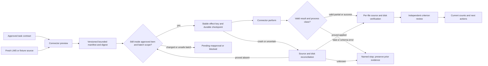

# Phase 20: General Tool Connectors — Research

**Researched:** 2026-10-09  
**Domain:** Versioned non-code task connectors and CoursePilot materials evidence  
**Confidence:** MEDIUM — the existing alpha-AOS and installed CoursePilot sources are directly inspected; live LMS behavior and multi-attachment completeness remain unproven.

<user_constraints>
## User Constraints (from CONTEXT.md)

### Locked Decisions

### 목록 변경과 재승인
- **D-01:** 승인된 미리보기 뒤 새 LMS 자료가 발견되면 이번 실행에 자동 포함하지 않는다. 기존 승인 항목은 계속 진행하고 새 자료는 보류해 새 미리보기와 승인을 받는다.
- **D-02:** 승인된 자료가 실행 전 새 목록에서 사라지면 그 자료를 `미확인`으로 보고하고 나머지 독립된 승인 항목은 진행한다. 사라진 자료를 저장 성공으로 세지 않는다.
- **D-03:** 자료 ID가 같아도 파일명이나 첨부파일 목록이 바뀌면 변경된 자료만 보류해 다시 미리보기한다. 변경 전 승인을 새 파일의 다운로드 권한으로 해석하지 않는다.
- **D-04:** 재승인 화면에는 현재 승인 범위의 전체 과목·주차·자료 목록과 추가·삭제·변경된 항목을 함께 보여준다. 변경 항목을 강조해 사용자가 차이를 볼 수 있게 한다.

### 저장 성공 기준
- **D-05:** 출처와 실제 파일 존재가 검증된 기존 파일은 `저장 확인` 합계에 포함하되, 이번 실행에서 새로 다운로드한 파일 수와 기존 확인 파일 수를 분리한다. 단순 예정 경로, LMS 완료, `planned`, `viewed_only`는 저장 증거가 아니다.
- **D-06:** 자료 하나의 첨부파일 중 일부만 검증되면 검증된 파일은 파일별 성공으로 보존하고 자료 항목은 `부분 완료`로 표시한다. 자료 항목 전체의 충족은 필요한 파일이 모두 검증된 경우에만 인정한다.
- **D-07:** 서로 다른 자료 항목이 한 로컬 파일을 참조하면 물리적인 저장 파일 수는 한 번만 센다. 각 자료 항목은 해당 LMS 출처와 파일 연결을 독립적으로 검증한 경우에만 충족 수에 포함한다. 파일 수와 충족된 자료 항목 수를 별도로 보고한다.
- **D-08:** 재개 시점과 최종 보고 직전에 저장 파일을 다시 확인한다. 파일이 이동·삭제되었거나 검증할 수 없으면 현재 저장 성공 수에서 제외하고 해당 항목을 미해결로 돌린다. 과거 성공 기록은 감사 증거로 보존할 수 있지만 현재 성공으로 사용하지 않는다.

### 부분 실패와 재시도
- **D-09:** 한 과목의 조회 또는 다운로드가 실패해도 다른 과목의 독립된 승인 항목은 계속 처리한다. 확인된 성공 증거를 보존하고 실패 과목과 다음 조치를 분리한다. CoursePilot의 전역 치명적 오류나 계약·스키마 오류는 기존 fail-closed 규칙에 따라 중단한다.
- **D-10:** 일시적인 파일별 실패는 승인된 자원 한도 안에서 실패 파일만 자동 재시도한다. 이미 검증된 파일은 다시 다운로드하지 않는다. 같은 실패가 반복되면 Phase 15의 비진행·중단 정책을 적용한다. 효과 결과가 불확실한 경우에는 먼저 출처와 파일을 조정하며, 조정 불가능한 `unknown`을 임의 재시도하지 않는다.
- **D-11:** CoursePilot의 `viewed_only`는 미저장으로 남기고 수동 확인 조치를 표시한다. 동일한 결과를 자동 반복하지 않으며, LMS 자료 상태가 바뀐 경우 새 미리보기와 승인 범위를 확인한다.
- **D-12:** 유효한 결과 JSON에서 `downloaded`라고 보고했더라도 `saved_path`의 실제 파일이 없으면 해당 파일만 검증 실패로 처리하고 성공 수에서 제외한다. 다른 파일의 유효한 검증 결과는 보존한다. 이는 항목별 검증 실패이며, 알 수 없는 스키마 버전이나 구조적으로 잘못된 결과를 수락한다는 뜻은 아니다.

### 결과 보고
- **D-13:** 결과는 전체 집계부터 보여준 뒤 과목·주차별 파일 상세를 표시한다. 신규 다운로드, 기존 확인, 미저장, 오류 수를 구분한다.
- **D-14:** 미저장 자료는 `viewed_only`, 다운로드 오류, 파일 검증 실패, 승인 후 목록 변경·소실 등 원인별 상태와 해당 다음 조치를 파일 또는 자료 항목에 연결해 표시한다.
- **D-15:** `저장 확인 / 대상` 진행률의 분모는 승인된 자료 목록이다. 이후 발견된 미승인 자료는 분모에 섞지 않고 `승인 대기`로 별도 표시한다.
- **D-16:** 보고서 마지막에는 미해결 자료별 다음 조치를 나열하고 자동 재시도 예정, 수동 확인 필요, 재승인 필요, 실행 차단을 구분한다. 전체 결과가 부분 완료 또는 차단 상태인지도 명확하게 표시한다.

### the agent's Discretion
- 내부 manifest, 파일 정체성 증거, 상태 코드의 구체적인 자료 구조와 표시 순서. 위 항목별 판단, 승인 경계, 현재 파일 검증, 정확한 집계는 유지한다.
- 승인된 한도와 기존 비진행 규칙 안에서 일시적 오류의 재시도 간격과 횟수. 성공 항목의 중복 실행과 불확실한 효과의 맹목적 재시도는 허용하지 않는다.

### Deferred Ideas (OUT OF SCOPE)

None — discussion stayed within Phase 20 scope.
</user_constraints>

<phase_requirements>
## Phase Requirements

| ID | Description | Research Support |
|---|---|---|
| TOOL-01 | Versioned non-code connector previews bounded item/effect manifest and independently verifies required outcomes. | Connector-owned envelope/schema, generic fixture, per-item evidence and review binding below. [VERIFIED: .planning/REQUIREMENTS.md:64-64] |
| TOOL-02 | CoursePilot material downloads reconcile actual saved files against a fresh manifest; planned/LMS completion/viewed-only are excluded. | Runtime resolver, strict material parser, batch-scope guard, file verification below. [VERIFIED: .planning/REQUIREMENTS.md:65-65] |
| TOOL-04 | Partial/fatal/schema errors remain item-specific and source content remains data. | Error taxonomy, bounded parsing, adversarial tests below. [VERIFIED: .planning/REQUIREMENTS.md:67-67] |
</phase_requirements>

## Summary

Build a **connector-owned protocol v1** around `preview`, `perform`, `reconcile`, and `verify`, and route its evidence into the existing contract digest, effect ledger, supervisor, independent reviewer, and criterion verdict. The current contract is development-only: the source declares `category: "development"`, `scope.workflow: "gsd-quick"`, measurement `kind: "cli-json"`, and effects `"workspace-write" | "local-commit" | "dependency-change"`; its JSON schema enforces the same constraints. [VERIFIED: src/core/task-contract.ts:19-45,64-76; schemas/task-contract.schema.json:62-95] The current `startTask` requires a clean Git baseline and GSD quick readiness, then derives artifact and effect evidence from repository files and commits, so a non-code branch needs its own measured artifact path while preserving common approval and review gates. [VERIFIED: src/core/task-run.ts:806-845,974-988,1155-1175,1518-1534]

The installed CoursePilot `materials` output is **not a versioned JSON envelope**: the source model has aggregate counters and `courses`, but no `schema_version`; the local JSON contract says the same. [VERIFIED: D:/dev/coursePilot/src/coursepilot/materials/models.py:58-69; C:/Users/alpha/.codex/skills/coursepilot/JSON_CONTRACT.md:99-115] Consequently, pin an adapter contract version and inspected skill/JSON_CONTRACT digest, validate the observed material shape, and refuse unknown adapter/contract versions. Do not pretend that the upstream `materials` payload carries a schema marker. [ASSUMED — recommended adapter design]

**Primary recommendation:** Implement the generic fixture and versioned evidence core first, then plug CoursePilot into it behind a course/week batch-scope guard and source-bound per-file verifier. [ASSUMED — implementation ordering]

## Project Constraints (from AGENTS.md)

- GSD Core `standard` owns project lifecycle/state; connector journal and receipts stay in alpha-AOS managed state. [VERIFIED: AGENTS.md:15-23,265-275]
- Keep Windows, macOS, and Linux portability with Node.js `>=24.0.0`, npm `>=10.0.0`, and Git. [VERIFIED: AGENTS.md:15-16]
- Mutation must be previewable, root-bounded, snapshotted, and rollback-aware; stale evidence cannot trigger deletion. [VERIFIED: AGENTS.md:19-20]
- Never place credential values in contracts, manifests, journals, command arguments, or repository files; use reviewed environment allowance. [VERIFIED: AGENTS.md:21]
- Use named TypeScript APIs, `.js` relative imports, strict typing, focused Node tests, and `npm run check`; use the existing process/validation infrastructure. [VERIFIED: AGENTS.md:91-121]
- GSD workflow must start before repository edits; this document is an artifact of the active GSD phase planning workflow. [VERIFIED: AGENTS.md:265-275]

## Architectural Responsibility Map

| Capability | Primary Tier | Secondary Tier | Rationale |
|---|---|---|---|
| Approval-bound item manifest | Local task control plane | CoursePilot CLI | alpha-AOS owns authorization; CoursePilot supplies observed LMS data. [CITED: docs/design/autonomous-work/README.md] |
| Download execution | CoursePilot CLI | Local supervisor | CoursePilot performs the LMS operation; supervisor records stable keys and bounds. [CITED: docs/design/autonomous-work/README.md] |
| Saved-file verification | Local connector verifier | Local filesystem | File and source identity must be checked independently of a tool success claim. [CITED: docs/design/autonomous-work/VALIDATION.md] |
| Acceptance/review | Local task verdict/reviewer | GSD workflow | Alpha-AOS measures and reviews; GSD alone changes project lifecycle state. [CITED: docs/design/autonomous-work/README.md] |

## Standard Stack

| Component | Version in project/runtime | Use |
|---|---|---|
| Node.js built-in process/filesystem/crypto/test | runtime `v24.13.1` observed; project engine `>=24.0.0` | Bounded process, hashing, file verification, tests. [VERIFIED: package.json:44-47; local `node --version` 2026-10-09] |
| TypeScript | pinned `5.9.3` | Typed connector API and compile check. [VERIFIED: package.json:48-59] |
| Ajv | pinned `8.20.0` | Validate connector-owned JSON schemas and received shape; compile schema, inspect validation errors. [VERIFIED: package.json:48-59] [CITED: https://ajv.js.org/guide/getting-started] |
| Installed CoursePilot skill and CLI | local skill resolved at runtime; CLI implementation inspected 2026-10-09 | Read-only dry-run and approved materials execution. [VERIFIED: C:/Users/alpha/.codex/skills/coursepilot/SKILL.md:1-39; D:/dev/coursePilot/src/coursepilot/cli.py:694-791] |

No new package is required by this recommendation. The project already pins the listed npm packages; this phase should not add package installation or a package legitimacy gate unless implementation introduces a new dependency. [VERIFIED: package.json:48-59] [ASSUMED — implementation recommendation]

## Architecture Patterns

### System Architecture Diagram



### Component Responsibilities and touchpoints

| Component | Recommended touchpoint | Responsibility |
|---|---|---|
| Contract and schema | `src/core/task-contract.ts`, `schemas/task-contract.schema.json` | Add a discriminated general category, connector/version/manifest identity, an outcome measurement, and an external download effect; include all authority fields in digest and drift checks. [VERIFIED: src/core/task-contract.ts:64-111,460-509,519-542; schemas/task-contract.schema.json:62-95] [ASSUMED — proposed edit] |
| Connector protocol and fixture | new `src/core/task-connector.ts`, `schemas/task-connector.schema.json`, focused tests | Pure normalized item/effect/evidence types, closed v1 schema, generic non-Git fixture. [ASSUMED — proposed files] |
| CoursePilot adapter | new `src/adapters/coursepilot-task.ts`, focused tests | Runtime skill/contract resolution, exact CLI argv, strict bounded parse, output normalization, batch guard. [ASSUMED — proposed file] |
| Effect and recovery | `src/core/task-effects.ts`, `src/core/task-supervisor.ts` | Persist per-item stable keys before action, dispatch connector reconciliation on resume, block unknown. [VERIFIED: src/core/task-effects.ts:457-625; src/core/task-supervisor.ts:297-356] |
| Evidence and verdict | `src/core/task-run.ts`, `src/core/task-verdict.ts`, `src/core/task-review-evidence.ts` | General artifact digest over manifest plus current evidence, per-criterion measurement, exact-revision review. [VERIFIED: src/core/task-run.ts:1155-1175,1518-1534; src/core/task-verdict.ts:245-310] [ASSUMED — proposed integration] |
| Human/JSON output | `src/format.ts`, `src/cli.ts` | Aggregate then course/week/item detail and next actions; Phase 21 owns the full persistent operator CLI. [CITED: .planning/phases/20-general-tool-connectors/20-CONTEXT.md] [ASSUMED — proposed edit] |

### Protocol and identity pattern

Use a connector-owned immutable preview containing protocol version, connector identity and local contract fingerprint, contract digest, source observation time, approved item IDs, source identity, expected file identities, intended destination, and effect category. Canonicalize then digest the full approval view; any authority, file-name, attachment-list, or destination change needs a new approval view. Re-fetch the manifest immediately before each perform group, compute added/missing/changed sets, and keep new/changed items outside the effect plan. [ASSUMED — design derived from D-01..04] A verified file receipt should bind approved item ID, observed CoursePilot result item identity, physical canonical path, size/hash, observation time, and whether newly downloaded or previously confirmed. The report must recompute *current* counts from reverified receipts, deduplicating physical files by canonical path plus file identity while keeping independent item-to-file links. [ASSUMED — design derived from D-05..08]

**Critical batch limit:** The installed CoursePilot CLI offers `--course` and `--week`, but no module ID or attachment selector. The source loops through all selected materials in that course/week. [VERIFIED: D:/dev/coursePilot/src/coursepilot/cli.py:694-758; D:/dev/coursePilot/src/coursepilot/materials/runner.py:230-251] Perform a group only when the fresh actionable course/week set is wholly approved for that invocation; otherwise report blocked/reapproval for that group while processing safe independent groups. A plain `--course`/`--week` invocation cannot implement “retry only the failed file” when a verified sibling is in the same group. This is a real connector capability limit, so the planner must include a non-duplication fixture and a visible blocked result, rather than asserting targeted retry is always possible. [ASSUMED — safety consequence of verified CLI granularity]

**Critical attachment limit:** The installed material model has one result `saved_path` per material and a singular `suggested_filename`/`download_url`; no attachment list or per-attachment result is present in that inspected model. [VERIFIED: D:/dev/coursePilot/src/coursepilot/materials/models.py:18-46] Generic connector v1 should represent required files individually for D-06; the CoursePilot adapter may assert complete item success only when it can establish the full required file set. For a module with unknown multiple attachments, keep item completion `unknown` and expose the missing source evidence. [ASSUMED — conservative completion rule]

### CoursePilot runtime and result mapping

Resolve the installed skill at runtime, expand its repository root marker or home marker, read `JSON_CONTRACT.md`, fingerprint both, and probe the absolute `uv` executable and resolved CoursePilot source before a live call. Do not put the local user path, credential file contents, or credentials into a contract or repository artifact. [VERIFIED: C:/Users/alpha/.codex/skills/coursepilot/SKILL.md:1-39] [ASSUMED — resolver implementation] Call `uv --directory <resolved-root> run python -m coursepilot materials --week all --dry-run --json` with explicit argument arrays and a bounded environment; use `--course <course-id>` and `--week <number>` only for fully approved live batches. The CLI supports these switches and emits one JSON object on stdout; stderr is log text. [VERIFIED: C:/Users/alpha/.codex/skills/coursepilot/SKILL.md:15-28; C:/Users/alpha/.codex/skills/coursepilot/JSON_CONTRACT.md:188-190; D:/dev/coursePilot/src/coursepilot/cli.py:694-758]

CoursePilot material statuses are quoted exactly: `"downloaded"`, `"skipped"`, `"viewed_only"`, `"failed"`, `"planned"`. [VERIFIED: D:/dev/coursePilot/src/coursepilot/materials/models.py:8-15] `"planned"` and `"viewed_only"` are unsaved; a `"downloaded"` result requires a nonempty `saved_path`, matching approved source identity, and a current regular file check. [VERIFIED: C:/Users/alpha/.codex/skills/coursepilot/JSON_CONTRACT.md:99-115,180-182] CoursePilot `"skipped"` can arise from a local file whose size matches HTTP content length, which is insufficient by itself to establish source identity; accept it as previously saved only with a prior source-bound receipt and current file recheck. [VERIFIED: D:/dev/coursePilot/src/coursepilot/materials/downloader.py:118-139] [ASSUMED — stricter evidence policy]

Treat exit `0` as complete process success, exit `1` with a structurally valid result as partial item outcome, and exit `2` as fatal. Source `materials_command` can emit exit `2` with no stdout when it catches an exception, and its per-course navigation can throw before it returns a result; therefore never assume exit `2` carries `errors[]` or that every course failure leaves partial JSON. Preserve earlier *separate invocation* receipts and stop with a named action. [VERIFIED: C:/Users/alpha/.codex/skills/coursepilot/JSON_CONTRACT.md:188-198; D:/dev/coursePilot/src/coursepilot/cli.py:769-791; D:/dev/coursePilot/src/coursepilot/materials/runner.py:230-251]

### Process and validation pattern

Reuse `runProcess` with an absolute executable, argument array, explicit environment, timeout, stream cap, and cancellation; it runs without a shell and returns only bounded redacted output. [VERIFIED: src/core/process.ts:48-80,440-470] Set a parse-sized excerpt cap and reject `outputCapped`, truncated/invalid JSON, unknown connector protocol version, duplicate IDs, contradictory totals, non-approved result IDs, and missing required structure *before* crediting any item. The redaction layer may replace source text, so identity checks must fail closed on a changed field; do not persist raw LMS output. [ASSUMED — proposed validation behavior] Ajv supports compiled schema validation and error reporting. [CITED: https://ajv.js.org/guide/getting-started]

For local files, use canonical root checks, `lstat` and an open file handle's `stat` to reject missing/nonregular/link paths and measure bytes/hash from the opened file; recheck on resume and before final report. Node 24 documents these APIs. `O_NOFOLLOW` is absent on Windows, so the verifier must not claim that flag alone provides portable race protection; record ambiguity or fail closed when path identity shifts during verification. [CITED: https://nodejs.org/docs/latest-v24.x/api/fs.html]

## Don't Hand-Roll

| Problem | Use instead | Reason |
|---|---|---|
| JSON schema checking | Existing Ajv-backed `validateManagedDocument` or focused Ajv v1 schema | Existing validation routes versions before schema checking; Ajv provides compiled schema checks. [VERIFIED: src/core/validation.ts:679-748] [CITED: https://ajv.js.org/guide/getting-started] |
| Process spawning, timeout, tree kill, redaction | `runProcess` | This already enforces absolute executable and bounded no-shell execution. [VERIFIED: src/core/process.ts:440-505] |
| Approval identity and replay prevention | Existing canonical task digest and approval record | Current contract code already canonicalizes and records approved revisions. [VERIFIED: src/core/task-contract.ts:460-509,750-856] |
| Crash effect key and journal | Existing effect ledger/supervisor, extended with connector dispatch | Existing keys and state machine are explicit; source reconciliation must be connector-specific. [VERIFIED: src/core/task-effects.ts:457-625; src/core/task-supervisor.ts:321-356] |
| LMS scraping/download implementation | Installed CoursePilot | The phase explicitly integrates rather than changes CoursePilot. [CITED: .planning/ROADMAP.md] |

## Common Pitfalls

| Pitfall | Prevention and phase check |
|---|---|
| Treating upstream `materials` as `schema_version: 1` | Keep alpha-AOS connector version separate from upstream shape and fingerprint the local contract; malformed/unknown adapter version blocks. [VERIFIED: C:/Users/alpha/.codex/skills/coursepilot/JSON_CONTRACT.md:99-115,153-158] [ASSUMED — implementation response] |
| Counting planned, viewed, LMS completed, or path-only as saved | Require source-bound file evidence; prove false-acceptance fixtures. [VERIFIED: C:/Users/alpha/.codex/skills/coursepilot/JSON_CONTRACT.md:178-182] |
| Re-running whole course/week for one failed item | Guard batch set against approved unresolved items; block unsafe group and report limitation. [VERIFIED: D:/dev/coursePilot/src/coursepilot/cli.py:694-758; D:/dev/coursePilot/src/coursepilot/materials/runner.py:230-251] [ASSUMED — mitigation] |
| Counting `skipped` as a verified preexisting file | CoursePilot's skip check compares filename and length; require prior source-bound receipt plus current hash/path verification. [VERIFIED: D:/dev/coursePilot/src/coursepilot/materials/downloader.py:118-139] [ASSUMED — mitigation] |
| Trusting aggregate CoursePilot counters | Derive physical-file and item counts from item receipts; shared file counts once physically. [VERIFIED: D:/dev/coursePilot/src/coursepilot/materials/models.py:58-69] [ASSUMED — mitigation] |
| Losing successes on partial/fatal outcome | Commit each verified item receipt before next group; retain successes even when another group fails. [ASSUMED — derived from D-09] |
| Treating LMS title/error text as commands or review instructions | Pass course IDs as argv data, bound/sanitize display, never interpolate source text into shell or agent authority. [CITED: https://cheatsheetseries.owasp.org/cheatsheets/Input_Validation_Cheat_Sheet.html] |
| Reusing historical verification after file deletion | Re-stat/hash on resume/report; historical receipt remains audit history but current count falls. [ASSUMED — derived from D-08] |

## Code Examples

The following is a **proposed pattern**, not existing repository API. It intentionally avoids assumed enum literals or upstream schema fields:

```typescript
// Proposed: keep the connector result inside a bounded, typed protocol.
interface Connector<I, E, V> {
  preview(input: I): Promise<{ manifest: readonly E[]; digest: string }>;
  perform(effect: E, signal: AbortSignal): Promise<unknown>;
  reconcile(effect: E): Promise<V>;
  verify(effect: E, result: unknown): Promise<V>;
}
```

Use `runProcess` with `executable`, `args`, `cwd`, `timeoutMs`, `maxOutputBytes`, `excerptBytes`, `environment`, and `signal` rather than constructing a command string; those property names are present in the source. [VERIFIED: src/core/process.ts:48-69,440-470]

## State of the Art

The current task engine is a development tracer with Git baseline/artifact assumptions; Phase 20 should extend its approved, measured, independently reviewed core via a separate general-task artifact path. [VERIFIED: src/core/task-run.ts:806-845,974-988,1155-1175] [ASSUMED — recommended evolution] The CoursePilot `materials` endpoint has a documented v1 skill contract but its particular result model has no version envelope and only one saved path per material. [VERIFIED: C:/Users/alpha/.codex/skills/coursepilot/JSON_CONTRACT.md:99-115,153-158; D:/dev/coursePilot/src/coursepilot/materials/models.py:37-69]

## Assumptions Log

| # | Claim | Section | Risk if wrong |
|---|---|---|---|
| A1 | Connector-owned v1 envelope plus local contract fingerprint can provide safe versioning for unversioned `materials` JSON. | Summary/Architecture | Unsupported shape drift could be accepted if fingerprint and parser are not tied together. |
| A2 | A group is executable only if every actionable course/week item is inside the approved unresolved set. | Architecture | Otherwise CoursePilot can perform effects on unapproved or already verified siblings. |
| A3 | A prior source-bound receipt plus current file hash is the minimum proof for `skipped`/preexisting files. | Architecture | Existing files may be undercounted, but false acceptance is avoided. |
| A4 | Unknown attachment cardinality keeps a material item unfulfilled. | Architecture | Some real modules may remain unknown until upstream exposes attachment evidence. |
| A5 | A redacted parse-sized stdout excerpt can be used if complete and identity preserving. | Architecture | Redaction/truncation may require a dedicated ephemeral parser path. |

## Open Questions and Execution Limits

1. **Per-module/per-file execution:** The current CoursePilot CLI cannot target a material ID or attachment. [VERIFIED: D:/dev/coursePilot/src/coursepilot/cli.py:694-758] The planner should design a blocked/reapproval outcome for unsafe groups and explicitly avoid promising automatic retry of only one failed file in those groups. Supporting that case fully would require a proven upstream selector, which is outside this phase's authority. [ASSUMED — design consequence]
2. **Attachment completeness:** The inspected `MaterialDownloadResult` exposes only one `saved_path`. [VERIFIED: D:/dev/coursePilot/src/coursepilot/materials/models.py:37-46] The planner should prove single-file cases and retain unknown/partial status where the required attachment set is not observable. [ASSUMED — design consequence]
3. **Live LMS access:** No credential contents or live LMS calls were read or made in this research. Bounded local dry-run/live validation is allowed only under the user's approved task scope. [CITED: .planning/ROADMAP.md]

## Environment Availability

| Dependency | Required By | Available | Version / evidence | Fallback |
|---|---|---|---|---|
| Node.js | Build/tests/connector | yes | `v24.13.1` observed 2026-10-09 | — |
| npm | Build/tests | yes | `11.8.0` observed 2026-10-09 | — |
| Git | Existing task/GSD workflow | yes | executable found; version not probed | — |
| uv | Local CoursePilot invocation | yes | `0.12.17` observed 2026-10-09 | Fixture adapter can validate protocol without LMS access. |
| CoursePilot runtime root | Local CoursePilot resolver | yes | home marker resolves to a local repo; path is intentionally omitted from stored plans | Fixture adapter if the local runtime is absent. |
| LMS credentials/service | Live proof only | unprobed | no values read | Offline fixtures; report live path unverified. |

## Validation Architecture

### Test Framework

| Property | Value |
|---|---|
| Framework | Node built-in `node:test` after TypeScript build. [VERIFIED: package.json:37-43] |
| Config file | `tsconfig.json` and `scripts/run-tests.mjs`. [VERIFIED: package.json:37-43] |
| Quick run | `npm run build` then `node --test dist/test/task-connector.test.js dist/test/task-coursepilot.test.js` (proposed filenames). [ASSUMED] |
| Full suite | `npm run check`; `npm test`. [VERIFIED: package.json:37-43] |

### Phase Requirements → Test Map

| Req ID | Behavior and falsification | Test type | Proposed file |
|---|---|---|---|
| TOOL-01 | Generic fixture runs preview/perform/reconcile/verify without Git artifact or code-test path; stale manifest digest refuses perform. | unit/integration | `test/task-connector.test.ts` [ASSUMED] |
| TOOL-02 | Mixed downloaded/planned/viewed/skipped/error, duplicate physical path, missing file, removed file on resume/report, changed filename, and unknown attachment set yield exact separate file/item counts. | fixture/integration | `test/task-coursepilot.test.ts` [ASSUMED] |
| TOOL-04 | Valid exit-1 partial retains prior successes; exit-2 empty stdout stops; unknown adapter version, malformed result, duplicate IDs, hostile title, output cap and wrong source ID block without command execution. | adversarial fixture | `test/task-coursepilot.test.ts` [ASSUMED] |

### Sampling Rate

- Per task commit: targeted compiled tests for changed connector, effect, contract, or report modules. [ASSUMED — proposed gate]
- Per wave merge: `npm run check` and affected task tests. [ASSUMED — proposed gate]
- Phase gate: `npm test` and a generic fixture end-to-end run; live LMS proof only when the approved account/scope is available. [CITED: .planning/ROADMAP.md] [ASSUMED — proposed gate]

### Wave 0 Gaps

- Add closed connector protocol schema and fixture test helper before orchestrator integration. [ASSUMED]
- Add fake CoursePilot executable/output fixtures for exit 0/1/2, schema drift, hostile text, interrupted action, and file disappearance. [ASSUMED]
- Include a fixture that fails if the adapter invokes a course/week containing any unapproved or already verified actionable material. [ASSUMED]

## Security Domain

The project config declares `"security_enforcement": true`. [VERIFIED: .planning/config.json:48-48]

| ASVS 5 area | Applies | Control |
|---|---|---|
| V1 Encoding and Sanitization | yes | LMS titles, filenames and errors are data; bounded display and no shell interpolation. [CITED: https://cheatsheetseries.owasp.org/IndexASVS] |
| V2 Input Validation | yes | Closed schema, byte/count/depth limits, identity checks, version refusal. [CITED: https://cheatsheetseries.owasp.org/cheatsheets/Input_Validation_Cheat_Sheet.html] |
| V5 File Handling | yes | Reject untrusted paths/filenames and verify current regular files inside approved roots. [CITED: https://cornucopia.owasp.org/taxonomy/asvs-5.0/05-file-handling/04-file-download] |
| V6 Authentication | yes, delegated to CoursePilot | Never read or persist LMS credential values; use existing installed runtime and approved environment. [VERIFIED: AGENTS.md:21; C:/Users/alpha/.codex/skills/coursepilot/SKILL.md:29-39] |

Threat checks: prompt injection in LMS text, command injection through labels, path traversal/symlink substitution, malicious oversized JSON, duplicate item identities, source-result mismatch, stale approvals, and replay of uncertain downloads. [ASSUMED — phase threat model] Require deterministic tests for each; no source text can alter contract authority or become executable instructions. [CITED: https://cheatsheetseries.owasp.org/cheatsheets/Input_Validation_Cheat_Sheet.html] [ASSUMED — proposed controls]

## Sources

### Primary and locally verified

- `.planning/phases/20-general-tool-connectors/20-CONTEXT.md`, `.planning/REQUIREMENTS.md`, `.planning/ROADMAP.md`, `AGENTS.md` — scope and locked constraints, read 2026-10-09.
- `src/core/task-contract.ts`, `schemas/task-contract.schema.json`, `src/core/task-effects.ts`, `src/core/task-run.ts`, `src/core/task-supervisor.ts`, `src/core/task-verdict.ts`, `src/core/process.ts`, `src/core/validation.ts` — current integration seams, read 2026-10-09.
- Installed CoursePilot `SKILL.md` and `JSON_CONTRACT.md`, plus local `materials/models.py`, `materials/runner.py`, `materials/downloader.py`, `cli.py` — observed interface and implementation, read 2026-10-09. Local install may change, so resolve and fingerprint again at execution.

### Official documentation (MEDIUM via classify-confidence seam)

- [Node.js v24 file system API](https://nodejs.org/docs/latest-v24.x/api/fs.html) — file verification APIs and Windows flag limit, retrieved through Context7 2026-10-09.
- [Ajv getting started](https://ajv.js.org/guide/getting-started) and [JSON Schema support](https://ajv.js.org/json-schema.html) — compiled validation, retrieved through Context7 2026-10-09.
- [OWASP ASVS index](https://cheatsheetseries.owasp.org/IndexASVS), [input validation](https://cheatsheetseries.owasp.org/cheatsheets/Input_Validation_Cheat_Sheet.html), [file download controls](https://cornucopia.owasp.org/taxonomy/asvs-5.0/05-file-handling/04-file-download) — security categories and controls, checked 2026-10-09.

## Metadata

**Confidence breakdown:** Standard stack HIGH for pinned/current local project values; architecture MEDIUM because new connector shape is proposed; pitfalls HIGH for observed CLI/model limitations and MEDIUM for mitigation efficacy.  
**Research date:** 2026-10-09  
**Valid until:** 2026-10-16 for the installed CoursePilot contract/runtime; re-resolve it before implementation or live proof.
