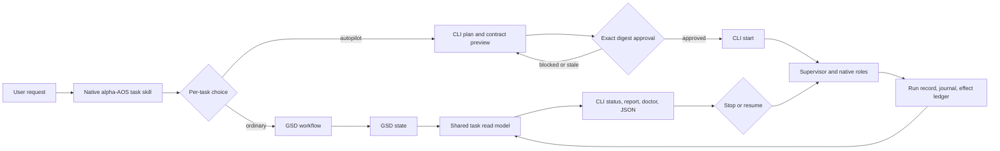

# Phase 21: Natural Entry and Operator CLI - Research

**Researched:** 2026-10-10
**Domain:** In-repository task entry, durable operator CLI, and native skill delivery
**Confidence:** HIGH for inspected code and locked decisions; MEDIUM for live harness discovery, which Phase 22 must prove

<user_constraints>
## User Constraints (from CONTEXT.md)

### Locked Decisions

### 자연어 진입
- **D-01:** 일반적인 자연어 작업 요청에서는 목표와 범위를 짧게 파악한 뒤 일반 GSD와 autopilot 중 선택을 제시한다. 일반 GSD가 기본이며, 제안 자체가 autopilot 동의가 아니다.
- **D-02:** 사용자가 일반 GSD를 선택하면 같은 대화에서 작업에 맞는 GSD 흐름으로 바로 이어간다. 별도 명령을 사용자가 다시 입력해야 하는 진입 흐름으로 만들지 않는다.
- **D-03:** 사용자가 autopilot을 선택했으나 목표, 완료 기준 또는 허용 작업이 모호하면 빠진 내용만 확인한 뒤 계약 미리보기를 만든다. 모호한 권한을 임의로 추정해 승인 가능한 계약으로 제시하지 않는다.
- **D-04:** 사용자가 처음부터 autopilot을 명시적으로 요청하면 두 경로를 다시 묻지 않고 계약 미리보기로 진행한다. 명시적 요청은 경로 선택이며, 계약 승인 또는 실행 시작을 대신하지 않는다.

### 계약 검토
- **D-05:** 승인 전 첫 화면은 목표, 완료 기준, 허용 권한과 효과를 먼저 보여준다. 선택된 역할·도구와 자원 한도는 그 뒤에 배치하고, 전체 계약과 정확한 다이제스트를 검토할 수 있게 한다.
- **D-06:** 사용자가 미리보기의 목표나 허용 작업 등을 수정하면 새 계약 전체와 이전 미리보기 대비 변경점을 함께 보여준다. 바뀐 계약은 새 리비전·다이제스트의 승인 경계를 따른다.
- **D-07:** 선택된 역할이나 필수 도구가 현재 사용할 수 없으면 전체 계약은 검토할 수 있게 보여주되, 차단 사유와 해결할 다음 조치를 앞에 놓는다. 지원 증거가 없는 계약을 승인·시작 가능한 상태로 표시하지 않는다.
- **D-08:** 미리보기는 각 설정 한도, 한도를 두지 않은 항목, 실제 계측 가능 여부를 명시한다. 근거 없는 예상 시간·사용량·비용을 표시하지 않는다. 계측이 필요한 한도를 충족하지 못하는 경우 기존 fail-closed 규칙을 따른다.
- **D-09:** Phase 14의 승인 경계를 유지한다. 최종 계약 승인은 읽기 전용 CLI 미리보기를 확인한 뒤 정확한 계약 다이제스트를 지정해 수행하며, 승인과 실행 시작은 별도 명령이다. 스킬 경험은 이 단계를 명확히 안내한다.

### 채팅 종료 후 제어
- **D-10:** 계약 승인·실행 시작 결과에는 계약 ID, 실행 ID, 계약 파일 위치 및 바로 복사할 수 있는 `status`, `stop`, `resume` 명령을 제공한다. 사용자가 원래 채팅 없이 같은 실행을 다시 찾을 수 있어야 한다.
- **D-11:** `status` 또는 `report`에서 실행 ID를 생략했고 해당 계약에 실행 이력이 여러 개 있으면 최신 실행을 조회하되, 실제 선택한 실행의 ID와 시각을 눈에 띄게 표시한다.
- **D-12:** `stop` 요청이 접수된 상태와 실제 프로세스 종료가 확인된 `stopped` 상태를 구분한다. 요청 접수만으로 종료 완료를 주장하지 않는다.
- **D-13:** 중지 완료 결과에는 같은 승인 계약으로 재개 가능한지, 재개 전 확인할 상태와 정확한 재개 명령을 보여준다. 재개 전 GSD·Git 상태와 효과 조정 등 선행 복구 규칙은 유지한다.

### 상태와 진단 출력
- **D-14:** `task status` 첫 화면은 현재 판정, 구체적인 이유, 사용자의 다음 조치를 먼저 보여준다. 진행 상황, 역할·모델·도구, 측정 사용량은 이어서 표시한다. `accepted`, `blocked`, `stopped`, `failed`, `unknown`을 혼동하지 않는다.
- **D-15:** `task report`는 미충족·확인 불가 필수 기준과 다음 조치를 먼저 보여준다. 통과한 모든 필수 기준과 각각의 검증 증거도 빠짐없이 포함한다. 일반 작업의 항목별 결과와 개발 작업의 리뷰 근거는 기존 출처·증거 규칙을 따른다.
- **D-16:** `task doctor`는 ID 없이 실행하면 환경·하네스 전체 상태를 진단하고, 계약 또는 실행 ID를 주면 해당 작업의 차단 원인을 진단한다. ID가 없다는 이유로 최근 작업을 암묵적으로 선택하지 않는다.
- **D-17:** `--json`은 성공뿐 아니라 실패·차단에도 구조화된 상태, 사유 코드, 관련 식별자, 다음 조치를 제공한다. 사람이 읽는 출력과 JSON은 같은 실제 저널·GSD 상태 및 측정 근거를 반영한다.

### the agent's Discretion
- 스킬의 구체적인 문구, 요약과 상세 화면의 배열, 복사 가능한 명령의 서식 및 JSON 필드 구성은 위 결정을 충족하는 범위에서 정한다.
- 새 저장·조회 구조는 기존 계약·저널·GSD 권한 경계를 재사용하도록 설계한다. 이번 논의는 내부 자료 구조나 라이브러리를 지정하지 않았다.

### Deferred Ideas (OUT OF SCOPE)

None — discussion stayed within Phase 21 scope.
</user_constraints>

<phase_requirements>
## Phase Requirements

| ID | Description | Research support |
|---|---|---|
| UX-01 | A user can state a task naturally through an alpha-AOS skill in each supported harness, choose ordinary GSD interaction or explicitly opt into autopilot, and review the resulting task contract. | Use locked skill delivery and contract preview paths; test native invocation and nonactivation. [VERIFIED: .planning/REQUIREMENTS.md:71-71] |
| UX-02 | A user can preview, start, inspect, stop, resume and diagnose a task through a local CLI, including after the original chat ends. | Close cross-process stop, run lookup, and targeted doctor gaps. [VERIFIED: .planning/REQUIREMENTS.md:72-72] |
| UX-03 | A user can view selected tools, agent/model identities, progress, limits, failed criteria and actionable stop reasons in human-readable and JSON output. | Build one read model from contract, journal, run records, capability receipts, and GSD diagnostics. [VERIFIED: .planning/REQUIREMENTS.md:73-73] |
</phase_requirements>

## Summary

Phase 21 is an integration phase over code already present. The CLI exposes the task verbs, and the repository already has contract digest approval, versioned run records, checkpoint and event journal, capability inventory, supervisor, and target skill synchronization. [VERIFIED: src/cli.ts:194-204,1802-2234; src/core/task-contract.ts:717-742,835-912; src/core/task-run.ts:304-341,533-564; src/core/task-journal.ts:23-75; src/core/owned-skills.ts:77-126,228-280] The planner should put one user journey through all of those layers before broad output polish.

Three existing behaviors need correction: `stop` writes a terminal checkpoint without cancelling or observing a live child; the top-level CLI catch emits plain stderr even with `--json`; and `doctor` always runs broad diagnostics because it ignores a task operand. [VERIFIED: src/cli.ts:1830-1850,1943-1977,2353-2359] Status reads a digest checkpoint while report reads per-run records, so a stable run selection and a joined read model are needed for cross-process consistency. [VERIFIED: src/cli.ts:545-599,1873-1940; src/core/task-run.ts:533-564]

**Primary recommendation:** Build a durable task read/stop service first, route all CLI human and JSON views through it, then add the repository-owned natural-entry skill and prove its native invocation.

## Architectural Responsibility Map

| Capability | Primary tier | Secondary tier | Rationale |
|---|---|---|---|
| Natural-language choice and contract handoff | Harness skill | Local CLI | Skill handles dialogue; CLI owns read-only preview and explicit approval. [VERIFIED: .planning/phases/21-natural-entry-and-operator-cli/21-CONTEXT.md:12-47] |
| Contract digest and consent | Local CLI/core | Managed state | Existing contract module computes digest and persists approval. [VERIFIED: src/core/task-contract.ts:476-483,835-912] |
| Stop, resume and reconciliation | Task supervisor | Agent adapter/process | Supervisor owns durable state; adapter must confirm child termination. [VERIFIED: src/core/task-supervisor.ts:251-397,424-445; src/adapters/task-agents.ts:380-410] |
| Status, report, doctor | CLI read model | Journal, run records, GSD | Read current evidence from each authority and render both formats. [VERIFIED: src/cli.ts:1830-1940] |
| Skill delivery | Installer/owned-skills | Native harness | Catalog and lock bind source/rendered hashes per target. [VERIFIED: catalog/stack.yaml:49-61; src/core/owned-skills.ts:77-126] |

## Project Constraints (from AGENTS.md)

- Preserve Windows/macOS/Linux portability, Node `">=24.0.0"`, npm `">=10.0.0"`, Git, and native behavior for all five harnesses; report unsupported parity. [VERIFIED: AGENTS.md:15-19]
- GSD Core `standard` alone owns lifecycle state. Changes must be deterministic, previewable, root bounded, snapshotted, rollback aware, and must not put credential values into persisted or displayed records. [VERIFIED: AGENTS.md:18-21]
- Require native discovery plus a meaningful read-only invocation. Follow current TypeScript style, explicit `.js` relative imports, strict checking, `node:test`, and the existing dry-run/apply transaction pattern. [VERIFIED: AGENTS.md:23-23,40-53,99-118,152-170]
- Keep implementation under the active GSD workflow and run phase verification and commit gates. [VERIFIED: AGENTS.md:265-274]

## Standard Stack

No external package is needed or recommended for this phase. Reuse the pinned in-repository Node APIs, TypeScript, `node:test`, catalog/lock, and task modules; therefore the Package Legitimacy Gate has no new install to audit. [VERIFIED: package.json:1-65; src/core/task-journal.ts:1-8; src/core/owned-skills.ts:1-17]

| Component | Current version/source | Phase use |
|---|---|---|
| Node.js | `">=24.0.0"` engine declaration [VERIFIED: package.json:43-47] | Filesystem, process, crypto, and test runner. |
| TypeScript | `"5.9.3"` pinned dev dependency [VERIFIED: package.json:57-65] | Existing strict ESM sources. |
| Existing task core | `src/core/task-*.ts` modules [VERIFIED: src/cli.ts:52-86] | Contract, supervisor, journal, capability and verdict logic. |
| Existing skill pipeline | `ownedSkills` catalog and lock [VERIFIED: catalog/stack.yaml:49-61; catalog/stack.lock.json:112-129] | Source hash, target hash, installation and rollback. |

## Architecture Patterns

### System Architecture Diagram



### Component responsibilities and task order

| Seam | Current implementation | Planner action |
|---|---|---|
| Contract | `loadTaskContract`, `previewTaskContract`, `approveTaskContract`, `assertTaskStartable`; digest mismatch already refuses stale replay. [VERIFIED: src/core/task-contract.ts:476-483,717-742,801-828,835-912] | Keep exact digest approval and separate start; present full changed contract and field diff. |
| CLI | Verb routing and `print()` live in `src/cli.ts`; human renderers in `src/format.ts`. [VERIFIED: src/cli.ts:347-365,1800-2234; src/format.ts:1099-1135,1155-1246,1356-1410] | Introduce shared read model and structured failure serializer at the CLI boundary; avoid parallel evidence rules. |
| Durable run | Per-run record lookup sorts by start time; checkpoint/journal are keyed by contract digest. [VERIFIED: src/core/task-run.ts:486-564; src/core/task-journal.ts:69-75,109-174] | Bind each status/report selection to explicit run ID and timestamp; reconcile per-run and checkpoint views. |
| Stop | CLI currently writes `status: "stopped"` immediately. This quote is the existing value, not proof of process termination. [VERIFIED: src/cli.ts:1943-1977] | Add durable request/acknowledgment, signal the active controller/descendants, then mark stopped only on observed termination. |
| Doctor | `doctor` always calls broad role/GSD diagnostics. [VERIFIED: src/cli.ts:1830-1850; src/core/task-doctor.ts:25-83] | Add ID-scoped read-only diagnosis while preserving no-ID environment sweep. |
| Skill | Existing `alpha-aos-control` shows automatic invocation on `"[claude, codex, antigravity, pi, hermes]"`; new skill must be added to catalog and lock, then delivered by owned-skill sync. [VERIFIED: catalog/stack.yaml:58-61; src/core/owned-skills.ts:77-126] | Add a distinct `alpha-aos-task` source, compute source and target hashes with repo tooling, then prove actual native invocation. |

**State vocabulary to reconcile:** The run record declares `"executing" | "accepted" | "rejected" | "unknown" | "blocked" | "stopped"`, while the checkpoint declares `"pending" | "running" | "accepted" | "rejected" | "blocked" | "stopped" | "needs-input"`. Phase 21's user-facing failed verdict therefore needs an explicit evidence-backed mapping, not a string rename in one formatter. [VERIFIED: src/core/task-run.ts:251-251; src/core/task-journal.ts:41-49]

### Recommended structure

Keep `src/cli.ts` as dispatcher, `src/format.ts` as human presenter, and add a small task read/control module under `src/core/` to join task run records, journal, GSD and capability evidence. Extend existing tests under `test/` and add `skills/alpha-aos-task/SKILL.md` through the existing owned-skill catalog. This is an implementation recommendation based on inspected boundaries. [VERIFIED: src/cli.ts:1800-2234; src/core/owned-skills.ts:77-126; test/task-cli.test.ts:1-53]

### Code examples

The existing help declares `"alpha-aos task preview <contract.json> [--json]"`, `"alpha-aos task approve <contract.json> [--contract-digest <digest>] [--apply] [--json]"`, and `"alpha-aos task start <contract.json> [--contract-digest <digest>] [--apply] [--json]"`. Keep that order in the skill. [VERIFIED: src/cli.ts:194-197]

```text
alpha-aos task preview <contract.json> --json
alpha-aos task approve <contract.json> --contract-digest <digest> --apply --json
alpha-aos task start <contract.json> --contract-digest <digest> --apply --json
```

For an unproven role, show the full preview and return a typed blocked reason and next action. Do not create an approval or launch an agent from skill prose; call the existing CLI authority boundary. [VERIFIED: .planning/phases/21-natural-entry-and-operator-cli/21-CONTEXT.md:27-47; src/core/task-contract.ts:835-912]

## Don't Hand-Roll

| Problem | Use instead | Why |
|---|---|---|
| Approval, canonical digest, revision diff | `task-contract.ts` functions | They already reject stale digests and reused revisions. [VERIFIED: src/core/task-contract.ts:801-857] |
| Role proof and selected capability reporting | `task-doctor.ts`, `task-capability-inventory.ts`, receipts | Current reports distinguish proof and invocation. [VERIFIED: src/core/task-doctor.ts:25-83; src/core/task-capability-inventory.ts:641-718] |
| GSD status | GSD files/tools via existing task GSD bridge | GSD owns lifecycle state. [VERIFIED: AGENTS.md:18-20; src/core/task-doctor.ts:122-166] |
| Managed skill write/rollback | `planOwnedSkillOperation`/`applyOwnedSkillSync` | Current implementation binds locked hashes and transaction roots. [VERIFIED: src/core/owned-skills.ts:151-218,228-280] |
| Process launch/cancel | Existing task adapter and bounded process utilities | Preserve native role proof, stream bounds and descendant cleanup. [VERIFIED: src/adapters/task-agents.ts:102-120,380-410; src/core/process.ts:1-105] |

## Common Pitfalls

1. **Requested stop presented as complete:** Current CLI immediately writes terminal state and a `limit_exceeded` event; another process may still be working. Verify a live controller scenario and distinguish request, acknowledgment, and observed termination. [VERIFIED: src/cli.ts:1943-1977]
2. **One digest mistaken for one run:** Checkpoint storage is digest keyed, while run records carry `runId`; choose the latest per-run record deterministically and show its ID/time, including when a later attempt is ongoing. [VERIFIED: src/core/task-journal.ts:69-75; src/core/task-run.ts:304-313,533-564]
3. **Failure JSON silently absent:** `main().catch` currently writes text to stderr; blocked readiness has JSON but thrown failures do not. Serialize typed errors through the redacted observable seam and preserve nonzero exit status. [VERIFIED: src/cli.ts:347-365,2353-2359]
4. **Unsupported preview hidden:** Current `task preview` throws for missing telemetry before showing its contract; Phase 21 requires reviewable full contract plus prominent block and next action. [VERIFIED: src/cli.ts:2200-2220]
5. **Skill installed treated as invoked:** Installer tests cover paths and hashes; product success requires a real native skill invocation in each supported harness. [VERIFIED: test/owned-skills.test.ts:48-112,243-347; .planning/ROADMAP.md:353-369]
6. **Output invents certainty:** The checkpoint stores nullable measured tokens/cost, and doctor may lack model/version proof. Preserve unknown/null and evidence provenance instead of rendering zero or a guessed model. [VERIFIED: src/core/task-journal.ts:40-62; src/core/task-doctor.ts:25-83]

## Validation Architecture

Nyquist validation is enabled by `"nyquist_validation": true`. [VERIFIED: .planning/config.json:25-25]

| Property | Value |
|---|---|
| Framework | Node built-in `node:test` with compiled TypeScript. [VERIFIED: package.json:32-42; test/task-cli.test.ts:1-9] |
| Config | `tsconfig.json`; custom `scripts/run-tests.mjs` verifies named compiled files exist. [VERIFIED: package.json:34-42; scripts/run-tests.mjs:72-105] |
| Quick run | `npm run build; node scripts/run-tests.mjs --files dist/test/task-cli.test.js dist/test/owned-skills.test.js` |
| Full suite | `npm run check; npm test; npm run build:check` |

| Requirement | Meaningful test | Existing coverage and Wave 0 gap |
|---|---|---|
| UX-01 | Install new task skill in all five fixture roots; invoke through each native adapter and assert ordinary GSD remains default, explicit autopilot reaches read-only preview without approval/start. | Existing owned-skill tests cover delivery, not the new skill's native invocation. Add task-skill integration/canary fixtures. [VERIFIED: test/owned-skills.test.ts:48-112,243-347; test/task-cli.test.ts:373-406] |
| UX-02 | In separate CLI processes, preview/approve/start/stop/status/resume/report by exact run ID; inject stale digest, active child, crash, and competing controller; assert no premature `stopped`. | Extend `test/task-cli.test.ts`, `test/task-supervisor-recovery.test.ts`, `test/task-controller-lease.test.ts`. [VERIFIED: test/task-cli.test.ts:516-608; src/core/controller-lease.ts:41-137] |
| UX-03 | Compare human/JSON verdict, reason, selected capabilities, role/model evidence, nullable usage, per-criterion evidence and next action; assert structured JSON for typed refusal and malformed input. | Extend `test/task-cli-capabilities.test.ts`, `test/task-cli-review.test.ts`, `test/task-cli.test.ts`. [VERIFIED: test/task-cli-capabilities.test.ts:121-162,187-253; src/format.ts:1155-1246,1356-1410] |

**Sampling:** targeted compiled CLI/skill tests after each relevant change; full `npm run check` and `npm test` at phase gate. Phase 22 owns the release-wide three-OS and live-host matrix. [VERIFIED: .planning/ROADMAP.md:353-391]

## Security Domain

Security enforcement is enabled: `"security_enforcement": true`. [VERIFIED: .planning/config.json:48-48]

| ASVS category | Applies | Phase control |
|---|---|---|
| V2 Authentication | Indirectly | Do not infer harness authentication from installation; report role proof and auth failures from actual probes. [VERIFIED: src/core/task-doctor.ts:25-83] |
| V3 Session Management | Yes | Bind continuation and stop to the selected run/controller identity and fresh reviewer session. [VERIFIED: src/core/task-run.ts:304-341; src/core/controller-lease.ts:8-39] |
| V4 Access Control | Yes | Keep exact digest consent, allowed roots/effects, and exclusive controller lease. [VERIFIED: src/core/task-contract.ts:407-471,901-912; src/core/controller-lease.ts:41-137] |
| V5 Input Validation | Yes | Validate contract IDs, digest, JSON shape and path before reading or mutation; never parse a skill's natural language as authority. [VERIFIED: src/core/task-contract.ts:252-328,476-483] |
| V6 Cryptography | Yes | Reuse SHA-256 digest and locked skill hashes; never implement a new digest algorithm. [VERIFIED: src/core/task-contract.ts:586-594; src/core/owned-skills.ts:97-111] |

Threats: stale preview replay (tampering) is handled by digest revalidation; one run being confused with another (spoofing) needs explicit run selection; concurrent stop/start (race and denial of service) needs fenced control; credential leakage (information disclosure) must use the existing redacted `print` seam. [VERIFIED: src/core/task-contract.ts:801-828,901-912; src/core/controller-lease.ts:41-137; src/cli.ts:347-365]

## Environment Availability

| Dependency | Required by | Observed availability | Fallback |
|---|---|---|---|
| Node | Build and CLI | `v24.13.1` observed 2026-10-10 | None needed |
| npm | Build/test | `11.8.0` observed 2026-10-10 | None needed |
| Git | GSD and baseline | `2.55.0.windows.3` observed 2026-10-10 | None needed |
| Live five-harness auth and invocation | Native discovery acceptance | Not probed in this research session | Keep unverified cells and schedule a canary at implementation/release gate |

## Assumptions Log

| # | Claim | Section | Risk if wrong |
|---|---|---|---|
| A1 | [ASSUMED] A distinct `alpha-aos-task` skill name is the clearest entry surface. | Architecture | Native naming convention or product copy may require a different name. |
| A2 | [ASSUMED] A durable stop request can be delivered to every supported live adapter without changing its external protocol. | Architecture | Planner must add adapter-specific control or mark a target unsupported. |

## Open Questions

1. **What owns run IDs for a supervisor with several attempts?** Current record IDs are per attempt while the checkpoint is contract-digest keyed. Planner should define the user-facing run ID mapping and test latest selection with multiple attempts. [VERIFIED: src/core/task-run.ts:1020-1037,1360-1380; src/core/task-journal.ts:69-75]
2. **How is a live controller cancelled across processes?** Existing CLI `stop` does not contact it, and supervisor checks an in-process `AbortSignal` only at loop boundaries. Planner must design request transport, acknowledgment, descendant cancellation, and crash recovery before output work. [VERIFIED: src/cli.ts:1943-1977; src/core/task-supervisor.ts:58-67,424-445]
3. **Where is exact provider/model evidence retained for status after chat exit?** Current run record stores harness/version, while capability and role receipts may contain richer evidence. Plan a source-backed joined view, explicitly reporting unavailable model IDs. [VERIFIED: src/core/task-run.ts:304-341; src/core/task-doctor.ts:25-83]
4. **When is a run ID assigned?** Approval currently returns only status, approval path, digest, and transaction ID; `startTask` creates the run ID later. D-10 requires a run ID in the approval result while approval and start remain separate. Planner must define a stable reservation or equivalent identity before start and prove a refused start does not falsely appear to have run. [VERIFIED: src/core/task-contract.ts:223-226; src/core/task-run.ts:1020-1037,1292-1304]
5. **How will every native skill canary be exercised on the implementation host?** Test fixtures can prove rendering; any missing live harness or authentication remains unverified and belongs in Phase 22's support matrix. [VERIFIED: .planning/ROADMAP.md:353-391]

## Sources

### Primary (HIGH confidence)
- `.planning/phases/21-natural-entry-and-operator-cli/21-CONTEXT.md`, `.planning/REQUIREMENTS.md`, `.planning/ROADMAP.md` — locked scope and acceptance.
- `src/cli.ts`, `src/format.ts`, `src/core/task-contract.ts`, `src/core/task-run.ts`, `src/core/task-journal.ts`, `src/core/task-supervisor.ts`, `src/core/task-doctor.ts`, `src/core/owned-skills.ts`, `src/core/controller-lease.ts` — source definitions read this session.
- `catalog/stack.yaml`, `catalog/stack.lock.json`, `package.json`, selected `test/*.test.ts` — current package/skill/test contracts read this session.

### Secondary (MEDIUM confidence)
- `docs/design/autonomous-work/README.md` — approved product design, subordinate to current locked CONTEXT and code.

## Metadata

**Confidence breakdown:** Standard stack HIGH; architecture HIGH for present code and MEDIUM for proposed stop transport; pitfalls HIGH for observed code; live native discovery LOW until canaries run.
**Research date:** 2026-10-10
**Valid until:** 2026-11-09, or sooner if Phase 19/20 integration changes task records or CLI behavior.
